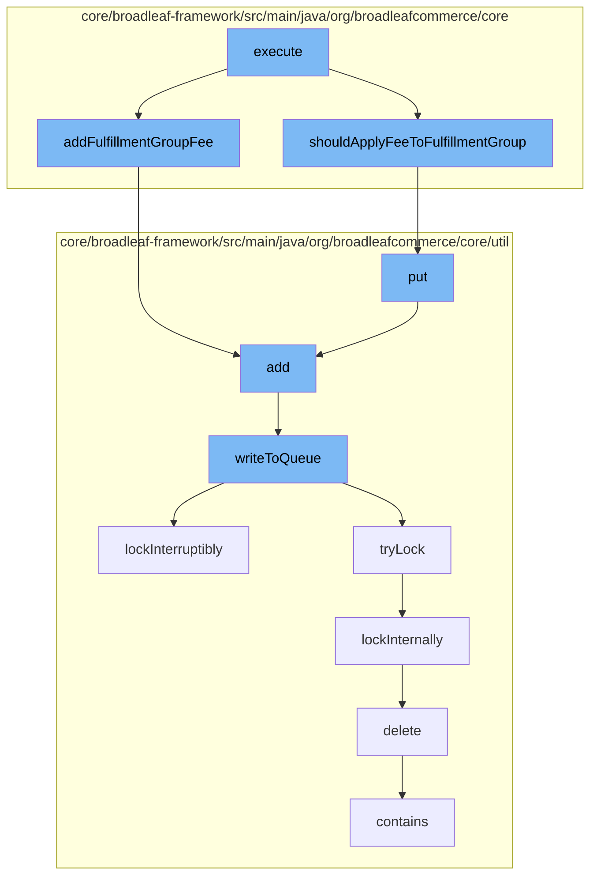

This document will cover the process of consolidating fulfillment fees in the BroadleafCommerce-demo project. The process includes the following steps:

1. Executing the main function
2. Checking if the fee should be applied to the fulfillment group
3. Adding the fee to the fulfillment group
4. Writing the fee to the queue
5. Locking the process
6. Deleting the code type
7. Checking if the queue contains the fee
8. Adding the fee to the resource purge service.



<SwmSnippet path="/core/broadleaf-framework/src/main/java/org/broadleafcommerce/core/pricing/service/workflow/ConsolidateFulfillmentFeesActivity.java" line="1">

---

# Executing the main function

The `execute` function in `ConsolidateFulfillmentFeesActivity.java` is the starting point of the process. It's responsible for initiating the process of consolidating fulfillment fees.

```java
/*-
 * #%L
 * BroadleafCommerce Framework
 * %%
 * Copyright (C) 2009 - 2024 Broadleaf Commerce
 * %%
 * Licensed under the Broadleaf Fair Use License Agreement, Version 1.0
 * (the "Fair Use License" located  at http://license.broadleafcommerce.org/fair_use_license-1.0.txt)
 * unless the restrictions on use therein are violated and require payment to Broadleaf in which case
 * the Broadleaf End User License Agreement (EULA), Version 1.1
 * (the "Commercial License" located at http://license.broadleafcommerce.org/commercial_license-1.1.txt)
 * shall apply.
 * 
 * Alternatively, the Commercial License may be replaced with a mutually agreed upon license (the "Custom License")
 * between you and Broadleaf Commerce. You may not use this file except in compliance with the applicable license.
 * #L%
 */
package org.broadleafcommerce.core.pricing.service.workflow;

import org.apache.commons.lang.StringUtils;
import org.broadleafcommerce.common.rule.MvelHelper;
```

---

</SwmSnippet>

<SwmSnippet path="/core/broadleaf-framework/src/main/java/org/broadleafcommerce/core/pricing/service/workflow/ConsolidateFulfillmentFeesActivity.java" line="101">

---

# Checking if the fee should be applied to the fulfillment group

`shouldApplyFeeToFulfillmentGroup` function checks if the fee should be applied to the fulfillment group. This is a crucial step to ensure that the fee is only applied when necessary.

```java
    /**
     * If the SkuFee expression is null or empty, this method will always return true
     * 
     * @param fee
     * @param fulfillmentGroup
     * @return
     */
    protected boolean shouldApplyFeeToFulfillmentGroup(SkuFee fee, FulfillmentGroup fulfillmentGroup) {
        boolean appliesToFulfillmentGroup = true;
        String feeExpression = fee.getExpression();
        
        if (StringUtils.isNotEmpty(feeExpression)) {
            synchronized (EXPRESSION_CACHE) {
                HashMap<String, Object> vars = new HashMap<>();
                vars.put("fulfillmentGroup", fulfillmentGroup);
                MvelHelper.evaluateRule(feeExpression, vars, EXPRESSION_CACHE);
            }
        }
        
        return appliesToFulfillmentGroup;
    }
```

---

</SwmSnippet>

<SwmSnippet path="/core/broadleaf-framework/src/main/java/org/broadleafcommerce/core/order/domain/FulfillmentGroupImpl.java" line="713">

---

# Adding the fee to the fulfillment group

The `addFulfillmentGroupFee` function in `FulfillmentGroupImpl.java` is responsible for adding the fee to the fulfillment group. It checks if the `fulfillmentGroupFees` list is null, and if so, it initializes it. Then it adds the `fulfillmentGroupFee` to the list.

```java
    @Override
    public void addFulfillmentGroupFee(FulfillmentGroupFee fulfillmentGroupFee) {
        if (fulfillmentGroupFees == null) {
            fulfillmentGroupFees = new ArrayList<FulfillmentGroupFee>();
        }
        fulfillmentGroupFees.add(fulfillmentGroupFee);
    }
```

---

</SwmSnippet>

<SwmSnippet path="/core/broadleaf-framework/src/main/java/org/broadleafcommerce/core/util/queue/ZookeeperDistributedQueue.java" line="503">

---

# Writing the fee to the queue

The `writeToQueue` function in `ZookeeperDistributedQueue.java` is responsible for writing the fee to the queue. It ensures that the entries are not null or empty, and then it writes each entry to the queue.

```java
    protected int writeToQueue(List<? extends T> entries, final long timeout) throws InterruptedException {
        if (entries == null || entries.isEmpty()) {
            return 0;
        }
        
        int entryCount = 0;
        long waitTime = timeout;
        synchronized (QUEUE_MONITOR) {
            while (true) {
                boolean locked = false;
                DistributedLock lock = getQueueAccessLock();
                if (timeout < 0L) {
                    lock.lockInterruptibly();
                    locked = true;
                } else if (timeout > 0L && waitTime > 0L) {
                    long start = System.currentTimeMillis();
                    locked = lock.tryLock(waitTime, TimeUnit.MILLISECONDS);
                    long end = System.currentTimeMillis();
                    waitTime -= (end - start);
                } else {
                    locked = lock.tryLock();
```

---

</SwmSnippet>

<SwmSnippet path="/core/broadleaf-framework/src/main/java/org/broadleafcommerce/core/util/lock/ReentrantDistributedZookeeperLock.java" line="335">

---

# Locking the process

The `lockInterruptibly` function in `ReentrantDistributedZookeeperLock.java` is responsible for locking the process. This is to ensure that the process is not interrupted while it's being executed.

```java
    @Override
    public void lockInterruptibly() throws InterruptedException {
        if (Thread.interrupted()) {
            throw new InterruptedException("Thread was interrupted prior to trying to acquire the lock.");
        }
        
        lockInternally(-1L);
    }
```

---

</SwmSnippet>

<SwmSnippet path="/core/broadleaf-framework/src/main/java/org/broadleafcommerce/core/util/dao/CodeTypeDaoImpl.java" line="51">

---

# Deleting the code type

The `delete` function in `CodeTypeDaoImpl.java` is responsible for deleting the code type. This is to ensure that the code type is removed from the system once it's no longer needed.

```java
    public void delete(CodeType codeType) {
        if (!em.contains(codeType)) {
            codeType = (CodeType) em.find(CodeTypeImpl.class, codeType.getId());
        }
        em.remove(codeType);
    }
```

---

</SwmSnippet>

<SwmSnippet path="/core/broadleaf-framework/src/main/java/org/broadleafcommerce/core/util/queue/ZookeeperDistributedQueue.java" line="474">

---

# Checking if the queue contains the fee

The `contains` function in `ZookeeperDistributedQueue.java` is responsible for checking if the queue contains the fee. This is to ensure that the fee has been successfully written to the queue.

```java
    @Override
    public boolean contains(Object o) {
        return containsAll(Collections.singletonList(o));
    }
```

---

</SwmSnippet>

<SwmSnippet path="/core/broadleaf-framework/src/main/java/org/broadleafcommerce/core/util/service/ResourcePurgeServiceImpl.java" line="593">

---

# Adding the fee to the resource purge service

The `add` function in `ResourcePurgeServiceImpl.java` is responsible for adding the fee to the resource purge service. This is to ensure that the fee is removed from the system once it's no longer needed.

```java
        public Long add(Long entry) {
            if (! cache.containsKey(entry)) {
                return cache.put(entry, new Long(System.currentTimeMillis()));
            }
            return null;
        }
```

---

</SwmSnippet>

&nbsp;

*This is an auto-generated document by Swimm AI 🌊 and has not yet been verified by a human*

<SwmMeta version="3.0.0" repo-id="Z2l0aHViJTNBJTNBQnJvYWRsZWFmQ29tbWVyY2UtZGVtbyUzQSUzQWdpbGFkbmF2b3Q=" repo-name="BroadleafCommerce-demo" doc-type="flows"><sup>Powered by [Swimm](/)</sup></SwmMeta>
