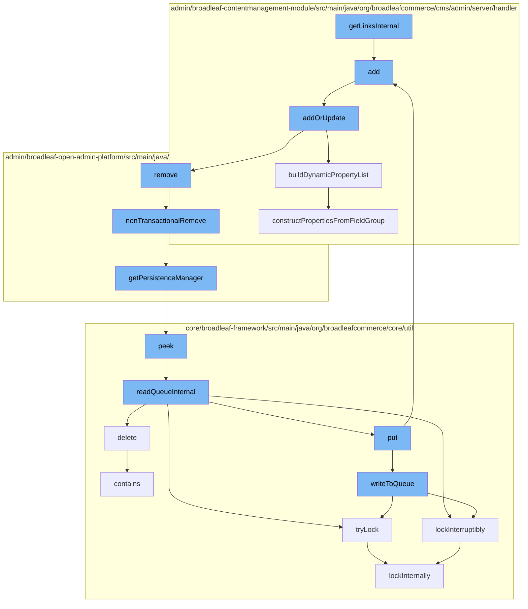

This document will cover the process of content management in BroadleafCommerce-demo, which includes:

1. Getting internal links
2. Adding or updating page templates
3. Building dynamic property lists
4. Removing non-transactional entities
5. Managing persistence
6. Managing distributed locks
7. Reading and writing to the queue.



<SwmSnippet path="/admin/broadleaf-contentmanagement-module/src/main/java/org/broadleafcommerce/cms/web/deeplink/ContentDeepLinkServiceImpl.java" line="1">

---

# Getting Internal Links

The `getLinksInternal` function is the starting point of the content management process. It's responsible for retrieving internal links related to the content.

```java
/*-
 * #%L
 * BroadleafCommerce CMS Module
 * %%
 * Copyright (C) 2009 - 2024 Broadleaf Commerce
 * %%
 * Licensed under the Broadleaf Fair Use License Agreement, Version 1.0
 * (the "Fair Use License" located  at http://license.broadleafcommerce.org/fair_use_license-1.0.txt)
 * unless the restrictions on use therein are violated and require payment to Broadleaf in which case
 * the Broadleaf End User License Agreement (EULA), Version 1.1
```

---

</SwmSnippet>

<SwmSnippet path="/admin/broadleaf-contentmanagement-module/src/main/java/org/broadleafcommerce/cms/admin/server/handler/PageTemplateCustomPersistenceHandler.java" line="294">

---

# Adding or Updating Page Templates

The `add` function calls the `addOrUpdate` function, which is responsible for adding or updating page templates in the content management system.

```java
    @Override
    public Entity add(PersistencePackage persistencePackage, DynamicEntityDao dynamicEntityDao, RecordHelper helper) throws ServiceException {
        return addOrUpdate(persistencePackage, dynamicEntityDao, helper);
    }
```

---

</SwmSnippet>

<SwmSnippet path="/admin/broadleaf-contentmanagement-module/src/main/java/org/broadleafcommerce/cms/admin/server/handler/DynamicFieldPersistenceHandlerHelper.java" line="109">

---

# Building Dynamic Property Lists

The `buildDynamicPropertyList` function is used to build metadata for all the dynamic properties within a StructuredContentType, gleaned from the FieldGroups and FieldDefinitions.

```java
    /**
     * Builds all of the metadata for all of the dynamic properties within a {@link StructuredContentType}, gleaned from
     * the {@link FieldGroup}s and {@link FieldDefinition}s.
     *
     * @param fieldGroups groups that the {@link Property}s are built from
     * @param inheritedType the value that each built {@link FieldMetadata} for each property will use to notate where the
     * dynamic field actually came from (meaning {@link FieldMetadata#setAvailableToTypes(String[])} and {@link FieldMetadata#setInheritedFromType(String)}
     * @return
     */
    public Property[] buildDynamicPropertyList(List<FieldGroup> fieldGroups, Class<?> inheritedType) {
        List<Property> propertiesList = new ArrayList<Property>();
        for (FieldGroup group : fieldGroups) {
            constructPropertiesFromFieldGroup(inheritedType, propertiesList, group, 0l);
        }
        Property property = constructIdProperty(inheritedType);
        propertiesList.add(property);

        Property[] properties = sortProperties(propertiesList);
        return properties;
    }
```

---

</SwmSnippet>

<SwmSnippet path="/admin/broadleaf-open-admin-platform/src/main/java/org/broadleafcommerce/openadmin/server/service/DynamicEntityRemoteService.java" line="329">

---

# Removing Non-Transactional Entities

The `nonTransactionalRemove` function is responsible for removing non-transactional entities from the persistence layer.

```java
    @Override
    public PersistenceResponse nonTransactionalRemove(final PersistencePackage persistencePackage) throws ServiceException {
        return persistenceThreadManager.operation(TargetModeType.SANDBOX, persistencePackage, new Persistable <PersistenceResponse, ServiceException>() {
            @Override
            public PersistenceResponse execute() throws ServiceException {
                try {
                    PersistenceManager persistenceManager = PersistenceManagerFactory.getPersistenceManager();
                    return persistenceManager.remove(persistencePackage);
                } catch (ServiceException e) {
                    //immediately throw validation exceptions without printing a stack trace
                    if (e instanceof ValidationException) {
                        throw e;
                    } else if (e.getCause() instanceof ValidationException) {
                        throw (ValidationException) e.getCause();
                    }
                    LOG.error("Problem removing " + persistencePackage.getCeilingEntityFullyQualifiedClassname(), e);
                    String message = exploitProtectionService.cleanString(e.getMessage());
                    throw recreateSpecificServiceException(e, message, e.getCause());
                }
            }
        });
```

---

</SwmSnippet>

<SwmSnippet path="/admin/broadleaf-open-admin-platform/src/main/java/org/broadleafcommerce/openadmin/server/service/persistence/PersistenceManagerContext.java" line="49">

---

# Managing Persistence

The `getPersistenceManager` function is used to manage persistence in the system. It retrieves the current PersistenceManager from the context.

```java
    public PersistenceManager getPersistenceManager() {
        return !persistenceManager.empty()?persistenceManager.peek():null;
    }
```

---

</SwmSnippet>

<SwmSnippet path="/core/broadleaf-framework/src/main/java/org/broadleafcommerce/core/util/lock/ReentrantDistributedZookeeperLock.java" line="344">

---

# Managing Distributed Locks

The `tryLock` function is used to manage distributed locks in the system. It attempts to acquire a lock internally.

```java
    @Override
    public boolean tryLock() {
        try {
            return lockInternally(0L);
        } catch (InterruptedException e) {
            Thread.currentThread().interrupt();
            return false;
        }
    }
```

---

</SwmSnippet>

<SwmSnippet path="/core/broadleaf-framework/src/main/java/org/broadleafcommerce/core/util/queue/ZookeeperDistributedQueue.java" line="222">

---

# Reading and Writing to the Queue

The `peek` function is used to read from the queue. It retrieves the first element in the queue without removing it. The `writeToQueue` function is used to write entries to the queue.

```java
    @Override
    public T peek() {
        try {
            Map<String, T> elements = readQueueInternal(1, false, 0L);
            Iterator<Map.Entry<String, T>> entries = elements.entrySet().iterator();
            if (entries.hasNext()) {
                return entries.next().getValue();
            }
            
            return null;
        } catch (InterruptedException e) {
            Thread.currentThread().interrupt();
            return null;
        }
    }
```

---

</SwmSnippet>

&nbsp;

*This is an auto-generated document by Swimm AI 🌊 and has not yet been verified by a human*

<SwmMeta version="3.0.0" repo-id="Z2l0aHViJTNBJTNBQnJvYWRsZWFmQ29tbWVyY2UtZGVtbyUzQSUzQWdpbGFkbmF2b3Q=" repo-name="BroadleafCommerce-demo" doc-type="flows"><sup>Powered by [Swimm](/)</sup></SwmMeta>
