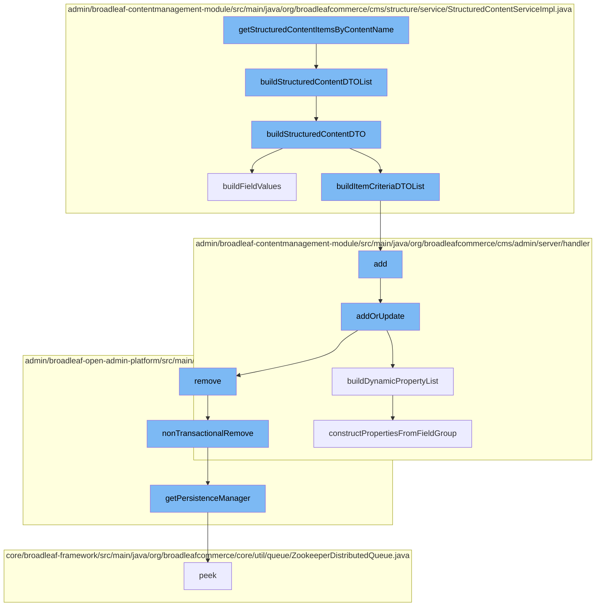

This document will cover the process of retrieving and structuring content items in BroadleafCommerce-demo, which includes:

1. Retrieving structured content items by content name
2. Building a list of structured content DTOs
3. Building individual structured content DTOs
4. Building field values for structured content
5. Adding or updating page templates
6. Building dynamic property list for page templates
7. Removing dynamic entities
8. Constructing properties from field group.



<SwmSnippet path="/admin/broadleaf-contentmanagement-module/src/main/java/org/broadleafcommerce/cms/structure/service/StructuredContentServiceImpl.java" line="1">

---

# Retrieving structured content items by content name

The function `getStructuredContentItemsByContentName` is the entry point for this flow. It retrieves structured content items by their content name.

```java
/*-
 * #%L
 * BroadleafCommerce CMS Module
 * %%
 * Copyright (C) 2009 - 2024 Broadleaf Commerce
 * %%
 * Licensed under the Broadleaf Fair Use License Agreement, Version 1.0
 * (the "Fair Use License" located  at http://license.broadleafcommerce.org/fair_use_license-1.0.txt)
 * unless the restrictions on use therein are violated and require payment to Broadleaf in which case
 * the Broadleaf End User License Agreement (EULA), Version 1.1
 * (the "Commercial License" located at http://license.broadleafcommerce.org/commercial_license-1.1.txt)
 * shall apply.
 * 
 * Alternatively, the Commercial License may be replaced with a mutually agreed upon license (the "Custom License")
 * between you and Broadleaf Commerce. You may not use this file except in compliance with the applicable license.
 * #L%
 */
package org.broadleafcommerce.cms.structure.service;

import org.apache.commons.collections4.ListUtils;
import org.apache.commons.collections4.MapUtils;
```

---

</SwmSnippet>

<SwmSnippet path="/admin/broadleaf-contentmanagement-module/src/main/java/org/broadleafcommerce/cms/structure/service/StructuredContentServiceImpl.java" line="154">

---

# Building a list of structured content DTOs

The function `buildStructuredContentDTOList` is called to convert a list of structured content items to a list of structured content DTOs.

```java
    /**
     * Converts a list of structured content items to a list of structured content DTOs.<br>
     * Internally calls buildStructuredContentDTO(...).
     *
     * @param structuredContentList
     * @param secure
     * @return
     * @see {@link #buildStructuredContentDTO(StructuredContent, boolean)}
     */
    @Override
    public List<StructuredContentDTO> buildStructuredContentDTOList(List<StructuredContent> structuredContentList, boolean secure) {
        List<StructuredContentDTO> dtoList = new ArrayList<>();
        structuredContentList = ListUtils.emptyIfNull(structuredContentList);

        for (StructuredContent sc : structuredContentList) {
            dtoList.add(buildStructuredContentDTO(sc, secure));
        }

        return dtoList;
    }
```

---

</SwmSnippet>

<SwmSnippet path="/admin/broadleaf-contentmanagement-module/src/main/java/org/broadleafcommerce/cms/structure/service/StructuredContentServiceImpl.java" line="577">

---

# Building individual structured content DTOs

The function `buildStructuredContentDTO` is called to convert each individual StructuredContent into a StructuredContentDTO.

```java
    /**
     * Converts a StructuredContent into a StructuredContentDTO.   If the item contains fields with
     * broadleaf cms urls, the urls are converted to utilize the domain.
     * <p/>
     * The StructuredContentDTO is built via the {@link EntityConfiguration}. To override the actual type that is returned,
     * include an override in an applicationContext like any other entity override.
     *
     * @param sc
     * @param secure
     * @return
     */
    @Override
    public StructuredContentDTO buildStructuredContentDTO(StructuredContent sc, boolean secure) {
        StructuredContentDTO scDTO = entityConfiguration.createEntityInstance(StructuredContentDTO.class.getName(), StructuredContentDTO.class);
        Set<StructuredContentItemCriteria> qualifyingItemCriteria = SetUtils.emptyIfNull(sc.getQualifyingItemCriteria());
        scDTO.setContentName(sc.getContentName());
        scDTO.setContentType(sc.getStructuredContentType().getName());
        scDTO.setId(sc.getId());
        scDTO.setPriority(sc.getPriority());

        if (sc.getLocale() != null) {
```

---

</SwmSnippet>

<SwmSnippet path="/admin/broadleaf-contentmanagement-module/src/main/java/org/broadleafcommerce/cms/structure/service/StructuredContentServiceImpl.java" line="472">

---

# Building field values for structured content

The function `buildFieldValues` is called to parse the given StructuredContent into its StructuredContentDTO representation and format the values into their actual data types.

```java
    /**
     * Parses the given {@link StructuredContent} into its {@link StructuredContentDTO} representation. This will also
     * format the values from {@link StructuredContentDTO#getValues()} into their actual data types. For instance, if the
     * given {@link StructuredContent} has a DATE field, then this method will ensure that the resulting object in the values
     * map of the DTO is a {@link Date} rather than just a String representing a date.
     * <p/>
     * Current support of parsing field types is:
     * DATE - {@link Date}
     * BOOLEAN - {@link Boolean}
     * DECIMAL - {@link BigDecimal}
     * INTEGER - {@link Integer}
     * MONEY - {@link Money}
     * <p/>
     * All other fields are treated as strings. This will also fix URL strings that have the CMS prefix (like images) by
     * prepending the standard CMS prefix with the particular environment prefix
     *
     * @param sc
     * @param scDTO
     * @param secure
     * @see {@link StaticAssetService#getStaticAssetEnvironmentUrlPrefix()}
     */
```

---

</SwmSnippet>

<SwmSnippet path="/admin/broadleaf-contentmanagement-module/src/main/java/org/broadleafcommerce/cms/admin/server/handler/PageTemplateCustomPersistenceHandler.java" line="294">

---

# Adding or updating page templates

The function `addOrUpdate` is called to add or update page templates. It validates the persistence package entity and updates the page fields accordingly.

```java
    @Override
    public Entity add(PersistencePackage persistencePackage, DynamicEntityDao dynamicEntityDao, RecordHelper helper) throws ServiceException {
        return addOrUpdate(persistencePackage, dynamicEntityDao, helper);
    }

    protected Entity addOrUpdate(PersistencePackage persistencePackage, DynamicEntityDao dynamicEntityDao, RecordHelper helper) throws ServiceException {
        String ceilingEntityFullyQualifiedClassname = persistencePackage.getCeilingEntityFullyQualifiedClassname();
        try {
            String pageId = persistencePackage.getCustomCriteria()[1];

            if (StringUtils.isBlank(pageId)) {
                return persistencePackage.getEntity();
            }

            Page page = pageService.findPageById(Long.valueOf(pageId));

            Property[] properties = dynamicFieldUtil.buildDynamicPropertyList(getFieldGroups(page, null), PageTemplate.class);
            Map<String, FieldMetadata> md = new HashMap<String, FieldMetadata>();
            for (Property property : properties) {
                md.put(property.getName(), property.getMetadata());
            }
```

---

</SwmSnippet>

<SwmSnippet path="/admin/broadleaf-contentmanagement-module/src/main/java/org/broadleafcommerce/cms/admin/server/handler/DynamicFieldPersistenceHandlerHelper.java" line="109">

---

# Building dynamic property list for page templates

The function `buildDynamicPropertyList` is called to build all of the metadata for all of the dynamic properties within a StructuredContentType.

```java
    /**
     * Builds all of the metadata for all of the dynamic properties within a {@link StructuredContentType}, gleaned from
     * the {@link FieldGroup}s and {@link FieldDefinition}s.
     *
     * @param fieldGroups groups that the {@link Property}s are built from
     * @param inheritedType the value that each built {@link FieldMetadata} for each property will use to notate where the
     * dynamic field actually came from (meaning {@link FieldMetadata#setAvailableToTypes(String[])} and {@link FieldMetadata#setInheritedFromType(String)}
     * @return
     */
    public Property[] buildDynamicPropertyList(List<FieldGroup> fieldGroups, Class<?> inheritedType) {
        List<Property> propertiesList = new ArrayList<Property>();
        for (FieldGroup group : fieldGroups) {
            constructPropertiesFromFieldGroup(inheritedType, propertiesList, group, 0l);
        }
        Property property = constructIdProperty(inheritedType);
        propertiesList.add(property);

        Property[] properties = sortProperties(propertiesList);
        return properties;
    }
```

---

</SwmSnippet>

<SwmSnippet path="/admin/broadleaf-open-admin-platform/src/main/java/org/broadleafcommerce/openadmin/server/service/DynamicEntityRemoteService.java" line="329">

---

# Removing dynamic entities

The function `nonTransactionalRemove` is called to remove dynamic entities in a non-transactional manner.

```java
    @Override
    public PersistenceResponse nonTransactionalRemove(final PersistencePackage persistencePackage) throws ServiceException {
        return persistenceThreadManager.operation(TargetModeType.SANDBOX, persistencePackage, new Persistable <PersistenceResponse, ServiceException>() {
            @Override
            public PersistenceResponse execute() throws ServiceException {
                try {
                    PersistenceManager persistenceManager = PersistenceManagerFactory.getPersistenceManager();
                    return persistenceManager.remove(persistencePackage);
                } catch (ServiceException e) {
                    //immediately throw validation exceptions without printing a stack trace
                    if (e instanceof ValidationException) {
                        throw e;
                    } else if (e.getCause() instanceof ValidationException) {
                        throw (ValidationException) e.getCause();
                    }
                    LOG.error("Problem removing " + persistencePackage.getCeilingEntityFullyQualifiedClassname(), e);
                    String message = exploitProtectionService.cleanString(e.getMessage());
                    throw recreateSpecificServiceException(e, message, e.getCause());
                }
            }
        });
```

---

</SwmSnippet>

<SwmSnippet path="/admin/broadleaf-contentmanagement-module/src/main/java/org/broadleafcommerce/cms/admin/server/handler/DynamicFieldPersistenceHandlerHelper.java" line="186">

---

# Constructing properties from field group

The function `constructPropertiesFromFieldGroup` is called to construct properties from a field group for the dynamic property list.

```java
    private void constructPropertiesFromFieldGroup(Class<?> inheritedType, List<Property> propertiesList, FieldGroup group, Long groupOrder) {
        List<FieldDefinition> definitions = group.getFieldDefinitions();
        for (FieldDefinition def : definitions) {
            Property property = buildDynamicProperty(def, inheritedType);
            BasicFieldMetadata fieldMetadata = (BasicFieldMetadata) property.getMetadata();
            fieldMetadata.setGroup(group.getName());
            fieldMetadata.setGroupCollapsed(group.getInitCollapsedFlag());
            fieldMetadata.setGroupOrder(groupOrder.intValue());
            propertiesList.add(property);
        }
    }
```

---

</SwmSnippet>

&nbsp;

*This is an auto-generated document by Swimm AI 🌊 and has not yet been verified by a human*

<SwmMeta version="3.0.0" repo-id="Z2l0aHViJTNBJTNBQnJvYWRsZWFmQ29tbWVyY2UtZGVtbyUzQSUzQWdpbGFkbmF2b3Q=" repo-name="BroadleafCommerce-demo" doc-type="flows"><sup>Powered by [Swimm](/)</sup></SwmMeta>
