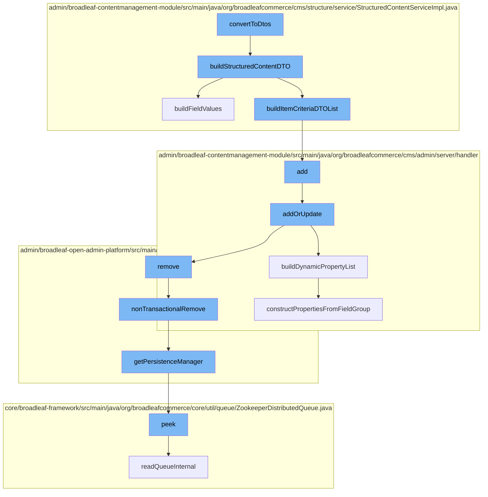

This document will cover the process of converting structured content to DTOs in the BroadleafCommerce-demo repository. The process includes the following steps:

1. Converting a StructuredContent into a StructuredContentDTO
2. Building field values for the DTO
3. Adding the DTO to the PageTemplateCustomPersistenceHandler
4. Removing any unnecessary entities from the DynamicEntityRemoteService
5. Reading the queue from the ZookeeperDistributedQueue.



<SwmSnippet path="/admin/broadleaf-contentmanagement-module/src/main/java/org/broadleafcommerce/cms/structure/service/StructuredContentServiceImpl.java" line="577">

---

# Converting a StructuredContent into a StructuredContentDTO

The `buildStructuredContentDTO` function is used to convert a `StructuredContent` into a `StructuredContentDTO`. It creates an instance of `StructuredContentDTO` and sets its properties based on the `StructuredContent` object. It also calls the `buildFieldValues` and `buildItemCriteriaDTOList` functions to build field values and item criteria for the DTO.

```java
    /**
     * Converts a StructuredContent into a StructuredContentDTO.   If the item contains fields with
     * broadleaf cms urls, the urls are converted to utilize the domain.
     * <p/>
     * The StructuredContentDTO is built via the {@link EntityConfiguration}. To override the actual type that is returned,
     * include an override in an applicationContext like any other entity override.
     *
     * @param sc
     * @param secure
     * @return
     */
    @Override
    public StructuredContentDTO buildStructuredContentDTO(StructuredContent sc, boolean secure) {
        StructuredContentDTO scDTO = entityConfiguration.createEntityInstance(StructuredContentDTO.class.getName(), StructuredContentDTO.class);
        Set<StructuredContentItemCriteria> qualifyingItemCriteria = SetUtils.emptyIfNull(sc.getQualifyingItemCriteria());
        scDTO.setContentName(sc.getContentName());
        scDTO.setContentType(sc.getStructuredContentType().getName());
        scDTO.setId(sc.getId());
        scDTO.setPriority(sc.getPriority());

        if (sc.getLocale() != null) {
```

---

</SwmSnippet>

<SwmSnippet path="/admin/broadleaf-contentmanagement-module/src/main/java/org/broadleafcommerce/cms/structure/service/StructuredContentServiceImpl.java" line="472">

---

# Building field values for the DTO

The `buildFieldValues` function is used to parse the `StructuredContent` into its `StructuredContentDTO` representation. It ensures that the resulting object in the values map of the DTO is of the correct data type. It also fixes URL strings that have the CMS prefix by prepending the standard CMS prefix with the particular environment prefix.

```java
    /**
     * Parses the given {@link StructuredContent} into its {@link StructuredContentDTO} representation. This will also
     * format the values from {@link StructuredContentDTO#getValues()} into their actual data types. For instance, if the
     * given {@link StructuredContent} has a DATE field, then this method will ensure that the resulting object in the values
     * map of the DTO is a {@link Date} rather than just a String representing a date.
     * <p/>
     * Current support of parsing field types is:
     * DATE - {@link Date}
     * BOOLEAN - {@link Boolean}
     * DECIMAL - {@link BigDecimal}
     * INTEGER - {@link Integer}
     * MONEY - {@link Money}
     * <p/>
     * All other fields are treated as strings. This will also fix URL strings that have the CMS prefix (like images) by
     * prepending the standard CMS prefix with the particular environment prefix
     *
     * @param sc
     * @param scDTO
     * @param secure
     * @see {@link StaticAssetService#getStaticAssetEnvironmentUrlPrefix()}
     */
```

---

</SwmSnippet>

<SwmSnippet path="/admin/broadleaf-contentmanagement-module/src/main/java/org/broadleafcommerce/cms/admin/server/handler/PageTemplateCustomPersistenceHandler.java" line="294">

---

# Adding the DTO to the PageTemplateCustomPersistenceHandler

The `addOrUpdate` function in `PageTemplateCustomPersistenceHandler` is used to add or update the DTO. It validates the DTO and updates the `PageField` values based on the DTO properties. If a `PageField` does not exist, it creates a new one.

```java
    @Override
    public Entity add(PersistencePackage persistencePackage, DynamicEntityDao dynamicEntityDao, RecordHelper helper) throws ServiceException {
        return addOrUpdate(persistencePackage, dynamicEntityDao, helper);
    }

    protected Entity addOrUpdate(PersistencePackage persistencePackage, DynamicEntityDao dynamicEntityDao, RecordHelper helper) throws ServiceException {
        String ceilingEntityFullyQualifiedClassname = persistencePackage.getCeilingEntityFullyQualifiedClassname();
        try {
            String pageId = persistencePackage.getCustomCriteria()[1];

            if (StringUtils.isBlank(pageId)) {
                return persistencePackage.getEntity();
            }

            Page page = pageService.findPageById(Long.valueOf(pageId));

            Property[] properties = dynamicFieldUtil.buildDynamicPropertyList(getFieldGroups(page, null), PageTemplate.class);
            Map<String, FieldMetadata> md = new HashMap<String, FieldMetadata>();
            for (Property property : properties) {
                md.put(property.getName(), property.getMetadata());
            }
```

---

</SwmSnippet>

<SwmSnippet path="/admin/broadleaf-open-admin-platform/src/main/java/org/broadleafcommerce/openadmin/server/service/DynamicEntityRemoteService.java" line="329">

---

# Removing any unnecessary entities from the DynamicEntityRemoteService

The `nonTransactionalRemove` function in `DynamicEntityRemoteService` is used to remove any unnecessary entities. It gets the `PersistenceManager` and calls its `remove` function.

```java
    @Override
    public PersistenceResponse nonTransactionalRemove(final PersistencePackage persistencePackage) throws ServiceException {
        return persistenceThreadManager.operation(TargetModeType.SANDBOX, persistencePackage, new Persistable <PersistenceResponse, ServiceException>() {
            @Override
            public PersistenceResponse execute() throws ServiceException {
                try {
                    PersistenceManager persistenceManager = PersistenceManagerFactory.getPersistenceManager();
                    return persistenceManager.remove(persistencePackage);
                } catch (ServiceException e) {
                    //immediately throw validation exceptions without printing a stack trace
                    if (e instanceof ValidationException) {
                        throw e;
                    } else if (e.getCause() instanceof ValidationException) {
                        throw (ValidationException) e.getCause();
                    }
                    LOG.error("Problem removing " + persistencePackage.getCeilingEntityFullyQualifiedClassname(), e);
                    String message = exploitProtectionService.cleanString(e.getMessage());
                    throw recreateSpecificServiceException(e, message, e.getCause());
                }
            }
        });
```

---

</SwmSnippet>

<SwmSnippet path="/core/broadleaf-framework/src/main/java/org/broadleafcommerce/core/util/queue/ZookeeperDistributedQueue.java" line="222">

---

# Reading the queue from the ZookeeperDistributedQueue

The `peek` function in `ZookeeperDistributedQueue` is used to read the queue. It calls the `readQueueInternal` function to get the elements from the queue.

```java
    @Override
    public T peek() {
        try {
            Map<String, T> elements = readQueueInternal(1, false, 0L);
            Iterator<Map.Entry<String, T>> entries = elements.entrySet().iterator();
            if (entries.hasNext()) {
                return entries.next().getValue();
            }
            
            return null;
        } catch (InterruptedException e) {
            Thread.currentThread().interrupt();
            return null;
        }
    }
```

---

</SwmSnippet>

&nbsp;

*This is an auto-generated document by Swimm AI 🌊 and has not yet been verified by a human*

<SwmMeta version="3.0.0" repo-id="Z2l0aHViJTNBJTNBQnJvYWRsZWFmQ29tbWVyY2UtZGVtbyUzQSUzQWdpbGFkbmF2b3Q=" repo-name="BroadleafCommerce-demo" doc-type="flows"><sup>Powered by [Swimm](/)</sup></SwmMeta>
