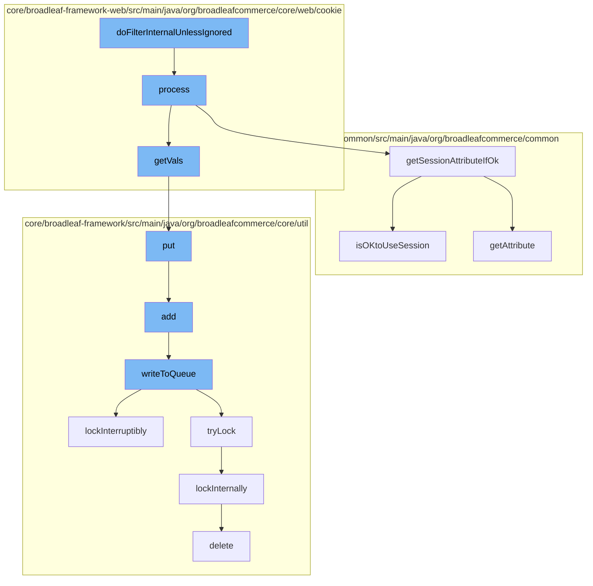

This document will cover the process of handling cookies in the BroadleafCommerce-demo project. The process includes:

1. Filtering requests and processing cookies
2. Retrieving session attributes
3. Adding data to a distributed queue
4. Locking and unlocking resources
5. Deleting data from the database.



<SwmSnippet path="/core/broadleaf-framework-web/src/main/java/org/broadleafcommerce/core/web/cookie/CookieRuleFilter.java" line="66">

---

# Filtering requests and processing cookies

The `doFilterInternalUnlessIgnored` function in `CookieRuleFilter.java` starts the process by calling the `process` function in `CookieRuleRequestProcessor.java`. This function checks if the request is an instance of `ServletWebRequest` and retrieves or creates a proxy map of cookies.

```java

```

---

</SwmSnippet>

<SwmSnippet path="/common/src/main/java/org/broadleafcommerce/common/util/BLCRequestUtils.java" line="63">

---

# Retrieving session attributes

The `getSessionAttributeIfOk` function in `BLCRequestUtils.java` is used to retrieve session attributes. It checks if it's okay to use the session and if so, it retrieves the attribute.

```java
    /**
     * Takes {@link #isOKtoUseSession(WebRequest)} into account when retrieving session attributes. If it's not ok, this
     * will return null
     */
    public static Object getSessionAttributeIfOk(WebRequest request, String attribute) {
        if (isOKtoUseSession(request)) {
            return request.getAttribute(attribute, WebRequest.SCOPE_SESSION);
        }
        return null;
    }
```

---

</SwmSnippet>

<SwmSnippet path="/core/broadleaf-framework/src/main/java/org/broadleafcommerce/core/util/queue/ZookeeperDistributedQueue.java" line="393">

---

# Adding data to a distributed queue

The `put` function in `ZookeeperDistributedQueue.java` is used to add data to a distributed queue. It calls the `writeToQueue` function to write the data to the queue.

```java
    @Override
    public void put(T e) throws InterruptedException {
        final ArrayList<T> elementsToAdd = new ArrayList<>();
        elementsToAdd.add(e);
        writeToQueue(elementsToAdd, -1L);
    }
```

---

</SwmSnippet>

<SwmSnippet path="/core/broadleaf-framework/src/main/java/org/broadleafcommerce/core/util/lock/ReentrantDistributedZookeeperLock.java" line="335">

---

# Locking and unlocking resources

The `lockInterruptibly` function in `ReentrantDistributedZookeeperLock.java` is used to lock resources. It calls the `lockInternally` function to perform the actual locking.

```java
    @Override
    public void lockInterruptibly() throws InterruptedException {
        if (Thread.interrupted()) {
            throw new InterruptedException("Thread was interrupted prior to trying to acquire the lock.");
        }
        
        lockInternally(-1L);
    }
```

---

</SwmSnippet>

<SwmSnippet path="/core/broadleaf-framework/src/main/java/org/broadleafcommerce/core/util/dao/CodeTypeDaoImpl.java" line="51">

---

# Deleting data from the database

The `delete` function in `CodeTypeDaoImpl.java` is used to delete data from the database. It checks if the data is contained in the entity manager and if so, it removes it.

```java
    public void delete(CodeType codeType) {
        if (!em.contains(codeType)) {
            codeType = (CodeType) em.find(CodeTypeImpl.class, codeType.getId());
        }
        em.remove(codeType);
    }
```

---

</SwmSnippet>

&nbsp;

*This is an auto-generated document by Swimm AI 🌊 and has not yet been verified by a human*

<SwmMeta version="3.0.0" repo-id="Z2l0aHViJTNBJTNBQnJvYWRsZWFmQ29tbWVyY2UtZGVtbyUzQSUzQWdpbGFkbmF2b3Q=" repo-name="BroadleafCommerce-demo" doc-type="flows"><sup>Powered by [Swimm](/)</sup></SwmMeta>
