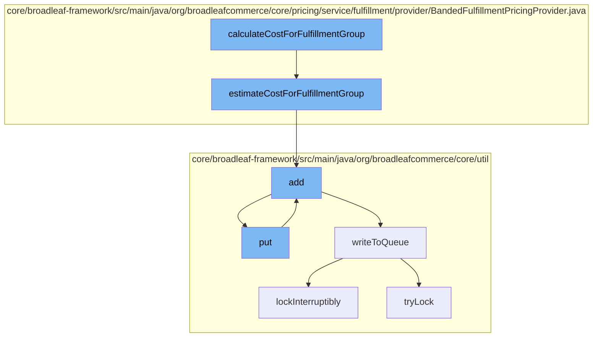

This document will cover the process of calculating the cost for a fulfillment group in the BroadleafCommerce-demo project. The process includes the following steps:

1. Initiating the cost calculation
2. Estimating the cost for the fulfillment group
3. Adding the estimated cost to the resource purge service
4. Putting the estimated cost into the Zookeeper distributed queue
5. Writing the estimated cost to the queue
6. Locking the process to avoid interruptions.



<SwmSnippet path="/core/broadleaf-framework/src/main/java/org/broadleafcommerce/core/pricing/service/fulfillment/provider/BandedFulfillmentPricingProvider.java" line="1">

---

# Initiating the cost calculation

The `calculateCostForFulfillmentGroup` function initiates the cost calculation process for a fulfillment group. This is the entry point for the cost calculation process.

```java
/*-
 * #%L
 * BroadleafCommerce Framework
 * %%
 * Copyright (C) 2009 - 2024 Broadleaf Commerce
 * %%
 * Licensed under the Broadleaf Fair Use License Agreement, Version 1.0
 * (the "Fair Use License" located  at http://license.broadleafcommerce.org/fair_use_license-1.0.txt)
 * unless the restrictions on use therein are violated and require payment to Broadleaf in which case
 * the Broadleaf End User License Agreement (EULA), Version 1.1
```

---

</SwmSnippet>

<SwmSnippet path="/core/broadleaf-framework/src/main/java/org/broadleafcommerce/core/pricing/service/fulfillment/provider/BandedFulfillmentPricingProvider.java" line="92">

---

# Estimating the cost for the fulfillment group

The `estimateCostForFulfillmentGroup` function is called to estimate the cost for the fulfillment group. It takes into account various factors such as the fulfillment option, the weight of the items, and the retail price.

```java
    @Override
    public FulfillmentEstimationResponse estimateCostForFulfillmentGroup(FulfillmentGroup fulfillmentGroup, Set<FulfillmentOption> options) throws FulfillmentPriceException {

        //Set up the response object
        FulfillmentEstimationResponse res = new FulfillmentEstimationResponse();
        HashMap<FulfillmentOption, Money> shippingPrices = new HashMap<FulfillmentOption, Money>();
        res.setFulfillmentOptionPrices(shippingPrices);

        for (FulfillmentOption option : options) {
            if (canCalculateCostForFulfillmentGroup(fulfillmentGroup, option)) {
                
                List<? extends FulfillmentBand> bands = null;
                if (option instanceof BandedPriceFulfillmentOption) {
                    bands = ((BandedPriceFulfillmentOption) option).getBands();
                } else if (option instanceof BandedWeightFulfillmentOption) {
                    bands = ((BandedWeightFulfillmentOption) option).getBands();
                }
                
                if (bands == null || bands.isEmpty()) {
                    //Something is misconfigured. There are no bands associated with this fulfillment option
                    throw new IllegalStateException("There were no Fulfillment Price Bands configured for a BandedPriceFulfillmentOption with ID: "
```

---

</SwmSnippet>

<SwmSnippet path="/core/broadleaf-framework/src/main/java/org/broadleafcommerce/core/util/service/ResourcePurgeServiceImpl.java" line="593">

---

# Adding the estimated cost to the resource purge service

The `add` function is called to add the estimated cost to the resource purge service. This is done to keep track of the resources used in the cost calculation process.

```java
        public Long add(Long entry) {
            if (! cache.containsKey(entry)) {
                return cache.put(entry, new Long(System.currentTimeMillis()));
            }
            return null;
        }
```

---

</SwmSnippet>

<SwmSnippet path="/core/broadleaf-framework/src/main/java/org/broadleafcommerce/core/util/queue/ZookeeperDistributedQueue.java" line="393">

---

# Putting the estimated cost into the Zookeeper distributed queue

The `put` function is called to put the estimated cost into the Zookeeper distributed queue. This is done to ensure that the cost calculation process is distributed and scalable.

```java
    @Override
    public void put(T e) throws InterruptedException {
        final ArrayList<T> elementsToAdd = new ArrayList<>();
        elementsToAdd.add(e);
        writeToQueue(elementsToAdd, -1L);
    }
```

---

</SwmSnippet>

<SwmSnippet path="/core/broadleaf-framework/src/main/java/org/broadleafcommerce/core/util/queue/ZookeeperDistributedQueue.java" line="503">

---

# Writing the estimated cost to the queue

The `writeToQueue` function is called to write the estimated cost to the queue. This is the final step in the cost calculation process, where the estimated cost is stored for future reference.

```java
    protected int writeToQueue(List<? extends T> entries, final long timeout) throws InterruptedException {
        if (entries == null || entries.isEmpty()) {
            return 0;
        }
        
        int entryCount = 0;
        long waitTime = timeout;
        synchronized (QUEUE_MONITOR) {
            while (true) {
                boolean locked = false;
                DistributedLock lock = getQueueAccessLock();
                if (timeout < 0L) {
                    lock.lockInterruptibly();
                    locked = true;
                } else if (timeout > 0L && waitTime > 0L) {
                    long start = System.currentTimeMillis();
                    locked = lock.tryLock(waitTime, TimeUnit.MILLISECONDS);
                    long end = System.currentTimeMillis();
                    waitTime -= (end - start);
                } else {
                    locked = lock.tryLock();
```

---

</SwmSnippet>

<SwmSnippet path="/core/broadleaf-framework/src/main/java/org/broadleafcommerce/core/util/lock/ReentrantDistributedZookeeperLock.java" line="335">

---

# Locking the process to avoid interruptions

The `lockInterruptibly` function is called to lock the process and avoid interruptions. This ensures that the cost calculation process is not interrupted midway.

```java
    @Override
    public void lockInterruptibly() throws InterruptedException {
        if (Thread.interrupted()) {
            throw new InterruptedException("Thread was interrupted prior to trying to acquire the lock.");
        }
        
        lockInternally(-1L);
    }
```

---

</SwmSnippet>

&nbsp;

*This is an auto-generated document by Swimm AI 🌊 and has not yet been verified by a human*

<SwmMeta version="3.0.0" repo-id="Z2l0aHViJTNBJTNBQnJvYWRsZWFmQ29tbWVyY2UtZGVtbyUzQSUzQWdpbGFkbmF2b3Q=" repo-name="BroadleafCommerce-demo" doc-type="flows"><sup>Powered by [Swimm](/)</sup></SwmMeta>
