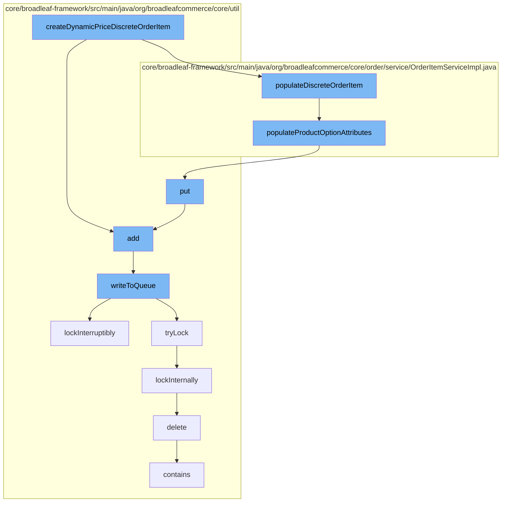

This document will cover the process of creating a dynamic price discrete order item in the BroadleafCommerce-demo repository. The process includes:

1. Adding a new entry to the resource purge service
2. Populating the discrete order item with product option attributes
3. Adding the populated item to the distributed queue
4. Writing the item to the queue with a distributed lock
5. Deleting the code type from the DAO.



<SwmSnippet path="/core/broadleaf-framework/src/main/java/org/broadleafcommerce/core/util/service/ResourcePurgeServiceImpl.java" line="593">

---

# Adding a new entry to the resource purge service

The `add` method in `ResourcePurgeServiceImpl` is used to add a new entry to the cache. If the entry does not already exist in the cache, it is added with the current time as its value.

```java
        public Long add(Long entry) {
            if (! cache.containsKey(entry)) {
                return cache.put(entry, new Long(System.currentTimeMillis()));
            }
            return null;
        }
```

---

</SwmSnippet>

<SwmSnippet path="/core/broadleaf-framework/src/main/java/org/broadleafcommerce/core/order/service/OrderItemServiceImpl.java" line="117">

---

# Populating the discrete order item with product option attributes

The `populateProductOptionAttributes` method in `OrderItemServiceImpl` is used to populate the order item with product option attributes. If the attributes map is not empty, each attribute is added to the order item's attributes.

```java
    protected void populateProductOptionAttributes(OrderItem item, Map<String, String> attributes) {
        if (attributes != null && attributes.size() > 0) {
            Map<String, OrderItemAttribute> orderItemAttributes = item.getOrderItemAttributes();
            if (item.getOrderItemAttributes() == null) {
                orderItemAttributes = new HashMap<String, OrderItemAttribute>();
                item.setOrderItemAttributes(orderItemAttributes);
            }
            for (String key : attributes.keySet()) {
                String value = attributes.get(key);
                if(value == null){
                    continue;
                }
                OrderItemAttribute attribute = orderItemAttributes.get(key);

                if(attribute == null) {
                    attribute = new OrderItemAttributeImpl();
                }

                attribute.setName(key);
                attribute.setValue(value);
                attribute.setOrderItem(item);
```

---

</SwmSnippet>

<SwmSnippet path="/core/broadleaf-framework/src/main/java/org/broadleafcommerce/core/util/queue/ZookeeperDistributedQueue.java" line="359">

---

# Adding the populated item to the distributed queue

The `add` method in `ZookeeperDistributedQueue` is used to add the populated item to the distributed queue. If the queue is full, an exception is thrown.

```java
    @Override
    public boolean add(T e) {
        try {
            final ArrayList<T> lst = new ArrayList<>();
            lst.add(e);
            int count = writeToQueue(lst, 0L);
            if (count != 1) {
                throw new IllegalStateException("The Zookeeper queue was full.");
            } else {
                return true;
            }
        } catch (InterruptedException ex) {
            Thread.currentThread().interrupt();
            return false;
        }
    }
```

---

</SwmSnippet>

<SwmSnippet path="/core/broadleaf-framework/src/main/java/org/broadleafcommerce/core/util/queue/ZookeeperDistributedQueue.java" line="503">

---

# Writing the item to the queue with a distributed lock

The `writeToQueue` method in `ZookeeperDistributedQueue` is used to write the item to the queue. A distributed lock is used to ensure that the operation is atomic.

```java
    protected int writeToQueue(List<? extends T> entries, final long timeout) throws InterruptedException {
        if (entries == null || entries.isEmpty()) {
            return 0;
        }
        
        int entryCount = 0;
        long waitTime = timeout;
        synchronized (QUEUE_MONITOR) {
            while (true) {
                boolean locked = false;
                DistributedLock lock = getQueueAccessLock();
                if (timeout < 0L) {
                    lock.lockInterruptibly();
                    locked = true;
                } else if (timeout > 0L && waitTime > 0L) {
                    long start = System.currentTimeMillis();
                    locked = lock.tryLock(waitTime, TimeUnit.MILLISECONDS);
                    long end = System.currentTimeMillis();
                    waitTime -= (end - start);
                } else {
                    locked = lock.tryLock();
```

---

</SwmSnippet>

<SwmSnippet path="/core/broadleaf-framework/src/main/java/org/broadleafcommerce/core/util/dao/CodeTypeDaoImpl.java" line="51">

---

# Deleting the code type from the DAO

The `delete` method in `CodeTypeDaoImpl` is used to delete the code type from the DAO. If the code type is not contained in the DAO, it is removed.

```java
    public void delete(CodeType codeType) {
        if (!em.contains(codeType)) {
            codeType = (CodeType) em.find(CodeTypeImpl.class, codeType.getId());
        }
        em.remove(codeType);
    }
```

---

</SwmSnippet>

&nbsp;

*This is an auto-generated document by Swimm AI 🌊 and has not yet been verified by a human*

<SwmMeta version="3.0.0" repo-id="Z2l0aHViJTNBJTNBQnJvYWRsZWFmQ29tbWVyY2UtZGVtbyUzQSUzQWdpbGFkbmF2b3Q=" repo-name="BroadleafCommerce-demo" doc-type="flows"><sup>Powered by [Swimm](/)</sup></SwmMeta>
