This document will cover the process of purging customers from the Broadleaf Commerce system. We'll cover:

1. The initiation of the purge process
2. Retrieving the list of customers to purge
3. Counting the customers to purge
4. Building the customer query
5. Applying the limited in clause
6. Adding the customers to the cache
7. Writing to the queue
8. Locking the process

```mermaid
graph TD;
subgraph core/broadleaf-framework/src/main/java/org/broadleafcommerce/core/util
  purgeCustomers:::mainFlowStyle --> getCustomersToPurge
end
subgraph core/broadleaf-framework/src/main/java/org/broadleafcommerce/core/util
  purgeCustomers:::mainFlowStyle --> getCustomersToPurgeLength
end
subgraph core/broadleaf-framework/src/main/java/org/broadleafcommerce/core/util
  getCustomersToPurge:::mainFlowStyle --> findCustomers
end
subgraph core/broadleaf-framework/src/main/java/org/broadleafcommerce/core/util
  getCustomersToPurgeLength:::mainFlowStyle --> findCustomersCount
end
subgraph core/broadleaf-framework/src/main/java/org/broadleafcommerce/core/util
  findCustomersCount:::mainFlowStyle --> buildCustomerQuery
end
subgraph core/broadleaf-framework/src/main/java/org/broadleafcommerce/core/util
  buildCustomerQuery:::mainFlowStyle --> applyLimitedInClause
end
subgraph core/broadleaf-framework/src/main/java/org/broadleafcommerce/core/util
  applyLimitedInClause --> add
end
subgraph core/broadleaf-framework/src/main/java/org/broadleafcommerce/core/util
  add --> put
end
subgraph core/broadleaf-framework/src/main/java/org/broadleafcommerce/core/util
  put --> add
end
subgraph core/broadleaf-framework/src/main/java/org/broadleafcommerce/core/util
  add --> writeToQueue
end
subgraph core/broadleaf-framework/src/main/java/org/broadleafcommerce/core/util
  writeToQueue --> lockInterruptibly
end
subgraph core/broadleaf-framework/src/main/java/org/broadleafcommerce/core/util
  writeToQueue --> tryLock
end
subgraph core/broadleaf-framework/src/main/java/org/broadleafcommerce/core/util
  lockInterruptibly --> lockInternally
end

classDef mainFlowStyle color:#000000,fill:#7CB9F4
classDef rootsStyle color:#000000,fill:#00FFF4
classDef Style1 color:#000000,fill:#00FFAA
classDef Style2 color:#000000,fill:#FFFF00
classDef Style3 color:#000000,fill:#AA7CB9
```



<SwmSnippet path="/core/broadleaf-framework/src/main/java/org/broadleafcommerce/core/util/service/ResourcePurgeServiceImpl.java" line="1">

---

# The initiation of the purge process

The `purgeCustomers` function initiates the process of purging customers. It calls `getCustomersToPurge` and `getCustomersToPurgeLength` to retrieve and count the customers to be purged.

```java
/*-
 * #%L
 * BroadleafCommerce Framework
 * %%
 * Copyright (C) 2009 - 2024 Broadleaf Commerce
 * %%
 * Licensed under the Broadleaf Fair Use License Agreement, Version 1.0
 * (the "Fair Use License" located  at http://license.broadleafcommerce.org/fair_use_license-1.0.txt)
 * unless the restrictions on use therein are violated and require payment to Broadleaf in which case
 * the Broadleaf End User License Agreement (EULA), Version 1.1
```

---

</SwmSnippet>

<SwmSnippet path="/core/broadleaf-framework/src/main/java/org/broadleafcommerce/core/util/service/ResourcePurgeServiceImpl.java" line="404">

---

# Retrieving the list of customers to purge

The `getCustomersToPurge` function retrieves the list of customers to be purged based on the provided parameters. It calls `findCustomers` to retrieve the customers from the database.

```java
    protected List<Customer> getCustomersToPurge(CustomerPurgeParams purgeParams, int startPos, int length, List<Long> customersInError) {
        Boolean isRegistered = purgeParams.getIsRegistered();
        Boolean isDeactivated = purgeParams.getIsDeactivated();
        Date dateCreatedMinThreshold = purgeParams.getDateCreatedMinThreshold();
        Boolean isPreview = purgeParams.getIsPreview();
        return resourcePurgeDao.findCustomers(dateCreatedMinThreshold, isRegistered, isDeactivated, isPreview, startPos, length, customersInError);
    }
```

---

</SwmSnippet>

<SwmSnippet path="/core/broadleaf-framework/src/main/java/org/broadleafcommerce/core/util/dao/ResourcePurgeDaoImpl.java" line="93">

---

# Counting the customers to purge

The `findCustomersCount` function counts the number of customers to be purged. It calls `buildCustomerQuery` to build the query for retrieving the customers.

```java
    @Override
    public Long findCustomersCount(Date dateCreatedMinThreshold, Boolean registered, Boolean deactivated, Boolean isPreview, List<Long> excludedIds) {
        TypedQuery<Long> query = buildCustomerQuery(dateCreatedMinThreshold, registered, deactivated, isPreview, Long.class, excludedIds);
        return query.getSingleResult();
    }
```

---

</SwmSnippet>

<SwmSnippet path="/core/broadleaf-framework/src/main/java/org/broadleafcommerce/core/util/dao/ResourcePurgeDaoImpl.java" line="99">

---

# Building the customer query

The `buildCustomerQuery` function builds the query for retrieving the customers to be purged. It applies various conditions based on the provided parameters and calls `applyLimitedInClause` to apply the in clause.

```java
    protected <T> TypedQuery<T> buildCustomerQuery(Date dateCreatedMinThreshold, Boolean registered, Boolean deactivated, Boolean isPreview, Class<T> returnType,
            List<Long> excludedIds) {
        CriteriaBuilder builder = em.getCriteriaBuilder();
        CriteriaQuery<T> criteria = builder.createQuery(returnType);
        Root<CustomerImpl> root = criteria.from(CustomerImpl.class);
        if (Long.class.equals(returnType)) {
            criteria.select((Selection<? extends T>) builder.count(root));
        } else {
            criteria.select((Selection<? extends T>) root);
        }

        //find only customers that do not have any orders, otherwise a purge would fail because of referential integrity
        Subquery<Long> subquery = criteria.subquery(Long.class);
        Root orderRoot = subquery.from(OrderImpl.class);
        subquery.select(builder.count(orderRoot));
        subquery.where(builder.equal(orderRoot.get("customer"),root));

        List<Predicate> restrictions = new ArrayList<Predicate>();
        restrictions.add(builder.equal(subquery, 0L));
        if (registered != null) {
            if (registered) {
```

---

</SwmSnippet>

<SwmSnippet path="/core/broadleaf-framework/src/main/java/org/broadleafcommerce/core/util/dao/ResourcePurgeDaoImpl.java" line="152">

---

# Applying the limited in clause

The `applyLimitedInClause` function applies the in clause to the query. It partitions the list of ids into smaller lists and adds them to the query.

```java
    protected <T> void applyLimitedInClause(List<Long> ids, CriteriaBuilder builder, Root<T> root, List<Predicate> restrictions) {
        List<List<Long>> listsOfExcludeIds = Lists.partition(ids, RESTRICT_IN_CLAUSE_MAX_SIZE);
        List<Predicate> inRestrictions = new ArrayList<Predicate>();
        for (List<Long> idSetToExclude : listsOfExcludeIds) {
            inRestrictions.add(builder.not(root.get("id").in(idSetToExclude)));
        }
        restrictions.add(builder.and(inRestrictions.toArray(new Predicate[inRestrictions.size()])));
    }
```

---

</SwmSnippet>

<SwmSnippet path="/core/broadleaf-framework/src/main/java/org/broadleafcommerce/core/util/service/ResourcePurgeServiceImpl.java" line="593">

---

# Adding the customers to the cache

The `add` function adds the customers to the cache. It checks if the customer is already in the cache before adding it.

```java
        public Long add(Long entry) {
            if (! cache.containsKey(entry)) {
                return cache.put(entry, new Long(System.currentTimeMillis()));
            }
            return null;
        }
```

---

</SwmSnippet>

<SwmSnippet path="/core/broadleaf-framework/src/main/java/org/broadleafcommerce/core/util/queue/ZookeeperDistributedQueue.java" line="393">

---

# Writing to the queue

The `put` function writes the customers to the queue. It calls `writeToQueue` to write the customers to the queue.

```java
    @Override
    public void put(T e) throws InterruptedException {
        final ArrayList<T> elementsToAdd = new ArrayList<>();
        elementsToAdd.add(e);
        writeToQueue(elementsToAdd, -1L);
    }
```

---

</SwmSnippet>

<SwmSnippet path="/core/broadleaf-framework/src/main/java/org/broadleafcommerce/core/util/lock/ReentrantDistributedZookeeperLock.java" line="335">

---

# Locking the process

The `lockInterruptibly` function locks the process to ensure that the purge process is not interrupted. It calls `lockInternally` to lock the process.

```java
    @Override
    public void lockInterruptibly() throws InterruptedException {
        if (Thread.interrupted()) {
            throw new InterruptedException("Thread was interrupted prior to trying to acquire the lock.");
        }
        
        lockInternally(-1L);
    }
```

---

</SwmSnippet>

&nbsp;

*This is an auto-generated document by Swimm AI 🌊 and has not yet been verified by a human*

<SwmMeta version="3.0.0" repo-id="Z2l0aHViJTNBJTNBQnJvYWRsZWFmQ29tbWVyY2UtZGVtbyUzQSUzQWdpbGFkbmF2b3Q=" repo-name="BroadleafCommerce-demo" doc-type="flows"><sup>Powered by [Swimm](/)</sup></SwmMeta>
