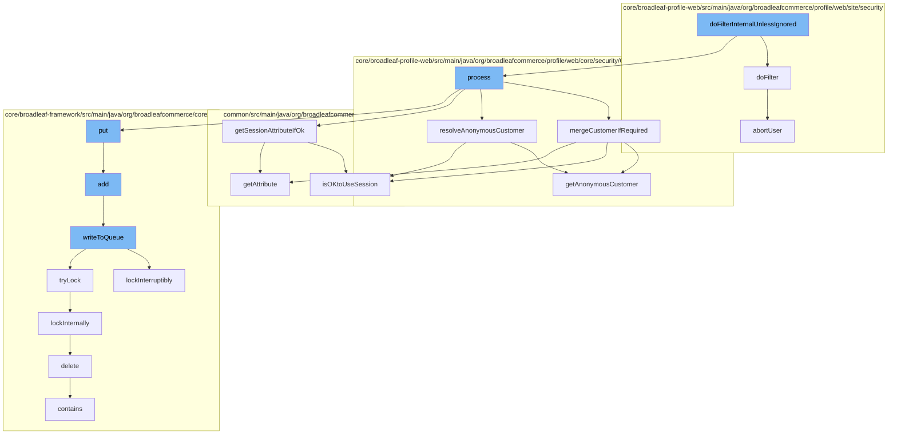

This document will cover the process of handling customer state in the BroadleafCommerce-demo project. We'll cover:

1. Filtering customer state
2. Session fixation protection
3. Processing customer state request
4. Merging customer if required
5. Resolving anonymous customer
6. Adding customer to distributed queue
7. Locking and writing to queue
8. Deleting code type.



<SwmSnippet path="/core/broadleaf-profile-web/src/main/java/org/broadleafcommerce/profile/web/site/security/CustomerStateFilter.java" line="1">

---

# Filtering customer state

The `doFilterInternalUnlessIgnored` function in `CustomerStateFilter.java` is the entry point for handling customer state. It calls the `doFilter` function in `SessionFixationProtectionFilter.java` and the `process` function in `CustomerStateRequestProcessor.java`.

```java
/*-
 * #%L
 * BroadleafCommerce Profile Web
 * %%
 * Copyright (C) 2009 - 2024 Broadleaf Commerce
 * %%
 * Licensed under the Broadleaf Fair Use License Agreement, Version 1.0
 * (the "Fair Use License" located  at http://license.broadleafcommerce.org/fair_use_license-1.0.txt)
 * unless the restrictions on use therein are violated and require payment to Broadleaf in which case
 * the Broadleaf End User License Agreement (EULA), Version 1.1
```

---

</SwmSnippet>

<SwmSnippet path="/core/broadleaf-profile-web/src/main/java/org/broadleafcommerce/profile/web/site/security/SessionFixationProtectionFilter.java" line="75">

---

# Session fixation protection

The `doFilter` function in `SessionFixationProtectionFilter.java` is responsible for session fixation protection. It checks if the session is secure and if the session fixation protection cookie is set. If the session is not secure, it aborts the user.

```java
    @Override
    public void doFilter(ServletRequest sRequest, ServletResponse sResponse, FilterChain chain) throws IOException, ServletException {
        HttpServletRequest request = (HttpServletRequest) sRequest;
        HttpServletResponse response = (HttpServletResponse) sResponse;
        HttpSession session = request.getSession(false);

        if (enabled) {
            if (SecurityContextHolder.getContext() == null) {
                chain.doFilter(request, response);
            }

            String activeIdSessionValue = (session == null) ? null : (String) session.getAttribute(SESSION_ATTR);

            if (StringUtils.isNotBlank(activeIdSessionValue) && request.isSecure()) {
                // The request is secure and and we've set a session fixation protection cookie

                String activeIdCookieValue = cookieUtils.getCookieValue(request, SessionFixationProtectionCookie.COOKIE_NAME);
                String decryptedActiveIdValue = encryptionModule.decrypt(activeIdCookieValue);

                if (!activeIdSessionValue.equals(decryptedActiveIdValue)) {
                    abortUser(request, response);
```

---

</SwmSnippet>

<SwmSnippet path="/core/broadleaf-profile-web/src/main/java/org/broadleafcommerce/profile/web/core/security/CustomerStateRequestProcessor.java" line="1">

---

# Processing customer state request

The `process` function in `CustomerStateRequestProcessor.java` is responsible for processing the customer state request. It calls the `mergeCustomerIfRequired`, `resolveAnonymousCustomer`, and `getSessionAttributeIfOk` functions.

```java
/*-
 * #%L
 * BroadleafCommerce Profile Web
 * %%
 * Copyright (C) 2009 - 2024 Broadleaf Commerce
 * %%
 * Licensed under the Broadleaf Fair Use License Agreement, Version 1.0
 * (the "Fair Use License" located  at http://license.broadleafcommerce.org/fair_use_license-1.0.txt)
 * unless the restrictions on use therein are violated and require payment to Broadleaf in which case
 * the Broadleaf End User License Agreement (EULA), Version 1.1
```

---

</SwmSnippet>

<SwmSnippet path="/core/broadleaf-profile-web/src/main/java/org/broadleafcommerce/profile/web/core/security/CustomerStateRequestProcessor.java" line="168">

---

# Merging customer if required

The `mergeCustomerIfRequired` function in `CustomerStateRequestProcessor.java` is responsible for merging anonymous customer data and/or session data to the logged in customer, if required.

```java
    /**
     * Allows the merging of anonymous customer data and / or session data, to the logged in customer, if required. 
     * This is written to only require it to happen once.
     * @param request
     * @param customer
     * @return
     */
    protected Customer mergeCustomerIfRequired(WebRequest request, Customer customer) {
        if (BLCRequestUtils.isOKtoUseSession(request)) {
            //Don't call this if it has already been called
            if (request.getAttribute(getAnonymousCustomerMergedSessionAttributeName(), WebRequest.SCOPE_SESSION) == null) {
                //Set this so we don't do this every time.
                request.setAttribute(getAnonymousCustomerMergedSessionAttributeName(), Boolean.TRUE, WebRequest.SCOPE_SESSION);

                Customer anonymousCustomer = getAnonymousCustomer(request);
                customer = copyAnonymousCustomerInfoToCustomer(request, anonymousCustomer, customer);
            }
        }
        return customer;
    }
```

---

</SwmSnippet>

<SwmSnippet path="/core/broadleaf-profile-web/src/main/java/org/broadleafcommerce/profile/web/core/security/CustomerStateRequestProcessor.java" line="280">

---

# Resolving anonymous customer

The `resolveAnonymousCustomer` function in `CustomerStateRequestProcessor.java` is responsible for returning the anonymous customer that was saved in session.

```java
    /**
     * Returns the anonymous customer that was saved in session. This first checks for a full customer in session (meaning
     * that the customer has not already been persisted) and returns that. If there is no full customer in session (and
     * there is instead just an anonymous customer ID) then this will look up the customer from the database using that and
     * return it.
     * 
     * @param request the current request
     * @return the anonymous customer in session or null if there is no anonymous customer represented in session
     * @see {@link #getAnonymousCustomerSessionAttributeName()} 
     * @see {@link #getAnonymousCustomerIdSessionAttributeName()}
     */
    public Customer getAnonymousCustomer(WebRequest request) {
        if (anonymousCustomerExtensionManager != null) {
            ExtensionResultHolder<Customer> resultHolder = new ExtensionResultHolder<Customer>();
            anonymousCustomerExtensionManager.getProxy().getAnonymousCustomer(resultHolder, request);
            if (resultHolder.getResult() != null) {
                return resultHolder.getResult();
            }
        }

        if (BLCRequestUtils.isOKtoUseSession(request)) {
```

---

</SwmSnippet>

<SwmSnippet path="/core/broadleaf-framework/src/main/java/org/broadleafcommerce/core/util/queue/ZookeeperDistributedQueue.java" line="359">

---

# Adding customer to distributed queue

The `add` function in `ZookeeperDistributedQueue.java` is responsible for adding the customer to the distributed queue. It calls the `writeToQueue` function.

```java
    @Override
    public boolean add(T e) {
        try {
            final ArrayList<T> lst = new ArrayList<>();
            lst.add(e);
            int count = writeToQueue(lst, 0L);
            if (count != 1) {
                throw new IllegalStateException("The Zookeeper queue was full.");
            } else {
                return true;
            }
        } catch (InterruptedException ex) {
            Thread.currentThread().interrupt();
            return false;
        }
    }
```

---

</SwmSnippet>

<SwmSnippet path="/core/broadleaf-framework/src/main/java/org/broadleafcommerce/core/util/queue/ZookeeperDistributedQueue.java" line="503">

---

# Locking and writing to queue

The `writeToQueue` function in `ZookeeperDistributedQueue.java` is responsible for writing to the queue. It locks the queue, writes the entries, and then unlocks the queue.

```java
    protected int writeToQueue(List<? extends T> entries, final long timeout) throws InterruptedException {
        if (entries == null || entries.isEmpty()) {
            return 0;
        }
        
        int entryCount = 0;
        long waitTime = timeout;
        synchronized (QUEUE_MONITOR) {
            while (true) {
                boolean locked = false;
                DistributedLock lock = getQueueAccessLock();
                if (timeout < 0L) {
                    lock.lockInterruptibly();
                    locked = true;
                } else if (timeout > 0L && waitTime > 0L) {
                    long start = System.currentTimeMillis();
                    locked = lock.tryLock(waitTime, TimeUnit.MILLISECONDS);
                    long end = System.currentTimeMillis();
                    waitTime -= (end - start);
                } else {
                    locked = lock.tryLock();
```

---

</SwmSnippet>

<SwmSnippet path="/core/broadleaf-framework/src/main/java/org/broadleafcommerce/core/util/dao/CodeTypeDaoImpl.java" line="51">

---

# Deleting code type

The `delete` function in `CodeTypeDaoImpl.java` is responsible for deleting a code type.

```java
    public void delete(CodeType codeType) {
        if (!em.contains(codeType)) {
            codeType = (CodeType) em.find(CodeTypeImpl.class, codeType.getId());
        }
        em.remove(codeType);
    }
```

---

</SwmSnippet>

&nbsp;

*This is an auto-generated document by Swimm AI 🌊 and has not yet been verified by a human*

<SwmMeta version="3.0.0" repo-id="Z2l0aHViJTNBJTNBQnJvYWRsZWFmQ29tbWVyY2UtZGVtbyUzQSUzQWdpbGFkbmF2b3Q=" repo-name="BroadleafCommerce-demo" doc-type="flows"><sup>Powered by [Swimm](/)</sup></SwmMeta>
