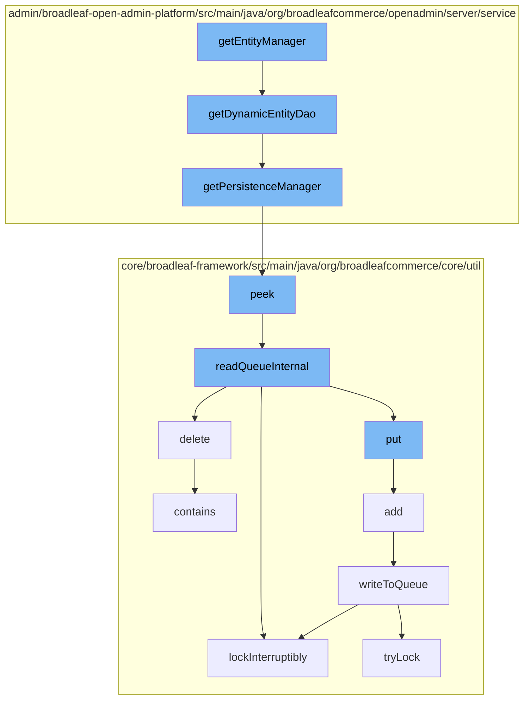

This document will cover the process of handling data persistence in the BroadleafCommerce-demo project. We'll cover:

1. Retrieving the EntityManager
2. Getting the DynamicEntityDao
3. Accessing the PersistenceManager
4. Interacting with the ZookeeperDistributedQueue
5. Managing distributed locks with ReentrantDistributedZookeeperLock.



<SwmSnippet path="/admin/broadleaf-open-admin-platform/src/main/java/org/broadleafcommerce/openadmin/server/factory/PersistencePackageFactoryImpl.java" line="1">

---

# Retrieving the EntityManager

The `getEntityManager` function is the starting point of the data persistence flow. It's responsible for retrieving the EntityManager, which is the primary interface for interacting with the persistence context.

```java
/*-
 * #%L
 * BroadleafCommerce Open Admin Platform
 * %%
 * Copyright (C) 2009 - 2024 Broadleaf Commerce
 * %%
 * Licensed under the Broadleaf Fair Use License Agreement, Version 1.0
 * (the "Fair Use License" located  at http://license.broadleafcommerce.org/fair_use_license-1.0.txt)
 * unless the restrictions on use therein are violated and require payment to Broadleaf in which case
 * the Broadleaf End User License Agreement (EULA), Version 1.1
```

---

</SwmSnippet>

<SwmSnippet path="/admin/broadleaf-open-admin-platform/src/main/java/org/broadleafcommerce/openadmin/server/service/AdminEntityServiceImpl.java" line="1030">

---

# Getting the DynamicEntityDao

The `getDynamicEntityDao` function is called by `getEntityManager`. It retrieves the DynamicEntityDao, which is used to perform operations on dynamic entities.

```java
    protected DynamicEntityDao getDynamicEntityDao(String owningClass) {
        return PersistenceManagerFactory.getPersistenceManager(owningClass).getDynamicEntityDao();
    }
```

---

</SwmSnippet>

<SwmSnippet path="/admin/broadleaf-open-admin-platform/src/main/java/org/broadleafcommerce/openadmin/server/service/persistence/PersistenceManagerContext.java" line="49">

---

# Accessing the PersistenceManager

The `getPersistenceManager` function is called by `getDynamicEntityDao`. It retrieves the PersistenceManager, which provides a set of APIs to interact with the persistence context.

```java
    public PersistenceManager getPersistenceManager() {
        return !persistenceManager.empty()?persistenceManager.peek():null;
    }
```

---

</SwmSnippet>

<SwmSnippet path="/core/broadleaf-framework/src/main/java/org/broadleafcommerce/core/util/queue/ZookeeperDistributedQueue.java" line="222">

---

# Interacting with the ZookeeperDistributedQueue

The `peek` function is called by `getPersistenceManager`. It interacts with the ZookeeperDistributedQueue, which is a distributed queue implementation using Zookeeper. It retrieves the first element in the queue without removing it.

```java
    @Override
    public T peek() {
        try {
            Map<String, T> elements = readQueueInternal(1, false, 0L);
            Iterator<Map.Entry<String, T>> entries = elements.entrySet().iterator();
            if (entries.hasNext()) {
                return entries.next().getValue();
            }
            
            return null;
        } catch (InterruptedException e) {
            Thread.currentThread().interrupt();
            return null;
        }
    }
```

---

</SwmSnippet>

<SwmSnippet path="/core/broadleaf-framework/src/main/java/org/broadleafcommerce/core/util/lock/ReentrantDistributedZookeeperLock.java" line="335">

---

# Managing distributed locks with ReentrantDistributedZookeeperLock

The `lockInterruptibly` function is called within the `readQueueInternal` and `writeToQueue` functions. It manages distributed locks using the ReentrantDistributedZookeeperLock, which is a reentrant lock implementation using Zookeeper.

```java
    @Override
    public void lockInterruptibly() throws InterruptedException {
        if (Thread.interrupted()) {
            throw new InterruptedException("Thread was interrupted prior to trying to acquire the lock.");
        }
        
        lockInternally(-1L);
    }
```

---

</SwmSnippet>

&nbsp;

*This is an auto-generated document by Swimm AI 🌊 and has not yet been verified by a human*

<SwmMeta version="3.0.0" repo-id="Z2l0aHViJTNBJTNBQnJvYWRsZWFmQ29tbWVyY2UtZGVtbyUzQSUzQWdpbGFkbmF2b3Q=" repo-name="BroadleafCommerce-demo" doc-type="flows"><sup>Powered by [Swimm](/)</sup></SwmMeta>
