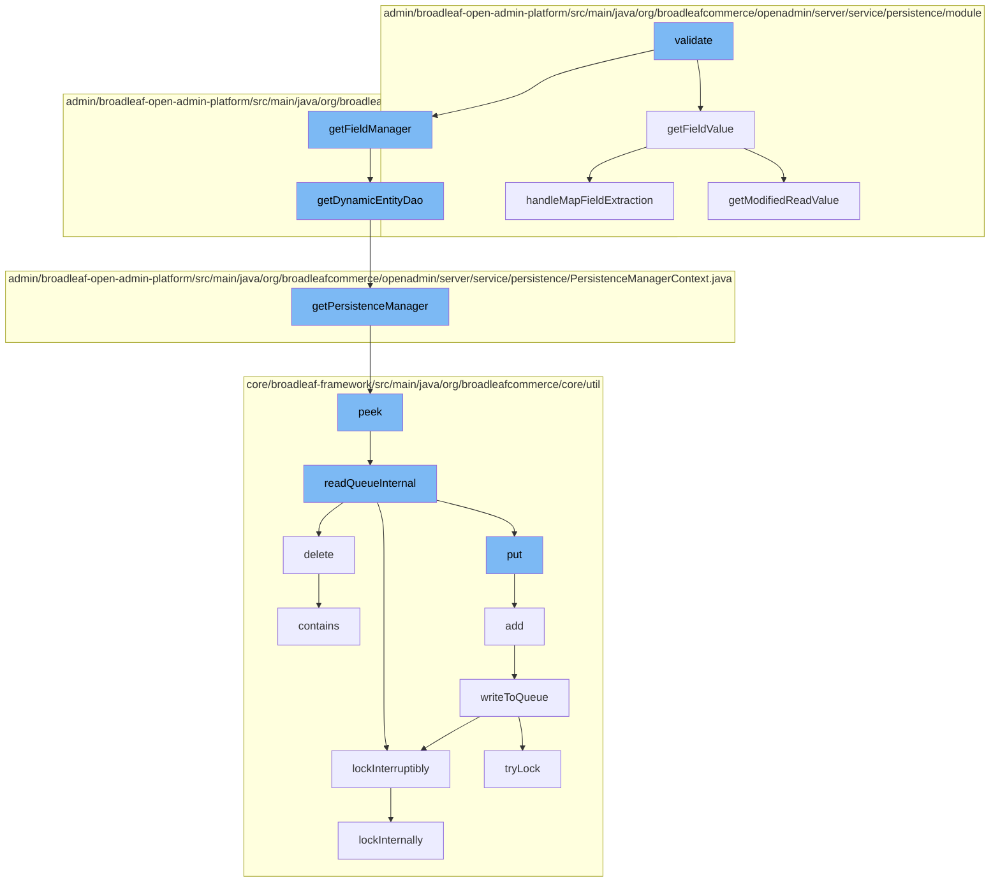

This document will cover the process of validating and managing data in Broadleaf Commerce, specifically focusing on the `MaxGreaterThanMinValidator` class. The topics we will cover are:

1. The purpose of the `MaxGreaterThanMinValidator` class.
2. How the `MaxGreaterThanMinValidator` interacts with other classes.
3. The flow of data validation and management.



<SwmSnippet path="/admin/broadleaf-open-admin-platform/src/main/java/org/broadleafcommerce/openadmin/server/service/persistence/validation/MaxGreaterThanMinValidator.java" line="1">

---

# Purpose of the MaxGreaterThanMinValidator Class

The `MaxGreaterThanMinValidator` class is a part of Broadleaf's data validation system. It ensures that the maximum value of a given field is greater than the minimum value. This is crucial in various scenarios such as price range validation, quantity checks, etc.

```java
/*-
 * #%L
 * BroadleafCommerce Open Admin Platform
 * %%
 * Copyright (C) 2009 - 2024 Broadleaf Commerce
 * %%
 * Licensed under the Broadleaf Fair Use License Agreement, Version 1.0
 * (the "Fair Use License" located  at http://license.broadleafcommerce.org/fair_use_license-1.0.txt)
 * unless the restrictions on use therein are violated and require payment to Broadleaf in which case
 * the Broadleaf End User License Agreement (EULA), Version 1.1
 * (the "Commercial License" located at http://license.broadleafcommerce.org/commercial_license-1.1.txt)
 * shall apply.
 * 
 * Alternatively, the Commercial License may be replaced with a mutually agreed upon license (the "Custom License")
 * between you and Broadleaf Commerce. You may not use this file except in compliance with the applicable license.
 * #L%
 */
package org.broadleafcommerce.openadmin.server.service.persistence.validation;

import org.apache.commons.lang.StringUtils;
import org.broadleafcommerce.openadmin.dto.BasicFieldMetadata;
```

---

</SwmSnippet>

<SwmSnippet path="/admin/broadleaf-open-admin-platform/src/main/java/org/broadleafcommerce/openadmin/server/service/persistence/validation/MaxGreaterThanMinValidator.java" line="51">

---

# Interaction with Other Classes

`MaxGreaterThanMinValidator` interacts with other classes like `FieldManager` and `UniqueValueValidator` to fetch field values and ensure their uniqueness respectively. This is part of the broader data validation and management process.

```java
        FieldManager fm = getFieldManager(propertyMetadata);
        boolean valid = true;
        String message = "";
        BigDecimal min = new BigDecimal(0);
        BigDecimal max = min;

        if (StringUtils.isBlank(value) || StringUtils.isBlank(otherField)) {
            return new PropertyValidationResult(true);
        }

        try {
            Object minObj = fm.getFieldValue(instance, otherField);
            if (minObj != null) {
                min = new BigDecimal(minObj.toString());
            }
            max = new BigDecimal(fm.getFieldValue(instance, propertyName).toString());
        } catch (IllegalAccessException | FieldNotAvailableException e) {
            valid = false;
            message = e.getMessage();
        }

```

---

</SwmSnippet>

<SwmSnippet path="/admin/broadleaf-open-admin-platform/src/main/java/org/broadleafcommerce/openadmin/server/service/persistence/validation/MaxGreaterThanMinValidator.java" line="101">

---

# Data Validation and Management Flow

The data validation and management process starts with the `MaxGreaterThanMinValidator` class, which calls the `getFieldValue` method from the `FieldManager` class to fetch the field value. It then interacts with the `UniqueValueValidator` class to ensure the uniqueness of the value. The process continues with various other classes and methods, ultimately ensuring the data is valid and properly managed.

```java

```

---

</SwmSnippet>

&nbsp;

*This is an auto-generated document by Swimm AI 🌊 and has not yet been verified by a human*

<SwmMeta version="3.0.0" repo-id="Z2l0aHViJTNBJTNBQnJvYWRsZWFmQ29tbWVyY2UtZGVtbyUzQSUzQWdpbGFkbmF2b3Q=" repo-name="BroadleafCommerce-demo" doc-type="flows"><sup>Powered by [Swimm](/)</sup></SwmMeta>
