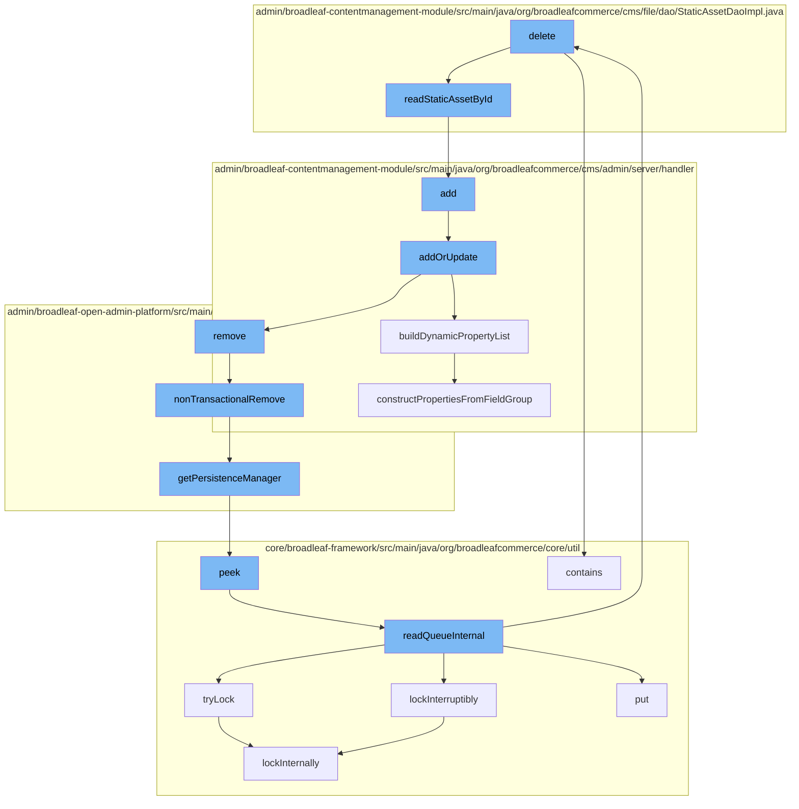

This document will cover the process of deleting a static asset in the BroadleafCommerce-demo repository. The process involves the following steps:

 1. Reading the static asset by its ID
 2. Adding the asset to the PageTemplateCustomPersistenceHandler
 3. Updating or adding the asset to the PageTemplateCustomPersistenceHandler
 4. Building a dynamic property list
 5. Removing the asset from the DynamicEntityRemoteService
 6. Getting the PersistenceManager from the PersistenceManagerContext
 7. Peeking at the ZookeeperDistributedQueue
 8. Reading the internal queue
 9. Trying to lock the ReentrantDistributedZookeeperLock
10. Deleting the asset from the CodeTypeDaoImpl.



<SwmSnippet path="/admin/broadleaf-contentmanagement-module/src/main/java/org/broadleafcommerce/cms/file/dao/StaticAssetDaoImpl.java" line="62">

---

# Reading the static asset by its ID

The `readStaticAssetById` function is used to read a static asset by its ID. It uses the CriteriaBuilder and CriteriaQuery to construct a query to fetch the asset from the database.

```java
    @Override
    public StaticAsset readStaticAssetById(Long id) {
        CriteriaBuilder builder = em.getCriteriaBuilder();
        CriteriaQuery<StaticAsset> criteria = builder.createQuery(StaticAsset.class);
        Root<StaticAssetImpl> handler = criteria.from(StaticAssetImpl.class);
        criteria.select(handler);
        List<Predicate> restrictions = new ArrayList<Predicate>();
        restrictions.add(builder.equal(handler.get("id"), id));
        try {
            if (queryExtensionManager != null) {
                queryExtensionManager.getProxy().setup(StaticAssetImpl.class, null);
                queryExtensionManager.getProxy().refineRetrieve(StaticAssetImpl.class, null, builder, criteria, handler, restrictions);

            }
            criteria.where(restrictions.toArray(new Predicate[restrictions.size()]));

            TypedQuery<StaticAsset> query = em.createQuery(criteria);
            query.setHint(QueryHints.HINT_CACHEABLE, true);
            List<StaticAsset> response = query.getResultList();
            if (response.size() > 0) {
                return response.get(0);
```

---

</SwmSnippet>

<SwmSnippet path="/admin/broadleaf-contentmanagement-module/src/main/java/org/broadleafcommerce/cms/admin/server/handler/PageTemplateCustomPersistenceHandler.java" line="294">

---

# Adding the asset to the PageTemplateCustomPersistenceHandler

The `add` function is used to add the static asset to the PageTemplateCustomPersistenceHandler. It simply calls the `addOrUpdate` function.

```java
    @Override
    public Entity add(PersistencePackage persistencePackage, DynamicEntityDao dynamicEntityDao, RecordHelper helper) throws ServiceException {
        return addOrUpdate(persistencePackage, dynamicEntityDao, helper);
    }
```

---

</SwmSnippet>

<SwmSnippet path="/admin/broadleaf-contentmanagement-module/src/main/java/org/broadleafcommerce/cms/admin/server/handler/PageTemplateCustomPersistenceHandler.java" line="299">

---

# Updating or adding the asset to the PageTemplateCustomPersistenceHandler

The `addOrUpdate` function is used to either add a new static asset or update an existing one. It validates the asset, checks for any changes, and then updates the asset in the database.

```java
    protected Entity addOrUpdate(PersistencePackage persistencePackage, DynamicEntityDao dynamicEntityDao, RecordHelper helper) throws ServiceException {
        String ceilingEntityFullyQualifiedClassname = persistencePackage.getCeilingEntityFullyQualifiedClassname();
        try {
            String pageId = persistencePackage.getCustomCriteria()[1];

            if (StringUtils.isBlank(pageId)) {
                return persistencePackage.getEntity();
            }

            Page page = pageService.findPageById(Long.valueOf(pageId));

            Property[] properties = dynamicFieldUtil.buildDynamicPropertyList(getFieldGroups(page, null), PageTemplate.class);
            Map<String, FieldMetadata> md = new HashMap<String, FieldMetadata>();
            for (Property property : properties) {
                md.put(property.getName(), property.getMetadata());
            }

            boolean validated = helper.validate(persistencePackage.getEntity(), new PageTemplateImpl(), md);
            if (!validated) {
                throw new ValidationException(persistencePackage.getEntity(), "Page dynamic fields failed validation");
            }
```

---

</SwmSnippet>

<SwmSnippet path="/admin/broadleaf-contentmanagement-module/src/main/java/org/broadleafcommerce/cms/admin/server/handler/DynamicFieldPersistenceHandlerHelper.java" line="109">

---

# Building a dynamic property list

The `buildDynamicPropertyList` function is used to build a list of dynamic properties for the static asset. It iterates over the field groups of the asset and constructs properties from each field group.

```java
    /**
     * Builds all of the metadata for all of the dynamic properties within a {@link StructuredContentType}, gleaned from
     * the {@link FieldGroup}s and {@link FieldDefinition}s.
     *
     * @param fieldGroups groups that the {@link Property}s are built from
     * @param inheritedType the value that each built {@link FieldMetadata} for each property will use to notate where the
     * dynamic field actually came from (meaning {@link FieldMetadata#setAvailableToTypes(String[])} and {@link FieldMetadata#setInheritedFromType(String)}
     * @return
     */
    public Property[] buildDynamicPropertyList(List<FieldGroup> fieldGroups, Class<?> inheritedType) {
        List<Property> propertiesList = new ArrayList<Property>();
        for (FieldGroup group : fieldGroups) {
            constructPropertiesFromFieldGroup(inheritedType, propertiesList, group, 0l);
        }
        Property property = constructIdProperty(inheritedType);
        propertiesList.add(property);

        Property[] properties = sortProperties(propertiesList);
        return properties;
    }
```

---

</SwmSnippet>

<SwmSnippet path="/admin/broadleaf-open-admin-platform/src/main/java/org/broadleafcommerce/openadmin/server/service/DynamicEntityRemoteService.java" line="329">

---

# Removing the asset from the DynamicEntityRemoteService

The `nonTransactionalRemove` function is used to remove the static asset from the DynamicEntityRemoteService. It uses the PersistenceManager to perform the removal operation.

```java
    @Override
    public PersistenceResponse nonTransactionalRemove(final PersistencePackage persistencePackage) throws ServiceException {
        return persistenceThreadManager.operation(TargetModeType.SANDBOX, persistencePackage, new Persistable <PersistenceResponse, ServiceException>() {
            @Override
            public PersistenceResponse execute() throws ServiceException {
                try {
                    PersistenceManager persistenceManager = PersistenceManagerFactory.getPersistenceManager();
                    return persistenceManager.remove(persistencePackage);
                } catch (ServiceException e) {
                    //immediately throw validation exceptions without printing a stack trace
                    if (e instanceof ValidationException) {
                        throw e;
                    } else if (e.getCause() instanceof ValidationException) {
                        throw (ValidationException) e.getCause();
                    }
                    LOG.error("Problem removing " + persistencePackage.getCeilingEntityFullyQualifiedClassname(), e);
                    String message = exploitProtectionService.cleanString(e.getMessage());
                    throw recreateSpecificServiceException(e, message, e.getCause());
                }
            }
        });
```

---

</SwmSnippet>

<SwmSnippet path="/admin/broadleaf-open-admin-platform/src/main/java/org/broadleafcommerce/openadmin/server/service/persistence/PersistenceManagerContext.java" line="49">

---

# Getting the PersistenceManager from the PersistenceManagerContext

The `getPersistenceManager` function is used to get the PersistenceManager from the PersistenceManagerContext. It returns the PersistenceManager if it exists, otherwise it returns null.

```java
    public PersistenceManager getPersistenceManager() {
        return !persistenceManager.empty()?persistenceManager.peek():null;
    }
```

---

</SwmSnippet>

<SwmSnippet path="/core/broadleaf-framework/src/main/java/org/broadleafcommerce/core/util/queue/ZookeeperDistributedQueue.java" line="222">

---

# Peeking at the ZookeeperDistributedQueue

The `peek` function is used to peek at the ZookeeperDistributedQueue. It reads the queue internally and returns the first element if it exists, otherwise it returns null.

```java
    @Override
    public T peek() {
        try {
            Map<String, T> elements = readQueueInternal(1, false, 0L);
            Iterator<Map.Entry<String, T>> entries = elements.entrySet().iterator();
            if (entries.hasNext()) {
                return entries.next().getValue();
            }
            
            return null;
        } catch (InterruptedException e) {
            Thread.currentThread().interrupt();
            return null;
        }
    }
```

---

</SwmSnippet>

<SwmSnippet path="/core/broadleaf-framework/src/main/java/org/broadleafcommerce/core/util/queue/ZookeeperDistributedQueue.java" line="591">

---

# Reading the internal queue

The `readQueueInternal` function is used to read the internal queue. It gets the children of the queue entry folder and notifies all waiting threads when a new event occurs.

```java
    protected Map<String, T> readQueueInternal(final int qty, final boolean remove, final long timeout) throws InterruptedException {
        final Map<String, T> out = new LinkedHashMap<>();
        long waitTime = timeout;
        synchronized (QUEUE_MONITOR) {
            while (true) {
                boolean locked;
                DistributedLock lock = getQueueAccessLock();
                if (timeout < 0L) {
                    lock.lockInterruptibly();
                    locked = true;
                } else if (timeout > 0L && waitTime > 0L) {
                    long start = System.currentTimeMillis();
                    locked = lock.tryLock(waitTime, TimeUnit.MILLISECONDS);
                    long end = System.currentTimeMillis();
                    waitTime -= (end - start);
                } else {
                    locked = lock.tryLock();
                    if (!locked) {
                        return out;
                    }
                }
```

---

</SwmSnippet>

<SwmSnippet path="/core/broadleaf-framework/src/main/java/org/broadleafcommerce/core/util/lock/ReentrantDistributedZookeeperLock.java" line="344">

---

# Trying to lock the ReentrantDistributedZookeeperLock

The `tryLock` function is used to try to lock the ReentrantDistributedZookeeperLock. It calls the `lockInternally` function and returns true if the lock is acquired, otherwise it returns false.

```java
    @Override
    public boolean tryLock() {
        try {
            return lockInternally(0L);
        } catch (InterruptedException e) {
            Thread.currentThread().interrupt();
            return false;
        }
    }
```

---

</SwmSnippet>

<SwmSnippet path="/core/broadleaf-framework/src/main/java/org/broadleafcommerce/core/util/dao/CodeTypeDaoImpl.java" line="474">

---

# Deleting the asset from the CodeTypeDaoImpl

The `contains` function is used to check if the static asset is in the CodeTypeDaoImpl. It returns true if the asset is found, otherwise it returns false.

```java

```

---

</SwmSnippet>

&nbsp;

*This is an auto-generated document by Swimm AI 🌊 and has not yet been verified by a human*

<SwmMeta version="3.0.0" repo-id="Z2l0aHViJTNBJTNBQnJvYWRsZWFmQ29tbWVyY2UtZGVtbyUzQSUzQWdpbGFkbmF2b3Q=" repo-name="BroadleafCommerce-demo" doc-type="flows"><sup>Powered by [Swimm](/)</sup></SwmMeta>
