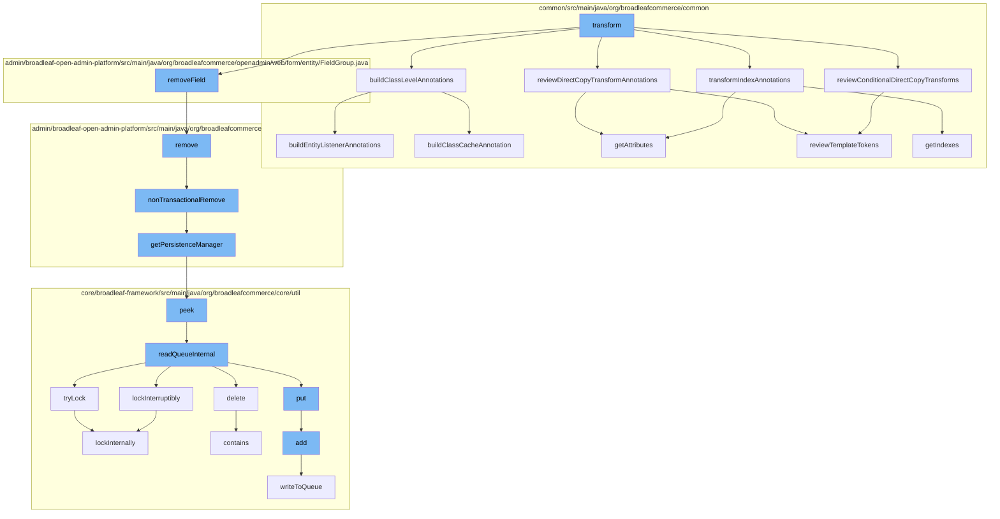

This document will cover the process of Direct Class Transformation in Broadleaf Commerce, which includes:

 1. Building Class Level Annotations
 2. Reviewing Direct Copy Transform Annotations
 3. Transforming Index Annotations
 4. Reviewing Conditional Direct Copy Transforms
 5. Removing Field
 6. Removing Entity
 7. Getting Persistence Manager
 8. Reading Queue Internal
 9. Locking Internally
10. Adding to Queue
11. Writing to Queue



<SwmSnippet path="/common/src/main/java/org/broadleafcommerce/common/extensibility/jpa/copy/DirectCopyClassTransformer.java" line="648">

---

# Building Class Level Annotations

The `buildClassLevelAnnotations` function is the starting point of the class transformation process. It calls two other functions, `buildEntityListenerAnnotations` and `buildClassCacheAnnotation`, to build the necessary annotations for the class.

```java
    protected void buildClassLevelAnnotations(ClassFile classFile, ClassFile templateClassFile, ConstPool constantPool) throws NotFoundException {
        buildEntityListenerAnnotations(classFile, templateClassFile, constantPool);
        buildClassCacheAnnotation(classFile, templateClassFile, constantPool);
    }
```

---

</SwmSnippet>

<SwmSnippet path="/common/src/main/java/org/broadleafcommerce/common/extensibility/jpa/copy/DirectCopyClassTransformer.java" line="480">

---

# Reviewing Direct Copy Transform Annotations

The `reviewTemplateTokens` function is called to review the template tokens in the Direct Copy Transform Annotations. It checks if the value matches any of the template tokens and adds them to the list of added templates.

```java
    protected List<String> reviewTemplateTokens(List<DirectCopyIgnorePattern> matchedPatterns, String val) {
        List<String> addedTemplates = new ArrayList<>();
        if (val != null && templateTokens.containsKey(val)) {
            templateCheck: {
                for (DirectCopyIgnorePattern matchedPattern : matchedPatterns) {
                    for (String ignoreToken : matchedPattern.getTemplateTokenPatterns()) {
                        if (val.matches(ignoreToken)) {
                            break templateCheck;
                        }
                    }
                }
                String[] templateVals = templateTokens.get(val).split(",");
                addedTemplates.addAll(Arrays.asList(templateVals));
            }
        }
        return addedTemplates;
    }
```

---

</SwmSnippet>

<SwmSnippet path="/common/src/main/java/org/broadleafcommerce/common/extensibility/jpa/copy/DirectCopyClassTransformer.java" line="546">

---

# Transforming Index Annotations

The `getIndexes` function is used to transform the index annotations. It creates a new table annotation and adds the index and unique constraint values from the existing and template tables.

```java
    protected Annotation getIndexes(ConstPool constantPool, Annotation existingTable, Annotation templateTable) {
        Annotation newTable = new Annotation(Table.class.getName(), constantPool);
        ArrayMemberValue indexArray = new ArrayMemberValue(constantPool);
        ArrayMemberValue uniqueConstraintArray = new ArrayMemberValue(constantPool);
        Set<MemberValue> indexMemberValues = new HashSet<>();
        Set<MemberValue> uniqueConstraintMemberValues = new HashSet<>();
        {
            ArrayMemberValue templateIndexValues = (ArrayMemberValue) templateTable.getMemberValue("indexes");
            if (templateIndexValues != null) {
                indexMemberValues.addAll(Arrays.asList(templateIndexValues.getValue()));
                logger.debug("Adding template values to new Table");
            }
        }

        ArrayMemberValue templateUniqueConstraintValues = (ArrayMemberValue) templateTable.getMemberValue("uniqueConstraints");
        if (templateUniqueConstraintValues != null) {
            uniqueConstraintMemberValues.addAll(Arrays.asList(templateUniqueConstraintValues.getValue()));
            logger.debug("Adding template values to new Table");
        }

        if (existingTable != null) {
```

---

</SwmSnippet>

<SwmSnippet path="/common/src/main/java/org/broadleafcommerce/common/extensibility/jpa/copy/DirectCopyClassTransformer.java" line="480">

---

# Reviewing Conditional Direct Copy Transforms

The `reviewTemplateTokens` function is called again to review the template tokens in the Conditional Direct Copy Transforms. It performs the same operation as before, checking for matching template tokens and adding them to the list of added templates.

```java
    protected List<String> reviewTemplateTokens(List<DirectCopyIgnorePattern> matchedPatterns, String val) {
        List<String> addedTemplates = new ArrayList<>();
        if (val != null && templateTokens.containsKey(val)) {
            templateCheck: {
                for (DirectCopyIgnorePattern matchedPattern : matchedPatterns) {
                    for (String ignoreToken : matchedPattern.getTemplateTokenPatterns()) {
                        if (val.matches(ignoreToken)) {
                            break templateCheck;
                        }
                    }
                }
                String[] templateVals = templateTokens.get(val).split(",");
                addedTemplates.addAll(Arrays.asList(templateVals));
            }
        }
        return addedTemplates;
    }
```

---

</SwmSnippet>

<SwmSnippet path="/admin/broadleaf-open-admin-platform/src/main/java/org/broadleafcommerce/openadmin/server/service/DynamicEntityRemoteService.java" line="249">

---

# Removing Field

The `remove` function is called to remove the field from the entity. It calls the `nonTransactionalRemove` function to perform the removal operation.

```java
    @Override
    public PersistenceResponse remove(final PersistencePackage persistencePackage) throws ServiceException {
        final PersistenceResponse[] response = new PersistenceResponse[1];
        try {
            PlatformTransactionManager transactionManager = identifyTransactionManager(persistencePackage);
            transUtil.runTransactionalOperation(new StreamCapableTransactionalOperationAdapter() {
                @Override
                public void execute() throws Throwable {
                    response[0] = nonTransactionalRemove(persistencePackage);
                }

                @Override
                public boolean shouldRetryOnTransactionLockAcquisitionFailure() {
                    return super.shouldRetryOnTransactionLockAcquisitionFailure();
                }
            }, RuntimeException.class, transactionManager);
        } catch (RuntimeException e) {
            if (e.getCause() instanceof ServiceException) {
                throw (ServiceException) e.getCause();
            }
            throw e;
```

---

</SwmSnippet>

<SwmSnippet path="/admin/broadleaf-open-admin-platform/src/main/java/org/broadleafcommerce/openadmin/server/service/DynamicEntityRemoteService.java" line="329">

---

# Removing Entity

The `nonTransactionalRemove` function is called to remove the entity. It gets the Persistence Manager and calls its remove function to perform the removal operation.

```java
    @Override
    public PersistenceResponse nonTransactionalRemove(final PersistencePackage persistencePackage) throws ServiceException {
        return persistenceThreadManager.operation(TargetModeType.SANDBOX, persistencePackage, new Persistable <PersistenceResponse, ServiceException>() {
            @Override
            public PersistenceResponse execute() throws ServiceException {
                try {
                    PersistenceManager persistenceManager = PersistenceManagerFactory.getPersistenceManager();
                    return persistenceManager.remove(persistencePackage);
                } catch (ServiceException e) {
                    //immediately throw validation exceptions without printing a stack trace
                    if (e instanceof ValidationException) {
                        throw e;
                    } else if (e.getCause() instanceof ValidationException) {
                        throw (ValidationException) e.getCause();
                    }
                    LOG.error("Problem removing " + persistencePackage.getCeilingEntityFullyQualifiedClassname(), e);
                    String message = exploitProtectionService.cleanString(e.getMessage());
                    throw recreateSpecificServiceException(e, message, e.getCause());
                }
            }
        });
```

---

</SwmSnippet>

<SwmSnippet path="/admin/broadleaf-open-admin-platform/src/main/java/org/broadleafcommerce/openadmin/server/service/persistence/PersistenceManagerContext.java" line="49">

---

# Getting Persistence Manager

The `getPersistenceManager` function is called to get the Persistence Manager. It calls the `peek` function to get the Persistence Manager from the stack.

```java
    public PersistenceManager getPersistenceManager() {
        return !persistenceManager.empty()?persistenceManager.peek():null;
    }
```

---

</SwmSnippet>

<SwmSnippet path="/core/broadleaf-framework/src/main/java/org/broadleafcommerce/core/util/queue/ZookeeperDistributedQueue.java" line="591">

---

# Reading Queue Internal

The `readQueueInternal` function is called to read the queue. It locks the queue, reads the data, and then unlocks the queue.

```java
    protected Map<String, T> readQueueInternal(final int qty, final boolean remove, final long timeout) throws InterruptedException {
        final Map<String, T> out = new LinkedHashMap<>();
        long waitTime = timeout;
        synchronized (QUEUE_MONITOR) {
            while (true) {
                boolean locked;
                DistributedLock lock = getQueueAccessLock();
                if (timeout < 0L) {
                    lock.lockInterruptibly();
                    locked = true;
                } else if (timeout > 0L && waitTime > 0L) {
                    long start = System.currentTimeMillis();
                    locked = lock.tryLock(waitTime, TimeUnit.MILLISECONDS);
                    long end = System.currentTimeMillis();
                    waitTime -= (end - start);
                } else {
```

---

</SwmSnippet>

<SwmSnippet path="/core/broadleaf-framework/src/main/java/org/broadleafcommerce/core/util/lock/ReentrantDistributedZookeeperLock.java" line="344">

---

# Locking Internally

The `tryLock` function is called to lock the queue. It calls the `lockInternally` function to perform the locking operation.

```java
    @Override
    public boolean tryLock() {
        try {
            return lockInternally(0L);
        } catch (InterruptedException e) {
            Thread.currentThread().interrupt();
            return false;
        }
    }
```

---

</SwmSnippet>

<SwmSnippet path="/core/broadleaf-framework/src/main/java/org/broadleafcommerce/core/util/queue/ZookeeperDistributedQueue.java" line="359">

---

# Adding to Queue

The `add` function is called to add the entity to the queue. It calls the `writeToQueue` function to perform the addition operation.

```java
    @Override
    public boolean add(T e) {
        try {
            final ArrayList<T> lst = new ArrayList<>();
            lst.add(e);
            int count = writeToQueue(lst, 0L);
            if (count != 1) {
                throw new IllegalStateException("The Zookeeper queue was full.");
            } else {
                return true;
            }
        } catch (InterruptedException ex) {
            Thread.currentThread().interrupt();
            return false;
        }
    }
```

---

</SwmSnippet>

<SwmSnippet path="/core/broadleaf-framework/src/main/java/org/broadleafcommerce/core/util/queue/ZookeeperDistributedQueue.java" line="503">

---

# Writing to Queue

The `writeToQueue` function is called to write the entity to the queue. It locks the queue, writes the data, and then unlocks the queue.

```java
    protected int writeToQueue(List<? extends T> entries, final long timeout) throws InterruptedException {
        if (entries == null || entries.isEmpty()) {
            return 0;
        }
        
        int entryCount = 0;
        long waitTime = timeout;
        synchronized (QUEUE_MONITOR) {
            while (true) {
                boolean locked = false;
                DistributedLock lock = getQueueAccessLock();
                if (timeout < 0L) {
                    lock.lockInterruptibly();
                    locked = true;
                } else if (timeout > 0L && waitTime > 0L) {
                    long start = System.currentTimeMillis();
                    locked = lock.tryLock(waitTime, TimeUnit.MILLISECONDS);
                    long end = System.currentTimeMillis();
                    waitTime -= (end - start);
                } else {
                    locked = lock.tryLock();
```

---

</SwmSnippet>

&nbsp;

*This is an auto-generated document by Swimm AI 🌊 and has not yet been verified by a human*

<SwmMeta version="3.0.0" repo-id="Z2l0aHViJTNBJTNBQnJvYWRsZWFmQ29tbWVyY2UtZGVtbyUzQSUzQWdpbGFkbmF2b3Q=" repo-name="BroadleafCommerce-demo" doc-type="flows"><sup>Powered by [Swimm](/)</sup></SwmMeta>
