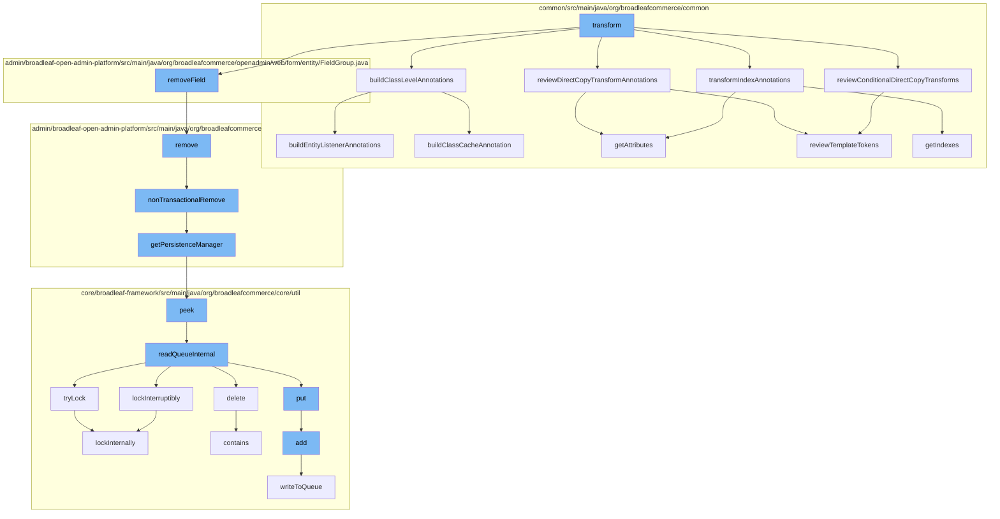

This document will cover the process of the DirectCopyClassTransformer function flow, which includes:

 1. Building class level annotations
 2. Reviewing Direct Copy Transform Annotations
 3. Transforming Index Annotations
 4. Reviewing Conditional Direct Copy Transforms
 5. Removing Field
 6. Removing from Dynamic Entity Remote Service
 7. Non-Transactional Removal
 8. Getting Persistence Manager
 9. Peeking at Zookeeper Distributed Queue
10. Reading Queue Internally
11. Trying Lock
12. Adding to Zookeeper Distributed Queue
13. Writing to Queue
14. Deleting from Code Type Dao Implementation
15. Locking Internally



<SwmSnippet path="/common/src/main/java/org/broadleafcommerce/common/extensibility/jpa/copy/DirectCopyClassTransformer.java" line="648">

---

# Building class level annotations

The `buildClassLevelAnnotations` function is the starting point of the flow. It is responsible for building class level annotations by calling `buildEntityListenerAnnotations` and `buildClassCacheAnnotation`.

```java
    protected void buildClassLevelAnnotations(ClassFile classFile, ClassFile templateClassFile, ConstPool constantPool) throws NotFoundException {
        buildEntityListenerAnnotations(classFile, templateClassFile, constantPool);
        buildClassCacheAnnotation(classFile, templateClassFile, constantPool);
    }
```

---

</SwmSnippet>

<SwmSnippet path="/common/src/main/java/org/broadleafcommerce/common/extensibility/jpa/copy/DirectCopyClassTransformer.java" line="480">

---

# Reviewing Direct Copy Transform Annotations

The `reviewTemplateTokens` function is called within `reviewDirectCopyTransformAnnotations` and `reviewConditionalDirectCopyTransforms`. It reviews the template tokens for Direct Copy Transform Annotations.

```java
    protected List<String> reviewTemplateTokens(List<DirectCopyIgnorePattern> matchedPatterns, String val) {
        List<String> addedTemplates = new ArrayList<>();
        if (val != null && templateTokens.containsKey(val)) {
            templateCheck: {
                for (DirectCopyIgnorePattern matchedPattern : matchedPatterns) {
                    for (String ignoreToken : matchedPattern.getTemplateTokenPatterns()) {
                        if (val.matches(ignoreToken)) {
                            break templateCheck;
                        }
                    }
                }
                String[] templateVals = templateTokens.get(val).split(",");
                addedTemplates.addAll(Arrays.asList(templateVals));
            }
        }
        return addedTemplates;
    }
```

---

</SwmSnippet>

<SwmSnippet path="/common/src/main/java/org/broadleafcommerce/common/extensibility/jpa/copy/DirectCopyClassTransformer.java" line="546">

---

# Transforming Index Annotations

The `getIndexes` function is called within `transformIndexAnnotations`. It is responsible for getting the index annotations and transforming them.

```java
    protected Annotation getIndexes(ConstPool constantPool, Annotation existingTable, Annotation templateTable) {
        Annotation newTable = new Annotation(Table.class.getName(), constantPool);
        ArrayMemberValue indexArray = new ArrayMemberValue(constantPool);
        ArrayMemberValue uniqueConstraintArray = new ArrayMemberValue(constantPool);
        Set<MemberValue> indexMemberValues = new HashSet<>();
        Set<MemberValue> uniqueConstraintMemberValues = new HashSet<>();
        {
            ArrayMemberValue templateIndexValues = (ArrayMemberValue) templateTable.getMemberValue("indexes");
            if (templateIndexValues != null) {
                indexMemberValues.addAll(Arrays.asList(templateIndexValues.getValue()));
                logger.debug("Adding template values to new Table");
            }
        }

        ArrayMemberValue templateUniqueConstraintValues = (ArrayMemberValue) templateTable.getMemberValue("uniqueConstraints");
        if (templateUniqueConstraintValues != null) {
            uniqueConstraintMemberValues.addAll(Arrays.asList(templateUniqueConstraintValues.getValue()));
            logger.debug("Adding template values to new Table");
        }

        if (existingTable != null) {
```

---

</SwmSnippet>

<SwmSnippet path="/admin/broadleaf-open-admin-platform/src/main/java/org/broadleafcommerce/openadmin/server/service/DynamicEntityRemoteService.java" line="249">

---

# Removing Field

The `remove` function is called within `removeField`. It is responsible for removing a persistence package.

```java
    @Override
    public PersistenceResponse remove(final PersistencePackage persistencePackage) throws ServiceException {
        final PersistenceResponse[] response = new PersistenceResponse[1];
        try {
            PlatformTransactionManager transactionManager = identifyTransactionManager(persistencePackage);
            transUtil.runTransactionalOperation(new StreamCapableTransactionalOperationAdapter() {
                @Override
                public void execute() throws Throwable {
                    response[0] = nonTransactionalRemove(persistencePackage);
                }

                @Override
                public boolean shouldRetryOnTransactionLockAcquisitionFailure() {
                    return super.shouldRetryOnTransactionLockAcquisitionFailure();
                }
            }, RuntimeException.class, transactionManager);
        } catch (RuntimeException e) {
            if (e.getCause() instanceof ServiceException) {
                throw (ServiceException) e.getCause();
            }
            throw e;
```

---

</SwmSnippet>

<SwmSnippet path="/admin/broadleaf-open-admin-platform/src/main/java/org/broadleafcommerce/openadmin/server/service/DynamicEntityRemoteService.java" line="329">

---

# Non-Transactional Removal

The `nonTransactionalRemove` function is called within `remove`. It is responsible for removing a persistence package in a non-transactional way.

```java
    @Override
    public PersistenceResponse nonTransactionalRemove(final PersistencePackage persistencePackage) throws ServiceException {
        return persistenceThreadManager.operation(TargetModeType.SANDBOX, persistencePackage, new Persistable <PersistenceResponse, ServiceException>() {
            @Override
            public PersistenceResponse execute() throws ServiceException {
                try {
                    PersistenceManager persistenceManager = PersistenceManagerFactory.getPersistenceManager();
                    return persistenceManager.remove(persistencePackage);
                } catch (ServiceException e) {
                    //immediately throw validation exceptions without printing a stack trace
                    if (e instanceof ValidationException) {
                        throw e;
                    } else if (e.getCause() instanceof ValidationException) {
                        throw (ValidationException) e.getCause();
                    }
                    LOG.error("Problem removing " + persistencePackage.getCeilingEntityFullyQualifiedClassname(), e);
                    String message = exploitProtectionService.cleanString(e.getMessage());
                    throw recreateSpecificServiceException(e, message, e.getCause());
                }
            }
        });
```

---

</SwmSnippet>

<SwmSnippet path="/admin/broadleaf-open-admin-platform/src/main/java/org/broadleafcommerce/openadmin/server/service/persistence/PersistenceManagerContext.java" line="49">

---

# Getting Persistence Manager

The `getPersistenceManager` function is called within `nonTransactionalRemove`. It is responsible for getting the persistence manager.

```java
    public PersistenceManager getPersistenceManager() {
        return !persistenceManager.empty()?persistenceManager.peek():null;
    }
```

---

</SwmSnippet>

<SwmSnippet path="/core/broadleaf-framework/src/main/java/org/broadleafcommerce/core/util/queue/ZookeeperDistributedQueue.java" line="222">

---

# Peeking at Zookeeper Distributed Queue

The `peek` function is called within `getPersistenceManager`. It is responsible for peeking at the Zookeeper Distributed Queue.

```java
    @Override
    public T peek() {
        try {
            Map<String, T> elements = readQueueInternal(1, false, 0L);
            Iterator<Map.Entry<String, T>> entries = elements.entrySet().iterator();
            if (entries.hasNext()) {
                return entries.next().getValue();
            }
            
            return null;
        } catch (InterruptedException e) {
            Thread.currentThread().interrupt();
            return null;
        }
    }
```

---

</SwmSnippet>

<SwmSnippet path="/core/broadleaf-framework/src/main/java/org/broadleafcommerce/core/util/queue/ZookeeperDistributedQueue.java" line="591">

---

# Reading Queue Internally

The `readQueueInternal` function is called within `peek`. It is responsible for reading the queue internally.

```java
    protected Map<String, T> readQueueInternal(final int qty, final boolean remove, final long timeout) throws InterruptedException {
        final Map<String, T> out = new LinkedHashMap<>();
        long waitTime = timeout;
        synchronized (QUEUE_MONITOR) {
            while (true) {
                boolean locked;
                DistributedLock lock = getQueueAccessLock();
                if (timeout < 0L) {
                    lock.lockInterruptibly();
                    locked = true;
                } else if (timeout > 0L && waitTime > 0L) {
                    long start = System.currentTimeMillis();
                    locked = lock.tryLock(waitTime, TimeUnit.MILLISECONDS);
                    long end = System.currentTimeMillis();
                    waitTime -= (end - start);
                } else {
                    locked = lock.tryLock();
                    if (!locked) {
                        return out;
                    }
                }
```

---

</SwmSnippet>

<SwmSnippet path="/core/broadleaf-framework/src/main/java/org/broadleafcommerce/core/util/lock/ReentrantDistributedZookeeperLock.java" line="344">

---

# Trying Lock

The `tryLock` function is called within `readQueueInternal`. It is responsible for trying to lock internally.

```java
    @Override
    public boolean tryLock() {
        try {
            return lockInternally(0L);
        } catch (InterruptedException e) {
            Thread.currentThread().interrupt();
            return false;
        }
    }
```

---

</SwmSnippet>

<SwmSnippet path="/core/broadleaf-framework/src/main/java/org/broadleafcommerce/core/util/queue/ZookeeperDistributedQueue.java" line="359">

---

# Adding to Zookeeper Distributed Queue

The `add` function is called within `put`. It is responsible for adding to the Zookeeper Distributed Queue.

```java
    @Override
    public boolean add(T e) {
        try {
            final ArrayList<T> lst = new ArrayList<>();
            lst.add(e);
            int count = writeToQueue(lst, 0L);
            if (count != 1) {
                throw new IllegalStateException("The Zookeeper queue was full.");
            } else {
                return true;
            }
        } catch (InterruptedException ex) {
            Thread.currentThread().interrupt();
            return false;
        }
    }
```

---

</SwmSnippet>

<SwmSnippet path="/core/broadleaf-framework/src/main/java/org/broadleafcommerce/core/util/queue/ZookeeperDistributedQueue.java" line="503">

---

# Writing to Queue

The `writeToQueue` function is called within `add`. It is responsible for writing to the queue.

```java
    protected int writeToQueue(List<? extends T> entries, final long timeout) throws InterruptedException {
        if (entries == null || entries.isEmpty()) {
            return 0;
        }
        
        int entryCount = 0;
        long waitTime = timeout;
        synchronized (QUEUE_MONITOR) {
            while (true) {
                boolean locked = false;
                DistributedLock lock = getQueueAccessLock();
                if (timeout < 0L) {
                    lock.lockInterruptibly();
                    locked = true;
                } else if (timeout > 0L && waitTime > 0L) {
                    long start = System.currentTimeMillis();
                    locked = lock.tryLock(waitTime, TimeUnit.MILLISECONDS);
                    long end = System.currentTimeMillis();
                    waitTime -= (end - start);
                } else {
                    locked = lock.tryLock();
```

---

</SwmSnippet>

<SwmSnippet path="/core/broadleaf-framework/src/main/java/org/broadleafcommerce/core/util/dao/CodeTypeDaoImpl.java" line="474">

---

# Deleting from Code Type Dao Implementation

The `contains` function is called within `delete`. It is responsible for checking if an object is contained in the Zookeeper Distributed Queue.

```java

```

---

</SwmSnippet>

<SwmSnippet path="/core/broadleaf-framework/src/main/java/org/broadleafcommerce/core/util/lock/ReentrantDistributedZookeeperLock.java" line="380">

---

# Locking Internally

The `lockInternally` function is called within `tryLock` and `lockInterruptibly`. It is responsible for locking internally.

```java
    protected boolean lockInternally(final long waitTime) throws InterruptedException {
        if (!canParticipate()) {
            //No lock will be provided in this case, but we want to simulate the normal lock semantics.
            if (waitTime < 0L) {
                //Simulate normal lock semantics,where the lock is unavailable, but we've been asked to wait interruptably for it indefinitely.
                synchronized (NON_PARTICIPANT_LOCK_MONITOR) {
                    //This basically will cause this thread to block forever until the thread is interrupted, which is what we want.
                    NON_PARTICIPANT_LOCK_MONITOR.wait(); 
                }
            } else if (waitTime > 0L) {
                //Simulate normal lock semantics, where the lock is unavailable, but we've been asked to wait interruptably for it for a period of time.
                synchronized (NON_PARTICIPANT_LOCK_MONITOR) {
                    NON_PARTICIPANT_LOCK_MONITOR.wait(waitTime);
                }
            }
            
            return false;
        }
        
        //See if this thread already has a lock permit.  If so, just increment the count and return it.
        //No need to interact with Zookeeper.
```

---

</SwmSnippet>

&nbsp;

*This is an auto-generated document by Swimm AI 🌊 and has not yet been verified by a human*

<SwmMeta version="3.0.0" repo-id="Z2l0aHViJTNBJTNBQnJvYWRsZWFmQ29tbWVyY2UtZGVtbyUzQSUzQWdpbGFkbmF2b3Q=" repo-name="BroadleafCommerce-demo" doc-type="flows"><sup>Powered by [Swimm](/)</sup></SwmMeta>
