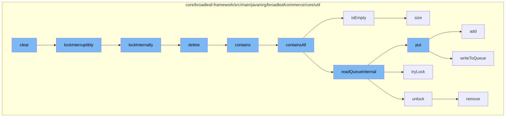

This document will cover the process of managing distributed queues in Broadleaf Commerce, which includes:

1. Locking the queue
2. Reading and writing to the queue
3. Handling queue interruptions
4. Managing queue size.



<SwmSnippet path="/core/broadleaf-framework/src/main/java/org/broadleafcommerce/core/util/lock/ReentrantDistributedZookeeperLock.java" line="335">

---

# Locking the queue

The `lockInterruptibly` function is used to acquire a lock on the queue. If the thread is interrupted before the lock is acquired, an `InterruptedException` is thrown.

```java
    @Override
    public void lockInterruptibly() throws InterruptedException {
        if (Thread.interrupted()) {
            throw new InterruptedException("Thread was interrupted prior to trying to acquire the lock.");
        }
        
        lockInternally(-1L);
    }
```

---

</SwmSnippet>

<SwmSnippet path="/core/broadleaf-framework/src/main/java/org/broadleafcommerce/core/util/queue/ZookeeperDistributedQueue.java" line="393">

---

# Reading and writing to the queue

The `put` function is used to add elements to the queue. It calls the `writeToQueue` function, which writes the elements to the queue.

```java
    @Override
    public void put(T e) throws InterruptedException {
        final ArrayList<T> elementsToAdd = new ArrayList<>();
        elementsToAdd.add(e);
        writeToQueue(elementsToAdd, -1L);
    }
```

---

</SwmSnippet>

<SwmSnippet path="/core/broadleaf-framework/src/main/java/org/broadleafcommerce/core/util/queue/ZookeeperDistributedQueue.java" line="305">

---

# Handling queue interruptions

If the thread is interrupted while trying to determine if elements are contained in the queue, a `DistributedQueueException` is thrown.

```java
    }
```

---

</SwmSnippet>

<SwmSnippet path="/core/broadleaf-framework/src/main/java/org/broadleafcommerce/core/util/queue/ZookeeperDistributedQueue.java" line="238">

---

# Managing queue size

The `size` function is used to determine the size of the queue. If the thread is interrupted while trying to determine the queue size, a `DistributedQueueException` is thrown.

```java
    @Override
    public int size() {
        DistributedLock lock = getQueueAccessLock();
        try {
            lock.lockInterruptibly();
            try {
                return executeOperation(new GenericOperation<Integer>() {
                    @Override
                    public Integer execute() throws Exception {
                        final Stat stat = new Stat();
                        getZookeeperClient().getData(getQueueEntryFolder(), null, stat);
                        return stat.getNumChildren();
                    }
                });
                
            } finally {
                lock.unlock();
            }
        } catch (InterruptedException e) {
            Thread.currentThread().interrupt();
            throw new DistributedQueueException("Thread was interrupted while trying to determine queue size for distributed Zookeeper queue, " + getQueueFolderPath(), e);
```

---

</SwmSnippet>

&nbsp;

*This is an auto-generated document by Swimm AI 🌊 and has not yet been verified by a human*

<SwmMeta version="3.0.0" repo-id="Z2l0aHViJTNBJTNBQnJvYWRsZWFmQ29tbWVyY2UtZGVtbyUzQSUzQWdpbGFkbmF2b3Q=" repo-name="BroadleafCommerce-demo" doc-type="flows"><sup>Powered by [Swimm](/)</sup></SwmMeta>
