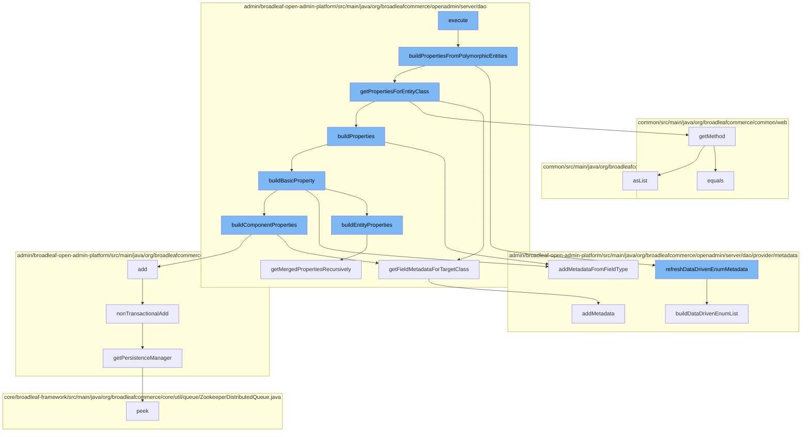

This document will cover the process of executing a dynamic entity operation in the BroadleafCommerce-demo repository. The process includes the following steps:

 1. Building properties from polymorphic entities
 2. Refreshing data driven enum metadata
 3. Getting properties for entity class
 4. Building properties
 5. Building basic property
 6. Building component properties
 7. Adding the component
 8. Non-transactional addition of the component
 9. Getting the persistence manager
10. Building entity properties



<SwmSnippet path="/admin/broadleaf-open-admin-platform/src/main/java/org/broadleafcommerce/openadmin/server/dao/DynamicEntityDaoImpl.java" line="749">

---

# Building properties from polymorphic entities

The `buildPropertiesFromPolymorphicEntities` function is the first step in the process. It iterates over the provided entities and builds a cache of field metadata for each entity. The cache key is constructed from various parameters including the entity class, foreign field, and additional non-persistent properties. If the cache does not contain data for the given key, it calls `getPropertiesForEntityClass` to fetch the properties and stores them in the cache.

```java
    protected void buildPropertiesFromPolymorphicEntities(
            Class<?>[] entities,
            ForeignKey foreignField,
            String[] additionalNonPersistentProperties,
            ForeignKey[] additionalForeignFields,
            MergedPropertyType mergedPropertyType,
            Boolean populateManyToOneFields,
            String[] includeFields,
            String[] excludeFields,
            String configurationKey,
            String ceilingEntityFullyQualifiedClassname,
            Map<String, FieldMetadata> mergedProperties,
            List<Class<?>> parentClasses,
            String prefix,
            Boolean isParentExcluded,
            String parentPrefix) {
        for (Class<?> clazz : entities) {
            String cacheKey = getCacheKey(ceilingEntityFullyQualifiedClassname, foreignField, additionalNonPersistentProperties, additionalForeignFields, mergedPropertyType, populateManyToOneFields, clazz, configurationKey, isParentExcluded);

            Map<String, FieldMetadata> cacheData = null;
            synchronized (DynamicDaoHelperImpl.LOCK_OBJECT) {
```

---

</SwmSnippet>

<SwmSnippet path="/admin/broadleaf-open-admin-platform/src/main/java/org/broadleafcommerce/openadmin/server/dao/provider/metadata/BasicFieldMetadataProvider.java" line="742">

---

# Refreshing data driven enum metadata

The `refreshDataDrivenEnumMetadata` function is called to refresh the metadata of data driven enums. This is necessary because different sites can potentially have different data driven enums.

```java
    public void refreshDataDrivenEnumMetadata(BasicFieldMetadata metadata){
        buildDataDrivenEnumList(metadata);
    }
```

---

</SwmSnippet>

<SwmSnippet path="/admin/broadleaf-open-admin-platform/src/main/java/org/broadleafcommerce/openadmin/server/dao/DynamicEntityDaoImpl.java" line="776">

---

# Getting properties for entity class

The `getPropertiesForEntityClass` function is called to get the properties for the given entity class. It calls several other functions including `getFieldMetadataForTargetClass`, `getMethod`, and `buildProperties`.

```java
                            clazz,
                            foreignField,
                            additionalNonPersistentProperties,
                            additionalForeignFields,
                            mergedPropertyType,
                            populateManyToOneFields,
                            includeFields,
                            excludeFields,
                            configurationKey,
                            ceilingEntityFullyQualifiedClassname,
                            parentClasses,
                            prefix,
                            isParentExcluded,
                            parentPrefix);
```

---

</SwmSnippet>

<SwmSnippet path="/admin/broadleaf-open-admin-platform/src/main/java/org/broadleafcommerce/openadmin/server/dao/DynamicEntityDaoImpl.java" line="790">

---

# Building properties

The `buildProperties` function is called to build the properties for the entity. It calls `addMetadataFromFieldType` and `buildBasicProperty`.

```java
                    //first check all the properties currently in there to see if my entity inherits from them
                    for (Class<?> clazz2 : entities) {
                        if (!clazz2.getName().equals(clazz.getName())) {
                            for (Map.Entry<String, FieldMetadata> entry : props.entrySet()) {
                                FieldMetadata metadata = entry.getValue();
                                try {
                                    if (Class.forName(metadata.getInheritedFromType()).isAssignableFrom(clazz2)) {
                                        String[] both = ArrayUtils.addAll(metadata.getAvailableToTypes(), new String[]{clazz2.getName()});
                                        metadata.setAvailableToTypes(both);
                                    }
                                } catch (ClassNotFoundException e) {
                                    throw new RuntimeException(e);
                                }
                            }
                        }
                    }
```

---

</SwmSnippet>

<SwmSnippet path="/admin/broadleaf-open-admin-platform/src/main/java/org/broadleafcommerce/openadmin/server/dao/DynamicEntityDaoImpl.java" line="1381">

---

# Building basic property

The `buildBasicProperty` function is called to build the basic properties for the entity. It calls `buildEntityProperties`, `addMetadataFromFieldType`, and `buildComponentProperties`.

```java
    protected void buildEntityProperties(
            Map<String, FieldMetadata> fields,
            ForeignKey foreignField,
            ForeignKey[] additionalForeignFields,
            String[] additionalNonPersistentProperties,
            Boolean populateManyToOneFields,
            String[] includeFields,
            String[] excludeFields,
            String configurationKey,
            String ceilingEntityFullyQualifiedClassname,
            String propertyName,
            Class<?> returnedClass,
            Class<?> targetClass,
            List<Class<?>> parentClasses,
            String prefix,
            Boolean isParentExcluded,
            String parentPrefix) {
        Class<?>[] polymorphicEntities = getAllPolymorphicEntitiesFromCeiling(returnedClass);
        List<Class<?>> clonedParentClasses = new ArrayList<>();

        for (Class<?> parentClass : parentClasses) {
```

---

</SwmSnippet>

<SwmSnippet path="/admin/broadleaf-open-admin-platform/src/main/java/org/broadleafcommerce/openadmin/server/dao/DynamicEntityDaoImpl.java" line="1382">

---

# Building component properties

The `buildComponentProperties` function is called to build the component properties for the entity. It calls `getFieldMetadataForTargetClass` and `add`.

```java
            Map<String, FieldMetadata> fields,
            ForeignKey foreignField,
            ForeignKey[] additionalForeignFields,
            String[] additionalNonPersistentProperties,
            Boolean populateManyToOneFields,
            String[] includeFields,
            String[] excludeFields,
            String configurationKey,
            String ceilingEntityFullyQualifiedClassname,
            String propertyName,
            Class<?> returnedClass,
            Class<?> targetClass,
            List<Class<?>> parentClasses,
            String prefix,
            Boolean isParentExcluded,
            String parentPrefix) {
        Class<?>[] polymorphicEntities = getAllPolymorphicEntitiesFromCeiling(returnedClass);
        List<Class<?>> clonedParentClasses = new ArrayList<>();

        for (Class<?> parentClass : parentClasses) {
            clonedParentClasses.add(parentClass);
```

---

</SwmSnippet>

<SwmSnippet path="/admin/broadleaf-open-admin-platform/src/main/java/org/broadleafcommerce/openadmin/server/service/DynamicEntityRemoteService.java" line="274">

---

# Adding the component

The `add` function is called to add the component to the dynamic entity. It calls `nonTransactionalAdd`.

```java
    @Override
    public PersistenceResponse nonTransactionalAdd(final PersistencePackage persistencePackage) throws ServiceException {
        return persistenceThreadManager.operation(TargetModeType.SANDBOX, persistencePackage, new Persistable <PersistenceResponse, ServiceException>() {
            @Override
            public PersistenceResponse execute() throws ServiceException {
                boolean shouldClean = isShouldClean();
                if (shouldClean && (CollectionUtils.isEmpty(entitiesIgnoreList) ||
                        !entitiesIgnoreList.contains(persistencePackage.getCeilingEntityFullyQualifiedClassname()))) {
                    cleanEntity(persistencePackage.getEntity());
                }
                try {
                    PersistenceManager persistenceManager = PersistenceManagerFactory.getPersistenceManager();
                    return persistenceManager.add(persistencePackage);
                } catch (ServiceException e) {
                    //immediately throw validation exceptions without printing a stack trace
                    if (e instanceof ValidationException) {
                        throw e;
                    } else if (e.getCause() instanceof ValidationException) {
                        throw (ValidationException) e.getCause();
                    }
                    String message = exploitProtectionService.cleanString(e.getMessage());
```

---

</SwmSnippet>

<SwmSnippet path="/admin/broadleaf-open-admin-platform/src/main/java/org/broadleafcommerce/openadmin/server/service/DynamicEntityRemoteService.java" line="274">

---

# Non-transactional addition of the component

The `nonTransactionalAdd` function is called to add the component to the dynamic entity in a non-transactional manner. It calls `getPersistenceManager`.

```java
    @Override
    public PersistenceResponse nonTransactionalAdd(final PersistencePackage persistencePackage) throws ServiceException {
        return persistenceThreadManager.operation(TargetModeType.SANDBOX, persistencePackage, new Persistable <PersistenceResponse, ServiceException>() {
            @Override
            public PersistenceResponse execute() throws ServiceException {
                boolean shouldClean = isShouldClean();
                if (shouldClean && (CollectionUtils.isEmpty(entitiesIgnoreList) ||
                        !entitiesIgnoreList.contains(persistencePackage.getCeilingEntityFullyQualifiedClassname()))) {
                    cleanEntity(persistencePackage.getEntity());
                }
                try {
                    PersistenceManager persistenceManager = PersistenceManagerFactory.getPersistenceManager();
                    return persistenceManager.add(persistencePackage);
                } catch (ServiceException e) {
                    //immediately throw validation exceptions without printing a stack trace
                    if (e instanceof ValidationException) {
                        throw e;
                    } else if (e.getCause() instanceof ValidationException) {
                        throw (ValidationException) e.getCause();
                    }
                    String message = exploitProtectionService.cleanString(e.getMessage());
```

---

</SwmSnippet>

<SwmSnippet path="/admin/broadleaf-open-admin-platform/src/main/java/org/broadleafcommerce/openadmin/server/service/persistence/PersistenceManagerContext.java" line="49">

---

# Getting the persistence manager

The `getPersistenceManager` function is called to get the persistence manager. It calls `peek`.

```java
    public PersistenceManager getPersistenceManager() {
        return !persistenceManager.empty()?persistenceManager.peek():null;
    }
```

---

</SwmSnippet>

<SwmSnippet path="/admin/broadleaf-open-admin-platform/src/main/java/org/broadleafcommerce/openadmin/server/dao/DynamicEntityDaoImpl.java" line="1381">

---

# Building entity properties

The `buildEntityProperties` function is called to build the entity properties. It calls `getMergedPropertiesRecursively`.

```java
    protected void buildEntityProperties(
            Map<String, FieldMetadata> fields,
            ForeignKey foreignField,
            ForeignKey[] additionalForeignFields,
            String[] additionalNonPersistentProperties,
            Boolean populateManyToOneFields,
            String[] includeFields,
            String[] excludeFields,
            String configurationKey,
            String ceilingEntityFullyQualifiedClassname,
            String propertyName,
            Class<?> returnedClass,
            Class<?> targetClass,
            List<Class<?>> parentClasses,
            String prefix,
            Boolean isParentExcluded,
            String parentPrefix) {
        Class<?>[] polymorphicEntities = getAllPolymorphicEntitiesFromCeiling(returnedClass);
        List<Class<?>> clonedParentClasses = new ArrayList<>();

        for (Class<?> parentClass : parentClasses) {
```

---

</SwmSnippet>

&nbsp;

*This is an auto-generated document by Swimm AI 🌊 and has not yet been verified by a human*

<SwmMeta version="3.0.0" repo-id="Z2l0aHViJTNBJTNBQnJvYWRsZWFmQ29tbWVyY2UtZGVtbyUzQSUzQWdpbGFkbmF2b3Q=" repo-name="BroadleafCommerce-demo" doc-type="flows"><sup>Powered by [Swimm](/)</sup></SwmMeta>
