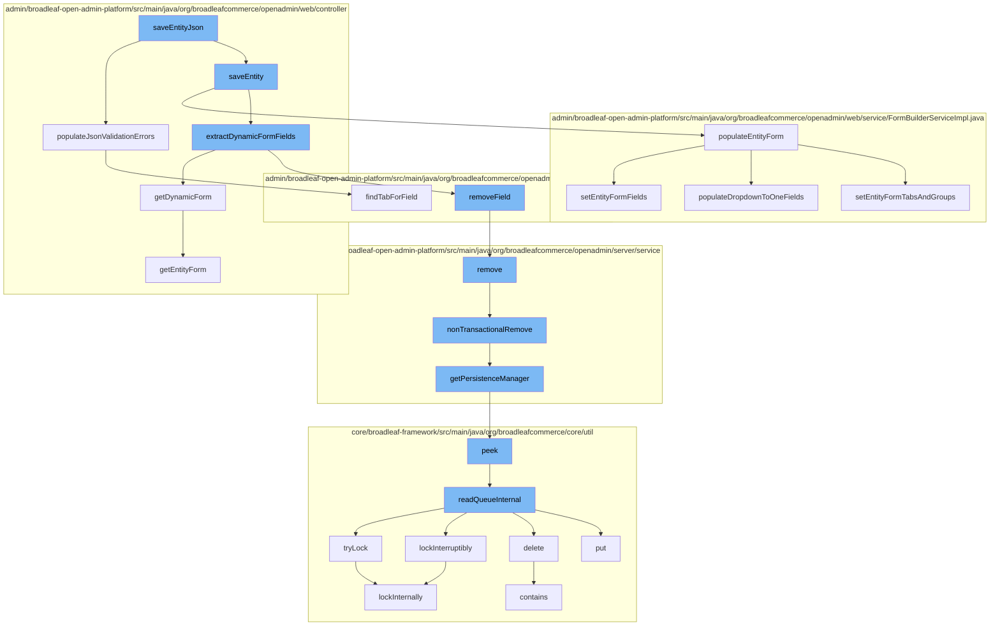

This document will cover the process of saving an entity in the BroadleafCommerce-demo repository. The process includes the following steps:

1. Initiating the save process
2. Populating the entity form
3. Extracting dynamic form fields
4. Removing fields
5. Non-transactional removal of entities
6. Getting the persistence manager
7. Reading the queue
8. Locking the process
9. Getting the dynamic form



<SwmSnippet path="/admin/broadleaf-open-admin-platform/src/main/java/org/broadleafcommerce/openadmin/web/controller/entity/AdminBasicEntityController.java" line="861">

---

# Initiating the save process

The `saveEntityJson` function initiates the process of saving an entity. It calls the `populateJsonValidationErrors` function to populate any validation errors in the JSON response object.

```java
            @PathVariable(value="id") String id) throws Exception {
        String sectionKey = getSectionKey(pathVars);
        String mainClassName = getClassNameForSection(sectionKey);
        List<SectionCrumb> sectionCrumbs = getSectionCrumbs(request, sectionKey, id);
        ClassMetadata mainMetadata = service.getClassMetadata(getSectionPersistencePackageRequest(mainClassName, sectionCrumbs, pathVars)).getDynamicResultSet().getClassMetaData();
        Property collectionProperty = mainMetadata.getPMap().get(collectionField);
        BasicFieldMetadata md = (BasicFieldMetadata) collectionProperty.getMetadata();

        AdminSection section = adminNavigationService.findAdminSectionByClassAndSectionId(md.getForeignKeyClass(), sectionKey);
        String sectionUrlKey = (section.getUrl().startsWith("/")) ? section.getUrl().substring(1) : section.getUrl();
        Map<String, String> varsForField = new HashMap<>();
        varsForField.put("sectionKey", sectionUrlKey);
        return viewEntityForm(request, response, model, varsForField, id);
    }

    @RequestMapping(
            value = "/{id}/{collectionField:.*}/{collectionItemId}/{tab:[0-9]+}/{tabName}",
            method = RequestMethod.POST
    )
    public String viewCollectionItemTab(HttpServletRequest request, HttpServletResponse response, Model model,
                                        @PathVariable  Map<String, String> pathVars,
```

---

</SwmSnippet>

<SwmSnippet path="/admin/broadleaf-open-admin-platform/src/main/java/org/broadleafcommerce/openadmin/web/service/FormBuilderServiceImpl.java" line="1417">

---

# Populating the entity form

The `populateEntityForm` function is called to populate the entity form with the necessary data. It sets the ceiling entity classname, section key, and section crumbs. It also sets the entity form fields and populates dropdown to one fields.

```java
    @Override
    public void populateEntityForm(ClassMetadata cmd, EntityForm ef, List<SectionCrumb> sectionCrumbs)
            throws ServiceException {
        ef.setCeilingEntityClassname(cmd.getCeilingType());
        
        String sectionIdentifier = extractSectionIdentifierFromCrumb(sectionCrumbs);

        AdminSection section = navigationService.findAdminSectionByClassAndSectionId(cmd.getCeilingType(),
                sectionIdentifier);
        if (section != null) {
            ef.setSectionKey(section.getUrl());
        } else {
            ef.setSectionKey(cmd.getCeilingType());
        }
        ef.setSectionCrumbsImpl(sectionCrumbs);

        setEntityFormTabsAndGroups(ef, cmd.getTabAndGroupMetadata());

        setEntityFormFields(cmd, ef, Arrays.asList(cmd.getProperties()));
        
        populateDropdownToOneFields(ef, cmd);
```

---

</SwmSnippet>

<SwmSnippet path="/admin/broadleaf-open-admin-platform/src/main/java/org/broadleafcommerce/openadmin/web/controller/AdminAbstractController.java" line="162">

---

# Extracting dynamic form fields

The `extractDynamicFormFields` function is called to extract dynamic form fields. It gets the dynamic form and removes any fields that are not needed.

```java
    /**
     * Returns a partial representing a dynamic form. An example of this is the dynamic fields that render
     * on structured content, which are determined by the currently selected structured content type. This 
     * method is typically only invoked through Javascript and used to replace the current dynamic form with
     * the one for the newly selected type.
     * 
     * @param request
     * @param response
     * @param model
     * @param pathVars
     * @param info
     * @return the return view path
     * @throws Exception
     */
    protected String getDynamicForm(HttpServletRequest request, HttpServletResponse response, Model model,
            Map<String, String> pathVars,
            DynamicEntityFormInfo info) throws Exception {
        String sectionKey = getSectionKey(pathVars);
        EntityForm blankFormContainer = new EntityForm();
        EntityForm dynamicForm = getEntityForm(info);

```

---

</SwmSnippet>

<SwmSnippet path="/admin/broadleaf-open-admin-platform/src/main/java/org/broadleafcommerce/openadmin/web/form/entity/FieldGroup.java" line="249">

---

# Removing fields

The `removeField` function is called to remove a field from the form. It calls the `remove` function to remove the field from the remote service.

```java
                    continue;
                }
                myGroupItems.add(mapField);
            }
        }

        //don't allow any modification of the fields
        return Collections.unmodifiableSet(new LinkedHashSet<>(myGroupItems));
    }

    public void setGroupItems(Set<FieldGroupItem> groupItems) {
        this.groupItems = groupItems;
    }

    public FieldGroupItem findFieldGroupItemByField(Field field) {
        for (FieldGroupItem groupItem : groupItems) {
            if (groupItem.isField() && field != null && field.equals(groupItem.getField())) {
                return groupItem;
            }
        }
        for (FieldGroupItem groupItem : alternateOrderedGroupItems) {
```

---

</SwmSnippet>

<SwmSnippet path="/admin/broadleaf-open-admin-platform/src/main/java/org/broadleafcommerce/openadmin/server/service/DynamicEntityRemoteService.java" line="329">

---

# Non-transactional removal of entities

The `nonTransactionalRemove` function is called to remove an entity without a transaction. It gets the persistence manager to perform the removal.

```java
    @Override
    public PersistenceResponse nonTransactionalRemove(final PersistencePackage persistencePackage) throws ServiceException {
        return persistenceThreadManager.operation(TargetModeType.SANDBOX, persistencePackage, new Persistable <PersistenceResponse, ServiceException>() {
            @Override
            public PersistenceResponse execute() throws ServiceException {
                try {
                    PersistenceManager persistenceManager = PersistenceManagerFactory.getPersistenceManager();
                    return persistenceManager.remove(persistencePackage);
                } catch (ServiceException e) {
                    //immediately throw validation exceptions without printing a stack trace
                    if (e instanceof ValidationException) {
                        throw e;
                    } else if (e.getCause() instanceof ValidationException) {
                        throw (ValidationException) e.getCause();
                    }
                    LOG.error("Problem removing " + persistencePackage.getCeilingEntityFullyQualifiedClassname(), e);
                    String message = exploitProtectionService.cleanString(e.getMessage());
                    throw recreateSpecificServiceException(e, message, e.getCause());
                }
            }
        });
```

---

</SwmSnippet>

<SwmSnippet path="/admin/broadleaf-open-admin-platform/src/main/java/org/broadleafcommerce/openadmin/server/service/persistence/PersistenceManagerContext.java" line="49">

---

# Getting the persistence manager

The `getPersistenceManager` function is called to get the persistence manager. It peeks into the queue to get the persistence manager.

```java
    public PersistenceManager getPersistenceManager() {
        return !persistenceManager.empty()?persistenceManager.peek():null;
    }
```

---

</SwmSnippet>

<SwmSnippet path="/core/broadleaf-framework/src/main/java/org/broadleafcommerce/core/util/queue/ZookeeperDistributedQueue.java" line="222">

---

# Reading the queue

The `readQueueInternal` function is called to read the queue. It tries to lock the process and if successful, it deletes the queue entry and puts it back.

```java
    @Override
    public T peek() {
        try {
            Map<String, T> elements = readQueueInternal(1, false, 0L);
            Iterator<Map.Entry<String, T>> entries = elements.entrySet().iterator();
            if (entries.hasNext()) {
                return entries.next().getValue();
            }
            
            return null;
        } catch (InterruptedException e) {
            Thread.currentThread().interrupt();
            return null;
        }
    }
```

---

</SwmSnippet>

<SwmSnippet path="/core/broadleaf-framework/src/main/java/org/broadleafcommerce/core/util/lock/ReentrantDistributedZookeeperLock.java" line="344">

---

# Locking the process

The `tryLock` function is called to lock the process. It calls the `lockInternally` function to lock the process internally.

```java
    @Override
    public boolean tryLock() {
        try {
            return lockInternally(0L);
        } catch (InterruptedException e) {
            Thread.currentThread().interrupt();
            return false;
        }
    }
```

---

</SwmSnippet>

<SwmSnippet path="/admin/broadleaf-open-admin-platform/src/main/java/org/broadleafcommerce/openadmin/web/controller/AdminAbstractController.java" line="132">

---

# Getting the dynamic form

The `getDynamicForm` function is called to get the dynamic form. It sets the specialized name for these fields and adds the dynamic form to the blank form container.

```java
    // *********************************************************
    // UNBOUND CONTROLLER METHODS (USED BY DIFFERENT SECTIONS) *
    // *********************************************************
    
    /**
     * Convenience method for obtaining a fully built EntityForm for the given sectionKey, sectionClassName, and id.
     * 
     * @param sectionKey
     * @param sectionClassName
     * @param id
     * @return a fully composed EntityForm
     * @throws ServiceException
     */
    protected EntityForm getEntityForm(String sectionKey, String sectionClassName, String id) throws ServiceException {
        SectionCrumb sc = new SectionCrumb();
        sc.setSectionId(id);
        sc.setSectionIdentifier("structured-content/all");
        List<SectionCrumb> crumbs = new ArrayList<>(1);
        crumbs.add(sc);

        PersistencePackageRequest ppr = getSectionPersistencePackageRequest(sectionClassName, crumbs, null);
```

---

</SwmSnippet>

&nbsp;

*This is an auto-generated document by Swimm AI 🌊 and has not yet been verified by a human*

<SwmMeta version="3.0.0" repo-id="Z2l0aHViJTNBJTNBQnJvYWRsZWFmQ29tbWVyY2UtZGVtbyUzQSUzQWdpbGFkbmF2b3Q=" repo-name="BroadleafCommerce-demo" doc-type="flows"><sup>Powered by [Swimm](/)</sup></SwmMeta>
