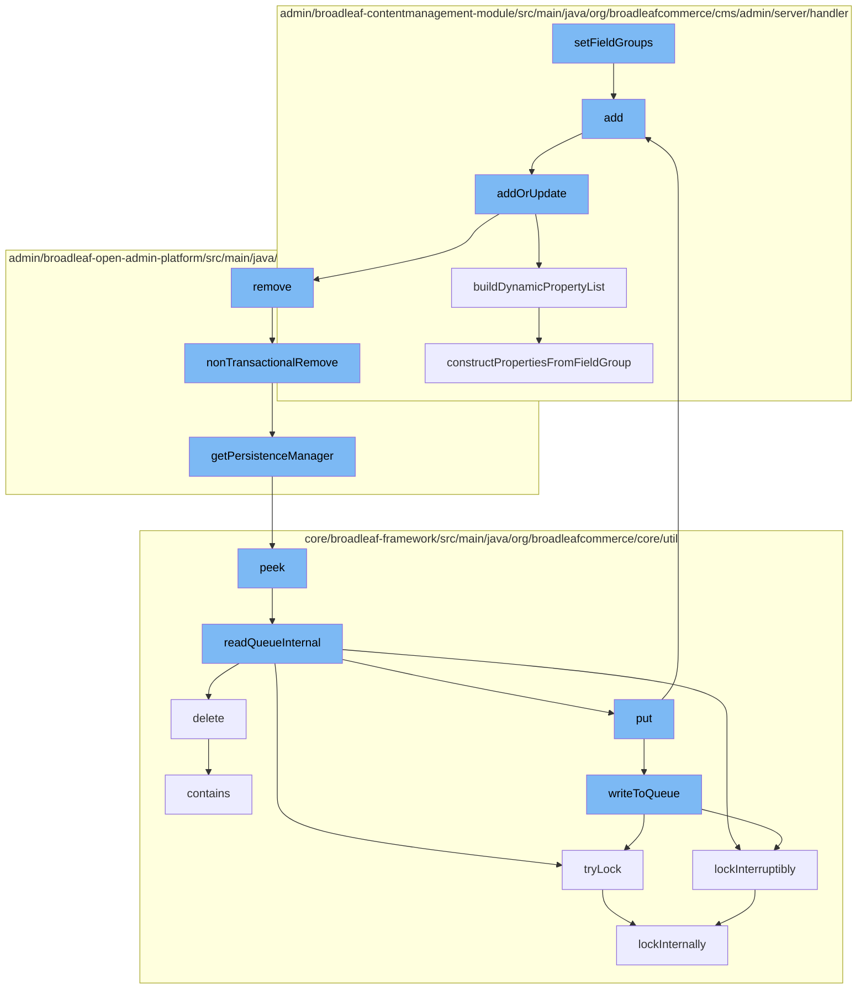

This document will cover the process of setting field groups in the BroadleafCommerce-demo project. We'll cover:

1. The function of setFieldGroups
2. How setFieldGroups interacts with other functions
3. The flow of data through these functions.



<SwmSnippet path="/admin/broadleaf-contentmanagement-module/src/main/java/org/broadleafcommerce/cms/page/domain/PageTemplateImpl.java" line="1">

---

# The function of setFieldGroups

The `setFieldGroups` function is used to set the field groups for a page template. This is a crucial step in the process of creating or updating a page template, as it determines the fields that will be available for the template.

```java
/*-
 * #%L
 * BroadleafCommerce CMS Module
 * %%
 * Copyright (C) 2009 - 2024 Broadleaf Commerce
 * %%
 * Licensed under the Broadleaf Fair Use License Agreement, Version 1.0
 * (the "Fair Use License" located  at http://license.broadleafcommerce.org/fair_use_license-1.0.txt)
 * unless the restrictions on use therein are violated and require payment to Broadleaf in which case
 * the Broadleaf End User License Agreement (EULA), Version 1.1
```

---

</SwmSnippet>

<SwmSnippet path="/admin/broadleaf-contentmanagement-module/src/main/java/org/broadleafcommerce/cms/admin/server/handler/PageTemplateCustomPersistenceHandler.java" line="294">

---

# Interaction with add function

`setFieldGroups` calls the `add` function in `PageTemplateCustomPersistenceHandler`. This function is responsible for adding a new entity to the persistence package, which is a container for data that is being persisted to the database.

```java
    @Override
    public Entity add(PersistencePackage persistencePackage, DynamicEntityDao dynamicEntityDao, RecordHelper helper) throws ServiceException {
        return addOrUpdate(persistencePackage, dynamicEntityDao, helper);
    }
```

---

</SwmSnippet>

<SwmSnippet path="/admin/broadleaf-contentmanagement-module/src/main/java/org/broadleafcommerce/cms/admin/server/handler/PageTemplateCustomPersistenceHandler.java" line="299">

---

# Interaction with addOrUpdate function

The `add` function calls `addOrUpdate`, which is responsible for either adding a new entity or updating an existing one. This function also validates the entity before persisting it to the database.

```java
    protected Entity addOrUpdate(PersistencePackage persistencePackage, DynamicEntityDao dynamicEntityDao, RecordHelper helper) throws ServiceException {
        String ceilingEntityFullyQualifiedClassname = persistencePackage.getCeilingEntityFullyQualifiedClassname();
        try {
            String pageId = persistencePackage.getCustomCriteria()[1];

            if (StringUtils.isBlank(pageId)) {
                return persistencePackage.getEntity();
            }

            Page page = pageService.findPageById(Long.valueOf(pageId));

            Property[] properties = dynamicFieldUtil.buildDynamicPropertyList(getFieldGroups(page, null), PageTemplate.class);
            Map<String, FieldMetadata> md = new HashMap<String, FieldMetadata>();
            for (Property property : properties) {
                md.put(property.getName(), property.getMetadata());
            }

            boolean validated = helper.validate(persistencePackage.getEntity(), new PageTemplateImpl(), md);
            if (!validated) {
                throw new ValidationException(persistencePackage.getEntity(), "Page dynamic fields failed validation");
            }
```

---

</SwmSnippet>

<SwmSnippet path="/admin/broadleaf-contentmanagement-module/src/main/java/org/broadleafcommerce/cms/admin/server/handler/DynamicFieldPersistenceHandlerHelper.java" line="109">

---

# Interaction with buildDynamicPropertyList function

`addOrUpdate` calls `buildDynamicPropertyList`, which builds a list of dynamic properties for the entity. These properties are derived from the field groups that were set by `setFieldGroups`.

```java
    /**
     * Builds all of the metadata for all of the dynamic properties within a {@link StructuredContentType}, gleaned from
     * the {@link FieldGroup}s and {@link FieldDefinition}s.
     *
     * @param fieldGroups groups that the {@link Property}s are built from
     * @param inheritedType the value that each built {@link FieldMetadata} for each property will use to notate where the
     * dynamic field actually came from (meaning {@link FieldMetadata#setAvailableToTypes(String[])} and {@link FieldMetadata#setInheritedFromType(String)}
     * @return
     */
    public Property[] buildDynamicPropertyList(List<FieldGroup> fieldGroups, Class<?> inheritedType) {
        List<Property> propertiesList = new ArrayList<Property>();
        for (FieldGroup group : fieldGroups) {
            constructPropertiesFromFieldGroup(inheritedType, propertiesList, group, 0l);
        }
        Property property = constructIdProperty(inheritedType);
        propertiesList.add(property);

        Property[] properties = sortProperties(propertiesList);
        return properties;
    }
```

---

</SwmSnippet>

<SwmSnippet path="/admin/broadleaf-open-admin-platform/src/main/java/org/broadleafcommerce/openadmin/server/service/DynamicEntityRemoteService.java" line="329">

---

# Interaction with nonTransactionalRemove function

`addOrUpdate` also calls `remove` in `DynamicEntityRemoteService`, which is responsible for removing an entity from the persistence context. This is done in a non-transactional manner, meaning that it does not affect the current transaction.

```java
    @Override
    public PersistenceResponse nonTransactionalRemove(final PersistencePackage persistencePackage) throws ServiceException {
        return persistenceThreadManager.operation(TargetModeType.SANDBOX, persistencePackage, new Persistable <PersistenceResponse, ServiceException>() {
            @Override
            public PersistenceResponse execute() throws ServiceException {
                try {
                    PersistenceManager persistenceManager = PersistenceManagerFactory.getPersistenceManager();
                    return persistenceManager.remove(persistencePackage);
                } catch (ServiceException e) {
                    //immediately throw validation exceptions without printing a stack trace
                    if (e instanceof ValidationException) {
                        throw e;
                    } else if (e.getCause() instanceof ValidationException) {
                        throw (ValidationException) e.getCause();
                    }
                    LOG.error("Problem removing " + persistencePackage.getCeilingEntityFullyQualifiedClassname(), e);
                    String message = exploitProtectionService.cleanString(e.getMessage());
                    throw recreateSpecificServiceException(e, message, e.getCause());
                }
            }
        });
```

---

</SwmSnippet>

<SwmSnippet path="/admin/broadleaf-open-admin-platform/src/main/java/org/broadleafcommerce/openadmin/server/service/persistence/PersistenceManagerContext.java" line="49">

---

# Interaction with getPersistenceManager function

`remove` calls `getPersistenceManager`, which retrieves the current persistence manager. The persistence manager is responsible for managing the persistence context and interacting with the database.

```java
    public PersistenceManager getPersistenceManager() {
        return !persistenceManager.empty()?persistenceManager.peek():null;
    }
```

---

</SwmSnippet>

<SwmSnippet path="/core/broadleaf-framework/src/main/java/org/broadleafcommerce/core/util/queue/ZookeeperDistributedQueue.java" line="222">

---

# Interaction with peek function

`getPersistenceManager` calls `peek`, which retrieves the next element in the queue without removing it. This is used to check if there are any more entities to be processed.

```java
    @Override
    public T peek() {
        try {
            Map<String, T> elements = readQueueInternal(1, false, 0L);
            Iterator<Map.Entry<String, T>> entries = elements.entrySet().iterator();
            if (entries.hasNext()) {
                return entries.next().getValue();
            }
            
            return null;
        } catch (InterruptedException e) {
            Thread.currentThread().interrupt();
            return null;
        }
    }
```

---

</SwmSnippet>

<SwmSnippet path="/core/broadleaf-framework/src/main/java/org/broadleafcommerce/core/util/queue/ZookeeperDistributedQueue.java" line="591">

---

# Interaction with readQueueInternal function

`peek` calls `readQueueInternal`, which reads the queue and retrieves the next element. If the `remove` parameter is set to true, the element is also removed from the queue.

```java
    protected Map<String, T> readQueueInternal(final int qty, final boolean remove, final long timeout) throws InterruptedException {
        final Map<String, T> out = new LinkedHashMap<>();
        long waitTime = timeout;
        synchronized (QUEUE_MONITOR) {
            while (true) {
                boolean locked;
                DistributedLock lock = getQueueAccessLock();
                if (timeout < 0L) {
                    lock.lockInterruptibly();
                    locked = true;
                } else if (timeout > 0L && waitTime > 0L) {
                    long start = System.currentTimeMillis();
                    locked = lock.tryLock(waitTime, TimeUnit.MILLISECONDS);
                    long end = System.currentTimeMillis();
                    waitTime -= (end - start);
                } else {
                    locked = lock.tryLock();
                    if (!locked) {
                        return out;
                    }
                }
```

---

</SwmSnippet>

<SwmSnippet path="/core/broadleaf-framework/src/main/java/org/broadleafcommerce/core/util/lock/ReentrantDistributedZookeeperLock.java" line="344">

---

# Interaction with tryLock function

`readQueueInternal` and `writeToQueue` both call `tryLock`, which attempts to acquire a lock. If the lock is not available, it returns false instead of blocking.

```java
    @Override
    public boolean tryLock() {
        try {
            return lockInternally(0L);
        } catch (InterruptedException e) {
            Thread.currentThread().interrupt();
            return false;
        }
    }
```

---

</SwmSnippet>

<SwmSnippet path="/core/broadleaf-framework/src/main/java/org/broadleafcommerce/core/util/queue/ZookeeperDistributedQueue.java" line="503">

---

# Interaction with writeToQueue function

`readQueueInternal` calls `writeToQueue`, which writes an element to the queue. This is used to add new entities to be processed.

```java
    protected int writeToQueue(List<? extends T> entries, final long timeout) throws InterruptedException {
        if (entries == null || entries.isEmpty()) {
            return 0;
        }
        
        int entryCount = 0;
        long waitTime = timeout;
        synchronized (QUEUE_MONITOR) {
            while (true) {
                boolean locked = false;
                DistributedLock lock = getQueueAccessLock();
                if (timeout < 0L) {
                    lock.lockInterruptibly();
                    locked = true;
                } else if (timeout > 0L && waitTime > 0L) {
                    long start = System.currentTimeMillis();
                    locked = lock.tryLock(waitTime, TimeUnit.MILLISECONDS);
                    long end = System.currentTimeMillis();
                    waitTime -= (end - start);
                } else {
                    locked = lock.tryLock();
```

---

</SwmSnippet>

<SwmSnippet path="/core/broadleaf-framework/src/main/java/org/broadleafcommerce/core/util/queue/ZookeeperDistributedQueue.java" line="474">

---

# Interaction with contains function

`delete` calls `contains`, which checks if an element is in the queue. This is used to ensure that an entity is not processed more than once.

```java
    @Override
    public boolean contains(Object o) {
        return containsAll(Collections.singletonList(o));
    }
```

---

</SwmSnippet>

<SwmSnippet path="/core/broadleaf-framework/src/main/java/org/broadleafcommerce/core/util/lock/ReentrantDistributedZookeeperLock.java" line="380">

---

# Interaction with lockInternally function

`tryLock` and `lockInterruptibly` both call `lockInternally`, which acquires a lock. If the lock is not available, it either blocks until the lock is available or returns false, depending on the parameters.

```java
    protected boolean lockInternally(final long waitTime) throws InterruptedException {
        if (!canParticipate()) {
            //No lock will be provided in this case, but we want to simulate the normal lock semantics.
            if (waitTime < 0L) {
                //Simulate normal lock semantics,where the lock is unavailable, but we've been asked to wait interruptably for it indefinitely.
                synchronized (NON_PARTICIPANT_LOCK_MONITOR) {
                    //This basically will cause this thread to block forever until the thread is interrupted, which is what we want.
                    NON_PARTICIPANT_LOCK_MONITOR.wait(); 
                }
            } else if (waitTime > 0L) {
                //Simulate normal lock semantics, where the lock is unavailable, but we've been asked to wait interruptably for it for a period of time.
                synchronized (NON_PARTICIPANT_LOCK_MONITOR) {
                    NON_PARTICIPANT_LOCK_MONITOR.wait(waitTime);
                }
            }
            
            return false;
        }
        
        //See if this thread already has a lock permit.  If so, just increment the count and return it.
        //No need to interact with Zookeeper.
```

---

</SwmSnippet>

<SwmSnippet path="/admin/broadleaf-contentmanagement-module/src/main/java/org/broadleafcommerce/cms/admin/server/handler/DynamicFieldPersistenceHandlerHelper.java" line="186">

---

# Interaction with constructPropertiesFromFieldGroup function

`buildDynamicPropertyList` calls `constructPropertiesFromFieldGroup`, which constructs properties from a field group. These properties are then added to the entity.

```java
    private void constructPropertiesFromFieldGroup(Class<?> inheritedType, List<Property> propertiesList, FieldGroup group, Long groupOrder) {
        List<FieldDefinition> definitions = group.getFieldDefinitions();
        for (FieldDefinition def : definitions) {
            Property property = buildDynamicProperty(def, inheritedType);
            BasicFieldMetadata fieldMetadata = (BasicFieldMetadata) property.getMetadata();
            fieldMetadata.setGroup(group.getName());
            fieldMetadata.setGroupCollapsed(group.getInitCollapsedFlag());
            fieldMetadata.setGroupOrder(groupOrder.intValue());
            propertiesList.add(property);
        }
    }
```

---

</SwmSnippet>

&nbsp;

*This is an auto-generated document by Swimm AI 🌊 and has not yet been verified by a human*

<SwmMeta version="3.0.0" repo-id="Z2l0aHViJTNBJTNBQnJvYWRsZWFmQ29tbWVyY2UtZGVtbyUzQSUzQWdpbGFkbmF2b3Q=" repo-name="BroadleafCommerce-demo" doc-type="flows"><sup>Powered by [Swimm](/)</sup></SwmMeta>
