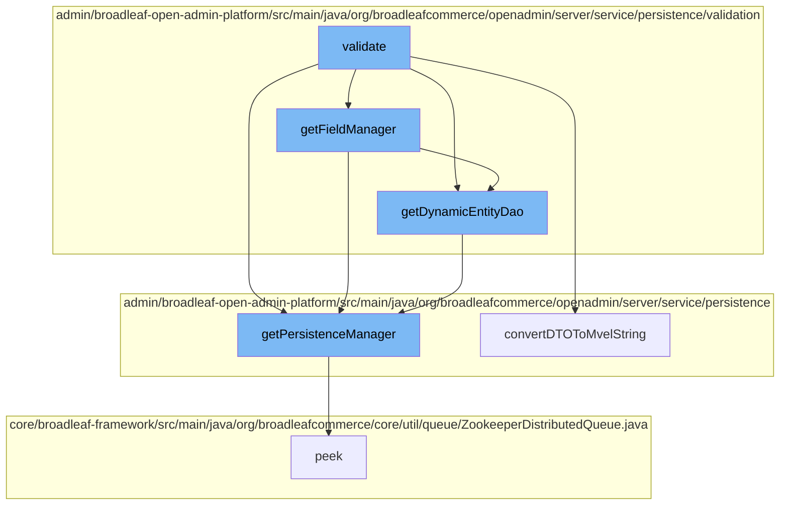

This document will cover the process of validating fields in Broadleaf Commerce, which includes:

1. Retrieving the Field Manager
2. Getting the Dynamic Entity DAO
3. Accessing the Persistence Manager
4. Converting DTO to MVEL string.



<SwmSnippet path="/admin/broadleaf-open-admin-platform/src/main/java/org/broadleafcommerce/openadmin/server/service/persistence/validation/AfterStartDateValidator.java" line="96">

---

# Retrieving the Field Manager

The `getFieldManager` function is used to retrieve the Field Manager. It uses the `PersistenceManagerFactory` to get the `PersistenceManager` based on the target class of the property metadata. The Field Manager is then retrieved from the `DynamicEntityDao` of the `PersistenceManager`.

```java
    protected FieldManager getFieldManager(BasicFieldMetadata propertyMetadata) {
        PersistenceManager persistenceManager;
        if (propertyMetadata.getTargetClass() != null) {
            persistenceManager = PersistenceManagerFactory.getPersistenceManager(propertyMetadata.getTargetClass());
        } else {
            persistenceManager = PersistenceManagerFactory.getPersistenceManager();
        }
        return persistenceManager.getDynamicEntityDao().getFieldManager();
    }
```

---

</SwmSnippet>

<SwmSnippet path="/admin/broadleaf-open-admin-platform/src/main/java/org/broadleafcommerce/openadmin/server/service/persistence/validation/UniqueValueValidator.java" line="71">

---

# Getting the Dynamic Entity DAO

The `getDynamicEntityDao` function is used to get the Dynamic Entity DAO. It uses the `PersistenceManagerFactory` to get the `PersistenceManager` based on the class name. The Dynamic Entity DAO is then retrieved from the `PersistenceManager`.

```java
    protected DynamicEntityDao getDynamicEntityDao(String className) {
        return PersistenceManagerFactory.getPersistenceManager(className).getDynamicEntityDao();
    }
}
```

---

</SwmSnippet>

<SwmSnippet path="/admin/broadleaf-open-admin-platform/src/main/java/org/broadleafcommerce/openadmin/server/service/persistence/PersistenceManagerContext.java" line="49">

---

# Accessing the Persistence Manager

The `getPersistenceManager` function is used to access the Persistence Manager. It checks if the `persistenceManager` is not empty and then retrieves the top `PersistenceManager` from the stack.

```java
    public PersistenceManager getPersistenceManager() {
        return !persistenceManager.empty()?persistenceManager.peek():null;
    }
```

---

</SwmSnippet>

<SwmSnippet path="/admin/broadleaf-open-admin-platform/src/main/java/org/broadleafcommerce/openadmin/server/service/persistence/module/provider/RuleFieldExtractionUtility.java" line="1">

---

# Converting DTO to MVEL string

The `convertDTOToMvelString` function is used to convert DTO to MVEL string. This is a crucial step in the field validation process.

```java
/*-
```

---

</SwmSnippet>

&nbsp;

*This is an auto-generated document by Swimm AI 🌊 and has not yet been verified by a human*

<SwmMeta version="3.0.0" repo-id="Z2l0aHViJTNBJTNBQnJvYWRsZWFmQ29tbWVyY2UtZGVtbyUzQSUzQWdpbGFkbmF2b3Q=" repo-name="BroadleafCommerce-demo" doc-type="flows"><sup>Powered by [Swimm](/)</sup></SwmMeta>
