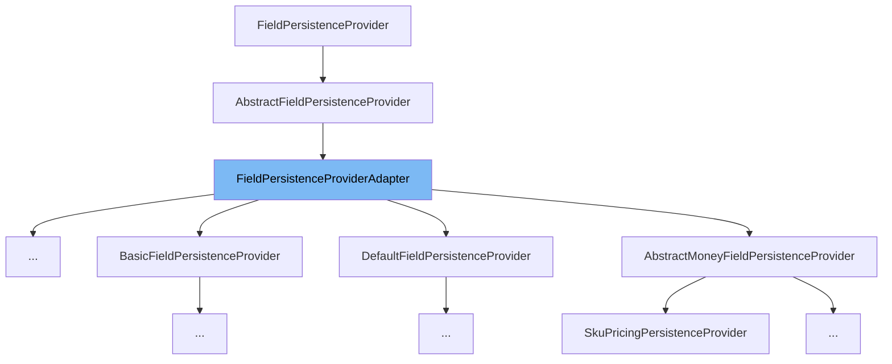

This document will cover the `FieldPersistenceProviderAdapter` class. We'll cover:

1. What is `FieldPersistenceProviderAdapter`.
2. The variables and functions defined in `FieldPersistenceProviderAdapter`.
3. An example of how to use `FieldPersistenceProviderAdapter`.



# What is FieldPersistenceProviderAdapter

`FieldPersistenceProviderAdapter` is a class in the Broadleaf Commerce framework that provides a default implementation for the `FieldPersistenceProvider` interface. It's designed to be extended by other classes that need to provide specific implementations for handling persistence of different types of fields in the admin platform.

<SwmSnippet path="/admin/broadleaf-open-admin-platform/src/main/java/org/broadleafcommerce/openadmin/server/service/persistence/module/provider/FieldPersistenceProviderAdapter.java" line="46">

---

# Variables and functions

The function `addSearchMapping` is used to add a search mapping. By default, it returns `MetadataProviderResponse.NOT_HANDLED`, indicating that this provider does not handle the operation.

```java
    public MetadataProviderResponse addSearchMapping(AddSearchMappingRequest addSearchMappingRequest, List<FilterMapping> filterMappings) {
        return MetadataProviderResponse.NOT_HANDLED;
    }
```

---

</SwmSnippet>

<SwmSnippet path="/admin/broadleaf-open-admin-platform/src/main/java/org/broadleafcommerce/openadmin/server/service/persistence/module/provider/FieldPersistenceProviderAdapter.java" line="51">

---

The function `populateValue` is used to populate a value. By default, it returns `MetadataProviderResponse.NOT_HANDLED`, indicating that this provider does not handle the operation.

```java
    public MetadataProviderResponse populateValue(PopulateValueRequest populateValueRequest, Serializable instance) {
        return MetadataProviderResponse.NOT_HANDLED;
    }
```

---

</SwmSnippet>

<SwmSnippet path="/admin/broadleaf-open-admin-platform/src/main/java/org/broadleafcommerce/openadmin/server/service/persistence/module/provider/FieldPersistenceProviderAdapter.java" line="56">

---

The function `extractValue` is used to extract a value. By default, it returns `MetadataProviderResponse.NOT_HANDLED`, indicating that this provider does not handle the operation.

```java
    public MetadataProviderResponse extractValue(ExtractValueRequest extractValueRequest, Property property) {
        return MetadataProviderResponse.NOT_HANDLED;
    }
```

---

</SwmSnippet>

<SwmSnippet path="/admin/broadleaf-open-admin-platform/src/main/java/org/broadleafcommerce/openadmin/server/service/persistence/module/provider/FieldPersistenceProviderAdapter.java" line="61">

---

The function `filterProperties` is used to filter properties. By default, it returns `MetadataProviderResponse.NOT_HANDLED`, indicating that this provider does not handle the operation.

```java
    public MetadataProviderResponse filterProperties(AddFilterPropertiesRequest addFilterPropertiesRequest, Map<String, FieldMetadata> properties) {
        return MetadataProviderResponse.NOT_HANDLED;
    }
```

---

</SwmSnippet>

<SwmSnippet path="/admin/broadleaf-open-admin-platform/src/main/java/org/broadleafcommerce/openadmin/server/service/persistence/module/provider/FieldPersistenceProviderAdapter.java" line="66">

---

The function `getOrder` is used to get the order of this provider. By default, it returns `Ordered.LOWEST_PRECEDENCE`, indicating that this provider has the lowest precedence.

```java
    public int getOrder() {
        return Ordered.LOWEST_PRECEDENCE;
    }
```

---

</SwmSnippet>

<SwmSnippet path="/admin/broadleaf-open-admin-platform/src/main/java/org/broadleafcommerce/openadmin/server/service/persistence/module/provider/FieldPersistenceProviderAdapter.java" line="70">

---

The function `checkDirtyState` is used to check if a field is dirty. It checks if the field value has changed from its original value.

```java
    protected boolean checkDirtyState(PopulateValueRequest request, Object instance, Object checkValue) throws Exception {
        boolean dirty = isFieldDirty(request, instance, checkValue);
        boolean hasDefaultValue = !StringUtils.isEmpty(request.getMetadata().getDefaultValue());

        return (!request.getPreAdd() || hasDefaultValue) && dirty;
    }
```

---

</SwmSnippet>

<SwmSnippet path="/admin/broadleaf-open-admin-platform/src/main/java/org/broadleafcommerce/openadmin/server/service/persistence/module/provider/FieldPersistenceProviderAdapter.java" line="77">

---

The function `isFieldDirty` is used to check if a field is dirty. It checks if the field value has changed from its original value.

```java
    protected boolean isFieldDirty(PopulateValueRequest request, Object instance, Object checkValue) throws IllegalAccessException, FieldNotAvailableException {
        boolean dirty = !(instance == null && checkValue == null) && (instance == null || checkValue == null);
        if (!dirty) {
            Object value = request.getFieldManager().getFieldValue(instance, request.getProperty().getName());
            if (checkValue instanceof String) {
                checkValue = ((String) checkValue).replaceAll("\\s+[</]|\\r\\n+[</]","</").trim();
            }
            if (value instanceof String) {
                value = ((String) value).replaceAll("\\s+[</]|\\r\\n+[</]","</").trim();
            }
            if (value instanceof BigDecimal) {
                BigDecimal origValue = (BigDecimal) value;
                BigDecimal newValue = (BigDecimal) checkValue;
                //set the scale of one of the BigDecimal values to the larger of the two scales
                if (newValue.scale() < origValue.scale()) {
                    checkValue = newValue.setScale(origValue.scale(), RoundingMode.UNNECESSARY);
                } else if (origValue.scale() < newValue.scale()) {
                    value = origValue.setScale(newValue.scale(), RoundingMode.UNNECESSARY);
                }
            }
            dirty = value == null || !value.equals(checkValue);
```

---

</SwmSnippet>

<SwmSnippet path="/admin/broadleaf-open-admin-platform/src/main/java/org/broadleafcommerce/openadmin/server/service/persistence/module/provider/FieldPersistenceProviderAdapter.java" line="102">

---

The function `setNonDisplayableValues` is used to set non-displayable values. It sets the display value and original display value of a property to a non-displayable label.

```java
    protected void setNonDisplayableValues(PopulateValueRequest request) {
        BroadleafRequestContext context = BroadleafRequestContext.getBroadleafRequestContext();
        MessageSource messages = context.getMessageSource();
        String label = "(" + messages.getMessage("Workflow_not_displayable", null, "Not Displayable", context.getJavaLocale()) + ")";
        request.getProperty().setDisplayValue(label);
        request.getProperty().setOriginalDisplayValue(label);
    }
```

---

</SwmSnippet>

<SwmSnippet path="/admin/broadleaf-open-admin-platform/src/main/java/org/broadleafcommerce/openadmin/server/service/persistence/module/provider/RuleFieldPersistenceProvider.java" line="1">

---

# Usage example

Here is an example of how `FieldPersistenceProviderAdapter` is used. The `RuleFieldPersistenceProvider` class extends `FieldPersistenceProviderAdapter` and provides specific implementations for the methods.

```java
/*-
 * #%L
 * BroadleafCommerce Open Admin Platform
 * %%
 * Copyright (C) 2009 - 2024 Broadleaf Commerce
 * %%
 * Licensed under the Broadleaf Fair Use License Agreement, Version 1.0
 * (the "Fair Use License" located  at http://license.broadleafcommerce.org/fair_use_license-1.0.txt)
 * unless the restrictions on use therein are violated and require payment to Broadleaf in which case
 * the Broadleaf End User License Agreement (EULA), Version 1.1
 * (the "Commercial License" located at http://license.broadleafcommerce.org/commercial_license-1.1.txt)
 * shall apply.
 * 
 * Alternatively, the Commercial License may be replaced with a mutually agreed upon license (the "Custom License")
 * between you and Broadleaf Commerce. You may not use this file except in compliance with the applicable license.
 * #L%
 */
package org.broadleafcommerce.openadmin.server.service.persistence.module.provider;

import com.fasterxml.jackson.databind.ObjectMapper;
import org.apache.commons.beanutils.PropertyUtils;
```

---

</SwmSnippet>

&nbsp;

*This is an auto-generated document by Swimm AI 🌊 and has not yet been verified by a human*

<SwmMeta version="3.0.0" repo-id="Z2l0aHViJTNBJTNBQnJvYWRsZWFmQ29tbWVyY2UtZGVtbyUzQSUzQWdpbGFkbmF2b3Q=" repo-name="BroadleafCommerce-demo" doc-type="class"><sup>Powered by [Swimm](/)</sup></SwmMeta>
