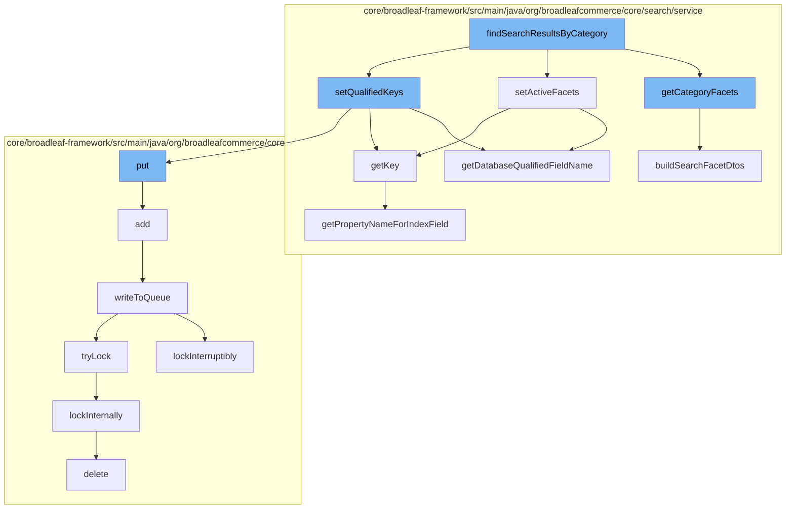

This document will cover the process of finding search results by category in the BroadleafCommerce-demo repository. The process includes the following steps:

1. Retrieving category facets
2. Setting active facets
3. Setting qualified keys
4. Writing to the queue
5. Locking the process
6. Deleting the lock



<SwmSnippet path="/core/broadleaf-framework/src/main/java/org/broadleafcommerce/core/search/service/DatabaseSearchServiceImpl.java" line="136">

---

# Retrieving category facets

The `getCategoryFacets` method retrieves the search facets for a given category. If the facets are not in the cache, it fetches them from the database, builds the DTOs, and stores them in the cache for future use.

```java
    @Override
    public List<SearchFacetDTO> getCategoryFacets(Category category) {
        String cacheKey = CACHE_KEY_PREFIX + "category:" + category.getId();
        List<SearchFacetDTO> facets = getCache().get(cacheKey);
        
        if (facets == null) {
            List<CategorySearchFacet> categorySearchFacets = category.getCumulativeSearchFacets();
            List<SearchFacet> searchFacets = new ArrayList<SearchFacet>();
            for (CategorySearchFacet categorySearchFacet : categorySearchFacets) {
                searchFacets.add(categorySearchFacet.getSearchFacet());
            }
            facets = buildSearchFacetDtos(searchFacets);
            getCache().put(cacheKey, facets);
        }
        return facets;
    }
```

---

</SwmSnippet>

<SwmSnippet path="/core/broadleaf-framework/src/main/java/org/broadleafcommerce/core/search/service/DatabaseSearchServiceImpl.java" line="198">

---

# Setting active facets

The `setActiveFacets` method sets the active facets for the search. It uses the `getDatabaseQualifiedFieldName` method to get the database field name for each facet.

```java
    protected String getDatabaseQualifiedFieldName(String qualifiedFieldName) {
        if (qualifiedFieldName.contains("productAttributes")) {
            return qualifiedFieldName.replace("product.", "");
        } else if (qualifiedFieldName.contains("defaultSku")) {
            return qualifiedFieldName.replace("product.", "");
        } else {
            return qualifiedFieldName;
        }
    }
```

---

</SwmSnippet>

<SwmSnippet path="/core/broadleaf-framework/src/main/java/org/broadleafcommerce/core/search/service/DatabaseSearchServiceImpl.java" line="198">

---

# Setting qualified keys

The `setQualifiedKeys` method sets the qualified keys for the search. It uses the `getDatabaseQualifiedFieldName` method to get the database field name for each key.

```java
    protected String getDatabaseQualifiedFieldName(String qualifiedFieldName) {
        if (qualifiedFieldName.contains("productAttributes")) {
            return qualifiedFieldName.replace("product.", "");
        } else if (qualifiedFieldName.contains("defaultSku")) {
            return qualifiedFieldName.replace("product.", "");
        } else {
            return qualifiedFieldName;
        }
    }
```

---

</SwmSnippet>

<SwmSnippet path="/core/broadleaf-framework/src/main/java/org/broadleafcommerce/core/util/queue/ZookeeperDistributedQueue.java" line="503">

---

# Writing to the queue

The `writeToQueue` method writes the search results to the queue. It uses a distributed lock to ensure that only one process can write to the queue at a time.

```java
    protected int writeToQueue(List<? extends T> entries, final long timeout) throws InterruptedException {
        if (entries == null || entries.isEmpty()) {
            return 0;
        }
        
        int entryCount = 0;
        long waitTime = timeout;
        synchronized (QUEUE_MONITOR) {
            while (true) {
                boolean locked = false;
                DistributedLock lock = getQueueAccessLock();
                if (timeout < 0L) {
                    lock.lockInterruptibly();
                    locked = true;
                } else if (timeout > 0L && waitTime > 0L) {
                    long start = System.currentTimeMillis();
                    locked = lock.tryLock(waitTime, TimeUnit.MILLISECONDS);
                    long end = System.currentTimeMillis();
                    waitTime -= (end - start);
                } else {
                    locked = lock.tryLock();
```

---

</SwmSnippet>

<SwmSnippet path="/core/broadleaf-framework/src/main/java/org/broadleafcommerce/core/util/lock/ReentrantDistributedZookeeperLock.java" line="335">

---

# Locking the process

The `lockInterruptibly` method is used to acquire a lock on the process. If the thread is interrupted before or during the acquisition of the lock, an InterruptedException is thrown.

```java
    @Override
    public void lockInterruptibly() throws InterruptedException {
        if (Thread.interrupted()) {
            throw new InterruptedException("Thread was interrupted prior to trying to acquire the lock.");
        }
        
        lockInternally(-1L);
    }
```

---

</SwmSnippet>

<SwmSnippet path="/core/broadleaf-framework/src/main/java/org/broadleafcommerce/core/util/dao/CodeTypeDaoImpl.java" line="51">

---

# Deleting the lock

The `delete` method is used to delete the lock once the process is complete. This ensures that other processes can acquire the lock.

```java
    public void delete(CodeType codeType) {
        if (!em.contains(codeType)) {
            codeType = (CodeType) em.find(CodeTypeImpl.class, codeType.getId());
        }
        em.remove(codeType);
    }
```

---

</SwmSnippet>

&nbsp;

*This is an auto-generated document by Swimm AI 🌊 and has not yet been verified by a human*

<SwmMeta version="3.0.0" repo-id="Z2l0aHViJTNBJTNBQnJvYWRsZWFmQ29tbWVyY2UtZGVtbyUzQSUzQWdpbGFkbmF2b3Q=" repo-name="BroadleafCommerce-demo" doc-type="flows"><sup>Powered by [Swimm](/)</sup></SwmMeta>
