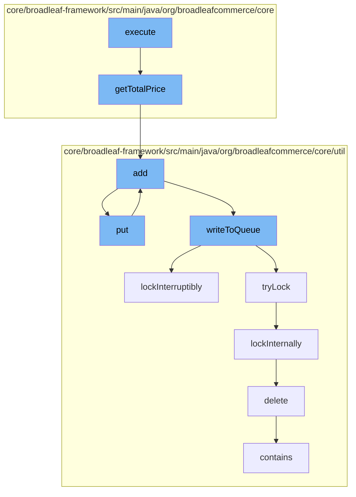

This document will cover the process of calculating and managing the total price of a fulfillment group in the Broadleaf Commerce framework. The process includes:

1. Calculating the total price of a bundle order item
2. Adding the calculated price to a resource purge service
3. Putting the calculated price into a distributed queue
4. Writing the calculated price to the queue
5. Locking the queue to prevent concurrent modifications
6. Deleting a code type from the database
7. Checking if the calculated price is in the queue.



<SwmSnippet path="/core/broadleaf-framework/src/main/java/org/broadleafcommerce/core/order/domain/BundleOrderItemImpl.java" line="416">

---

# Calculating the total price of a bundle order item

The `getTotalPrice` method in `BundleOrderItemImpl` calculates the total price of a bundle order item. If the bundle should be summed, it iterates over all order items, adding their total prices together. The result is then multiplied by the quantity. If the bundle should not be summed, it simply returns the super class's total price.

```java
    @Override
    public Money getTotalPrice() {
        Money returnValue = convertToMoney(BigDecimal.ZERO);
        if (shouldSumItems()) {
            for (OrderItem containedItem : getOrderItems()) {
                returnValue = returnValue.add(containedItem.getTotalPrice());
            }
            returnValue = returnValue.multiply(quantity);
        } else {
            returnValue = super.getTotalPrice();
        }
        return returnValue;
    }
```

---

</SwmSnippet>

<SwmSnippet path="/core/broadleaf-framework/src/main/java/org/broadleafcommerce/core/util/service/ResourcePurgeServiceImpl.java" line="593">

---

# Adding the calculated price to a resource purge service

The `add` method in `ResourcePurgeServiceImpl` adds the calculated price to a cache if it doesn't already exist in the cache. The method returns the timestamp of when the price was added to the cache.

```java
        public Long add(Long entry) {
            if (! cache.containsKey(entry)) {
                return cache.put(entry, new Long(System.currentTimeMillis()));
            }
            return null;
        }
```

---

</SwmSnippet>

<SwmSnippet path="/core/broadleaf-framework/src/main/java/org/broadleafcommerce/core/util/queue/ZookeeperDistributedQueue.java" line="393">

---

# Putting the calculated price into a distributed queue

The `put` method in `ZookeeperDistributedQueue` puts the calculated price into a distributed queue. It does this by calling the `writeToQueue` method.

```java
    @Override
    public void put(T e) throws InterruptedException {
        final ArrayList<T> elementsToAdd = new ArrayList<>();
        elementsToAdd.add(e);
        writeToQueue(elementsToAdd, -1L);
    }
```

---

</SwmSnippet>

<SwmSnippet path="/core/broadleaf-framework/src/main/java/org/broadleafcommerce/core/util/queue/ZookeeperDistributedQueue.java" line="503">

---

# Writing the calculated price to the queue

The `writeToQueue` method in `ZookeeperDistributedQueue` writes the calculated price to the queue. It does this by acquiring a lock on the queue, checking the remaining capacity of the queue, and then adding the price to the queue if there is enough capacity.

```java
    protected int writeToQueue(List<? extends T> entries, final long timeout) throws InterruptedException {
        if (entries == null || entries.isEmpty()) {
            return 0;
        }
        
        int entryCount = 0;
        long waitTime = timeout;
        synchronized (QUEUE_MONITOR) {
            while (true) {
                boolean locked = false;
                DistributedLock lock = getQueueAccessLock();
                if (timeout < 0L) {
                    lock.lockInterruptibly();
                    locked = true;
                } else if (timeout > 0L && waitTime > 0L) {
                    long start = System.currentTimeMillis();
                    locked = lock.tryLock(waitTime, TimeUnit.MILLISECONDS);
                    long end = System.currentTimeMillis();
                    waitTime -= (end - start);
                } else {
                    locked = lock.tryLock();
```

---

</SwmSnippet>

<SwmSnippet path="/core/broadleaf-framework/src/main/java/org/broadleafcommerce/core/util/lock/ReentrantDistributedZookeeperLock.java" line="335">

---

# Locking the queue to prevent concurrent modifications

The `lockInterruptibly` method in `ReentrantDistributedZookeeperLock` locks the queue to prevent concurrent modifications. It does this by calling the `lockInternally` method.

```java
    @Override
    public void lockInterruptibly() throws InterruptedException {
        if (Thread.interrupted()) {
            throw new InterruptedException("Thread was interrupted prior to trying to acquire the lock.");
        }
        
        lockInternally(-1L);
    }
```

---

</SwmSnippet>

<SwmSnippet path="/core/broadleaf-framework/src/main/java/org/broadleafcommerce/core/util/dao/CodeTypeDaoImpl.java" line="51">

---

# Deleting a code type from the database

The `delete` method in `CodeTypeDaoImpl` deletes a code type from the database. It does this by first finding the code type in the entity manager and then removing it.

```java
    public void delete(CodeType codeType) {
        if (!em.contains(codeType)) {
            codeType = (CodeType) em.find(CodeTypeImpl.class, codeType.getId());
        }
        em.remove(codeType);
    }
```

---

</SwmSnippet>

<SwmSnippet path="/core/broadleaf-framework/src/main/java/org/broadleafcommerce/core/util/queue/ZookeeperDistributedQueue.java" line="474">

---

# Checking if the calculated price is in the queue

The `contains` method in `ZookeeperDistributedQueue` checks if the calculated price is in the queue. It does this by calling the `containsAll` method with a singleton list containing the price.

```java
    @Override
    public boolean contains(Object o) {
        return containsAll(Collections.singletonList(o));
    }
```

---

</SwmSnippet>

&nbsp;

*This is an auto-generated document by Swimm AI 🌊 and has not yet been verified by a human*

<SwmMeta version="3.0.0" repo-id="Z2l0aHViJTNBJTNBQnJvYWRsZWFmQ29tbWVyY2UtZGVtbyUzQSUzQWdpbGFkbmF2b3Q=" repo-name="BroadleafCommerce-demo" doc-type="flows"><sup>Powered by [Swimm](/)</sup></SwmMeta>
