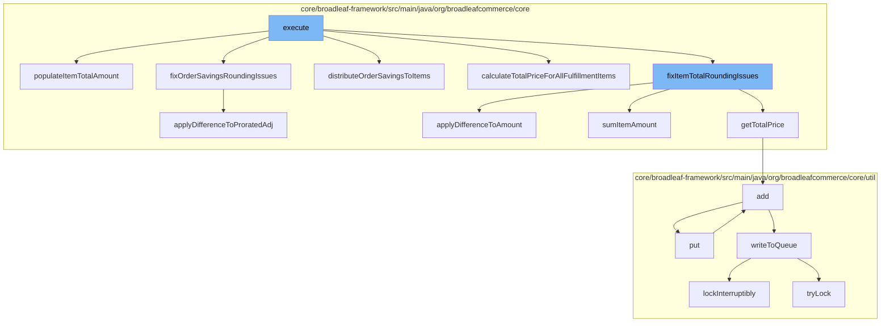

This document will cover the process of pricing fulfillment items in the BroadleafCommerce-demo project. The process includes the following steps:

1. Executing the main pricing function
2. Populating the total amount for each item
3. Fixing rounding issues for item totals and order savings
4. Distributing order savings to items
5. Calculating the total price for all fulfillment items
6. Writing the calculated data to the queue.



<SwmSnippet path="/core/broadleaf-framework/src/main/java/org/broadleafcommerce/core/pricing/service/workflow/FulfillmentItemPricingActivity.java" line="104">

---

# Executing the main pricing function

The `execute` function is the main entry point for the pricing process. It calls several other functions to perform specific tasks related to pricing.

```java
    /**
     * Sets the fulfillment amount which includes the relative portion of the total price for 
     * the corresponding order item.
     * 
     * @param order
     * @param partialOrderItemMap
     */
    protected void populateItemTotalAmount(Order order, Map<OrderItem, List<FulfillmentGroupItem>> partialOrderItemMap) {
        for (FulfillmentGroup fulfillmentGroup : order.getFulfillmentGroups()) {
            for (FulfillmentGroupItem fgItem : fulfillmentGroup.getFulfillmentGroupItems()) {
                OrderItem orderItem = fgItem.getOrderItem();
                int fgItemQty = fgItem.getQuantity();
                int orderItemQty = orderItem.getQuantity();
                Money totalItemAmount = orderItem.getTotalPrice();

                if (fgItemQty != orderItemQty) {
                    // We need to keep track of all of these items in case we need to distribute a remainder 
                    // to one or more of the items.
                    List<FulfillmentGroupItem> fgItemList = partialOrderItemMap.get(orderItem);
                    if (fgItemList == null) {
                        fgItemList = new ArrayList<>();
```

---

</SwmSnippet>

<SwmSnippet path="/core/broadleaf-framework/src/main/java/org/broadleafcommerce/core/pricing/service/workflow/FulfillmentItemPricingActivity.java" line="111">

---

# Populating the total amount for each item

The `populateItemTotalAmount` function is used to set the total amount for each item in the order, which includes the relative portion of the total price for the corresponding order item.

```java
    protected void populateItemTotalAmount(Order order, Map<OrderItem, List<FulfillmentGroupItem>> partialOrderItemMap) {
        for (FulfillmentGroup fulfillmentGroup : order.getFulfillmentGroups()) {
            for (FulfillmentGroupItem fgItem : fulfillmentGroup.getFulfillmentGroupItems()) {
                OrderItem orderItem = fgItem.getOrderItem();
                int fgItemQty = fgItem.getQuantity();
                int orderItemQty = orderItem.getQuantity();
                Money totalItemAmount = orderItem.getTotalPrice();

                if (fgItemQty != orderItemQty) {
                    // We need to keep track of all of these items in case we need to distribute a remainder 
                    // to one or more of the items.
                    List<FulfillmentGroupItem> fgItemList = partialOrderItemMap.get(orderItem);
                    if (fgItemList == null) {
                        fgItemList = new ArrayList<>();
                        partialOrderItemMap.put(orderItem, fgItemList);
                    }
                    fgItemList.add(fgItem);
                    fgItem.setTotalItemAmount(totalItemAmount.multiply(fgItemQty).divide(orderItemQty));
                } else {
                    fgItem.setTotalItemAmount(totalItemAmount);
                }
```

---

</SwmSnippet>

<SwmSnippet path="/core/broadleaf-framework/src/main/java/org/broadleafcommerce/core/pricing/service/workflow/FulfillmentItemPricingActivity.java" line="295">

---

# Fixing rounding issues for item totals and order savings

The `fixItemTotalRoundingIssues` and `fixOrderSavingsRoundingIssues` functions are used to correct any rounding issues that may have occurred during the calculation of item totals and order savings, respectively.

```java
    public long applyDifferenceToAmount(FulfillmentGroupItem fgItem, long numApplicationsNeeded, Money unitAmount) {
        BigDecimal numTimesToApply = new BigDecimal(Math.min(numApplicationsNeeded, fgItem.getQuantity()));

        Money oldAmount = fgItem.getTotalItemAmount();
        Money changeToAmount = unitAmount.multiply(numTimesToApply);

        fgItem.setTotalItemAmount(oldAmount.add(changeToAmount));
        return numTimesToApply.longValue();
    }
```

---

</SwmSnippet>

<SwmSnippet path="/core/broadleaf-framework/src/main/java/org/broadleafcommerce/core/pricing/service/workflow/FulfillmentItemPricingActivity.java" line="305">

---

# Distributing order savings to items

The `distributeOrderSavingsToItems` function is used to distribute the savings from the order level to the individual items in the order.

```java
    public long applyDifferenceToProratedAdj(FulfillmentGroupItem fgItem, long numApplicationsNeeded, Money unitAmount) {
        BigDecimal numTimesToApply = new BigDecimal(Math.min(numApplicationsNeeded, fgItem.getQuantity()));

        Money oldAmount = fgItem.getProratedOrderAdjustmentAmount();
        Money changeToAmount = unitAmount.multiply(numTimesToApply);

        fgItem.setProratedOrderAdjustmentAmount(oldAmount.add(changeToAmount));
        return numTimesToApply.longValue();
    }
```

---

</SwmSnippet>

<SwmSnippet path="/core/broadleaf-framework/src/main/java/org/broadleafcommerce/core/pricing/service/workflow/FulfillmentItemPricingActivity.java" line="104">

---

# Calculating the total price for all fulfillment items

The `calculateTotalPriceForAllFulfillmentItems` function is used to calculate the total price for all items in the fulfillment group.

```java
    /**
     * Sets the fulfillment amount which includes the relative portion of the total price for 
     * the corresponding order item.
     * 
     * @param order
     * @param partialOrderItemMap
     */
    protected void populateItemTotalAmount(Order order, Map<OrderItem, List<FulfillmentGroupItem>> partialOrderItemMap) {
        for (FulfillmentGroup fulfillmentGroup : order.getFulfillmentGroups()) {
            for (FulfillmentGroupItem fgItem : fulfillmentGroup.getFulfillmentGroupItems()) {
                OrderItem orderItem = fgItem.getOrderItem();
                int fgItemQty = fgItem.getQuantity();
                int orderItemQty = orderItem.getQuantity();
                Money totalItemAmount = orderItem.getTotalPrice();

                if (fgItemQty != orderItemQty) {
                    // We need to keep track of all of these items in case we need to distribute a remainder 
                    // to one or more of the items.
                    List<FulfillmentGroupItem> fgItemList = partialOrderItemMap.get(orderItem);
                    if (fgItemList == null) {
                        fgItemList = new ArrayList<>();
```

---

</SwmSnippet>

<SwmSnippet path="/core/broadleaf-framework/src/main/java/org/broadleafcommerce/core/util/queue/ZookeeperDistributedQueue.java" line="393">

---

# Writing the calculated data to the queue

The `put` function is used to write the calculated data to the queue for further processing.

```java
    @Override
    public void put(T e) throws InterruptedException {
        final ArrayList<T> elementsToAdd = new ArrayList<>();
        elementsToAdd.add(e);
        writeToQueue(elementsToAdd, -1L);
    }
```

---

</SwmSnippet>

&nbsp;

*This is an auto-generated document by Swimm AI 🌊 and has not yet been verified by a human*

<SwmMeta version="3.0.0" repo-id="Z2l0aHViJTNBJTNBQnJvYWRsZWFmQ29tbWVyY2UtZGVtbyUzQSUzQWdpbGFkbmF2b3Q=" repo-name="BroadleafCommerce-demo" doc-type="flows"><sup>Powered by [Swimm](/)</sup></SwmMeta>
