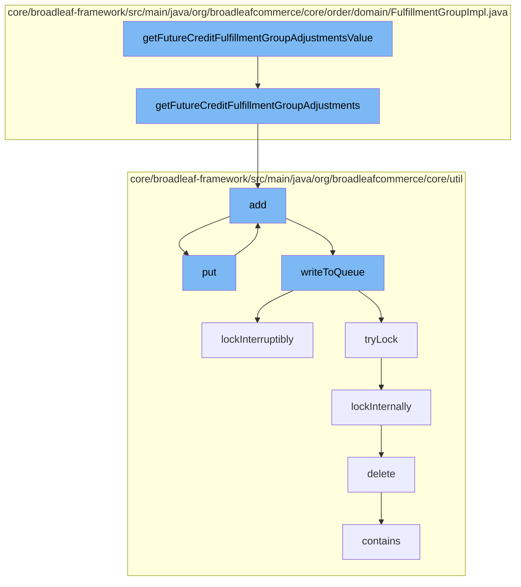

This document will cover the process of calculating future credit adjustments for a fulfillment group in the Broadleaf Commerce framework. The process includes the following steps:

1. Retrieving future credit adjustments for a fulfillment group
2. Adding the adjustments to a cache
3. Writing the adjustments to a distributed queue
4. Locking the queue for exclusive access
5. Deleting the adjustment from the database.



<SwmSnippet path="/core/broadleaf-framework/src/main/java/org/broadleafcommerce/core/order/domain/FulfillmentGroupImpl.java" line="502">

---

# Retrieving future credit adjustments for a fulfillment group

The `getFutureCreditFulfillmentGroupAdjustments` method retrieves all future credit adjustments for a fulfillment group. It does this by iterating over all adjustments associated with the fulfillment group and adding those marked as future credits to a new list, which is then returned.

```java
    @Override
    public List<FulfillmentGroupAdjustment> getFutureCreditFulfillmentGroupAdjustments() {
        List<FulfillmentGroupAdjustment> futureCreditAdjustments = new ArrayList<>();
        for (FulfillmentGroupAdjustment adjustment : fulfillmentGroupAdjustments) {
            if (adjustment.isFutureCredit()) {
                futureCreditAdjustments.add(adjustment);
            }
            
        }
        return futureCreditAdjustments;
    }
```

---

</SwmSnippet>

<SwmSnippet path="/core/broadleaf-framework/src/main/java/org/broadleafcommerce/core/util/service/ResourcePurgeServiceImpl.java" line="593">

---

# Adding the adjustments to a cache

The `add` method is used to add an entry to a cache. If the entry does not already exist in the cache, it is added with the current timestamp.

```java
        public Long add(Long entry) {
            if (! cache.containsKey(entry)) {
                return cache.put(entry, new Long(System.currentTimeMillis()));
            }
            return null;
        }
```

---

</SwmSnippet>

<SwmSnippet path="/core/broadleaf-framework/src/main/java/org/broadleafcommerce/core/util/queue/ZookeeperDistributedQueue.java" line="393">

---

# Writing the adjustments to a distributed queue

The `put` method is used to add an element to a distributed queue. It does this by calling the `writeToQueue` method.

```java
    @Override
    public void put(T e) throws InterruptedException {
        final ArrayList<T> elementsToAdd = new ArrayList<>();
        elementsToAdd.add(e);
        writeToQueue(elementsToAdd, -1L);
    }
```

---

</SwmSnippet>

<SwmSnippet path="/core/broadleaf-framework/src/main/java/org/broadleafcommerce/core/util/lock/ReentrantDistributedZookeeperLock.java" line="335">

---

# Locking the queue for exclusive access

The `lockInterruptibly` method is used to acquire a lock on the queue. If the thread is interrupted before the lock can be acquired, an `InterruptedException` is thrown.

```java
    @Override
    public void lockInterruptibly() throws InterruptedException {
        if (Thread.interrupted()) {
            throw new InterruptedException("Thread was interrupted prior to trying to acquire the lock.");
        }
        
        lockInternally(-1L);
    }
```

---

</SwmSnippet>

<SwmSnippet path="/core/broadleaf-framework/src/main/java/org/broadleafcommerce/core/util/dao/CodeTypeDaoImpl.java" line="51">

---

# Deleting the adjustment from the database

The `delete` method is used to remove a `CodeType` object from the database. If the object is not managed by the entity manager, it is first retrieved from the database before being removed.

```java
    public void delete(CodeType codeType) {
        if (!em.contains(codeType)) {
            codeType = (CodeType) em.find(CodeTypeImpl.class, codeType.getId());
        }
        em.remove(codeType);
    }
```

---

</SwmSnippet>

&nbsp;

*This is an auto-generated document by Swimm AI 🌊 and has not yet been verified by a human*

<SwmMeta version="3.0.0" repo-id="Z2l0aHViJTNBJTNBQnJvYWRsZWFmQ29tbWVyY2UtZGVtbyUzQSUzQWdpbGFkbmF2b3Q=" repo-name="BroadleafCommerce-demo" doc-type="flows"><sup>Powered by [Swimm](/)</sup></SwmMeta>
