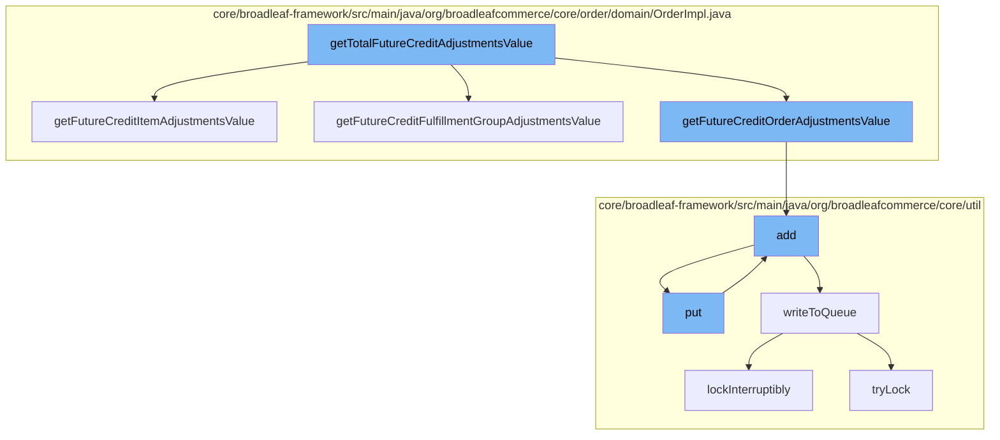

This document will cover the process of calculating and storing future credit adjustments in the Broadleaf Commerce framework. The process includes the following steps:

1. Calculating the total future credit adjustments value
2. Calculating the future credit adjustments value for order items, fulfillment groups, and orders
3. Adding the calculated values to a cache
4. Writing the cache to a distributed queue.



<SwmSnippet path="/core/broadleaf-framework/src/main/java/org/broadleafcommerce/core/order/domain/OrderImpl.java" line="631">

---

# Calculating the total future credit adjustments value

The `getTotalFutureCreditAdjustmentsValue` function is the entry point for this process. It calculates the total future credit adjustments value by summing up the future credit adjustments value for order items, fulfillment groups, and orders.

```java
    @Override
    public Money getFutureCreditItemAdjustmentsValue() {
        Money itemAdjustmentsValue = BroadleafCurrencyUtils.getMoney(BigDecimal.ZERO, getCurrency());
        for (OrderItem orderItem : orderItems) {
            itemAdjustmentsValue = itemAdjustmentsValue.add(orderItem.getFutureCreditTotalAdjustmentValue());
        }
        return itemAdjustmentsValue;
    }
```

---

</SwmSnippet>

<SwmSnippet path="/core/broadleaf-framework/src/main/java/org/broadleafcommerce/core/util/service/ResourcePurgeServiceImpl.java" line="593">

---

# Adding the calculated values to a cache

The `add` function is used to add the calculated future credit adjustments value to a cache. If the value is not already in the cache, it is added along with the current timestamp.

```java
        public Long add(Long entry) {
            if (! cache.containsKey(entry)) {
                return cache.put(entry, new Long(System.currentTimeMillis()));
            }
            return null;
        }
```

---

</SwmSnippet>

<SwmSnippet path="/core/broadleaf-framework/src/main/java/org/broadleafcommerce/core/util/queue/ZookeeperDistributedQueue.java" line="503">

---

# Writing the cache to a distributed queue

The `writeToQueue` function is used to write the cache to a distributed queue. It uses a distributed lock to ensure that the operation is thread-safe.

```java
    protected int writeToQueue(List<? extends T> entries, final long timeout) throws InterruptedException {
        if (entries == null || entries.isEmpty()) {
            return 0;
        }
        
        int entryCount = 0;
        long waitTime = timeout;
        synchronized (QUEUE_MONITOR) {
            while (true) {
                boolean locked = false;
                DistributedLock lock = getQueueAccessLock();
                if (timeout < 0L) {
                    lock.lockInterruptibly();
                    locked = true;
                } else if (timeout > 0L && waitTime > 0L) {
                    long start = System.currentTimeMillis();
                    locked = lock.tryLock(waitTime, TimeUnit.MILLISECONDS);
                    long end = System.currentTimeMillis();
                    waitTime -= (end - start);
                } else {
                    locked = lock.tryLock();
```

---

</SwmSnippet>

&nbsp;

*This is an auto-generated document by Swimm AI 🌊 and has not yet been verified by a human*

<SwmMeta version="3.0.0" repo-id="Z2l0aHViJTNBJTNBQnJvYWRsZWFmQ29tbWVyY2UtZGVtbyUzQSUzQWdpbGFkbmF2b3Q=" repo-name="BroadleafCommerce-demo" doc-type="flows"><sup>Powered by [Swimm](/)</sup></SwmMeta>
