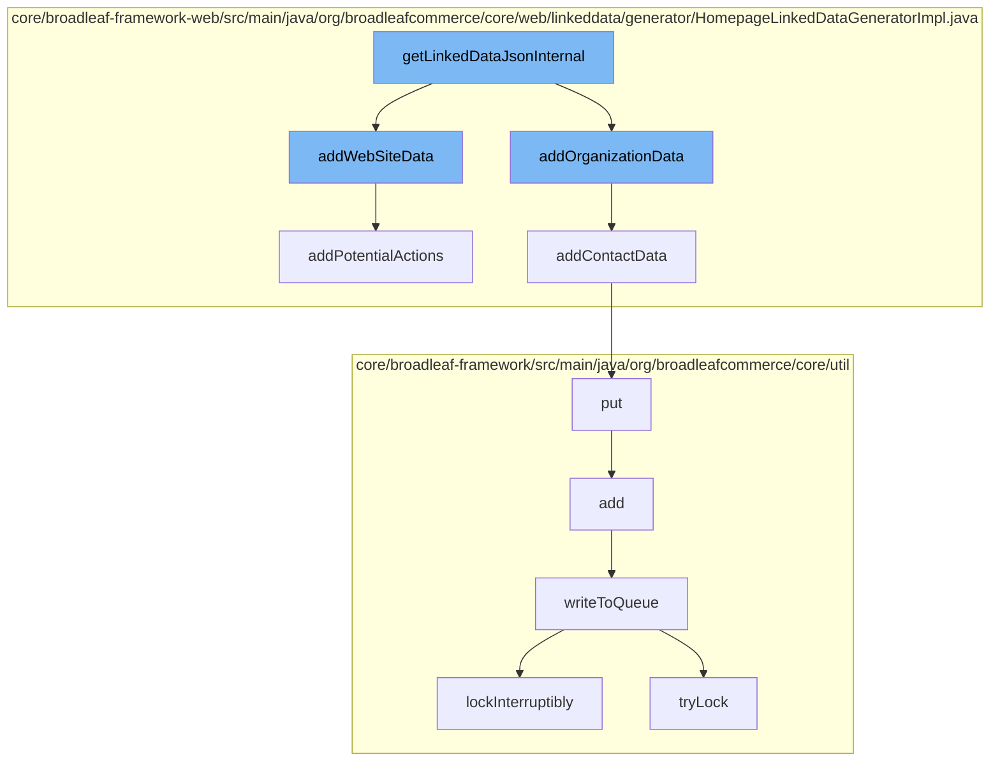

This document will cover the process of generating and storing linked data for the homepage of the Broadleaf Commerce application. The process includes the following steps:

1. Generation of website data
2. Generation of organization data
3. Adding contact data
4. Storing the data in a distributed queue



<SwmSnippet path="/core/broadleaf-framework-web/src/main/java/org/broadleafcommerce/core/web/linkeddata/generator/HomepageLinkedDataGeneratorImpl.java" line="106">

---

# Generation of website data

The `addWebSiteData` function generates a JSON object representing the website data. It includes the site name, base URL, and potential actions that can be performed on the website.

```java
    /**
     * Generates an object representing the Schema.org WebSite
     *
     * @return JSON representation of WebSite from Schema.org
     */
    protected JSONObject addWebSiteData(final HttpServletRequest request) throws JSONException {
        JSONObject webSite = new JSONObject();
        webSite.put("@context", DEFAULT_STRUCTURED_CONTENT_CONTEXT);
        webSite.put("@type", "WebSite");
        webSite.put("name", getSiteName());
        webSite.put("url", getSiteBaseUrl());
        webSite.put("potentialAction", addPotentialActions(request));

        extensionManager.getProxy().addWebSiteData(request, webSite);

        return webSite;
    }
```

---

</SwmSnippet>

<SwmSnippet path="/core/broadleaf-framework-web/src/main/java/org/broadleafcommerce/core/web/linkeddata/generator/HomepageLinkedDataGeneratorImpl.java" line="91">

---

# Generation of organization data

The `addContactData` function is called within the `addOrganizationData` function to generate contact data for the organization. This includes the customer service telephone number and contact type.

```java
    protected JSONArray addContactData(final HttpServletRequest request) throws JSONException {
        final JSONArray contactList = new JSONArray();
        final JSONObject contact = new JSONObject();
        
        contact.put("@type", "ContactPoint");
        contact.put("telephone", getSiteCustomerServiceNumber());
        contact.put("contactType", "customerService");

        extensionManager.getProxy().addContactData(request, contact);
        
        contactList.put(contact);
        
        return contactList;
    }
```

---

</SwmSnippet>

<SwmSnippet path="/core/broadleaf-framework/src/main/java/org/broadleafcommerce/core/util/queue/ZookeeperDistributedQueue.java" line="393">

---

# Storing the data in a distributed queue

The `put` function is used to store the generated data in a distributed queue. It calls the `writeToQueue` function to write the data to the queue.

```java
    @Override
    public void put(T e) throws InterruptedException {
        final ArrayList<T> elementsToAdd = new ArrayList<>();
        elementsToAdd.add(e);
        writeToQueue(elementsToAdd, -1L);
    }
```

---

</SwmSnippet>

&nbsp;

*This is an auto-generated document by Swimm AI 🌊 and has not yet been verified by a human*

<SwmMeta version="3.0.0" repo-id="Z2l0aHViJTNBJTNBQnJvYWRsZWFmQ29tbWVyY2UtZGVtbyUzQSUzQWdpbGFkbmF2b3Q=" repo-name="BroadleafCommerce-demo" doc-type="flows"><sup>Powered by [Swimm](/)</sup></SwmMeta>
