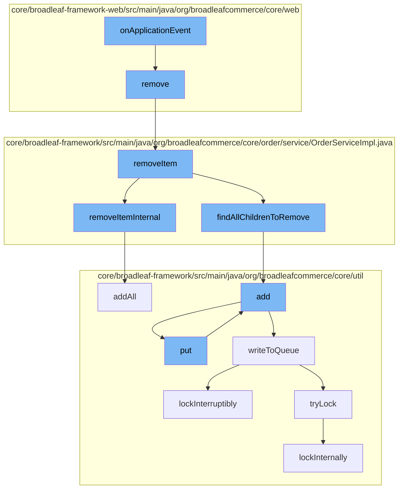

This document will cover the process of handling an application event in the Broadleaf Commerce framework, specifically focusing on the removal of an item from the cart. The process includes the following steps:

1. Triggering the `onApplicationEvent` function
2. Removing the item from the cart
3. Updating the order service
4. Adding the removed item to the resource purge service
5. Writing the updated state to the distributed queue.



<SwmSnippet path="/core/broadleaf-framework-web/src/main/java/org/broadleafcommerce/core/web/order/SessionOrderLockManager.java" line="1">

---

# Triggering the `onApplicationEvent` function

The `onApplicationEvent` function is the entry point for this process. It is triggered when an application event occurs, such as a user action to remove an item from the cart.

```java
/*-
 * #%L
 * BroadleafCommerce Framework Web
 * %%
 * Copyright (C) 2009 - 2024 Broadleaf Commerce
 * %%
 * Licensed under the Broadleaf Fair Use License Agreement, Version 1.0
 * (the "Fair Use License" located  at http://license.broadleafcommerce.org/fair_use_license-1.0.txt)
 * unless the restrictions on use therein are violated and require payment to Broadleaf in which case
 * the Broadleaf End User License Agreement (EULA), Version 1.1
```

---

</SwmSnippet>

<SwmSnippet path="/core/broadleaf-framework-web/src/main/java/org/broadleafcommerce/core/web/controller/cart/BroadleafCartController.java" line="318">

---

# Removing the item from the cart

The `remove` function in the `BroadleafCartController` class is called by `onApplicationEvent`. This function handles the removal of the item from the cart.

```java
    /**
     * Takes in an item request, updates the quantity of that item in the cart, and returns
     * 
     * If the method was invoked via an AJAX call, it will render the "ajax/cart" template.
     * Otherwise, it will perform a 302 redirect to "/cart"
     * 
     * @param request
     * @param response
     * @param model
     * @param itemRequest
     * @throws IOException
     * @throws PricingException
     * @throws RemoveFromCartException 
     */
    public String remove(HttpServletRequest request, HttpServletResponse response, Model model,
            OrderItemRequestDTO itemRequest) throws IOException, PricingException, RemoveFromCartException {
        Order cart = CartState.getCart();
        
        cart = orderService.removeItem(cart.getId(), itemRequest.getOrderItemId(), false);
        cart = orderService.save(cart, true);
        
```

---

</SwmSnippet>

<SwmSnippet path="/core/broadleaf-framework/src/main/java/org/broadleafcommerce/core/order/service/OrderServiceImpl.java" line="814">

---

# Updating the order service

The `removeItem` function in the `OrderServiceImpl` class is called by `remove`. This function updates the order service to reflect the removal of the item from the cart.

```java
    @Override
    @Transactional(value = "blTransactionManager", rollbackFor = {RemoveFromCartException.class})
    public Order removeItem(Long orderId, Long orderItemId, boolean priceOrder) throws RemoveFromCartException {
        preValidateCartOperation(findOrderById(orderId));
        try {
            OrderItem oi = orderItemService.readOrderItemById(orderItemId);
            if (oi == null) {
                throw new WorkflowException(new ItemNotFoundException());
            }
            List<Long> childrenToRemove = new ArrayList<Long>();
            if (oi instanceof BundleOrderItem) {
                List<DiscreteOrderItem> bundledItems = ((BundleOrderItem) oi).getDiscreteOrderItems();
                for (DiscreteOrderItem doi : bundledItems) {
                    findAllChildrenToRemove(childrenToRemove, doi);
                }
            } else {
                findAllChildrenToRemove(childrenToRemove, oi);
            }
            for (Long childToRemove : childrenToRemove) {
                removeItemInternal(orderId, childToRemove, false);
            }                    
```

---

</SwmSnippet>

<SwmSnippet path="/core/broadleaf-framework/src/main/java/org/broadleafcommerce/core/util/service/ResourcePurgeServiceImpl.java" line="593">

---

# Adding the removed item to the resource purge service

The `add` function in the `ResourcePurgeServiceImpl` class is called by `removeItem`. This function adds the removed item to the resource purge service, which handles the cleanup of resources associated with the removed item.

```java
        public Long add(Long entry) {
            if (! cache.containsKey(entry)) {
                return cache.put(entry, new Long(System.currentTimeMillis()));
            }
            return null;
        }
```

---

</SwmSnippet>

<SwmSnippet path="/core/broadleaf-framework/src/main/java/org/broadleafcommerce/core/util/queue/ZookeeperDistributedQueue.java" line="393">

---

# Writing the updated state to the distributed queue

The `put` function in the `ZookeeperDistributedQueue` class is called by `add`. This function writes the updated state to the distributed queue, ensuring that the state of the application is consistent across all nodes.

```java
    @Override
    public void put(T e) throws InterruptedException {
        final ArrayList<T> elementsToAdd = new ArrayList<>();
        elementsToAdd.add(e);
        writeToQueue(elementsToAdd, -1L);
    }
```

---

</SwmSnippet>

&nbsp;

*This is an auto-generated document by Swimm AI 🌊 and has not yet been verified by a human*

<SwmMeta version="3.0.0" repo-id="Z2l0aHViJTNBJTNBQnJvYWRsZWFmQ29tbWVyY2UtZGVtbyUzQSUzQWdpbGFkbmF2b3Q=" repo-name="BroadleafCommerce-demo" doc-type="flows"><sup>Powered by [Swimm](/)</sup></SwmMeta>
