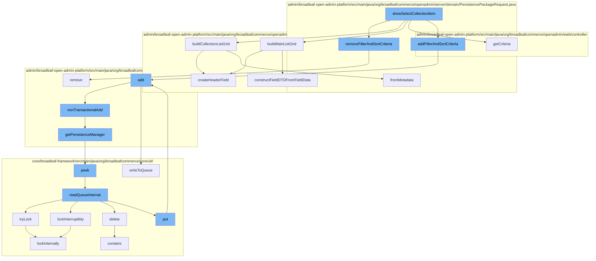

This document will cover the process of handling collection items in the Broadleaf Commerce framework, specifically focusing on the `showSelectCollectionItem` function. The topics covered include:

1. Removing filter and sort criteria
2. Building the main and collection list grids
3. Adding filter and sort criteria
4. Adding items to the queue
5. Locking mechanisms



<SwmSnippet path="/admin/broadleaf-open-admin-platform/src/main/java/org/broadleafcommerce/openadmin/server/domain/PersistencePackageRequest.java" line="384">

---

# Removing filter and sort criteria

The `removeFilterAndSortCriteria` function is used to remove specific filter and sort criteria from the persistence package request. This is done by iterating over the list of criteria and removing the one that matches the provided name.

```java
    public PersistencePackageRequest removeFilterAndSortCriteria(String name) {
        Iterator<FilterAndSortCriteria> it = filterAndSortCriteria.listIterator();
        while (it.hasNext()) {
            FilterAndSortCriteria fasc = it.next();
            if (fasc.getPropertyId().equals(name)) {
                it.remove();
            }
        }
        return this;
    }
```

---

</SwmSnippet>

<SwmSnippet path="/admin/broadleaf-open-admin-platform/src/main/java/org/broadleafcommerce/openadmin/web/service/FormBuilderServiceImpl.java" line="365">

---

# Building the main and collection list grids

The `createHeaderField` function is used in both `buildMainListGrid` and `buildCollectionListGrid` functions to create a header field for the list grid. This includes setting the name, friendly name, order, column width, foreign key display value property, foreign key class, foreign key section path, owning entity class, can link to external entity, and field type.

```java
    protected Field createHeaderField(Property p, BasicFieldMetadata fmd) {
        Field headerField = this.initHeaderField(fmd);

        headerField
                .withName(p.getName())
                .withFriendlyName(StringUtils.isNotEmpty(fmd.getFriendlyName()) ? fmd.getFriendlyName() : p.getName())
                .withOrder(fmd.getGridOrder())
                .withColumnWidth(fmd.getColumnWidth())
                .withForeignKeyDisplayValueProperty(fmd.getForeignKeyDisplayValueProperty())
                .withForeignKeyClass(fmd.getForeignKeyClass())
                .withForeignKeySectionPath(getAdminSectionPath(fmd.getForeignKeyClass()))
                .withOwningEntityClass(fmd.getOwningClass() != null ? fmd.getOwningClass() : fmd.getTargetClass())
                .withCanLinkToExternalEntity(fmd.getCanLinkToExternalEntity())
                .withFieldType(fmd.getFieldType() == null ? null : fmd.getFieldType().toString());

        return headerField;
```

---

</SwmSnippet>

<SwmSnippet path="/admin/broadleaf-open-admin-platform/src/main/java/org/broadleafcommerce/openadmin/server/service/DynamicEntityRemoteService.java" line="199">

---

# Adding filter and sort criteria

The `add` function is used to add a persistence package to the persistence response. This is done within a transactional operation, and if an exception occurs, it is handled and thrown as a `ServiceException`.

```java
    @Override
    public PersistenceResponse add(final PersistencePackage persistencePackage) throws ServiceException {
        final PersistenceResponse[] response = new PersistenceResponse[1];
        try {
            PlatformTransactionManager transactionManager = identifyTransactionManager(persistencePackage);
            transUtil.runTransactionalOperation(new StreamCapableTransactionalOperationAdapter() {
                @Override
                public void execute() throws Throwable {
                    response[0] = nonTransactionalAdd(persistencePackage);
                }

                @Override
                public boolean shouldRetryOnTransactionLockAcquisitionFailure() {
                    return super.shouldRetryOnTransactionLockAcquisitionFailure();
                }
            }, RuntimeException.class, transactionManager);
        } catch (RuntimeException e) {
            if (e.getCause() instanceof ServiceException) {
                throw (ServiceException) e.getCause();
            }
            throw e;
```

---

</SwmSnippet>

<SwmSnippet path="/core/broadleaf-framework/src/main/java/org/broadleafcommerce/core/util/queue/ZookeeperDistributedQueue.java" line="359">

---

# Adding items to the queue

The `add` function is used to add an item to the queue. If the queue is full, an `IllegalStateException` is thrown. If the operation is interrupted, the thread's interrupt status is set and the function returns false.

```java
    @Override
    public boolean add(T e) {
        try {
            final ArrayList<T> lst = new ArrayList<>();
            lst.add(e);
            int count = writeToQueue(lst, 0L);
            if (count != 1) {
                throw new IllegalStateException("The Zookeeper queue was full.");
            } else {
                return true;
            }
        } catch (InterruptedException ex) {
            Thread.currentThread().interrupt();
            return false;
        }
    }
```

---

</SwmSnippet>

<SwmSnippet path="/core/broadleaf-framework/src/main/java/org/broadleafcommerce/core/util/lock/ReentrantDistributedZookeeperLock.java" line="344">

---

# Locking mechanisms

The `tryLock` function is used to acquire the lock if it is available. If the operation is interrupted, the thread's interrupt status is set and the function returns false.

```java
    @Override
    public boolean tryLock() {
        try {
            return lockInternally(0L);
        } catch (InterruptedException e) {
            Thread.currentThread().interrupt();
            return false;
        }
    }
```

---

</SwmSnippet>

&nbsp;

*This is an auto-generated document by Swimm AI 🌊 and has not yet been verified by a human*

<SwmMeta version="3.0.0" repo-id="Z2l0aHViJTNBJTNBQnJvYWRsZWFmQ29tbWVyY2UtZGVtbyUzQSUzQWdpbGFkbmF2b3Q=" repo-name="BroadleafCommerce-demo" doc-type="flows"><sup>Powered by [Swimm](/)</sup></SwmMeta>
