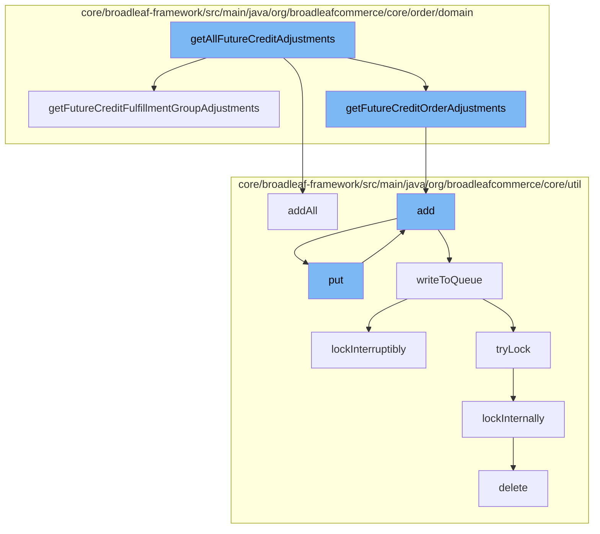

This document will cover the process of handling future credit adjustments in the BroadleafCommerce-demo project. The process includes the following steps:

1. Retrieving all future credit adjustments
2. Adding future credit adjustments to the cache
3. Adding future credit adjustments to the queue
4. Writing future credit adjustments to the queue
5. Locking the queue for exclusive access
6. Deleting the lock after the operation is complete.



<SwmSnippet path="/core/broadleaf-framework/src/main/java/org/broadleafcommerce/core/order/domain/OrderImpl.java" line="502">

---

# Retrieving all future credit adjustments

The function `getAllFutureCreditAdjustments` is used to retrieve all future credit adjustments. It does this by calling `getFutureCreditFulfillmentGroupAdjustments` and `getFutureCreditOrderAdjustments` which filter out the adjustments that are marked as future credits.

```java

    @Override
    public List<OrderAdjustment> getFutureCreditOrderAdjustments() {
        List<OrderAdjustment> futureCreditAdjustments = new ArrayList<>();
        for (OrderAdjustment adjustment : orderAdjustments) {
            if (adjustment.isFutureCredit()) {
                futureCreditAdjustments.add(adjustment);
            }
        }
        return futureCreditAdjustments;
    }
```

---

</SwmSnippet>

<SwmSnippet path="/core/broadleaf-framework/src/main/java/org/broadleafcommerce/core/util/service/ResourcePurgeServiceImpl.java" line="593">

---

# Adding future credit adjustments to the cache

The function `add` is used to add the future credit adjustments to the cache. If the adjustment is not already in the cache, it is added with the current timestamp.

```java
        public Long add(Long entry) {
            if (! cache.containsKey(entry)) {
                return cache.put(entry, new Long(System.currentTimeMillis()));
            }
            return null;
        }
```

---

</SwmSnippet>

<SwmSnippet path="/core/broadleaf-framework/src/main/java/org/broadleafcommerce/core/util/queue/ZookeeperDistributedQueue.java" line="359">

---

# Adding future credit adjustments to the queue

The function `add` is used to add the future credit adjustments to the queue. If the queue is full, an exception is thrown.

```java
    @Override
    public boolean add(T e) {
        try {
            final ArrayList<T> lst = new ArrayList<>();
            lst.add(e);
            int count = writeToQueue(lst, 0L);
            if (count != 1) {
                throw new IllegalStateException("The Zookeeper queue was full.");
            } else {
                return true;
            }
        } catch (InterruptedException ex) {
            Thread.currentThread().interrupt();
            return false;
        }
    }
```

---

</SwmSnippet>

<SwmSnippet path="/core/broadleaf-framework/src/main/java/org/broadleafcommerce/core/util/queue/ZookeeperDistributedQueue.java" line="503">

---

# Writing future credit adjustments to the queue

The function `writeToQueue` is used to write the future credit adjustments to the queue. It does this by serializing the adjustments and writing them to the queue in a thread-safe manner.

```java
    protected int writeToQueue(List<? extends T> entries, final long timeout) throws InterruptedException {
        if (entries == null || entries.isEmpty()) {
            return 0;
        }
        
        int entryCount = 0;
        long waitTime = timeout;
        synchronized (QUEUE_MONITOR) {
            while (true) {
                boolean locked = false;
                DistributedLock lock = getQueueAccessLock();
                if (timeout < 0L) {
                    lock.lockInterruptibly();
                    locked = true;
                } else if (timeout > 0L && waitTime > 0L) {
                    long start = System.currentTimeMillis();
                    locked = lock.tryLock(waitTime, TimeUnit.MILLISECONDS);
                    long end = System.currentTimeMillis();
                    waitTime -= (end - start);
                } else {
                    locked = lock.tryLock();
```

---

</SwmSnippet>

<SwmSnippet path="/core/broadleaf-framework/src/main/java/org/broadleafcommerce/core/util/lock/ReentrantDistributedZookeeperLock.java" line="335">

---

# Locking the queue for exclusive access

The function `lockInterruptibly` is used to lock the queue for exclusive access. This ensures that no other operations can modify the queue while the adjustments are being written.

```java
    @Override
    public void lockInterruptibly() throws InterruptedException {
        if (Thread.interrupted()) {
            throw new InterruptedException("Thread was interrupted prior to trying to acquire the lock.");
        }
        
        lockInternally(-1L);
    }
```

---

</SwmSnippet>

<SwmSnippet path="/core/broadleaf-framework/src/main/java/org/broadleafcommerce/core/util/dao/CodeTypeDaoImpl.java" line="51">

---

# Deleting the lock after the operation is complete

The function `delete` is used to delete the lock after the operation is complete. This allows other operations to access the queue.

```java
    public void delete(CodeType codeType) {
        if (!em.contains(codeType)) {
            codeType = (CodeType) em.find(CodeTypeImpl.class, codeType.getId());
        }
        em.remove(codeType);
    }
```

---

</SwmSnippet>

&nbsp;

*This is an auto-generated document by Swimm AI 🌊 and has not yet been verified by a human*

<SwmMeta version="3.0.0" repo-id="Z2l0aHViJTNBJTNBQnJvYWRsZWFmQ29tbWVyY2UtZGVtbyUzQSUzQWdpbGFkbmF2b3Q=" repo-name="BroadleafCommerce-demo" doc-type="flows"><sup>Powered by [Swimm](/)</sup></SwmMeta>
