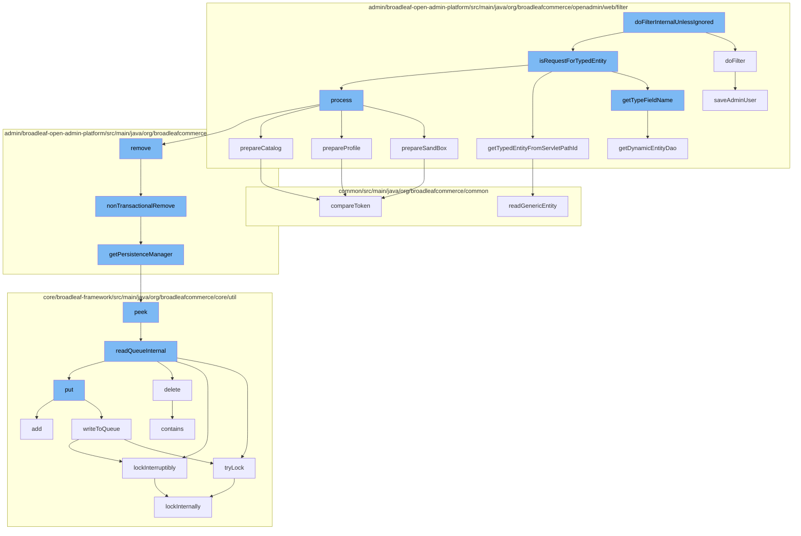

This document will cover the process of handling typed entity requests in the Broadleaf Commerce framework, specifically focusing on the function `doFilterInternalUnlessIgnored` in the `BroadleafAdminTypedEntityRequestFilter` class. The process involves the following steps:

 1. Filtering the request
 2. Checking if the request is for a typed entity
 3. Processing the request
 4. Preparing the sandbox, profile, and catalog
 5. Removing the entity from the dynamic entity remote service
 6. Managing persistence
 7. Handling distributed queue operations
 8. Locking operations
 9. Comparing security tokens
10. Reading generic entities
11. Saving admin user data.



<SwmSnippet path="/admin/broadleaf-open-admin-platform/src/main/java/org/broadleafcommerce/openadmin/web/filter/AdminExternalLoginStateFilter.java" line="72">

---

# Filtering the request

The `doFilter` method in `AdminExternalLoginStateFilter` class is responsible for filtering incoming requests. It checks if the user is authenticated and if so, it retrieves the user details and saves the admin user.

```java
    @Override
    public void doFilter(ServletRequest servletRequest, ServletResponse servletResponse, FilterChain filterChain) throws IOException, ServletException {

        HttpServletRequest request = (HttpServletRequest)servletRequest;
        if (request.getSession(true).getAttribute(BLC_ADMIN_PROVISION_USER_CHECK) == null) {
            Authentication authentication = SecurityContextHolder.getContext().getAuthentication();
            if (authentication != null && authentication.isAuthenticated()) {
                if (authentication.getPrincipal() instanceof UserDetails){
                    UserDetails userDetails = (UserDetails)authentication.getPrincipal();
                    if (userDetails != null && userDetails.getUsername() != null) {
                        AdminUser user = adminSecurityService.readAdminUserByUserName(userDetails.getUsername());
                        if (userDetails instanceof BroadleafExternalAuthenticationUserDetails) {
                            BroadleafExternalAuthenticationUserDetails broadleafUser = (BroadleafExternalAuthenticationUserDetails)userDetails;
                            if (user == null) {
                                //Provision a new user...
                                user = (AdminUser)entityConfiguration.createEntityInstance(AdminUser.class.getName());
                            }
                            saveAdminUser(broadleafUser, user);
                            request.getSession().setAttribute(BLC_ADMIN_PROVISION_USER_CHECK, Boolean.TRUE);
                        }

```

---

</SwmSnippet>

<SwmSnippet path="/admin/broadleaf-open-admin-platform/src/main/java/org/broadleafcommerce/openadmin/web/filter/BroadleafAdminTypedEntityRequestFilter.java" line="251">

---

# Checking if the request is for a typed entity

The `getTypeFieldName` method in `BroadleafAdminTypedEntityRequestFilter` class is used to determine if the request is for a typed entity. It does this by checking the type field name of the entity.

```java
    protected String getTypeFieldName(AdminSection adminSection) {
        try {
            DynamicEntityDao dynamicEntityDao = getDynamicEntityDao(adminSection.getCeilingEntity());
            Class<?> implClass = dynamicEntityDao.getCeilingImplClass(adminSection.getCeilingEntity());
            return ((TypedEntity) implClass.newInstance()).getTypeFieldName();
        } catch (Exception e) {
            return null;
        }
    }
```

---

</SwmSnippet>

<SwmSnippet path="/admin/broadleaf-open-admin-platform/src/main/java/org/broadleafcommerce/openadmin/web/filter/BroadleafAdminRequestProcessor.java" line="336">

---

# Processing the request

The `prepareSandBox` method in `BroadleafAdminRequestProcessor` class is responsible for preparing the sandbox for the request. It retrieves the admin user and sets up the sandbox environment for the user.

```java
    protected void prepareSandBox(WebRequest request, BroadleafRequestContext brc) {
        AdminUser adminUser = adminRemoteSecurityService.getPersistentAdminUser();
        if (adminUser == null) {
            //clear any sandbox
            if (BLCRequestUtils.isOKtoUseSession(request)) {
                request.removeAttribute(BroadleafSandBoxResolver.SANDBOX_ID_VAR, WebRequest.SCOPE_SESSION);
            }
        } else {
            SandBox sandBox = null;
            if (StringUtils.isNotBlank(request.getParameter(SANDBOX_REQ_PARAM))) {
                Long sandBoxId = Long.parseLong(request.getParameter(SANDBOX_REQ_PARAM));
                sandBox = sandBoxService.retrieveUserSandBoxForParent(adminUser.getId(), sandBoxId);
                if (sandBox == null) {
                    SandBox approvalOrUserSandBox = sandBoxService.retrieveSandBoxManagementById(sandBoxId);
                    if (approvalOrUserSandBox != null) {
                        if (approvalOrUserSandBox.getSandBoxType().equals(SandBoxType.USER)) {
                            sandBox = approvalOrUserSandBox;
                        } else {
                            sandBox = sandBoxService.createUserSandBox(adminUser.getId(), approvalOrUserSandBox);
                        }
                    }
```

---

</SwmSnippet>

<SwmSnippet path="/admin/broadleaf-open-admin-platform/src/main/java/org/broadleafcommerce/openadmin/server/service/DynamicEntityRemoteService.java" line="329">

---

# Removing the entity from the dynamic entity remote service

The `nonTransactionalRemove` method in `DynamicEntityRemoteService` class is responsible for removing the entity from the dynamic entity remote service. It does this by calling the `remove` method of the persistence manager.

```java
    @Override
    public PersistenceResponse nonTransactionalRemove(final PersistencePackage persistencePackage) throws ServiceException {
        return persistenceThreadManager.operation(TargetModeType.SANDBOX, persistencePackage, new Persistable <PersistenceResponse, ServiceException>() {
            @Override
            public PersistenceResponse execute() throws ServiceException {
                try {
                    PersistenceManager persistenceManager = PersistenceManagerFactory.getPersistenceManager();
                    return persistenceManager.remove(persistencePackage);
                } catch (ServiceException e) {
                    //immediately throw validation exceptions without printing a stack trace
                    if (e instanceof ValidationException) {
                        throw e;
                    } else if (e.getCause() instanceof ValidationException) {
                        throw (ValidationException) e.getCause();
                    }
                    LOG.error("Problem removing " + persistencePackage.getCeilingEntityFullyQualifiedClassname(), e);
                    String message = exploitProtectionService.cleanString(e.getMessage());
                    throw recreateSpecificServiceException(e, message, e.getCause());
                }
            }
        });
```

---

</SwmSnippet>

<SwmSnippet path="/admin/broadleaf-open-admin-platform/src/main/java/org/broadleafcommerce/openadmin/server/service/persistence/PersistenceManagerContext.java" line="49">

---

# Managing persistence

The `getPersistenceManager` method in `PersistenceManagerContext` class is used to manage persistence. It retrieves the persistence manager for the current context.

```java
    public PersistenceManager getPersistenceManager() {
        return !persistenceManager.empty()?persistenceManager.peek():null;
    }
```

---

</SwmSnippet>

<SwmSnippet path="/core/broadleaf-framework/src/main/java/org/broadleafcommerce/core/util/queue/ZookeeperDistributedQueue.java" line="222">

---

# Handling distributed queue operations

The `peek` method in `ZookeeperDistributedQueue` class is used to handle distributed queue operations. It reads the queue internally and retrieves the value of the first element without removing it.

```java
    @Override
    public T peek() {
        try {
            Map<String, T> elements = readQueueInternal(1, false, 0L);
            Iterator<Map.Entry<String, T>> entries = elements.entrySet().iterator();
            if (entries.hasNext()) {
                return entries.next().getValue();
            }
            
            return null;
        } catch (InterruptedException e) {
            Thread.currentThread().interrupt();
            return null;
        }
    }
```

---

</SwmSnippet>

<SwmSnippet path="/core/broadleaf-framework/src/main/java/org/broadleafcommerce/core/util/lock/ReentrantDistributedZookeeperLock.java" line="344">

---

# Locking operations

The `tryLock` method in `ReentrantDistributedZookeeperLock` class is used for locking operations. It attempts to acquire the lock without waiting.

```java
    @Override
    public boolean tryLock() {
        try {
            return lockInternally(0L);
        } catch (InterruptedException e) {
            Thread.currentThread().interrupt();
            return false;
        }
    }
```

---

</SwmSnippet>

<SwmSnippet path="/common/src/main/java/org/broadleafcommerce/common/security/service/StaleStateProtectionServiceImpl.java" line="57">

---

# Comparing security tokens

The `compareToken` method in `StaleStateProtectionServiceImpl` class is used to compare security tokens. It checks if the passed token matches the state version token.

```java
    @Override
    public void compareToken(String passedToken) {
        if (staleStateProtectionEnabled) {
            HttpServletRequest request = ((ServletRequestAttributes) RequestContextHolder.getRequestAttributes()).getRequest();
            if (!getStateVersionToken().equals(passedToken) && request.getAttribute(getStateVersionTokenParameter()) == null) {
                throw new StaleStateServiceException("Page version token mismatch (" + passedToken + "). The request likely came from a stale page.");
            } else {
                request.setAttribute(getStateVersionTokenParameter(), "passed");
                if (LOG.isDebugEnabled()) {
                    LOG.debug("Validated page version token");
                }
            }
        }
    }
```

---

</SwmSnippet>

<SwmSnippet path="/common/src/main/java/org/broadleafcommerce/common/service/GenericEntityServiceImpl.java" line="39">

---

# Reading generic entities

The `readGenericEntity` method in `GenericEntityServiceImpl` class is used to read generic entities. It retrieves the implementation class for the given class name and reads the generic entity.

```java
    @Override
    public Object readGenericEntity(String className, Object id) {
        Class<?> clazz = genericEntityDao.getImplClass(className);
        return genericEntityDao.readGenericEntity(clazz, id);
    }
```

---

</SwmSnippet>

<SwmSnippet path="/admin/broadleaf-open-admin-platform/src/main/java/org/broadleafcommerce/openadmin/web/filter/AdminExternalLoginStateFilter.java" line="101">

---

# Saving admin user data

The `saveAdminUser` method in `AdminExternalLoginStateFilter` class is responsible for saving admin user data. It sets the login, password, name, and email of the user and saves the user data and all of the roles.

```java
    protected void saveAdminUser(BroadleafExternalAuthenticationUserDetails broadleafUser, AdminUser user) {
        //Name, login, password, email are required.
        user.setLogin(broadleafUser.getUsername());
        user.setUnencodedPassword(broadleafUser.getPassword());

        if (user.getUnencodedPassword() == null) {
            //If Spring is configured to erase credentials, then this will always be null
            //Set the username as a default password here.
            user.setUnencodedPassword(user.getLogin());
        }

        StringBuffer name = new StringBuffer();
        if (broadleafUser.getFirstName() != null && broadleafUser.getFirstName().trim().length() > 0) {
            name.append(broadleafUser.getFirstName().trim());
            name.append(" ");
        }

        if (broadleafUser.getLastName() != null && broadleafUser.getLastName().trim().length() > 0) {
            name.append(broadleafUser.getLastName().trim());
        }

```

---

</SwmSnippet>

&nbsp;

*This is an auto-generated document by Swimm AI 🌊 and has not yet been verified by a human*

<SwmMeta version="3.0.0" repo-id="Z2l0aHViJTNBJTNBQnJvYWRsZWFmQ29tbWVyY2UtZGVtbyUzQSUzQWdpbGFkbmF2b3Q=" repo-name="BroadleafCommerce-demo" doc-type="flows"><sup>Powered by [Swimm](/)</sup></SwmMeta>
