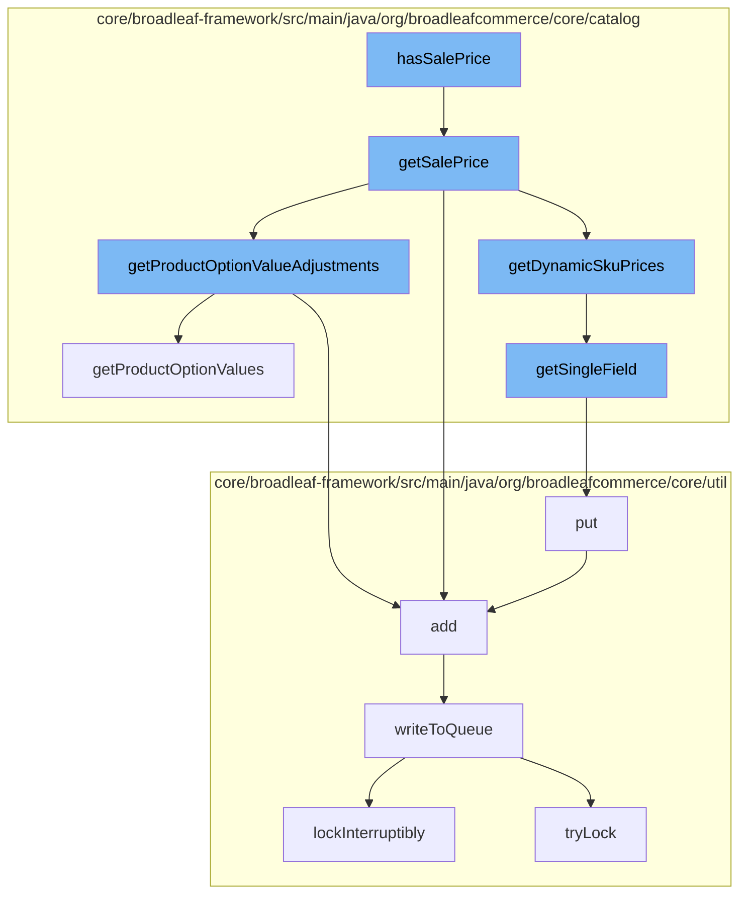

This document will cover the process of determining and handling sale prices in the BroadleafCommerce-demo project. We'll cover:

1. Checking if a SKU has a sale price
2. Retrieving the sale price
3. Adjusting the sale price based on product options
4. Handling dynamic pricing
5. Writing to the distributed queue.



<SwmSnippet path="/core/broadleaf-framework/src/main/java/org/broadleafcommerce/core/catalog/domain/SkuImpl.java" line="493">

---

# Checking if a SKU has a sale price

The `hasSalePrice` function initiates the process. It checks if a SKU has a sale price by calling the `getSalePrice` function.

```java
    @Override
    public Money getSalePrice() {
        Money returnPrice = null;
        Money optionValueAdjustments = null;

        if (SkuPricingConsiderationContext.hasDynamicPricing()) {
            // We have dynamic pricing, so we will pull the sale price from there
            DynamicSkuPrices dynamicPrices = SkuPricingConsiderationContext.getDynamicSkuPrices(this);
            returnPrice = dynamicPrices.getSalePrice();
            optionValueAdjustments = dynamicPrices.getPriceAdjustment();
            if (SkuPricingConsiderationContext.isPricingConsiderationActive()) {
                return returnPrice;
            }
        } else if (salePrice != null) {
            // We have an explicitly set sale price directly on this entity. We will not apply any adjustments
            returnPrice = new Money(salePrice, getCurrency());
        }

        if (returnPrice == null && hasDefaultSku()) {
            returnPrice = lookupDefaultSku().getSalePrice();
            optionValueAdjustments = getProductOptionValueAdjustments();
```

---

</SwmSnippet>

<SwmSnippet path="/core/broadleaf-framework/src/main/java/org/broadleafcommerce/core/catalog/domain/SkuImpl.java" line="493">

---

# Retrieving the sale price

The `getSalePrice` function retrieves the sale price of a SKU. If dynamic pricing is enabled, it retrieves the dynamic sale price and any price adjustments. If not, it retrieves the explicitly set sale price on the SKU entity.

```java
    @Override
    public Money getSalePrice() {
        Money returnPrice = null;
        Money optionValueAdjustments = null;

        if (SkuPricingConsiderationContext.hasDynamicPricing()) {
            // We have dynamic pricing, so we will pull the sale price from there
            DynamicSkuPrices dynamicPrices = SkuPricingConsiderationContext.getDynamicSkuPrices(this);
            returnPrice = dynamicPrices.getSalePrice();
            optionValueAdjustments = dynamicPrices.getPriceAdjustment();
            if (SkuPricingConsiderationContext.isPricingConsiderationActive()) {
                return returnPrice;
            }
        } else if (salePrice != null) {
            // We have an explicitly set sale price directly on this entity. We will not apply any adjustments
            returnPrice = new Money(salePrice, getCurrency());
        }

        if (returnPrice == null && hasDefaultSku()) {
            returnPrice = lookupDefaultSku().getSalePrice();
            optionValueAdjustments = getProductOptionValueAdjustments();
```

---

</SwmSnippet>

<SwmSnippet path="/core/broadleaf-framework/src/main/java/org/broadleafcommerce/core/catalog/domain/SkuImpl.java" line="476">

---

# Adjusting the sale price based on product options

The `getProductOptionValueAdjustments` function is called to retrieve any price adjustments based on the product options of the SKU. These adjustments are then added to the sale price.

```java
    @Override
    public Money getProductOptionValueAdjustments() {
        Money optionValuePriceAdjustments = null;
        if (getProductOptionValues() != null) {
            for (ProductOptionValue value : getProductOptionValues()) {
                if (value.getPriceAdjustment() != null) {
                    if (optionValuePriceAdjustments == null) {
                        optionValuePriceAdjustments = value.getPriceAdjustment();
                    } else {
                        optionValuePriceAdjustments = optionValuePriceAdjustments.add(value.getPriceAdjustment());
                    }
                }
            }
        }
        return optionValuePriceAdjustments;
    }
```

---

</SwmSnippet>

<SwmSnippet path="/core/broadleaf-framework/src/main/java/org/broadleafcommerce/core/catalog/service/dynamic/SkuPricingConsiderationContext.java" line="131">

---

# Handling dynamic pricing

If dynamic pricing is enabled, the `getDynamicSkuPrices` function is called. This function retrieves the dynamic sale price and any price adjustments. It uses the `getSingleField` function to retrieve specific fields from the dynamic pricing context.

```java
    protected static synchronized Field getSingleField(Class<?> clazz, String fieldName) throws IllegalStateException {
        String cacheKey = clazz.getName() + fieldName;
        if (FIELD_CACHE.containsKey(cacheKey)) {
            return FIELD_CACHE.get(cacheKey);
        }

        Field field = ReflectionUtils.findField(clazz, fieldName);
        if (field != null) {
            field.setAccessible(true);
        }

        FIELD_CACHE.put(cacheKey, field);

        return field;
    }
```

---

</SwmSnippet>

<SwmSnippet path="/core/broadleaf-framework/src/main/java/org/broadleafcommerce/core/util/queue/ZookeeperDistributedQueue.java" line="393">

---

# Writing to the distributed queue

The `put` function is called to write the sale price information to a distributed queue. This ensures that the sale price information is available across all instances of the application.

```java
    @Override
    public void put(T e) throws InterruptedException {
        final ArrayList<T> elementsToAdd = new ArrayList<>();
        elementsToAdd.add(e);
        writeToQueue(elementsToAdd, -1L);
    }
```

---

</SwmSnippet>

&nbsp;

*This is an auto-generated document by Swimm AI 🌊 and has not yet been verified by a human*

<SwmMeta version="3.0.0" repo-id="Z2l0aHViJTNBJTNBQnJvYWRsZWFmQ29tbWVyY2UtZGVtbyUzQSUzQWdpbGFkbmF2b3Q=" repo-name="BroadleafCommerce-demo" doc-type="flows"><sup>Powered by [Swimm](/)</sup></SwmMeta>
