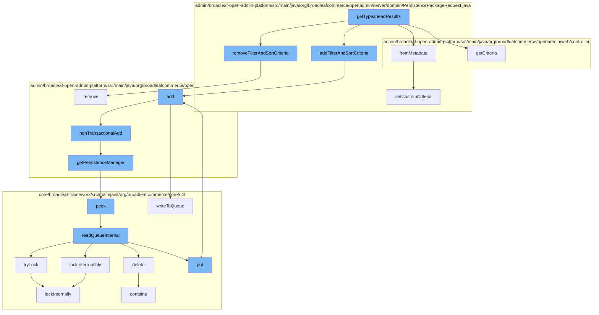

This document will cover the process of handling typeahead results in the BroadleafCommerce-demo project. The process includes the following steps:

 1. Removing filter and sort criteria
 2. Getting criteria
 3. Creating a PersistencePackageRequest from metadata
 4. Adding filter and sort criteria
 5. Adding the PersistencePackageRequest to the DynamicEntityRemoteService
 6. Non-transactional addition of the PersistencePackageRequest
 7. Getting the PersistenceManager
 8. Peeking at the ZookeeperDistributedQueue
 9. Reading the queue internally
10. Locking the queue internally
11. Adding to the queue
12. Writing to the queue



<SwmSnippet path="/admin/broadleaf-open-admin-platform/src/main/java/org/broadleafcommerce/openadmin/server/domain/PersistencePackageRequest.java" line="384">

---

# Removing filter and sort criteria

The `removeFilterAndSortCriteria` function is used to remove a specific filter and sort criteria from the PersistencePackageRequest. It does this by iterating over the list of criteria and removing the one that matches the given name.

```java
    public PersistencePackageRequest removeFilterAndSortCriteria(String name) {
        Iterator<FilterAndSortCriteria> it = filterAndSortCriteria.listIterator();
        while (it.hasNext()) {
            FilterAndSortCriteria fasc = it.next();
            if (fasc.getPropertyId().equals(name)) {
                it.remove();
            }
        }
        return this;
    }
```

---

</SwmSnippet>

<SwmSnippet path="/admin/broadleaf-open-admin-platform/src/main/java/org/broadleafcommerce/openadmin/server/domain/PersistencePackageRequest.java" line="199">

---

# Adding filter and sort criteria

The `add` function is used to add the PersistencePackageRequest to the DynamicEntityRemoteService. It does this by running a transactional operation that calls the `nonTransactionalAdd` function.

```java
        return this;
    }

    public PersistencePackageRequest withSecurityCeilingEntityClassname(String className) {
        setSecurityCeilingEntityClassname(className);
        return this;
    }

    public PersistencePackageRequest withForeignKey(ForeignKey foreignKey) {
        setForeignKey(foreignKey);
        return this;
    }

    public PersistencePackageRequest withConfigKey(String configKey) {
        setConfigKey(configKey);
        return this;
    }

    public PersistencePackageRequest withFilterAndSortCriteria(FilterAndSortCriteria[] filterAndSortCriteria) {
        if (ArrayUtils.isNotEmpty(filterAndSortCriteria)) {
            setFilterAndSortCriteria(filterAndSortCriteria);
```

---

</SwmSnippet>

<SwmSnippet path="/admin/broadleaf-open-admin-platform/src/main/java/org/broadleafcommerce/openadmin/server/service/DynamicEntityRemoteService.java" line="274">

---

# Non-transactional addition of the PersistencePackageRequest

The `nonTransactionalAdd` function is used to add the PersistencePackageRequest to the PersistenceManager. It does this by running an operation on the PersistenceManager.

```java
    @Override
    public PersistenceResponse nonTransactionalAdd(final PersistencePackage persistencePackage) throws ServiceException {
        return persistenceThreadManager.operation(TargetModeType.SANDBOX, persistencePackage, new Persistable <PersistenceResponse, ServiceException>() {
            @Override
            public PersistenceResponse execute() throws ServiceException {
                boolean shouldClean = isShouldClean();
                if (shouldClean && (CollectionUtils.isEmpty(entitiesIgnoreList) ||
                        !entitiesIgnoreList.contains(persistencePackage.getCeilingEntityFullyQualifiedClassname()))) {
                    cleanEntity(persistencePackage.getEntity());
                }
                try {
                    PersistenceManager persistenceManager = PersistenceManagerFactory.getPersistenceManager();
                    return persistenceManager.add(persistencePackage);
                } catch (ServiceException e) {
                    //immediately throw validation exceptions without printing a stack trace
                    if (e instanceof ValidationException) {
                        throw e;
                    } else if (e.getCause() instanceof ValidationException) {
                        throw (ValidationException) e.getCause();
                    }
                    String message = exploitProtectionService.cleanString(e.getMessage());
```

---

</SwmSnippet>

<SwmSnippet path="/admin/broadleaf-open-admin-platform/src/main/java/org/broadleafcommerce/openadmin/server/service/persistence/PersistenceManagerContext.java" line="49">

---

# Getting the PersistenceManager

The `getPersistenceManager` function is used to get the current PersistenceManager. It does this by peeking at the persistenceManager stack.

```java
    public PersistenceManager getPersistenceManager() {
        return !persistenceManager.empty()?persistenceManager.peek():null;
    }
```

---

</SwmSnippet>

<SwmSnippet path="/core/broadleaf-framework/src/main/java/org/broadleafcommerce/core/util/queue/ZookeeperDistributedQueue.java" line="222">

---

# Peeking at the ZookeeperDistributedQueue

The `peek` function is used to look at the first element in the ZookeeperDistributedQueue without removing it. It does this by calling the `readQueueInternal` function with a quantity of 1 and a remove flag of false.

```java
    @Override
    public T peek() {
        try {
            Map<String, T> elements = readQueueInternal(1, false, 0L);
            Iterator<Map.Entry<String, T>> entries = elements.entrySet().iterator();
            if (entries.hasNext()) {
                return entries.next().getValue();
            }
            
            return null;
        } catch (InterruptedException e) {
            Thread.currentThread().interrupt();
            return null;
        }
    }
```

---

</SwmSnippet>

<SwmSnippet path="/core/broadleaf-framework/src/main/java/org/broadleafcommerce/core/util/queue/ZookeeperDistributedQueue.java" line="591">

---

# Reading the queue internally

The `readQueueInternal` function is used to read a certain quantity of elements from the ZookeeperDistributedQueue. It does this by acquiring a lock on the queue, reading the elements, and then releasing the lock.

```java
    protected Map<String, T> readQueueInternal(final int qty, final boolean remove, final long timeout) throws InterruptedException {
        final Map<String, T> out = new LinkedHashMap<>();
        long waitTime = timeout;
        synchronized (QUEUE_MONITOR) {
            while (true) {
                boolean locked;
                DistributedLock lock = getQueueAccessLock();
                if (timeout < 0L) {
                    lock.lockInterruptibly();
                    locked = true;
                } else if (timeout > 0L && waitTime > 0L) {
                    long start = System.currentTimeMillis();
                    locked = lock.tryLock(waitTime, TimeUnit.MILLISECONDS);
                    long end = System.currentTimeMillis();
                    waitTime -= (end - start);
                } else {
```

---

</SwmSnippet>

<SwmSnippet path="/core/broadleaf-framework/src/main/java/org/broadleafcommerce/core/util/lock/ReentrantDistributedZookeeperLock.java" line="380">

---

# Locking the queue internally

The `lockInternally` function is used to acquire a lock on the ZookeeperDistributedQueue. It does this by creating a lock node in Zookeeper and then waiting until it is the smallest node in the lock folder.

```java
    protected boolean lockInternally(final long waitTime) throws InterruptedException {
        if (!canParticipate()) {
            //No lock will be provided in this case, but we want to simulate the normal lock semantics.
            if (waitTime < 0L) {
                //Simulate normal lock semantics,where the lock is unavailable, but we've been asked to wait interruptably for it indefinitely.
                synchronized (NON_PARTICIPANT_LOCK_MONITOR) {
                    //This basically will cause this thread to block forever until the thread is interrupted, which is what we want.
                    NON_PARTICIPANT_LOCK_MONITOR.wait(); 
                }
            } else if (waitTime > 0L) {
                //Simulate normal lock semantics, where the lock is unavailable, but we've been asked to wait interruptably for it for a period of time.
                synchronized (NON_PARTICIPANT_LOCK_MONITOR) {
                    NON_PARTICIPANT_LOCK_MONITOR.wait(waitTime);
                }
            }
            
            return false;
        }
        
        //See if this thread already has a lock permit.  If so, just increment the count and return it.
        //No need to interact with Zookeeper.
```

---

</SwmSnippet>

<SwmSnippet path="/core/broadleaf-framework/src/main/java/org/broadleafcommerce/core/util/queue/ZookeeperDistributedQueue.java" line="359">

---

# Adding to the queue

The `add` function is used to add an element to the ZookeeperDistributedQueue. It does this by calling the `writeToQueue` function with a list containing the element.

```java
    @Override
    public boolean add(T e) {
        try {
            final ArrayList<T> lst = new ArrayList<>();
            lst.add(e);
            int count = writeToQueue(lst, 0L);
            if (count != 1) {
                throw new IllegalStateException("The Zookeeper queue was full.");
            } else {
                return true;
            }
        } catch (InterruptedException ex) {
            Thread.currentThread().interrupt();
            return false;
        }
    }
```

---

</SwmSnippet>

<SwmSnippet path="/core/broadleaf-framework/src/main/java/org/broadleafcommerce/core/util/queue/ZookeeperDistributedQueue.java" line="503">

---

# Writing to the queue

The `writeToQueue` function is used to write a list of elements to the ZookeeperDistributedQueue. It does this by acquiring a lock on the queue, writing the elements, and then releasing the lock.

```java
    protected int writeToQueue(List<? extends T> entries, final long timeout) throws InterruptedException {
        if (entries == null || entries.isEmpty()) {
            return 0;
        }
        
        int entryCount = 0;
        long waitTime = timeout;
        synchronized (QUEUE_MONITOR) {
            while (true) {
                boolean locked = false;
                DistributedLock lock = getQueueAccessLock();
                if (timeout < 0L) {
                    lock.lockInterruptibly();
                    locked = true;
                } else if (timeout > 0L && waitTime > 0L) {
                    long start = System.currentTimeMillis();
                    locked = lock.tryLock(waitTime, TimeUnit.MILLISECONDS);
                    long end = System.currentTimeMillis();
                    waitTime -= (end - start);
                } else {
                    locked = lock.tryLock();
```

---

</SwmSnippet>

&nbsp;

*This is an auto-generated document by Swimm AI 🌊 and has not yet been verified by a human*

<SwmMeta version="3.0.0" repo-id="Z2l0aHViJTNBJTNBQnJvYWRsZWFmQ29tbWVyY2UtZGVtbyUzQSUzQWdpbGFkbmF2b3Q=" repo-name="BroadleafCommerce-demo" doc-type="flows"><sup>Powered by [Swimm](/)</sup></SwmMeta>
