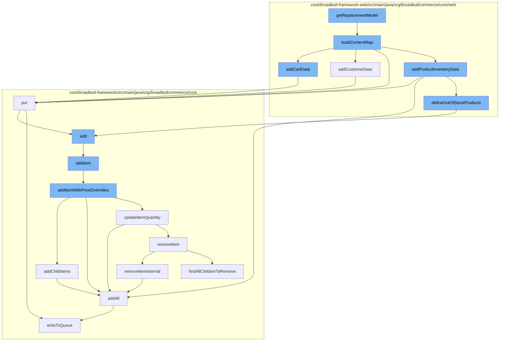

This document will cover the process of handling uncacheable data in the BroadleafCommerce-demo project. The process includes:

 1. Building a content map
 2. Adding cart data
 3. Adding customer data
 4. Adding product inventory data
 5. Defining out of stock products
 6. Adding items to the wishlist
 7. Adding items to the order
 8. Updating item quantity
 9. Removing items from the order
10. Writing data to the queue.



<SwmSnippet path="/core/broadleaf-framework-web/src/main/java/org/broadleafcommerce/core/web/processor/UncacheableDataProcessor.java" line="121">

---

# Building a content map

The `buildContentMap` function is the starting point of the process. It creates a map to hold various data related to the cart, customer, and product inventory. It also handles CSRF tokens.

```java
    protected String buildContentMap(BroadleafTemplateContext context) {
        Map<String, Object> attrMap = new HashMap<>();
        addCartData(attrMap);
        addCustomerData(attrMap);
        addProductInventoryData(attrMap, context);

        try {
            attrMap.put("csrfToken", eps.getCSRFToken());
            attrMap.put("csrfTokenParameter", eps.getCsrfTokenParameter());
        } catch (ServiceException e) {
            throw new RuntimeException("Could not get a CSRF token for this session", e);
        }
        return StringUtil.getMapAsJson(attrMap);
    }
```

---

</SwmSnippet>

<SwmSnippet path="/core/broadleaf-framework-web/src/main/java/org/broadleafcommerce/core/web/processor/UncacheableDataProcessor.java" line="220">

---

# Adding cart data

The `addCartData` function adds data related to the cart to the map. This includes the count of items in the cart and the IDs of items with and without options.

```java
    protected void addCartData(Map<String, Object> attrMap) {
        Order cart = CartState.getCart();
        int cartQty = 0;
        List<Long> cartItemIdsWithOptions = new ArrayList<>();
        List<Long> cartItemIdsWithoutOptions = new ArrayList<>();

        if (cart != null && cart.getOrderItems() != null) {
            cartQty = cart.getItemCount();

            for (OrderItem item : cart.getOrderItems()) {
                if (item instanceof SkuAccessor) {
                    Sku sku = ((SkuAccessor) item).getSku();
                    if (sku != null && sku.getProduct() != null && item.getParentOrderItem() == null) {
                        Product product = sku.getProduct();
                        List<ProductOptionXref> optionXrefs = product.getProductOptionXrefs();
                        if (optionXrefs == null || optionXrefs.isEmpty()) {
                            cartItemIdsWithoutOptions.add(product.getId());
                        } else {
                            cartItemIdsWithOptions.add(product.getId());
                        }
                    }
```

---

</SwmSnippet>

<SwmSnippet path="/core/broadleaf-framework-web/src/main/java/org/broadleafcommerce/core/web/processor/UncacheableDataProcessor.java" line="123">

---

# Adding customer data

The `addCustomerData` function adds customer-related data to the map. The specifics of this function are not provided in the context.

```java
        addCartData(attrMap);
        addCustomerData(attrMap);
```

---

</SwmSnippet>

<SwmSnippet path="/core/broadleaf-framework-web/src/main/java/org/broadleafcommerce/core/web/processor/UncacheableDataProcessor.java" line="125">

---

# Adding product inventory data

The `addProductInventoryData` function adds data related to the product inventory to the map. The specifics of this function are not provided in the context.

```java
        addProductInventoryData(attrMap, context);

```

---

</SwmSnippet>

<SwmSnippet path="/core/broadleaf-framework-web/src/main/java/org/broadleafcommerce/core/web/processor/UncacheableDataProcessor.java" line="230">

---

# Defining out of stock products

The `defineOutOfStockProducts` function identifies out of stock products and adds them to the wishlist.

```java
                if (item instanceof SkuAccessor) {
                    Sku sku = ((SkuAccessor) item).getSku();
                    if (sku != null && sku.getProduct() != null && item.getParentOrderItem() == null) {
                        Product product = sku.getProduct();
                        List<ProductOptionXref> optionXrefs = product.getProductOptionXrefs();
                        if (optionXrefs == null || optionXrefs.isEmpty()) {
                            cartItemIdsWithoutOptions.add(product.getId());
                        } else {
                            cartItemIdsWithOptions.add(product.getId());
                        }
                    }
                }
            }
```

---

</SwmSnippet>

<SwmSnippet path="/core/broadleaf-framework-web/src/main/java/org/broadleafcommerce/core/web/controller/account/BroadleafManageWishlistController.java" line="62">

---

# Adding items to the wishlist

The `add` function adds items to the wishlist. If the wishlist does not exist for the customer, it creates one.

```java
    public String add(HttpServletRequest request, HttpServletResponse response, Model model,
                      OrderItemRequestDTO itemRequest, String wishlistName) throws IOException, AddToCartException, PricingException  {
        Order wishlist = orderService.findNamedOrderForCustomer(wishlistName, CustomerState.getCustomer(request));

        if (wishlist == null) {
            wishlist = orderService.createNamedOrderForCustomer(wishlistName, CustomerState.getCustomer(request));
        }
        
        wishlist = orderService.addItem(wishlist.getId(), itemRequest, false);
        wishlist = orderService.save(wishlist, true);

        return getAccountWishlistRedirect();
    }
```

---

</SwmSnippet>

<SwmSnippet path="/core/broadleaf-framework/src/main/java/org/broadleafcommerce/core/order/service/OrderServiceImpl.java" line="655">

---

# Adding items to the order

The `addItem` function adds items to the order. It calls the `addItemWithPriceOverrides` function to handle price overrides.

```java
    @Override
    @Transactional(value = "blTransactionManager", rollbackFor = {AddToCartException.class})
    public Order addItem(Long orderId, OrderItemRequestDTO orderItemRequestDTO, boolean priceOrder) throws AddToCartException {
        // Don't allow overrides from this method.
        orderItemRequestDTO.setOverrideRetailPrice(null);
        orderItemRequestDTO.setOverrideSalePrice(null);
        return addItemWithPriceOverrides(orderId, orderItemRequestDTO, priceOrder);
    }
```

---

</SwmSnippet>

<SwmSnippet path="/core/broadleaf-framework/src/main/java/org/broadleafcommerce/core/order/service/OrderServiceImpl.java" line="675">

---

# Updating item quantity

The `updateItemQuantity` function updates the quantity of an item in the order. If the quantity is updated to zero, it removes the item from the order.

```java
                    return updateItemQuantity(orderId, orderItemRequestDTO, priceOrder);
                } catch (RemoveFromCartException e) {
                    throw new AddToCartException("Unexpected error - system tried to remove item while adding to cart", e);
                } catch (UpdateCartException e) {
                    throw new AddToCartException("Could not update quantity for matched item", e);
```

---

</SwmSnippet>

<SwmSnippet path="/core/broadleaf-framework/src/main/java/org/broadleafcommerce/core/order/service/OrderServiceImpl.java" line="851">

---

# Removing items from the order

The `removeItemInternal` function removes an item from the order. It also handles the removal of child items if any.

```java
    protected Order removeItemInternal(Long orderId, Long orderItemId, boolean priceOrder) throws WorkflowException {
        OrderItemRequestDTO orderItemRequestDTO = new OrderItemRequestDTO();
        orderItemRequestDTO.setOrderItemId(orderItemId);
        CartOperationRequest cartOpRequest = new CartOperationRequest(findOrderById(orderId), orderItemRequestDTO, priceOrder);
        Session session = em.unwrap(Session.class);
        FlushMode current = session.getHibernateFlushMode();
        if (!autoFlushRemoveFromCart) {
            //Performance measure. Hibernate will sometimes perform an autoflush when performing query operations and this can
            //be expensive. It is possible to avoid the autoflush if there's no concern about queries in the flow returning
            //incorrect results because something has not been flushed to the database yet.
            session.setHibernateFlushMode(FlushMode.MANUAL);
        }
        ProcessContext<CartOperationRequest> context;
        try {
            context = (ProcessContext<CartOperationRequest>) removeItemWorkflow.doActivities(cartOpRequest);
        } finally {
            if (!autoFlushRemoveFromCart) {
                session.setHibernateFlushMode(current);
            }
        }
        context.getSeedData().getOrder().getOrderMessages().addAll(((ActivityMessages) context).getActivityMessages());
```

---

</SwmSnippet>

<SwmSnippet path="/core/broadleaf-framework/src/main/java/org/broadleafcommerce/core/util/queue/ZookeeperDistributedQueue.java" line="503">

---

# Writing data to the queue

The `writeToQueue` function writes data to the queue. It handles the locking mechanism to ensure thread safety.

```java
    protected int writeToQueue(List<? extends T> entries, final long timeout) throws InterruptedException {
        if (entries == null || entries.isEmpty()) {
            return 0;
        }
        
        int entryCount = 0;
        long waitTime = timeout;
        synchronized (QUEUE_MONITOR) {
            while (true) {
                boolean locked = false;
                DistributedLock lock = getQueueAccessLock();
                if (timeout < 0L) {
                    lock.lockInterruptibly();
                    locked = true;
                } else if (timeout > 0L && waitTime > 0L) {
                    long start = System.currentTimeMillis();
                    locked = lock.tryLock(waitTime, TimeUnit.MILLISECONDS);
                    long end = System.currentTimeMillis();
                    waitTime -= (end - start);
                } else {
                    locked = lock.tryLock();
```

---

</SwmSnippet>

&nbsp;

*This is an auto-generated document by Swimm AI 🌊 and has not yet been verified by a human*

<SwmMeta version="3.0.0" repo-id="Z2l0aHViJTNBJTNBQnJvYWRsZWFmQ29tbWVyY2UtZGVtbyUzQSUzQWdpbGFkbmF2b3Q=" repo-name="BroadleafCommerce-demo" doc-type="flows"><sup>Powered by [Swimm](/)</sup></SwmMeta>
