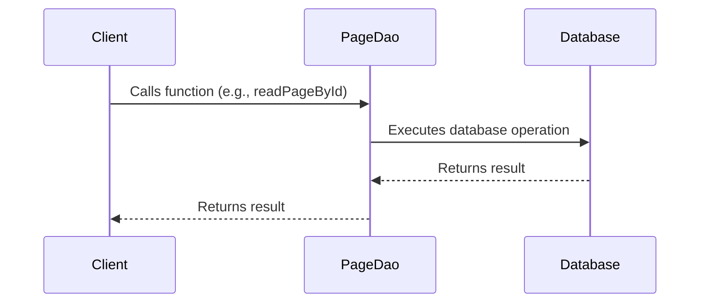

Page DAO (Data Access Object) is an interface that provides a mechanism to interact with the Page data in the database. It provides methods to perform CRUD operations (Create, Read, Update, Delete) on Page entities. It also provides methods to find pages by URI, read all pages, and handle other specific operations related to pages.

The PageDaoImpl class is the implementation of the PageDao interface. It uses the EntityManager for interacting with the database. It also uses CriteriaBuilder and CriteriaQuery for building complex database queries.

The PageDao is used in various services like PageSiteMapGenerator, PageServiceUtility, and PageServiceImpl. These services use the methods provided by the PageDao to interact with the Page data.

<SwmSnippet path="/admin/broadleaf-contentmanagement-module/src/main/java/org/broadleafcommerce/cms/page/dao/PageDao.java" line="33">

---

# PageDao Interface

This is the PageDao interface. It declares methods for various operations like reading a page by its ID, reading all pages, updating a page, deleting a page, etc. These methods are implemented in the PageDaoImpl class.

```java
public interface PageDao {

    Page readPageById(Long id);
    
    List<PageField> readPageFieldsByPageId(Long pageId);

    PageTemplate readPageTemplateById(Long id);
    
    /**
     * Saves the given {@link PageTemplate}
     * 
     * @param template the {@link PageTemplate} to save
     * @return the database-saved {@link PageTemplate}
     */
    PageTemplate savePageTemplate(PageTemplate template);

    Page updatePage(Page page);

    void delete(Page page);

    Page addPage(Page clonedPage);
```

---

</SwmSnippet>

<SwmSnippet path="/admin/broadleaf-contentmanagement-module/src/main/java/org/broadleafcommerce/cms/page/dao/PageDaoImpl.java" line="57">

---

# PageDaoImpl Class

This is the PageDaoImpl class, which implements the PageDao interface. It provides the actual implementation for the methods declared in the PageDao interface. It uses the EntityManager for performing the database operations.

```java
@Repository("blPageDao")
public class PageDaoImpl implements PageDao {

    private static SandBox DUMMY_SANDBOX = new SandBoxImpl();

    {
        DUMMY_SANDBOX.setId(-1l);
    }

    @PersistenceContext(unitName = "blPU")
    protected EntityManager em;

    @Resource(name = "blEntityConfiguration")
    protected EntityConfiguration entityConfiguration;

    protected Long currentDateResolution = 10 * 60 * 1000L;

    protected Date cachedDate = SystemTime.asDate();


    @Override
```

---

</SwmSnippet>

<SwmSnippet path="/admin/broadleaf-contentmanagement-module/src/main/java/org/broadleafcommerce/cms/page/service/PageSiteMapGenerator.java" line="46">

---

# Using the PageDao

Here is an example of how the PageDao is used in the codebase. The PageDao is injected into the PageSiteMapGenerator class, and its methods are called whenever a database operation related to the Page entity is required.

```java
    protected PageDao pageDao;
```

---

</SwmSnippet>

This section provides an overview of the main functions in the Page DAO.

<SwmSnippet path="/admin/broadleaf-contentmanagement-module/src/main/java/org/broadleafcommerce/cms/page/dao/PageDaoImpl.java" line="77">

---

## Reading Page by ID

The `readPageById` function retrieves a Page record from the database using its ID. It uses the EntityManager's `find` method to perform the database operation.

```java
    @Override
    public Page readPageById(Long id) {
        return em.find(PageImpl.class, id);
    }
```

---

</SwmSnippet>

<SwmSnippet path="/admin/broadleaf-contentmanagement-module/src/main/java/org/broadleafcommerce/cms/page/dao/PageDaoImpl.java" line="82">

---

## Reading Page Fields by Page ID

The `readPageFieldsByPageId` function retrieves the fields of a Page using the Page's ID. It uses the Criteria API to build the query and the EntityManager's `createQuery` method to execute the query.

```java
    @Override
    public List<PageField> readPageFieldsByPageId(Long pageId) {
        CriteriaBuilder builder = em.getCriteriaBuilder();

        CriteriaQuery<PageField> criteria = builder.createQuery(PageField.class);
        Root<PageFieldImpl> pageField = criteria.from(PageFieldImpl.class);
        criteria.select(pageField);

        Path<Object> path = pageField.get("page").get("id");
        criteria.where(builder.equal(pageField.get("page").get("id"), pageId));

        TypedQuery<PageField> query = em.createQuery(criteria);
        query.setHint(QueryHints.HINT_CACHEABLE, true);
        return query.getResultList();
    }
```

---

</SwmSnippet>

<SwmSnippet path="/admin/broadleaf-contentmanagement-module/src/main/java/org/broadleafcommerce/cms/page/dao/PageDaoImpl.java" line="98">

---

## Reading Page Template by ID

The `readPageTemplateById` function retrieves a PageTemplate record from the database using its ID. It uses the EntityManager's `find` method to perform the database operation.

```java
    @Override
    public PageTemplate readPageTemplateById(Long id) {
        return em.find(PageTemplateImpl.class, id);
    }
```

---

</SwmSnippet>

<SwmSnippet path="/admin/broadleaf-contentmanagement-module/src/main/java/org/broadleafcommerce/cms/page/dao/PageDaoImpl.java" line="104">

---

## Saving Page Template

The `savePageTemplate` function saves a PageTemplate record to the database. It uses the EntityManager's `merge` method to perform the database operation.

```java
    @Override
    public PageTemplate savePageTemplate(PageTemplate template) {
        return em.merge(template);
    }
```

---

</SwmSnippet>

<SwmSnippet path="/admin/broadleaf-contentmanagement-module/src/main/java/org/broadleafcommerce/cms/page/dao/PageDaoImpl.java" line="109">

---

## Updating Page

The `updatePage` function updates a Page record in the database. It uses the EntityManager's `merge` method to perform the database operation.

```java
    @Override
    public Page updatePage(Page page) {
        return em.merge(page);
    }
```

---

</SwmSnippet>

<SwmSnippet path="/admin/broadleaf-contentmanagement-module/src/main/java/org/broadleafcommerce/cms/page/dao/PageDaoImpl.java" line="114">

---

## Deleting Page

The `delete` function removes a Page record from the database. It first checks if the Page entity is managed in the current persistence context. If not, it retrieves the Page using its ID and then removes it using the EntityManager's `remove` method.

```java
    @Override
    public void delete(Page page) {
        if (!em.contains(page)) {
            page = readPageById(page.getId());
        }
        em.remove(page);
    }
```

---

</SwmSnippet>

<SwmSnippet path="/admin/broadleaf-contentmanagement-module/src/main/java/org/broadleafcommerce/cms/page/dao/PageDaoImpl.java" line="122">

---

## Adding Page

The `addPage` function adds a new Page record to the database. It uses the EntityManager's `merge` method to perform the database operation.

```java
    @Override
    public Page addPage(Page clonedPage) {
        return em.merge(clonedPage);
    }
```

---

</SwmSnippet>

<SwmSnippet path="/admin/broadleaf-contentmanagement-module/src/main/java/org/broadleafcommerce/cms/page/dao/PageDaoImpl.java" line="239">

---

## Reading All Pages

The `readAllPages` function retrieves all Page records from the database. It uses the Criteria API to build the query and the EntityManager's `createQuery` method to execute the query.

```java
    @Override
    public List<Page> readAllPages() {
        CriteriaBuilder builder = em.getCriteriaBuilder();
        CriteriaQuery<Page> criteria = builder.createQuery(Page.class);
        Root<PageImpl> page = criteria.from(PageImpl.class);

        criteria.select(page);

        try {
            Query query = em.createQuery(criteria);
            query.setHint(QueryHints.HINT_CACHEABLE, true);
            return query.getResultList();
        } catch (NoResultException e) {
            return Collections.emptyList();
        }
    }
```

---

</SwmSnippet>

<SwmSnippet path="/admin/broadleaf-contentmanagement-module/src/main/java/org/broadleafcommerce/cms/page/dao/PageDaoImpl.java" line="256">

---

## Reading Online and Included Pages

The `readOnlineAndIncludedPages` function retrieves a subset of Page records that are online and included in the site map. It uses the Criteria API to build the query and the EntityManager's `createQuery` method to execute the query.

```java
    @Override
    public List<Page> readOnlineAndIncludedPages(int limit, int offset, String sortBy) {
        CriteriaBuilder builder = em.getCriteriaBuilder();
        CriteriaQuery<Page> criteria = builder.createQuery(Page.class);
        Root<PageImpl> page = criteria.from(PageImpl.class);
        criteria.select(page);
        criteria.where(builder.and(
                builder.or(builder.isFalse(page.get("offlineFlag").as(Boolean.class)), builder.isNull(page.get("offlineFlag").as(Boolean.class))),
                builder.or(builder.isFalse(page.get("excludeFromSiteMap").as(Boolean.class)), builder.isNull(page.get("excludeFromSiteMap").as(Boolean.class)))));
        criteria.orderBy(builder.asc(page.get(sortBy)));
        TypedQuery<Page> query = em.createQuery(criteria);
        query.setFirstResult(offset);
        query.setMaxResults(limit);
        query.setHint(QueryHints.HINT_CACHEABLE, true);
        return query.getResultList();
    }
```

---

</SwmSnippet>

<SwmSnippet path="/admin/broadleaf-contentmanagement-module/src/main/java/org/broadleafcommerce/cms/page/dao/PageDaoImpl.java" line="273">

---

## Reading All Page Templates

The `readAllPageTemplates` function retrieves all PageTemplate records from the database. It uses the Criteria API to build the query and the EntityManager's `createQuery` method to execute the query.

```java
    @Override
    public List<PageTemplate> readAllPageTemplates() {
        CriteriaBuilder builder = em.getCriteriaBuilder();
        CriteriaQuery<PageTemplate> criteria = builder.createQuery(PageTemplate.class);
        Root<PageTemplateImpl> template = criteria.from(PageTemplateImpl.class);

        criteria.select(template);

        try {
            Query query = em.createQuery(criteria);
            query.setHint(QueryHints.HINT_CACHEABLE, true);
            return query.getResultList();
        } catch (NoResultException e) {
            return Collections.emptyList();
        }
    }
```

---

</SwmSnippet>

<SwmSnippet path="/admin/broadleaf-contentmanagement-module/src/main/java/org/broadleafcommerce/cms/page/dao/PageDaoImpl.java" line="127">

---

## Finding Page by URI

The `findPageByURI` function retrieves Page records that match a given URI. It uses the Criteria API to build the query and the EntityManager's `createQuery` method to execute the query.

```java
    @Override
    public List<Page> findPageByURI(String uri) {
        CriteriaBuilder builder = em.getCriteriaBuilder();
        CriteriaQuery<Page> criteriaQuery = builder.createQuery(Page.class);
        Root pageRoot = criteriaQuery.from(PageImpl.class);
        criteriaQuery.select(pageRoot);
        
        List<Predicate> restrictions = new ArrayList<>();
        restrictions.add(builder.equal(pageRoot.get("fullUrl"), uri));

        Date currentDate = DateUtil.getCurrentDateAfterFactoringInDateResolution(cachedDate, getCurrentDateResolution());

        addActiveDateRestrictions(builder, pageRoot, restrictions, currentDate, currentDate);
        addOfflineRestriction(builder, pageRoot, restrictions);

        criteriaQuery.where(restrictions.toArray(new Predicate[restrictions.size()]));
        
        return getResultForQueryAndCache(criteriaQuery);
    }
```

---

</SwmSnippet>

<SwmSnippet path="/admin/broadleaf-contentmanagement-module/src/main/java/org/broadleafcommerce/cms/page/dao/PageDaoImpl.java" line="174">

---

## Finding Page by URI and Active Date

The `findPageByURIAndActiveDate` function retrieves Page records that match a given URI and are within 1 day of the active date. It uses the Criteria API to build the query and the EntityManager's `createQuery` method to execute the query.

```java
    @Override
    public List<Page> findPageByURIAndActiveDate(final String uri, final Date activeDate) {
        final CriteriaBuilder builder = em.getCriteriaBuilder();
        final CriteriaQuery<Page> criteriaQuery = builder.createQuery(Page.class);
        final Root pageRoot = criteriaQuery.from(PageImpl.class);
        criteriaQuery.select(pageRoot);

        final List<Predicate> restrictions = new ArrayList<>();
        restrictions.add(builder.equal(pageRoot.get("fullUrl"), uri));

        final Date nextDay = DateUtils.addDays(activeDate, 1);

        addOfflineRestriction(builder, pageRoot, restrictions);
        addActiveDateRestrictions(builder, pageRoot, restrictions, nextDay, activeDate);
        
        criteriaQuery.where(restrictions.toArray(new Predicate[restrictions.size()]));

        List<Page> pages = getResultForQueryAndCache(criteriaQuery);
        
        return filterInactive(pages);
    }
```

---

</SwmSnippet>

<SwmSnippet path="/admin/broadleaf-contentmanagement-module/src/main/java/org/broadleafcommerce/cms/page/dao/PageDaoImpl.java" line="295">

---

## Detaching Page

The `detachPage` function detaches a Page entity from the current persistence context. This is useful when you want to make changes to an entity without affecting the database.

```java
    @Override
    public void detachPage(Page page) {
        em.detach(page);
    }
```

---

</SwmSnippet>



&nbsp;

*This is an auto-generated document by Swimm AI 🌊 and has not yet been verified by a human*

<SwmMeta version="3.0.0" repo-id="Z2l0aHViJTNBJTNBQnJvYWRsZWFmQ29tbWVyY2UtZGVtbyUzQSUzQWdpbGFkbmF2b3Q=" repo-name="BroadleafCommerce-demo" doc-type="overview"><sup>Powered by [Swimm](/)</sup></SwmMeta>
