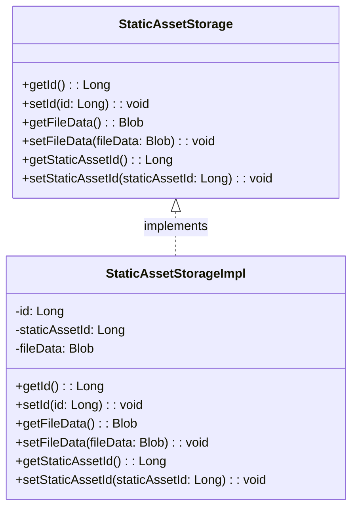

Static Asset Storage in Broadleaf Commerce refers to the mechanism for storing and retrieving static assets such as images, CSS, and JavaScript files. It is implemented through the `StaticAssetStorage` interface and its implementation `StaticAssetStorageImpl`. The `StaticAssetStorage` interface defines methods for getting and setting the ID of the static asset, getting and setting the file data as a Blob, and getting and setting the static asset ID. The `StaticAssetStorageImpl` class provides the concrete implementation of these methods. The static assets are stored in a database table named `BLC_STATIC_ASSET_STRG`.

<SwmSnippet path="/admin/broadleaf-contentmanagement-module/src/main/java/org/broadleafcommerce/cms/file/domain/StaticAssetStorage.java" line="29">

---

## StaticAssetStorage Interface

The `StaticAssetStorage` interface provides the necessary methods for managing static assets. It includes methods to get and set the ID of the static asset (`getId`, `setId`), to get and set the actual file data (`getFileData`, `setFileData`), and to get and set the static asset ID (`getStaticAssetId`, `setStaticAssetId`).

```java
public interface StaticAssetStorage {

    Long getId();

    void setId(Long id);

    Blob getFileData();

    void setFileData(Blob fileData);

    public Long getStaticAssetId();

    public void setStaticAssetId(Long staticAssetId);

}
```

---

</SwmSnippet>

<SwmSnippet path="/admin/broadleaf-contentmanagement-module/src/main/java/org/broadleafcommerce/cms/file/domain/StaticAssetStorageImpl.java" line="38">

---

## StaticAssetStorageImpl Class

The `StaticAssetStorageImpl` class implements the `StaticAssetStorage` interface. It provides the actual implementation of the methods defined in the interface. It also includes additional fields such as `id`, `staticAssetId`, and `fileData` which are used to store the ID of the static asset, the static asset ID, and the actual file data respectively.

```java
@Entity
@Inheritance(strategy = InheritanceType.JOINED)
@Table(name = "BLC_STATIC_ASSET_STRG")
public class StaticAssetStorageImpl implements StaticAssetStorage {

    private static final long serialVersionUID = 1L;

    @Id
    @GeneratedValue(generator = "StaticAssetStorageId")
    @GenericGenerator(
        name="StaticAssetStorageId",
        strategy="org.broadleafcommerce.common.persistence.IdOverrideTableGenerator",
        parameters = {
            @Parameter(name="segment_value", value="StaticAssetStorageImpl"),
            @Parameter(name="entity_name", value="org.broadleafcommerce.cms.file.domain.StaticAssetStorageImpl")
        }
    )
    @Column(name = "STATIC_ASSET_STRG_ID")
    protected Long id;

    @Column(name ="STATIC_ASSET_ID", nullable = false)
```

---

</SwmSnippet>

# Static Asset Storage

The StaticAssetStorage interface and its implementation, StaticAssetStorageImpl, are responsible for managing the storage of static assets in the Broadleaf Commerce framework.

<SwmSnippet path="/admin/broadleaf-contentmanagement-module/src/main/java/org/broadleafcommerce/cms/file/domain/StaticAssetStorage.java" line="29">

---

## StaticAssetStorage Interface

The StaticAssetStorage interface declares the methods that must be implemented by any class that manages the storage of static assets. These methods include getters and setters for the ID of the static asset, the data of the file, and the ID of the static asset.

```java
public interface StaticAssetStorage {

    Long getId();

    void setId(Long id);

    Blob getFileData();

    void setFileData(Blob fileData);

    public Long getStaticAssetId();

    public void setStaticAssetId(Long staticAssetId);

}
```

---

</SwmSnippet>

<SwmSnippet path="/admin/broadleaf-contentmanagement-module/src/main/java/org/broadleafcommerce/cms/file/domain/StaticAssetStorageImpl.java" line="41">

---

## StaticAssetStorageImpl Class

The StaticAssetStorageImpl class implements the StaticAssetStorage interface. It defines the properties of the static asset storage and the methods for getting and setting these properties. The properties include the ID of the static asset storage, the ID of the static asset, and the data of the file.

```java
public class StaticAssetStorageImpl implements StaticAssetStorage {

    private static final long serialVersionUID = 1L;

    @Id
    @GeneratedValue(generator = "StaticAssetStorageId")
    @GenericGenerator(
        name="StaticAssetStorageId",
        strategy="org.broadleafcommerce.common.persistence.IdOverrideTableGenerator",
        parameters = {
            @Parameter(name="segment_value", value="StaticAssetStorageImpl"),
            @Parameter(name="entity_name", value="org.broadleafcommerce.cms.file.domain.StaticAssetStorageImpl")
        }
    )
    @Column(name = "STATIC_ASSET_STRG_ID")
    protected Long id;

    @Column(name ="STATIC_ASSET_ID", nullable = false)
    @Index(name="STATIC_ASSET_ID_INDEX", columnNames={"STATIC_ASSET_ID"})
    protected Long staticAssetId;

```

---

</SwmSnippet>



&nbsp;

*This is an auto-generated document by Swimm AI 🌊 and has not yet been verified by a human*

<SwmMeta version="3.0.0" repo-id="Z2l0aHViJTNBJTNBQnJvYWRsZWFmQ29tbWVyY2UtZGVtbyUzQSUzQWdpbGFkbmF2b3Q=" repo-name="BroadleafCommerce-demo" doc-type="overview"><sup>Powered by [Swimm](/)</sup></SwmMeta>
