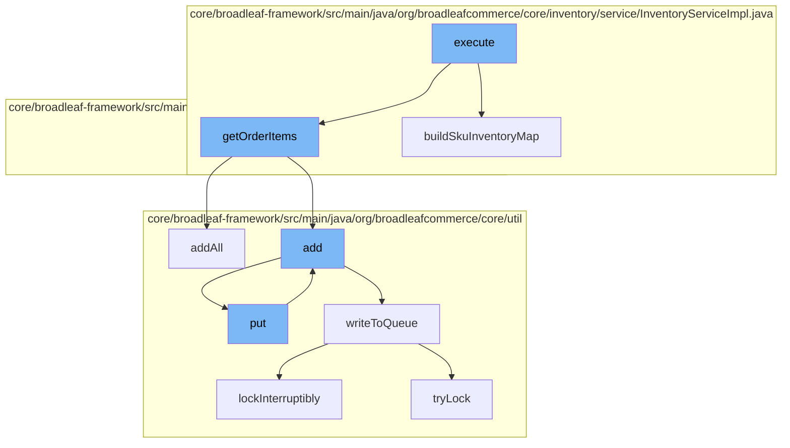

This document will cover the process of inventory decrement during the checkout process in Broadleaf Commerce. The steps include:

1. Execution of the DecrementInventoryActivity
2. Building the SKU inventory map
3. Getting order items
4. Adding items to the distributed queue
5. Writing to the queue
6. Locking the queue for concurrent access.



<SwmSnippet path="/core/broadleaf-framework/src/main/java/org/broadleafcommerce/core/checkout/service/workflow/DecrementInventoryActivity.java" line="1">

---

# Execution of DecrementInventoryActivity

The `execute` function in `DecrementInventoryActivity` is the entry point for this flow. It's responsible for initiating the process of decrementing the inventory after a successful checkout.

```java
/*-
 * #%L
 * BroadleafCommerce Framework
 * %%
 * Copyright (C) 2009 - 2024 Broadleaf Commerce
 * %%
 * Licensed under the Broadleaf Fair Use License Agreement, Version 1.0
 * (the "Fair Use License" located  at http://license.broadleafcommerce.org/fair_use_license-1.0.txt)
 * unless the restrictions on use therein are violated and require payment to Broadleaf in which case
 * the Broadleaf End User License Agreement (EULA), Version 1.1
```

---

</SwmSnippet>

<SwmSnippet path="/core/broadleaf-framework/src/main/java/org/broadleafcommerce/core/inventory/service/InventoryServiceImpl.java" line="302">

---

# Building the SKU inventory map

The `buildSkuInventoryMap` function is called next. It creates a map of SKUs and their quantities from the order. This map is used later to decrement the inventory.

```java
    @Override
    public Map<Sku, Integer> buildSkuInventoryMap(Order order) {
        //map to hold skus and quantity purchased
        HashMap<Sku, Integer> skuInventoryMap = new HashMap<Sku, Integer>();

        for (OrderItem orderItem : order.getOrderItems()) {
            if (orderItem instanceof DiscreteOrderItem) {
                Sku sku = ((DiscreteOrderItem) orderItem).getSku();
                Sku skuForInventory = sku;
                if (enableUseDefaultSkuInventory && ((ProductSkuUsage) sku.getProduct()).getUseDefaultSkuInInventory()){
                    skuForInventory = sku.getProduct().getDefaultSku();
                }
                Integer quantity = skuInventoryMap.get(skuForInventory);
                if (quantity == null) {
                    quantity = orderItem.getQuantity();
                } else {
                    quantity += orderItem.getQuantity();
                }
                if (InventoryType.CHECK_QUANTITY.equals(skuForInventory.getInventoryType())) {
                    skuInventoryMap.put(skuForInventory, quantity);
                }
```

---

</SwmSnippet>

<SwmSnippet path="/core/broadleaf-framework/src/main/java/org/broadleafcommerce/core/checkout/service/workflow/ValidateProductOptionsActivity.java" line="1">

---

# Getting order items

The `getOrderItems` function retrieves all the items in the order. These items are then added to the distributed queue for further processing.

```java
/*-
 * #%L
 * BroadleafCommerce Framework
 * %%
 * Copyright (C) 2009 - 2024 Broadleaf Commerce
 * %%
 * Licensed under the Broadleaf Fair Use License Agreement, Version 1.0
 * (the "Fair Use License" located  at http://license.broadleafcommerce.org/fair_use_license-1.0.txt)
 * unless the restrictions on use therein are violated and require payment to Broadleaf in which case
 * the Broadleaf End User License Agreement (EULA), Version 1.1
```

---

</SwmSnippet>

<SwmSnippet path="/core/broadleaf-framework/src/main/java/org/broadleafcommerce/core/util/queue/ZookeeperDistributedQueue.java" line="307">

---

# Adding items to the distributed queue

The `addAll` function is used to add all the order items to the distributed queue. This queue is used to handle the inventory decrement in a distributed manner.

```java
    @Override
    public boolean addAll(Collection<? extends T> c) {
        if (c == null || c.isEmpty()) {
            return false;
        }
        try {
            int count = writeToQueue(new ArrayList<>(c), -1L);
            return count == c.size();
        } catch (InterruptedException e) {
            return false;
        }
        
    }
```

---

</SwmSnippet>

<SwmSnippet path="/core/broadleaf-framework/src/main/java/org/broadleafcommerce/core/util/queue/ZookeeperDistributedQueue.java" line="503">

---

# Writing to the queue

The `writeToQueue` function is used to write the order items to the queue. It also handles the locking mechanism to ensure that the inventory decrement process is thread-safe.

```java
    protected int writeToQueue(List<? extends T> entries, final long timeout) throws InterruptedException {
        if (entries == null || entries.isEmpty()) {
            return 0;
        }
        
        int entryCount = 0;
        long waitTime = timeout;
        synchronized (QUEUE_MONITOR) {
            while (true) {
                boolean locked = false;
                DistributedLock lock = getQueueAccessLock();
                if (timeout < 0L) {
                    lock.lockInterruptibly();
                    locked = true;
                } else if (timeout > 0L && waitTime > 0L) {
                    long start = System.currentTimeMillis();
                    locked = lock.tryLock(waitTime, TimeUnit.MILLISECONDS);
                    long end = System.currentTimeMillis();
                    waitTime -= (end - start);
                } else {
                    locked = lock.tryLock();
```

---

</SwmSnippet>

<SwmSnippet path="/core/broadleaf-framework/src/main/java/org/broadleafcommerce/core/util/lock/ReentrantDistributedZookeeperLock.java" line="335">

---

# Locking the queue for concurrent access

The `lockInterruptibly` function is used to lock the queue for concurrent access. This ensures that the inventory decrement process is thread-safe and prevents race conditions.

```java
    @Override
    public void lockInterruptibly() throws InterruptedException {
        if (Thread.interrupted()) {
            throw new InterruptedException("Thread was interrupted prior to trying to acquire the lock.");
        }
        
        lockInternally(-1L);
    }
```

---

</SwmSnippet>

&nbsp;

*This is an auto-generated document by Swimm AI 🌊 and has not yet been verified by a human*

<SwmMeta version="3.0.0" repo-id="Z2l0aHViJTNBJTNBQnJvYWRsZWFmQ29tbWVyY2UtZGVtbyUzQSUzQWdpbGFkbmF2b3Q=" repo-name="BroadleafCommerce-demo" doc-type="flows"><sup>Powered by [Swimm](/)</sup></SwmMeta>
