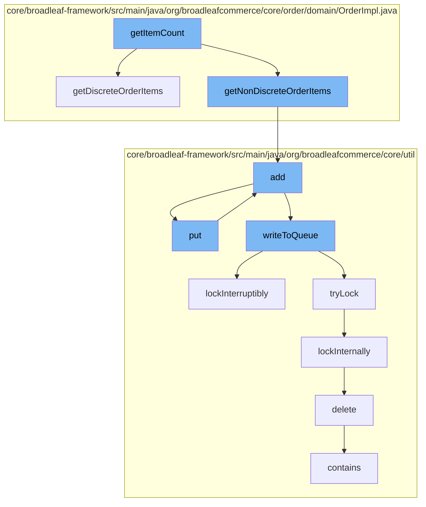

This document will cover the process of calculating the item count in an order in the BroadleafCommerce-demo project. The process includes the following steps:

1. Retrieving discrete and non-discrete order items
2. Adding items to the resource purge service
3. Writing items to the distributed queue
4. Locking the distributed queue
5. Deleting the code type from the DAO



<SwmSnippet path="/core/broadleaf-framework/src/main/java/org/broadleafcommerce/core/order/domain/OrderImpl.java" line="535">

---

# Retrieving Discrete and Non-Discrete Order Items

The `getDiscreteOrderItems` method is used to retrieve all discrete order items from an order. It iterates over all order items and checks if they are instances of `BundleOrderItem` or `DiscreteOrderItem`, and adds them to the `discreteOrderItems` list.

```java
    @Override
    public List<DiscreteOrderItem> getDiscreteOrderItems() {
        List<DiscreteOrderItem> discreteOrderItems = new ArrayList<DiscreteOrderItem>();
        for (OrderItem orderItem : orderItems) {
            if (orderItem instanceof BundleOrderItem) {
                BundleOrderItemImpl bundleOrderItem = (BundleOrderItemImpl)orderItem;
                for (DiscreteOrderItem discreteOrderItem : bundleOrderItem.getDiscreteOrderItems()) {
                    discreteOrderItems.add(discreteOrderItem);
                }
            } else if (orderItem instanceof DiscreteOrderItem) {
                DiscreteOrderItem discreteOrderItem = (DiscreteOrderItem) orderItem;
                discreteOrderItems.add(discreteOrderItem);
            }
        }
        return discreteOrderItems;
    }
```

---

</SwmSnippet>

<SwmSnippet path="/core/broadleaf-framework/src/main/java/org/broadleafcommerce/core/util/service/ResourcePurgeServiceImpl.java" line="593">

---

# Adding Items to the Resource Purge Service

The `add` method in the `ResourcePurgeServiceImpl` class is used to add an entry to the cache if it does not already exist. The entry is the current system time in milliseconds.

```java
        public Long add(Long entry) {
            if (! cache.containsKey(entry)) {
                return cache.put(entry, new Long(System.currentTimeMillis()));
            }
            return null;
        }
```

---

</SwmSnippet>

<SwmSnippet path="/core/broadleaf-framework/src/main/java/org/broadleafcommerce/core/util/queue/ZookeeperDistributedQueue.java" line="503">

---

# Writing Items to the Distributed Queue

The `writeToQueue` method in the `ZookeeperDistributedQueue` class is used to write entries to the distributed queue. It locks the queue, checks the remaining capacity, and writes the entries to the queue.

```java
    protected int writeToQueue(List<? extends T> entries, final long timeout) throws InterruptedException {
        if (entries == null || entries.isEmpty()) {
            return 0;
        }
        
        int entryCount = 0;
        long waitTime = timeout;
        synchronized (QUEUE_MONITOR) {
            while (true) {
                boolean locked = false;
                DistributedLock lock = getQueueAccessLock();
                if (timeout < 0L) {
                    lock.lockInterruptibly();
                    locked = true;
                } else if (timeout > 0L && waitTime > 0L) {
                    long start = System.currentTimeMillis();
                    locked = lock.tryLock(waitTime, TimeUnit.MILLISECONDS);
                    long end = System.currentTimeMillis();
                    waitTime -= (end - start);
                } else {
                    locked = lock.tryLock();
```

---

</SwmSnippet>

<SwmSnippet path="/core/broadleaf-framework/src/main/java/org/broadleafcommerce/core/util/lock/ReentrantDistributedZookeeperLock.java" line="335">

---

# Locking the Distributed Queue

The `lockInterruptibly` method in the `ReentrantDistributedZookeeperLock` class is used to lock the distributed queue. If the thread is interrupted before trying to acquire the lock, an `InterruptedException` is thrown.

```java
    @Override
    public void lockInterruptibly() throws InterruptedException {
        if (Thread.interrupted()) {
            throw new InterruptedException("Thread was interrupted prior to trying to acquire the lock.");
        }
        
        lockInternally(-1L);
    }
```

---

</SwmSnippet>

<SwmSnippet path="/core/broadleaf-framework/src/main/java/org/broadleafcommerce/core/util/dao/CodeTypeDaoImpl.java" line="51">

---

# Deleting the Code Type from the DAO

The `delete` method in the `CodeTypeDaoImpl` class is used to delete a `CodeType` from the database. If the `CodeType` is not contained in the entity manager, it is first found and then removed.

```java
    public void delete(CodeType codeType) {
        if (!em.contains(codeType)) {
            codeType = (CodeType) em.find(CodeTypeImpl.class, codeType.getId());
        }
        em.remove(codeType);
    }
```

---

</SwmSnippet>

&nbsp;

*This is an auto-generated document by Swimm AI 🌊 and has not yet been verified by a human*

<SwmMeta version="3.0.0" repo-id="Z2l0aHViJTNBJTNBQnJvYWRsZWFmQ29tbWVyY2UtZGVtbyUzQSUzQWdpbGFkbmF2b3Q=" repo-name="BroadleafCommerce-demo" doc-type="flows"><sup>Powered by [Swimm](/)</sup></SwmMeta>
