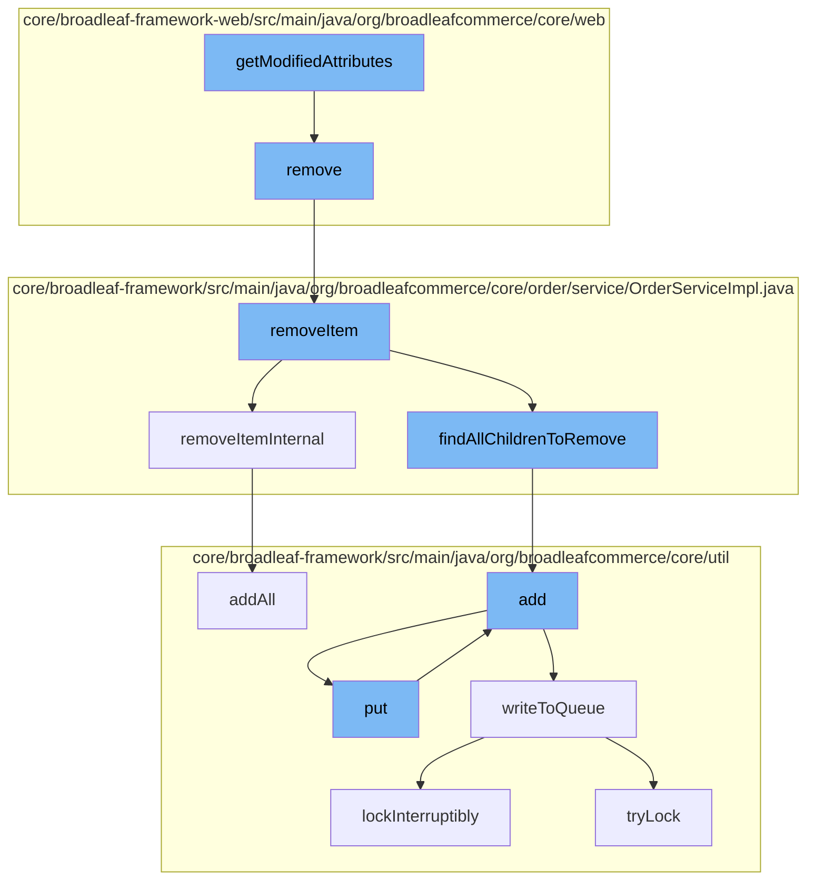

This document will cover the process of removing an item from the cart in the BroadleafCommerce-demo project. The process includes the following steps:

1. Modifying the attributes of the pagination sort link.
2. Removing the item from the cart.
3. Removing the item from the order.
4. Adding the removed item to the resource purge service.
5. Adding the removed item to the distributed queue.



<SwmSnippet path="/core/broadleaf-framework-web/src/main/java/org/broadleafcommerce/core/web/processor/PaginationSortLinkProcessor.java" line="1">

---

# Modifying the attributes of the pagination sort link

The `getModifiedAttributes` function in `PaginationSortLinkProcessor.java` is the starting point of the flow. It modifies the attributes of the pagination sort link, which is used in the user interface for sorting items in the cart.

```java
/*-
 * #%L
 * BroadleafCommerce Framework Web
 * %%
 * Copyright (C) 2009 - 2024 Broadleaf Commerce
 * %%
 * Licensed under the Broadleaf Fair Use License Agreement, Version 1.0
 * (the "Fair Use License" located  at http://license.broadleafcommerce.org/fair_use_license-1.0.txt)
 * unless the restrictions on use therein are violated and require payment to Broadleaf in which case
 * the Broadleaf End User License Agreement (EULA), Version 1.1
```

---

</SwmSnippet>

<SwmSnippet path="/core/broadleaf-framework-web/src/main/java/org/broadleafcommerce/core/web/controller/cart/BroadleafCartController.java" line="332">

---

# Removing the item from the cart

The `remove` function in `BroadleafCartController.java` is called next. It removes the item from the cart by calling the `removeItem` function of the `orderService`.

```java
    public String remove(HttpServletRequest request, HttpServletResponse response, Model model,
            OrderItemRequestDTO itemRequest) throws IOException, PricingException, RemoveFromCartException {
        Order cart = CartState.getCart();
        
        cart = orderService.removeItem(cart.getId(), itemRequest.getOrderItemId(), false);
        cart = orderService.save(cart, true);
        
        if (isAjaxRequest(request)) {
            Map<String, Object> extraData = new HashMap<>();
            extraData.put("cartItemCount", cart.getItemCount());
            extraData.put("skuId", itemRequest.getSkuId());
            extraData.put("productId", itemRequest.getProductId());
            model.addAttribute("blcextradata", new ObjectMapper().writeValueAsString(extraData));
            return getCartView();
        } else {
            return getCartPageRedirect();
        }
    }
```

---

</SwmSnippet>

<SwmSnippet path="/core/broadleaf-framework/src/main/java/org/broadleafcommerce/core/order/service/OrderServiceImpl.java" line="814">

---

# Removing the item from the order

The `removeItem` function in `OrderServiceImpl.java` removes the item from the order. It also calls the `removeItemInternal` and `findAllChildrenToRemove` functions to ensure all child items are also removed.

```java
    @Override
    @Transactional(value = "blTransactionManager", rollbackFor = {RemoveFromCartException.class})
    public Order removeItem(Long orderId, Long orderItemId, boolean priceOrder) throws RemoveFromCartException {
        preValidateCartOperation(findOrderById(orderId));
        try {
            OrderItem oi = orderItemService.readOrderItemById(orderItemId);
            if (oi == null) {
                throw new WorkflowException(new ItemNotFoundException());
            }
            List<Long> childrenToRemove = new ArrayList<Long>();
            if (oi instanceof BundleOrderItem) {
                List<DiscreteOrderItem> bundledItems = ((BundleOrderItem) oi).getDiscreteOrderItems();
                for (DiscreteOrderItem doi : bundledItems) {
                    findAllChildrenToRemove(childrenToRemove, doi);
                }
            } else {
                findAllChildrenToRemove(childrenToRemove, oi);
            }
            for (Long childToRemove : childrenToRemove) {
                removeItemInternal(orderId, childToRemove, false);
            }                    
```

---

</SwmSnippet>

<SwmSnippet path="/core/broadleaf-framework/src/main/java/org/broadleafcommerce/core/util/service/ResourcePurgeServiceImpl.java" line="593">

---

# Adding the removed item to the resource purge service

The `add` function in `ResourcePurgeServiceImpl.java` is called to add the removed item to the resource purge service. This is done to ensure the removed item is properly cleaned up from the system.

```java
        public Long add(Long entry) {
            if (! cache.containsKey(entry)) {
                return cache.put(entry, new Long(System.currentTimeMillis()));
            }
            return null;
        }
```

---

</SwmSnippet>

<SwmSnippet path="/core/broadleaf-framework/src/main/java/org/broadleafcommerce/core/util/queue/ZookeeperDistributedQueue.java" line="393">

---

# Adding the removed item to the distributed queue

The `put` function in `ZookeeperDistributedQueue.java` is called to add the removed item to the distributed queue. This is done to ensure the removed item is properly processed and removed from all distributed systems.

```java
    @Override
    public void put(T e) throws InterruptedException {
        final ArrayList<T> elementsToAdd = new ArrayList<>();
        elementsToAdd.add(e);
        writeToQueue(elementsToAdd, -1L);
    }
```

---

</SwmSnippet>

&nbsp;

*This is an auto-generated document by Swimm AI 🌊 and has not yet been verified by a human*

<SwmMeta version="3.0.0" repo-id="Z2l0aHViJTNBJTNBQnJvYWRsZWFmQ29tbWVyY2UtZGVtbyUzQSUzQWdpbGFkbmF2b3Q=" repo-name="BroadleafCommerce-demo" doc-type="flows"><sup>Powered by [Swimm](/)</sup></SwmMeta>
