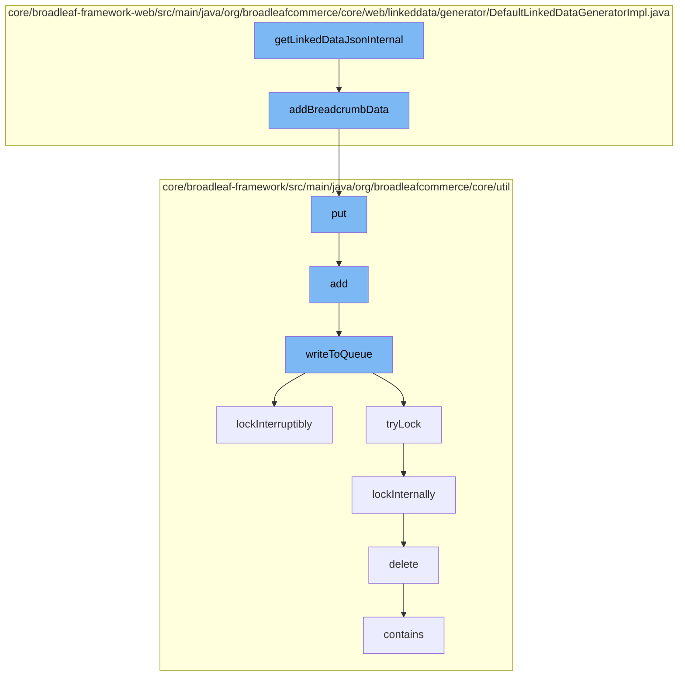

This document will cover the process of generating and managing linked data in the BroadleafCommerce-demo project. The process includes:

1. Generating linked data JSON
2. Adding breadcrumb data
3. Storing data in a distributed queue
4. Managing distributed locks
5. Deleting code types.



<SwmSnippet path="/core/broadleaf-framework-web/src/main/java/org/broadleafcommerce/core/web/linkeddata/generator/DefaultLinkedDataGeneratorImpl.java" line="64">

---

# Generating linked data JSON

The `getLinkedDataJsonInternal` function initiates the process. It calls the `addBreadcrumbData` function to generate a JSON object representing the [Schema.org](http://Schema.org) BreadcrumbList.

```java
    protected JSONObject addBreadcrumbData(final HttpServletRequest request) throws JSONException {
        final JSONObject breadcrumbObjects = new JSONObject();

        breadcrumbObjects.put("@context", getStructuredDataContext());
        breadcrumbObjects.put("@type", "BreadcrumbList");

        final String requestUri = getRequestUri();
        final Map<String, String[]> params = getRequestParams();

        final List<BreadcrumbDTO> breadcrumbs = breadcrumbService.buildBreadcrumbDTOs(requestUri, params);

        final JSONArray breadcrumbList = new JSONArray();
        int index = 1;

        for (final BreadcrumbDTO breadcrumb : breadcrumbs) {
            final JSONObject listItem = new JSONObject();
            listItem.put("@type", "ListItem");
            listItem.put("position", index);

            final JSONObject item = new JSONObject();
            item.put("@id", getSiteBaseUrl() + breadcrumb.getLink());
```

---

</SwmSnippet>

<SwmSnippet path="/core/broadleaf-framework-web/src/main/java/org/broadleafcommerce/core/web/linkeddata/generator/DefaultLinkedDataGeneratorImpl.java" line="64">

---

# Adding breadcrumb data

The `addBreadcrumbData` function constructs a JSON object representing the breadcrumb data. It then calls the `put` function to store this data in a distributed queue.

```java
    protected JSONObject addBreadcrumbData(final HttpServletRequest request) throws JSONException {
        final JSONObject breadcrumbObjects = new JSONObject();

        breadcrumbObjects.put("@context", getStructuredDataContext());
        breadcrumbObjects.put("@type", "BreadcrumbList");

        final String requestUri = getRequestUri();
        final Map<String, String[]> params = getRequestParams();

        final List<BreadcrumbDTO> breadcrumbs = breadcrumbService.buildBreadcrumbDTOs(requestUri, params);

        final JSONArray breadcrumbList = new JSONArray();
        int index = 1;

        for (final BreadcrumbDTO breadcrumb : breadcrumbs) {
            final JSONObject listItem = new JSONObject();
            listItem.put("@type", "ListItem");
            listItem.put("position", index);

            final JSONObject item = new JSONObject();
            item.put("@id", getSiteBaseUrl() + breadcrumb.getLink());
```

---

</SwmSnippet>

<SwmSnippet path="/core/broadleaf-framework/src/main/java/org/broadleafcommerce/core/util/queue/ZookeeperDistributedQueue.java" line="393">

---

# Storing data in a distributed queue

The `put` function adds the breadcrumb data to a distributed queue. It calls the `writeToQueue` function to write the data to the queue.

```java
    @Override
    public void put(T e) throws InterruptedException {
        final ArrayList<T> elementsToAdd = new ArrayList<>();
        elementsToAdd.add(e);
        writeToQueue(elementsToAdd, -1L);
    }
```

---

</SwmSnippet>

<SwmSnippet path="/core/broadleaf-framework/src/main/java/org/broadleafcommerce/core/util/lock/ReentrantDistributedZookeeperLock.java" line="335">

---

# Managing distributed locks

The `writeToQueue` function uses a distributed lock to ensure thread safety when writing to the queue. The `lockInterruptibly` function is called to acquire the lock.

```java
    @Override
    public void lockInterruptibly() throws InterruptedException {
        if (Thread.interrupted()) {
            throw new InterruptedException("Thread was interrupted prior to trying to acquire the lock.");
        }
        
        lockInternally(-1L);
    }
```

---

</SwmSnippet>

<SwmSnippet path="/core/broadleaf-framework/src/main/java/org/broadleafcommerce/core/util/dao/CodeTypeDaoImpl.java" line="51">

---

# Deleting code types

The `delete` function is called to delete a code type from the database. This is part of the cleanup process after the data has been written to the queue.

```java
    public void delete(CodeType codeType) {
        if (!em.contains(codeType)) {
            codeType = (CodeType) em.find(CodeTypeImpl.class, codeType.getId());
        }
        em.remove(codeType);
    }
```

---

</SwmSnippet>

&nbsp;

*This is an auto-generated document by Swimm AI 🌊 and has not yet been verified by a human*

<SwmMeta version="3.0.0" repo-id="Z2l0aHViJTNBJTNBQnJvYWRsZWFmQ29tbWVyY2UtZGVtbyUzQSUzQWdpbGFkbmF2b3Q=" repo-name="BroadleafCommerce-demo" doc-type="flows"><sup>Powered by [Swimm](/)</sup></SwmMeta>
