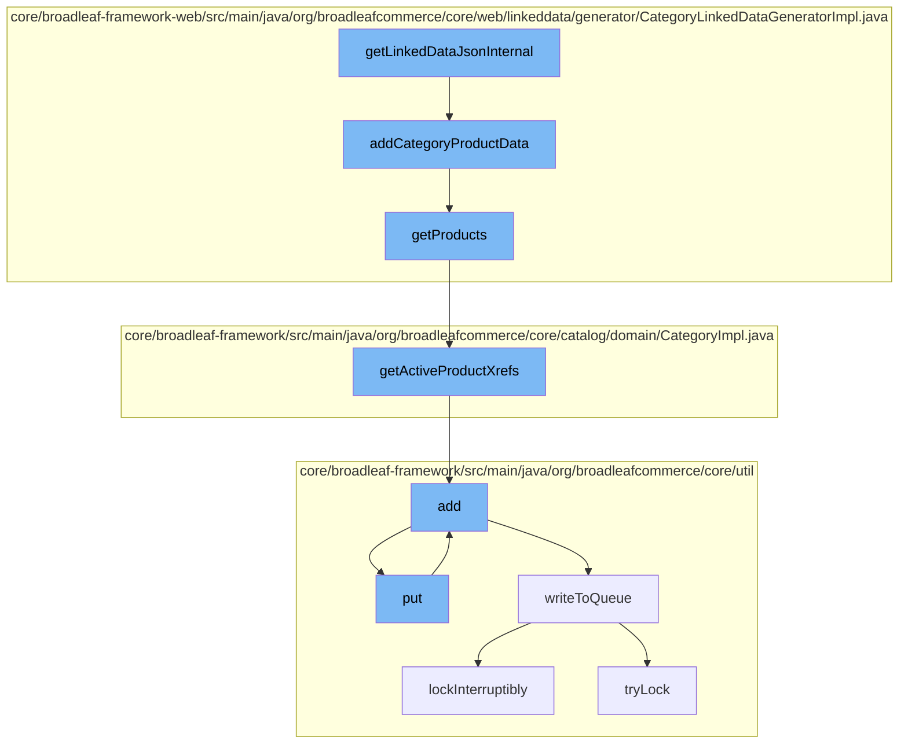

This document will cover the process of generating and managing linked data for product categories in the Broadleaf Commerce framework. The process includes:

1. Generating JSON data for a category
2. Adding product data to the category
3. Retrieving products for a category
4. Adding product references to a distributed queue
5. Writing data to the distributed queue.



<SwmSnippet path="/core/broadleaf-framework-web/src/main/java/org/broadleafcommerce/core/web/linkeddata/generator/CategoryLinkedDataGeneratorImpl.java" line="1">

---

# Generating JSON data for a category

The `getLinkedDataJsonInternal` function initiates the process of generating JSON linked data for a category. This is the entry point for the flow.

```java
/*-
 * #%L
 * BroadleafCommerce Framework Web
 * %%
 * Copyright (C) 2009 - 2024 Broadleaf Commerce
 * %%
 * Licensed under the Broadleaf Fair Use License Agreement, Version 1.0
 * (the "Fair Use License" located  at http://license.broadleafcommerce.org/fair_use_license-1.0.txt)
 * unless the restrictions on use therein are violated and require payment to Broadleaf in which case
 * the Broadleaf End User License Agreement (EULA), Version 1.1
 * (the "Commercial License" located at http://license.broadleafcommerce.org/commercial_license-1.1.txt)
 * shall apply.
 * 
 * Alternatively, the Commercial License may be replaced with a mutually agreed upon license (the "Custom License")
 * between you and Broadleaf Commerce. You may not use this file except in compliance with the applicable license.
 * #L%
 */
package org.broadleafcommerce.core.web.linkeddata.generator;

import org.broadleafcommerce.common.util.BLCArrayUtils;
import org.broadleafcommerce.common.util.TypedTransformer;
```

---

</SwmSnippet>

<SwmSnippet path="/core/broadleaf-framework-web/src/main/java/org/broadleafcommerce/core/web/linkeddata/generator/CategoryLinkedDataGeneratorImpl.java" line="75">

---

# Adding product data to the category

The `addCategoryProductData` function is called to add product data to the category JSON. It retrieves a list of products and adds each product as a `ListItem` to the `itemListElement` of the category data.

```java
    protected void addCategoryProductData(final HttpServletRequest request, final JSONObject categoryData) throws JSONException {
        final List<Product> products = getProducts(request);
        final JSONArray itemList = new JSONArray();

        for (int i = 0; i < products.size(); i++) {
            JSONObject item = new JSONObject();
            item.put("@type", "ListItem");
            item.put("position", i + 1);
            item.put("url", products.get(i).getUrl());
            itemList.put(item);

            extensionManager.getProxy().addCategoryProductData(request, categoryData);
        }

        categoryData.put("itemListElement", itemList);
    }
```

---

</SwmSnippet>

<SwmSnippet path="/core/broadleaf-framework-web/src/main/java/org/broadleafcommerce/core/web/linkeddata/generator/CategoryLinkedDataGeneratorImpl.java" line="92">

---

# Retrieving products for a category

The `getProducts` function retrieves the products for a category. It uses the `getActiveProductXrefs` function to get the active product references for the category.

```java
    protected List<Product> getProducts(final HttpServletRequest request) {
        Category category = (Category) request.getAttribute(CategoryHandlerMapping.CURRENT_CATEGORY_ATTRIBUTE_NAME);
        category = catalogService.findCategoryById(category.getId());
        return BLCArrayUtils.collect(category.getActiveProductXrefs().toArray(), new TypedTransformer<Product>() {
            @Override
            public Product transform(Object input) {
                return ((CategoryProductXref) input).getProduct();
            }
        });
    }
```

---

</SwmSnippet>

<SwmSnippet path="/core/broadleaf-framework/src/main/java/org/broadleafcommerce/core/util/service/ResourcePurgeServiceImpl.java" line="593">

---

# Adding product references to a distributed queue

The `add` function in `ResourcePurgeServiceImpl` adds the product reference to a cache if it doesn't already exist. This is part of the process of adding the product references to a distributed queue.

```java
        public Long add(Long entry) {
            if (! cache.containsKey(entry)) {
                return cache.put(entry, new Long(System.currentTimeMillis()));
            }
            return null;
        }
```

---

</SwmSnippet>

<SwmSnippet path="/core/broadleaf-framework/src/main/java/org/broadleafcommerce/core/util/queue/ZookeeperDistributedQueue.java" line="503">

---

# Writing data to the distributed queue

The `writeToQueue` function writes the product references to a distributed queue. It uses a distributed lock to ensure thread safety during the write operation.

```java
    protected int writeToQueue(List<? extends T> entries, final long timeout) throws InterruptedException {
        if (entries == null || entries.isEmpty()) {
            return 0;
        }
        
        int entryCount = 0;
        long waitTime = timeout;
        synchronized (QUEUE_MONITOR) {
            while (true) {
                boolean locked = false;
                DistributedLock lock = getQueueAccessLock();
                if (timeout < 0L) {
                    lock.lockInterruptibly();
                    locked = true;
                } else if (timeout > 0L && waitTime > 0L) {
                    long start = System.currentTimeMillis();
                    locked = lock.tryLock(waitTime, TimeUnit.MILLISECONDS);
                    long end = System.currentTimeMillis();
                    waitTime -= (end - start);
                } else {
                    locked = lock.tryLock();
```

---

</SwmSnippet>

&nbsp;

*This is an auto-generated document by Swimm AI 🌊 and has not yet been verified by a human*

<SwmMeta version="3.0.0" repo-id="Z2l0aHViJTNBJTNBQnJvYWRsZWFmQ29tbWVyY2UtZGVtbyUzQSUzQWdpbGFkbmF2b3Q=" repo-name="BroadleafCommerce-demo" doc-type="flows"><sup>Powered by [Swimm](/)</sup></SwmMeta>
