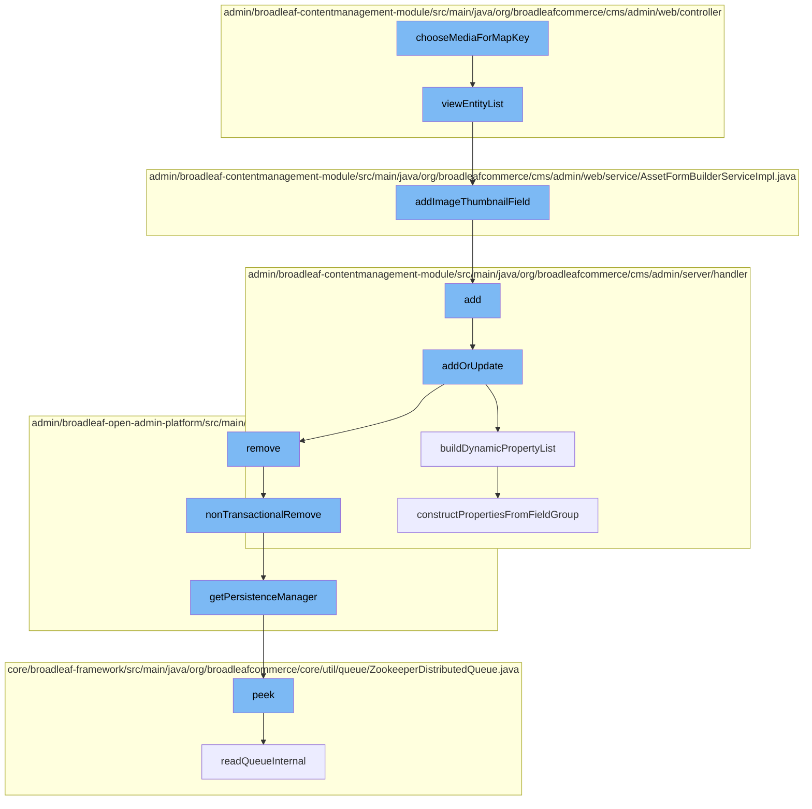

This document will cover the process of handling media assets in the BroadleafCommerce-demo repository. The process includes:

1. Choosing media for a map key
2. Viewing the entity list
3. Adding an image thumbnail field
4. Adding or updating a page template
5. Building a dynamic property list
6. Removing an entity non-transactionally
7. Getting the persistence manager
8. Reading the queue internally
9. Constructing properties from a field group.



<SwmSnippet path="/admin/broadleaf-contentmanagement-module/src/main/java/org/broadleafcommerce/cms/admin/web/controller/AdminAssetUploadController.java" line="1">

---

# Choosing media for a map key

The function `chooseMediaForMapKey` is the starting point of the flow. It is responsible for selecting the appropriate media asset based on a provided map key.

```java
/*-
 * #%L
 * BroadleafCommerce CMS Module
 * %%
 * Copyright (C) 2009 - 2024 Broadleaf Commerce
 * %%
 * Licensed under the Broadleaf Fair Use License Agreement, Version 1.0
 * (the "Fair Use License" located  at http://license.broadleafcommerce.org/fair_use_license-1.0.txt)
 * unless the restrictions on use therein are violated and require payment to Broadleaf in which case
 * the Broadleaf End User License Agreement (EULA), Version 1.1
 * (the "Commercial License" located at http://license.broadleafcommerce.org/commercial_license-1.1.txt)
 * shall apply.
 * 
 * Alternatively, the Commercial License may be replaced with a mutually agreed upon license (the "Custom License")
 * between you and Broadleaf Commerce. You may not use this file except in compliance with the applicable license.
 * #L%
 */
package org.broadleafcommerce.cms.admin.web.controller;

import org.broadleafcommerce.cms.file.domain.ImageStaticAssetImpl;
import org.broadleafcommerce.cms.file.domain.StaticAsset;
```

---

</SwmSnippet>

<SwmSnippet path="/admin/broadleaf-contentmanagement-module/src/main/java/org/broadleafcommerce/cms/admin/web/controller/AdminAssetController.java" line="78">

---

# Viewing the entity list

The `viewEntityList` function is called next. It handles the request to view a list of entities, in this case, media assets. It also modifies the default add button to an upload asset button.

```java
    @Override
    @SuppressWarnings("unchecked")
    @RequestMapping(value = "", method = RequestMethod.GET)
    public String viewEntityList(HttpServletRequest request, HttpServletResponse response, Model model,
            @PathVariable  Map<String, String> pathVars,
            @RequestParam  MultiValueMap<String, String> requestParams) throws Exception {
        String returnPath = super.viewEntityList(request, response, model, pathVars, requestParams);
        
        // Remove the default add button and replace it with an upload asset button
        List<EntityFormAction> mainActions = (List<EntityFormAction>) model.asMap().get("mainActions");
        Iterator<EntityFormAction> actions = mainActions.iterator();
        while (actions.hasNext()) {
            EntityFormAction action = actions.next();
            if (EntityFormAction.ADD.equals(action.getId())) {
                actions.remove();
                break;
            }
        }
        mainActions.add(0, new EntityFormAction("UPLOAD_ASSET")
                .withButtonClass("upload-asset")
                .withIconClass("icon-camera")
```

---

</SwmSnippet>

<SwmSnippet path="/admin/broadleaf-contentmanagement-module/src/main/java/org/broadleafcommerce/cms/admin/web/service/AssetFormBuilderServiceImpl.java" line="46">

---

# Adding an image thumbnail field

The `addImageThumbnailField` function is then called. It adds a thumbnail field to the list grid for each media asset.

```java
    @Override
    public void addImageThumbnailField(ListGrid listGrid, String urlField) {
        listGrid.getHeaderFields().add(new Field()
            .withName("thumbnail")
            .withFriendlyName("Asset_thumbnail")
            .withFieldType(SupportedFieldType.STRING.toString())
            .withOrder(Integer.MIN_VALUE)
            .withColumnWidth("50px")
            .withFilterSortDisabled(true));
        
        for (ListGridRecord record : listGrid.getRecords()) {
            // Get the value of the URL
            String imageUrl = record.getField(urlField).getValue();
            
            // Prepend the static asset url prefix if necessary
            String staticAssetUrlPrefix = staticAssetService.getStaticAssetUrlPrefix();
            if (staticAssetUrlPrefix != null && !staticAssetUrlPrefix.startsWith("/")) {
                staticAssetUrlPrefix = "/" + staticAssetUrlPrefix;
            }
            if (staticAssetUrlPrefix == null) {
                staticAssetUrlPrefix = "";
```

---

</SwmSnippet>

<SwmSnippet path="/admin/broadleaf-contentmanagement-module/src/main/java/org/broadleafcommerce/cms/admin/server/handler/PageTemplateCustomPersistenceHandler.java" line="294">

---

# Adding or updating a page template

The `addOrUpdate` function is responsible for adding or updating a page template. It validates the dynamic fields of the page and updates the page fields accordingly.

```java
    @Override
    public Entity add(PersistencePackage persistencePackage, DynamicEntityDao dynamicEntityDao, RecordHelper helper) throws ServiceException {
        return addOrUpdate(persistencePackage, dynamicEntityDao, helper);
    }

    protected Entity addOrUpdate(PersistencePackage persistencePackage, DynamicEntityDao dynamicEntityDao, RecordHelper helper) throws ServiceException {
        String ceilingEntityFullyQualifiedClassname = persistencePackage.getCeilingEntityFullyQualifiedClassname();
        try {
            String pageId = persistencePackage.getCustomCriteria()[1];

            if (StringUtils.isBlank(pageId)) {
                return persistencePackage.getEntity();
            }

            Page page = pageService.findPageById(Long.valueOf(pageId));

            Property[] properties = dynamicFieldUtil.buildDynamicPropertyList(getFieldGroups(page, null), PageTemplate.class);
            Map<String, FieldMetadata> md = new HashMap<String, FieldMetadata>();
            for (Property property : properties) {
                md.put(property.getName(), property.getMetadata());
            }
```

---

</SwmSnippet>

<SwmSnippet path="/admin/broadleaf-contentmanagement-module/src/main/java/org/broadleafcommerce/cms/admin/server/handler/DynamicFieldPersistenceHandlerHelper.java" line="109">

---

# Building a dynamic property list

The `buildDynamicPropertyList` function constructs a list of dynamic properties from the field groups of a structured content type.

```java
    /**
     * Builds all of the metadata for all of the dynamic properties within a {@link StructuredContentType}, gleaned from
     * the {@link FieldGroup}s and {@link FieldDefinition}s.
     *
     * @param fieldGroups groups that the {@link Property}s are built from
     * @param inheritedType the value that each built {@link FieldMetadata} for each property will use to notate where the
     * dynamic field actually came from (meaning {@link FieldMetadata#setAvailableToTypes(String[])} and {@link FieldMetadata#setInheritedFromType(String)}
     * @return
     */
    public Property[] buildDynamicPropertyList(List<FieldGroup> fieldGroups, Class<?> inheritedType) {
        List<Property> propertiesList = new ArrayList<Property>();
        for (FieldGroup group : fieldGroups) {
            constructPropertiesFromFieldGroup(inheritedType, propertiesList, group, 0l);
        }
        Property property = constructIdProperty(inheritedType);
        propertiesList.add(property);

        Property[] properties = sortProperties(propertiesList);
        return properties;
    }
```

---

</SwmSnippet>

<SwmSnippet path="/admin/broadleaf-open-admin-platform/src/main/java/org/broadleafcommerce/openadmin/server/service/DynamicEntityRemoteService.java" line="329">

---

# Removing an entity non-transactionally

The `nonTransactionalRemove` function is called to remove an entity from the persistence context without affecting the transaction.

```java
    @Override
    public PersistenceResponse nonTransactionalRemove(final PersistencePackage persistencePackage) throws ServiceException {
        return persistenceThreadManager.operation(TargetModeType.SANDBOX, persistencePackage, new Persistable <PersistenceResponse, ServiceException>() {
            @Override
            public PersistenceResponse execute() throws ServiceException {
                try {
                    PersistenceManager persistenceManager = PersistenceManagerFactory.getPersistenceManager();
                    return persistenceManager.remove(persistencePackage);
                } catch (ServiceException e) {
                    //immediately throw validation exceptions without printing a stack trace
                    if (e instanceof ValidationException) {
                        throw e;
                    } else if (e.getCause() instanceof ValidationException) {
                        throw (ValidationException) e.getCause();
                    }
                    LOG.error("Problem removing " + persistencePackage.getCeilingEntityFullyQualifiedClassname(), e);
                    String message = exploitProtectionService.cleanString(e.getMessage());
                    throw recreateSpecificServiceException(e, message, e.getCause());
                }
            }
        });
```

---

</SwmSnippet>

<SwmSnippet path="/admin/broadleaf-open-admin-platform/src/main/java/org/broadleafcommerce/openadmin/server/service/persistence/PersistenceManagerContext.java" line="49">

---

# Getting the persistence manager

The `getPersistenceManager` function retrieves the current persistence manager from the context.

```java
    public PersistenceManager getPersistenceManager() {
        return !persistenceManager.empty()?persistenceManager.peek():null;
    }
```

---

</SwmSnippet>

<SwmSnippet path="/core/broadleaf-framework/src/main/java/org/broadleafcommerce/core/util/queue/ZookeeperDistributedQueue.java" line="222">

---

# Reading the queue internally

The `readQueueInternal` function reads the queue internally to retrieve the next element.

```java
    @Override
    public T peek() {
        try {
            Map<String, T> elements = readQueueInternal(1, false, 0L);
            Iterator<Map.Entry<String, T>> entries = elements.entrySet().iterator();
            if (entries.hasNext()) {
                return entries.next().getValue();
            }
            
            return null;
        } catch (InterruptedException e) {
            Thread.currentThread().interrupt();
            return null;
        }
    }
```

---

</SwmSnippet>

<SwmSnippet path="/admin/broadleaf-contentmanagement-module/src/main/java/org/broadleafcommerce/cms/admin/server/handler/DynamicFieldPersistenceHandlerHelper.java" line="186">

---

# Constructing properties from a field group

The `constructPropertiesFromFieldGroup` function constructs properties from a field group. It is used to build dynamic properties for a structured content type.

```java
    private void constructPropertiesFromFieldGroup(Class<?> inheritedType, List<Property> propertiesList, FieldGroup group, Long groupOrder) {
        List<FieldDefinition> definitions = group.getFieldDefinitions();
        for (FieldDefinition def : definitions) {
            Property property = buildDynamicProperty(def, inheritedType);
            BasicFieldMetadata fieldMetadata = (BasicFieldMetadata) property.getMetadata();
            fieldMetadata.setGroup(group.getName());
            fieldMetadata.setGroupCollapsed(group.getInitCollapsedFlag());
            fieldMetadata.setGroupOrder(groupOrder.intValue());
            propertiesList.add(property);
        }
    }
```

---

</SwmSnippet>

&nbsp;

*This is an auto-generated document by Swimm AI 🌊 and has not yet been verified by a human*

<SwmMeta version="3.0.0" repo-id="Z2l0aHViJTNBJTNBQnJvYWRsZWFmQ29tbWVyY2UtZGVtbyUzQSUzQWdpbGFkbmF2b3Q=" repo-name="BroadleafCommerce-demo" doc-type="flows"><sup>Powered by [Swimm](/)</sup></SwmMeta>
