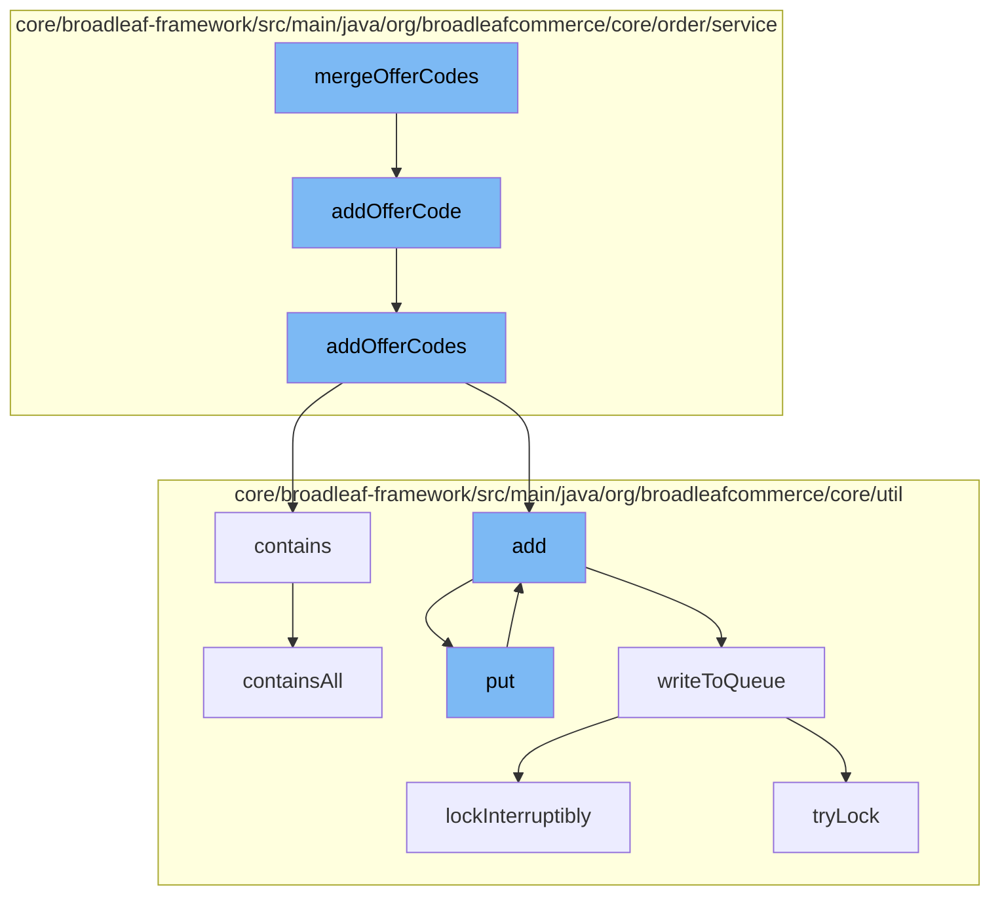

This document will cover the process of merging offer codes in the BroadleafCommerce-demo repository. The process includes the following steps:

1. Merging offer codes
2. Adding offer codes to the order
3. Checking if the offer codes already exist
4. Adding the offer codes to the distributed queue
5. Writing the offer codes to the queue.



<SwmSnippet path="/core/broadleaf-framework/src/main/java/org/broadleafcommerce/core/order/service/legacy/LegacyMergeCartServiceImpl.java" line="1">

---

# Merging offer codes

The `mergeOfferCodes` function in `LegacyMergeCartServiceImpl.java` is the starting point of the process. It is responsible for merging offer codes.

```java
/*-
```

---

</SwmSnippet>

<SwmSnippet path="/core/broadleaf-framework/src/main/java/org/broadleafcommerce/core/order/service/OrderServiceImpl.java" line="464">

---

# Adding offer codes to the order

The `addOfferCode` function in `OrderServiceImpl.java` is called by `mergeOfferCodes`. It adds the offer code to the order.

```java
    @Override
    @Transactional("blTransactionManager")
    public Order addOfferCode(Order order, OfferCode offerCode, boolean priceOrder) throws PricingException, OfferException {
        ArrayList<OfferCode> offerCodes = new ArrayList<OfferCode>();
        offerCodes.add(offerCode);
        return addOfferCodes(order, offerCodes, priceOrder);
    }
```

---

</SwmSnippet>

<SwmSnippet path="/core/broadleaf-framework/src/main/java/org/broadleafcommerce/core/util/queue/ZookeeperDistributedQueue.java" line="474">

---

# Checking if the offer codes already exist

The `contains` function in `ZookeeperDistributedQueue.java` is called by `addOfferCodes`. It checks if the offer codes already exist in the queue.

```java
    @Override
    public boolean contains(Object o) {
        return containsAll(Collections.singletonList(o));
    }
```

---

</SwmSnippet>

<SwmSnippet path="/core/broadleaf-framework/src/main/java/org/broadleafcommerce/core/util/service/ResourcePurgeServiceImpl.java" line="1">

---

# Adding the offer codes to the distributed queue

The `add` function in `ResourcePurgeServiceImpl.java` is called by `addOfferCodes`. It adds the offer codes to the distributed queue.

```java
/*-
```

---

</SwmSnippet>

<SwmSnippet path="/core/broadleaf-framework/src/main/java/org/broadleafcommerce/core/util/queue/ZookeeperDistributedQueue.java" line="503">

---

# Writing the offer codes to the queue

The `writeToQueue` function in `ZookeeperDistributedQueue.java` is called by `add` and `put`. It writes the offer codes to the queue.

```java
    protected int writeToQueue(List<? extends T> entries, final long timeout) throws InterruptedException {
        if (entries == null || entries.isEmpty()) {
            return 0;
        }
        
        int entryCount = 0;
        long waitTime = timeout;
        synchronized (QUEUE_MONITOR) {
            while (true) {
                boolean locked = false;
                DistributedLock lock = getQueueAccessLock();
                if (timeout < 0L) {
                    lock.lockInterruptibly();
                    locked = true;
                } else if (timeout > 0L && waitTime > 0L) {
                    long start = System.currentTimeMillis();
                    locked = lock.tryLock(waitTime, TimeUnit.MILLISECONDS);
                    long end = System.currentTimeMillis();
                    waitTime -= (end - start);
                } else {
                    locked = lock.tryLock();
```

---

</SwmSnippet>

&nbsp;

*This is an auto-generated document by Swimm AI 🌊 and has not yet been verified by a human*

<SwmMeta version="3.0.0" repo-id="Z2l0aHViJTNBJTNBQnJvYWRsZWFmQ29tbWVyY2UtZGVtbyUzQSUzQWdpbGFkbmF2b3Q=" repo-name="BroadleafCommerce-demo" doc-type="flows"><sup>Powered by [Swimm](/)</sup></SwmMeta>
