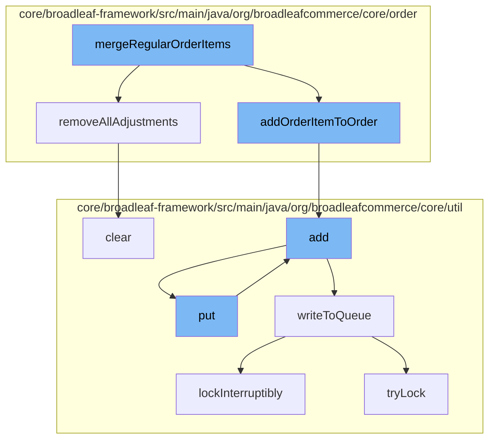

This document will cover the process of merging regular order items in the BroadleafCommerce-demo repository. The process includes the following steps:

1. Merging regular order items
2. Removing all adjustments
3. Adding order items to the order
4. Adding entries to the cache
5. Writing to the queue
6. Locking the queue
7. Clearing the queue.



<SwmSnippet path="/core/broadleaf-framework/src/main/java/org/broadleafcommerce/core/order/service/legacy/LegacyMergeCartServiceImpl.java" line="1">

---

# Merging Regular Order Items

The `mergeRegularOrderItems` function is the starting point of the process. It is responsible for merging regular order items in the cart.

```java
/*-
 * #%L
 * BroadleafCommerce Framework
 * %%
 * Copyright (C) 2009 - 2024 Broadleaf Commerce
 * %%
 * Licensed under the Broadleaf Fair Use License Agreement, Version 1.0
 * (the "Fair Use License" located  at http://license.broadleafcommerce.org/fair_use_license-1.0.txt)
 * unless the restrictions on use therein are violated and require payment to Broadleaf in which case
 * the Broadleaf End User License Agreement (EULA), Version 1.1
 * (the "Commercial License" located at http://license.broadleafcommerce.org/commercial_license-1.1.txt)
 * shall apply.
 * 
 * Alternatively, the Commercial License may be replaced with a mutually agreed upon license (the "Custom License")
 * between you and Broadleaf Commerce. You may not use this file except in compliance with the applicable license.
 * #L%
 */
package org.broadleafcommerce.core.order.service.legacy;

import org.apache.commons.lang.StringUtils;
import org.broadleafcommerce.core.offer.dao.OfferDao;
```

---

</SwmSnippet>

<SwmSnippet path="/core/broadleaf-framework/src/main/java/org/broadleafcommerce/core/order/domain/FulfillmentGroupImpl.java" line="534">

---

# Removing All Adjustments

The `removeAllAdjustments` function is called to remove all adjustments from the fulfillment group. This is necessary to ensure that the order items are correctly merged without any previous adjustments.

```java
    @Override
    public void removeAllAdjustments() {
        if (fulfillmentGroupAdjustments != null) {
            for (FulfillmentGroupAdjustment adjustment : fulfillmentGroupAdjustments) {
                adjustment.setFulfillmentGroup(null);
            }
            fulfillmentGroupAdjustments.clear();
        }
    }
```

---

</SwmSnippet>

<SwmSnippet path="/core/broadleaf-framework/src/main/java/org/broadleafcommerce/core/order/service/legacy/LegacyMergeCartServiceImpl.java" line="101">

---

# Adding Order Items to the Order

The `addOrderItemToOrder` function is called to add the merged order items to the order.

```java
        // add anonymous cart items (make sure they are valid)
        if (anonymousCart != null && (customerCart == null || !customerCart.getId().equals(anonymousCart.getId()))) {
            if (anonymousCart != null && anonymousCart.getOrderItems() != null && !anonymousCart.getOrderItems().isEmpty()) {
                if (customerCart == null) {
                    customerCart = orderService.createNewCartForCustomer(customer);
                }
                
                Map<OrderItem, OrderItem> oldNewItemMap = new HashMap<OrderItem, OrderItem>();
                customerCart = mergeRegularOrderItems(anonymousCart, mergeCartResponse, customerCart, oldNewItemMap);
                customerCart = mergeOfferCodes(anonymousCart, customerCart);
                customerCart = removeExpiredGiftWrapOrderItems(mergeCartResponse, customerCart, oldNewItemMap);
                customerCart = mergeGiftWrapOrderItems(mergeCartResponse, customerCart, oldNewItemMap);

                orderService.cancelOrder(anonymousCart);
            }
        }
        
        // copy the customer's email to this order, overriding any previously set email
        if (customerCart != null && StringUtils.isNotBlank(customer.getEmailAddress())) {
            customerCart.setEmailAddress(customer.getEmailAddress());
            customerCart = orderService.save(customerCart, priceOrder);
```

---

</SwmSnippet>

<SwmSnippet path="/core/broadleaf-framework/src/main/java/org/broadleafcommerce/core/util/service/ResourcePurgeServiceImpl.java" line="593">

---

# Adding Entries to the Cache

The `add` function is called to add entries to the cache. This is done to keep track of the order items that have been added to the order.

```java
        public Long add(Long entry) {
            if (! cache.containsKey(entry)) {
                return cache.put(entry, new Long(System.currentTimeMillis()));
            }
            return null;
        }
```

---

</SwmSnippet>

<SwmSnippet path="/core/broadleaf-framework/src/main/java/org/broadleafcommerce/core/util/queue/ZookeeperDistributedQueue.java" line="503">

---

# Writing to the Queue

The `writeToQueue` function is called to write the order items to the queue. This is done to ensure that the order items are processed in the correct order.

```java
    protected int writeToQueue(List<? extends T> entries, final long timeout) throws InterruptedException {
        if (entries == null || entries.isEmpty()) {
            return 0;
        }
        
        int entryCount = 0;
        long waitTime = timeout;
        synchronized (QUEUE_MONITOR) {
            while (true) {
                boolean locked = false;
                DistributedLock lock = getQueueAccessLock();
                if (timeout < 0L) {
                    lock.lockInterruptibly();
                    locked = true;
                } else if (timeout > 0L && waitTime > 0L) {
                    long start = System.currentTimeMillis();
                    locked = lock.tryLock(waitTime, TimeUnit.MILLISECONDS);
                    long end = System.currentTimeMillis();
                    waitTime -= (end - start);
                } else {
                    locked = lock.tryLock();
```

---

</SwmSnippet>

<SwmSnippet path="/core/broadleaf-framework/src/main/java/org/broadleafcommerce/core/util/lock/ReentrantDistributedZookeeperLock.java" line="335">

---

# Locking the Queue

The `lockInterruptibly` function is called to lock the queue. This is done to ensure that the order items are processed in the correct order and no other process can interfere with the queue while the order items are being processed.

```java
    @Override
    public void lockInterruptibly() throws InterruptedException {
        if (Thread.interrupted()) {
            throw new InterruptedException("Thread was interrupted prior to trying to acquire the lock.");
        }
        
        lockInternally(-1L);
    }
```

---

</SwmSnippet>

<SwmSnippet path="/core/broadleaf-framework/src/main/java/org/broadleafcommerce/core/util/queue/ZookeeperDistributedQueue.java" line="331">

---

# Clearing the Queue

Finally, the `clear` function is called to clear the queue. This is done to ensure that the queue is ready for the next set of order items to be processed.

```java
    @Override
    public void clear() {
        DistributedLock lock = getQueueAccessLock();
        try {
            lock.lockInterruptibly();
            try {
                executeOperation(new GenericOperation<Void>() {
                    @Override
                    public Void execute() throws Exception {
                        List<String> entryNames = getZookeeperClient().getChildren(getQueueEntryFolder(), null);
                        if (entryNames != null) {
                            for (String entry : entryNames) {
                                getZookeeperClient().delete(getQueueEntryFolder() + '/' + entry, 0);
                            }
                        }
                        return null;
                    }
                });
                
            } finally {
                lock.unlock();
```

---

</SwmSnippet>

&nbsp;

*This is an auto-generated document by Swimm AI 🌊 and has not yet been verified by a human*

<SwmMeta version="3.0.0" repo-id="Z2l0aHViJTNBJTNBQnJvYWRsZWFmQ29tbWVyY2UtZGVtbyUzQSUzQWdpbGFkbmF2b3Q=" repo-name="BroadleafCommerce-demo" doc-type="flows"><sup>Powered by [Swimm](/)</sup></SwmMeta>
