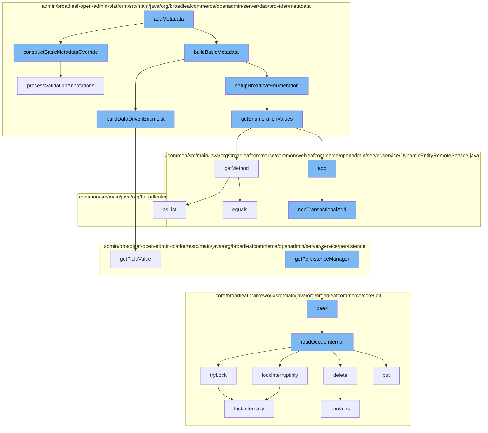

This document will cover the process of adding metadata in the BroadleafCommerce-demo repository, which includes:

1. Constructing basic metadata override
2. Building basic metadata
3. Setting up Broadleaf enumeration
4. Getting enumeration values
5. Adding non-transactional data
6. Getting persistence manager
7. Reading queue internally
8. Locking internally



<SwmSnippet path="/admin/broadleaf-open-admin-platform/src/main/java/org/broadleafcommerce/openadmin/server/dao/provider/metadata/BasicFieldMetadataProvider.java" line="353">

---

# Constructing basic metadata override

The `constructBasicMetadataOverride` function is used to construct a metadata override object based on the provided annotations. This includes setting various properties such as field type, group, tab, visibility, and more.

```java
    protected FieldMetadataOverride constructBasicMetadataOverride(AdminPresentation annot, AdminPresentationToOneLookup toOneLookup,
            AdminPresentationDataDrivenEnumeration dataDrivenEnumeration) {
        if (annot != null) {
            FieldMetadataOverride override = new FieldMetadataOverride();
            override.setBroadleafEnumeration(annot.broadleafEnumeration());
            override.setHideEnumerationIfEmpty(annot.hideEnumerationIfEmpty());
            override.setFieldComponentRenderer(annot.fieldComponentRenderer());
            override.setFieldComponentRendererTemplate(annot.fieldComponentRendererTemplate());
            override.setGridFieldComponentRenderer(annot.gridFieldComponentRenderer());
            override.setGridFieldComponentRendererTemplate(annot.gridFieldComponentRendererTemplate());
            override.setColumnWidth(annot.columnWidth());
            override.setExplicitFieldType(annot.fieldType());
            override.setDisplayType(annot.displayType());
            override.setFieldType(annot.fieldType());
            override.setGroup(annot.group());
            override.setGroupCollapsed(annot.groupCollapsed());
            override.setGroupOrder(annot.groupOrder());
            override.setTab(annot.tab());
            override.setRuleIdentifier(annot.ruleIdentifier());
            override.setTabOrder(annot.tabOrder());
            override.setHelpText(annot.helpText());
```

---

</SwmSnippet>

<SwmSnippet path="/admin/broadleaf-open-admin-platform/src/main/java/org/broadleafcommerce/openadmin/server/dao/provider/metadata/BasicFieldMetadataProvider.java" line="690">

---

# Building basic metadata

The `buildBasicMetadata` function is used to build the basic metadata for a field. This includes setting up data-driven enumeration lists if applicable.

```java
    protected void buildDataDrivenEnumList(BasicFieldMetadata metadata) {
        try {
            DynamicEntityDao dynamicEntityDao = PersistenceManagerFactory.getDefaultPersistenceManager().getDynamicEntityDao();
            FieldManager fieldManager = dynamicEntityDao.getFieldManager();

            Class criteriaClass = Class.forName(metadata.getOptionListEntity());

            CriteriaBuilder builder = dynamicEntityDao.getStandardEntityManager().getCriteriaBuilder();
            CriteriaQuery criteria = builder.createQuery(criteriaClass);
            Root root = criteria.from(criteriaClass);
            List<Predicate> restrictions = new ArrayList<>();

            if (metadata.getOptionListEntity().equals(DataDrivenEnumerationValueImpl.class.getName())) {
                restrictions.add(builder.equal(root.get("hidden"), false));
            }

            if (metadata.getOptionFilterParams() != null) {
                for (String[] param : metadata.getOptionFilterParams()) {
                    Path current = root;
                    String key = param[0];
                    if (!key.equals(".ignore")) {
```

---

</SwmSnippet>

<SwmSnippet path="/admin/broadleaf-open-admin-platform/src/main/java/org/broadleafcommerce/openadmin/server/dao/provider/metadata/AbstractFieldMetadataProvider.java" line="37">

---

# Setting up Broadleaf enumeration

The `setupBroadleafEnumeration` function is used to set up Broadleaf enumeration values for a field. This is done by calling the `getEnumerationValues` function.

```java
import java.util.HashMap;
import java.util.List;
import java.util.Map;

import javax.annotation.Resource;
import javax.persistence.ManyToMany;
import javax.persistence.MapKey;
import javax.persistence.OneToMany;

/**
 * @author Jeff Fischer
 */
public abstract class AbstractFieldMetadataProvider extends AbstractMetadataProvider implements FieldMetadataProvider {

    @Resource(name = "blEntityConfiguration")
    protected EntityConfiguration entityConfiguration;
    
    @Resource(name = "blBroadleafEnumerationUtility")
    protected BroadleafEnumerationUtility enumerationUtility;

    protected void setClassOwnership(Class<?> parentClass, Class<?> targetClass, Map<String, FieldMetadata> attributes, FieldInfo field) {
```

---

</SwmSnippet>

<SwmSnippet path="/admin/broadleaf-open-admin-platform/src/main/java/org/broadleafcommerce/openadmin/server/dao/provider/metadata/BroadleafEnumerationUtility.java" line="37">

---

# Getting enumeration values

The `getEnumerationValues` function is used to get the enumeration values for a given Broadleaf enumeration class. The values are returned as a list of tuples, where each tuple contains a value and its corresponding friendly name.

```java
    @SuppressWarnings("rawtypes")
    public List<Tuple<String, String>> getEnumerationValues(String broadleafEnumerationClass, DynamicEntityDao dynamicEntityDao) {
        try {
            Map<String, String> enumVals;
            Class<?> broadleafEnumeration = Class.forName(broadleafEnumerationClass);  
    
            Method typeMethod = broadleafEnumeration.getMethod("getType");
            Method friendlyTypeMethod = broadleafEnumeration.getMethod("getFriendlyType");
            Field types = dynamicEntityDao.getFieldManager().getField(broadleafEnumeration, "TYPES");
            
            if (Comparable.class.isAssignableFrom(broadleafEnumeration)) {
                enumVals = new LinkedHashMap<String, String>();
                if (types != null) {
                    Map<Object, ?> typesMap = getTypesMap(types, broadleafEnumeration);
                    for (final Object value : getSortedEnumValues(typesMap)) {
                        enumVals.put((String) friendlyTypeMethod.invoke(value), (String) typeMethod.invoke(value));
                    }
                }
            } else {
                enumVals = new TreeMap<String, String>();
                if (types != null) {
```

---

</SwmSnippet>

<SwmSnippet path="/admin/broadleaf-open-admin-platform/src/main/java/org/broadleafcommerce/openadmin/server/service/DynamicEntityRemoteService.java" line="274">

---

# Adding non-transactional data

The `nonTransactionalAdd` function is used to add a persistence package in a non-transactional manner. This is done by calling the `add` function of the persistence manager.

```java
    @Override
    public PersistenceResponse nonTransactionalAdd(final PersistencePackage persistencePackage) throws ServiceException {
        return persistenceThreadManager.operation(TargetModeType.SANDBOX, persistencePackage, new Persistable <PersistenceResponse, ServiceException>() {
            @Override
            public PersistenceResponse execute() throws ServiceException {
                boolean shouldClean = isShouldClean();
                if (shouldClean && (CollectionUtils.isEmpty(entitiesIgnoreList) ||
                        !entitiesIgnoreList.contains(persistencePackage.getCeilingEntityFullyQualifiedClassname()))) {
                    cleanEntity(persistencePackage.getEntity());
                }
                try {
                    PersistenceManager persistenceManager = PersistenceManagerFactory.getPersistenceManager();
                    return persistenceManager.add(persistencePackage);
                } catch (ServiceException e) {
                    //immediately throw validation exceptions without printing a stack trace
                    if (e instanceof ValidationException) {
                        throw e;
                    } else if (e.getCause() instanceof ValidationException) {
                        throw (ValidationException) e.getCause();
                    }
                    String message = exploitProtectionService.cleanString(e.getMessage());
```

---

</SwmSnippet>

<SwmSnippet path="/admin/broadleaf-open-admin-platform/src/main/java/org/broadleafcommerce/openadmin/server/service/persistence/PersistenceManagerContext.java" line="49">

---

# Getting persistence manager

The `getPersistenceManager` function is used to get the current persistence manager from the context.

```java
    public PersistenceManager getPersistenceManager() {
        return !persistenceManager.empty()?persistenceManager.peek():null;
    }
```

---

</SwmSnippet>

<SwmSnippet path="/core/broadleaf-framework/src/main/java/org/broadleafcommerce/core/util/queue/ZookeeperDistributedQueue.java" line="591">

---

# Reading queue internally

The `readQueueInternal` function is used to read a certain number of elements from the queue. If the `remove` parameter is true, the elements are also removed from the queue.

```java
    protected Map<String, T> readQueueInternal(final int qty, final boolean remove, final long timeout) throws InterruptedException {
        final Map<String, T> out = new LinkedHashMap<>();
        long waitTime = timeout;
        synchronized (QUEUE_MONITOR) {
            while (true) {
                boolean locked;
                DistributedLock lock = getQueueAccessLock();
                if (timeout < 0L) {
                    lock.lockInterruptibly();
                    locked = true;
                } else if (timeout > 0L && waitTime > 0L) {
                    long start = System.currentTimeMillis();
                    locked = lock.tryLock(waitTime, TimeUnit.MILLISECONDS);
                    long end = System.currentTimeMillis();
                    waitTime -= (end - start);
                } else {
                    locked = lock.tryLock();
                    if (!locked) {
                        return out;
                    }
                }
```

---

</SwmSnippet>

<SwmSnippet path="/core/broadleaf-framework/src/main/java/org/broadleafcommerce/core/util/lock/ReentrantDistributedZookeeperLock.java" line="380">

---

# Locking internally

The `lockInternally` function is used to acquire a lock. If the lock cannot be acquired immediately, the function waits for the specified amount of time.

```java
    protected boolean lockInternally(final long waitTime) throws InterruptedException {
        if (!canParticipate()) {
            //No lock will be provided in this case, but we want to simulate the normal lock semantics.
            if (waitTime < 0L) {
                //Simulate normal lock semantics,where the lock is unavailable, but we've been asked to wait interruptably for it indefinitely.
                synchronized (NON_PARTICIPANT_LOCK_MONITOR) {
                    //This basically will cause this thread to block forever until the thread is interrupted, which is what we want.
                    NON_PARTICIPANT_LOCK_MONITOR.wait(); 
                }
            } else if (waitTime > 0L) {
                //Simulate normal lock semantics, where the lock is unavailable, but we've been asked to wait interruptably for it for a period of time.
                synchronized (NON_PARTICIPANT_LOCK_MONITOR) {
                    NON_PARTICIPANT_LOCK_MONITOR.wait(waitTime);
                }
            }
            
            return false;
        }
        
        //See if this thread already has a lock permit.  If so, just increment the count and return it.
        //No need to interact with Zookeeper.
```

---

</SwmSnippet>

&nbsp;

*This is an auto-generated document by Swimm AI 🌊 and has not yet been verified by a human*

<SwmMeta version="3.0.0" repo-id="Z2l0aHViJTNBJTNBQnJvYWRsZWFmQ29tbWVyY2UtZGVtbyUzQSUzQWdpbGFkbmF2b3Q=" repo-name="BroadleafCommerce-demo" doc-type="flows"><sup>Powered by [Swimm](/)</sup></SwmMeta>
