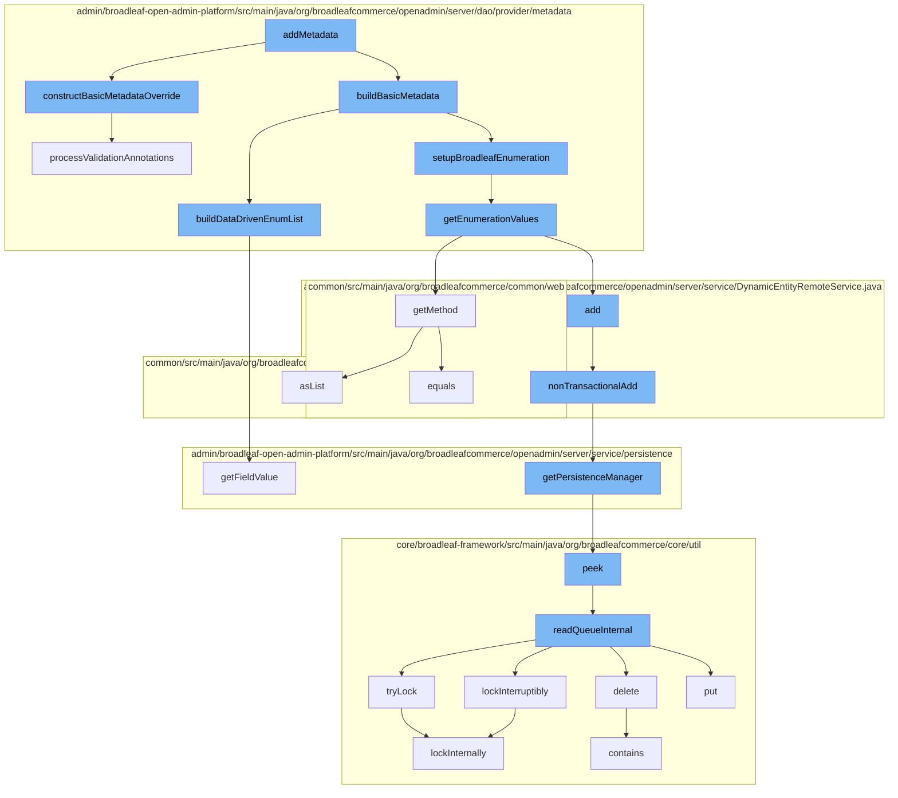

This document will cover the process of adding metadata in the BroadleafCommerce-demo repository. The process includes the following steps:

1. Constructing basic metadata override
2. Building basic metadata
3. Setting up Broadleaf enumeration
4. Getting enumeration values
5. Adding dynamic entity
6. Getting persistence manager
7. Reading queue internally
8. Locking internally



<SwmSnippet path="/admin/broadleaf-open-admin-platform/src/main/java/org/broadleafcommerce/openadmin/server/dao/provider/metadata/BasicFieldMetadataProvider.java" line="353">

---

# Constructing Basic Metadata Override

The `constructBasicMetadataOverride` function is used to construct a metadata override for a field. It takes in annotations and uses them to create a `FieldMetadataOverride` object, which is then returned. This object contains all the necessary information for overriding the field's metadata.

```java
    protected FieldMetadataOverride constructBasicMetadataOverride(AdminPresentation annot, AdminPresentationToOneLookup toOneLookup,
            AdminPresentationDataDrivenEnumeration dataDrivenEnumeration) {
        if (annot != null) {
            FieldMetadataOverride override = new FieldMetadataOverride();
            override.setBroadleafEnumeration(annot.broadleafEnumeration());
            override.setHideEnumerationIfEmpty(annot.hideEnumerationIfEmpty());
            override.setFieldComponentRenderer(annot.fieldComponentRenderer());
            override.setFieldComponentRendererTemplate(annot.fieldComponentRendererTemplate());
            override.setGridFieldComponentRenderer(annot.gridFieldComponentRenderer());
            override.setGridFieldComponentRendererTemplate(annot.gridFieldComponentRendererTemplate());
            override.setColumnWidth(annot.columnWidth());
            override.setExplicitFieldType(annot.fieldType());
            override.setDisplayType(annot.displayType());
            override.setFieldType(annot.fieldType());
            override.setGroup(annot.group());
            override.setGroupCollapsed(annot.groupCollapsed());
            override.setGroupOrder(annot.groupOrder());
            override.setTab(annot.tab());
            override.setRuleIdentifier(annot.ruleIdentifier());
            override.setTabOrder(annot.tabOrder());
            override.setHelpText(annot.helpText());
```

---

</SwmSnippet>

<SwmSnippet path="/admin/broadleaf-open-admin-platform/src/main/java/org/broadleafcommerce/openadmin/server/dao/provider/metadata/BasicFieldMetadataProvider.java" line="690">

---

# Building Basic Metadata

The `buildBasicMetadata` function is used to build a list of data-driven enums for the metadata. It uses the `DynamicEntityDao` to get the field manager and uses it to get the values for the enum fields. These values are then added to the metadata.

```java
    protected void buildDataDrivenEnumList(BasicFieldMetadata metadata) {
        try {
            DynamicEntityDao dynamicEntityDao = PersistenceManagerFactory.getDefaultPersistenceManager().getDynamicEntityDao();
            FieldManager fieldManager = dynamicEntityDao.getFieldManager();

            Class criteriaClass = Class.forName(metadata.getOptionListEntity());

            CriteriaBuilder builder = dynamicEntityDao.getStandardEntityManager().getCriteriaBuilder();
            CriteriaQuery criteria = builder.createQuery(criteriaClass);
            Root root = criteria.from(criteriaClass);
            List<Predicate> restrictions = new ArrayList<>();

            if (metadata.getOptionListEntity().equals(DataDrivenEnumerationValueImpl.class.getName())) {
                restrictions.add(builder.equal(root.get("hidden"), false));
            }

            if (metadata.getOptionFilterParams() != null) {
                for (String[] param : metadata.getOptionFilterParams()) {
                    Path current = root;
                    String key = param[0];
                    if (!key.equals(".ignore")) {
```

---

</SwmSnippet>

<SwmSnippet path="/admin/broadleaf-open-admin-platform/src/main/java/org/broadleafcommerce/openadmin/server/dao/provider/metadata/AbstractFieldMetadataProvider.java" line="37">

---

# Setting Up Broadleaf Enumeration

The `setupBroadleafEnumeration` function is used to set up the enumeration values for a field. It uses the `getEnumerationValues` function to get the enumeration values and then sets these values in the metadata.

```java
import java.util.HashMap;
import java.util.List;
import java.util.Map;

import javax.annotation.Resource;
import javax.persistence.ManyToMany;
import javax.persistence.MapKey;
import javax.persistence.OneToMany;

/**
 * @author Jeff Fischer
 */
public abstract class AbstractFieldMetadataProvider extends AbstractMetadataProvider implements FieldMetadataProvider {

    @Resource(name = "blEntityConfiguration")
    protected EntityConfiguration entityConfiguration;
    
    @Resource(name = "blBroadleafEnumerationUtility")
    protected BroadleafEnumerationUtility enumerationUtility;

    protected void setClassOwnership(Class<?> parentClass, Class<?> targetClass, Map<String, FieldMetadata> attributes, FieldInfo field) {
```

---

</SwmSnippet>

<SwmSnippet path="/admin/broadleaf-open-admin-platform/src/main/java/org/broadleafcommerce/openadmin/server/dao/provider/metadata/BroadleafEnumerationUtility.java" line="37">

---

# Getting Enumeration Values

The `getEnumerationValues` function is used to get the enumeration values for a field. It uses the `ZookeeperClient` to get the children of the field and then adds these children to the enumeration values.

```java
    @SuppressWarnings("rawtypes")
    public List<Tuple<String, String>> getEnumerationValues(String broadleafEnumerationClass, DynamicEntityDao dynamicEntityDao) {
        try {
            Map<String, String> enumVals;
            Class<?> broadleafEnumeration = Class.forName(broadleafEnumerationClass);  
    
            Method typeMethod = broadleafEnumeration.getMethod("getType");
            Method friendlyTypeMethod = broadleafEnumeration.getMethod("getFriendlyType");
            Field types = dynamicEntityDao.getFieldManager().getField(broadleafEnumeration, "TYPES");
            
            if (Comparable.class.isAssignableFrom(broadleafEnumeration)) {
                enumVals = new LinkedHashMap<String, String>();
                if (types != null) {
                    Map<Object, ?> typesMap = getTypesMap(types, broadleafEnumeration);
                    for (final Object value : getSortedEnumValues(typesMap)) {
                        enumVals.put((String) friendlyTypeMethod.invoke(value), (String) typeMethod.invoke(value));
                    }
                }
            } else {
                enumVals = new TreeMap<String, String>();
                if (types != null) {
```

---

</SwmSnippet>

<SwmSnippet path="/admin/broadleaf-open-admin-platform/src/main/java/org/broadleafcommerce/openadmin/server/service/DynamicEntityRemoteService.java" line="274">

---

# Adding Dynamic Entity

The `nonTransactionalAdd` function is used to add a dynamic entity to the persistence manager. It uses the `PersistenceManagerFactory` to get the persistence manager and then adds the entity to the manager.

```java
    @Override
    public PersistenceResponse nonTransactionalAdd(final PersistencePackage persistencePackage) throws ServiceException {
        return persistenceThreadManager.operation(TargetModeType.SANDBOX, persistencePackage, new Persistable <PersistenceResponse, ServiceException>() {
            @Override
            public PersistenceResponse execute() throws ServiceException {
                boolean shouldClean = isShouldClean();
                if (shouldClean && (CollectionUtils.isEmpty(entitiesIgnoreList) ||
                        !entitiesIgnoreList.contains(persistencePackage.getCeilingEntityFullyQualifiedClassname()))) {
                    cleanEntity(persistencePackage.getEntity());
                }
                try {
                    PersistenceManager persistenceManager = PersistenceManagerFactory.getPersistenceManager();
                    return persistenceManager.add(persistencePackage);
                } catch (ServiceException e) {
                    //immediately throw validation exceptions without printing a stack trace
                    if (e instanceof ValidationException) {
                        throw e;
                    } else if (e.getCause() instanceof ValidationException) {
                        throw (ValidationException) e.getCause();
                    }
                    String message = exploitProtectionService.cleanString(e.getMessage());
```

---

</SwmSnippet>

<SwmSnippet path="/admin/broadleaf-open-admin-platform/src/main/java/org/broadleafcommerce/openadmin/server/service/persistence/PersistenceManagerContext.java" line="49">

---

# Getting Persistence Manager

The `getPersistenceManager` function is used to get the persistence manager. It checks if the persistence manager is empty and if it is not, it returns the persistence manager.

```java
    public PersistenceManager getPersistenceManager() {
        return !persistenceManager.empty()?persistenceManager.peek():null;
    }
```

---

</SwmSnippet>

<SwmSnippet path="/core/broadleaf-framework/src/main/java/org/broadleafcommerce/core/util/queue/ZookeeperDistributedQueue.java" line="591">

---

# Reading Queue Internally

The `readQueueInternal` function is used to read the queue internally. It uses the `ZookeeperClient` to get the children of the queue and then adds these children to the queue.

```java
    protected Map<String, T> readQueueInternal(final int qty, final boolean remove, final long timeout) throws InterruptedException {
        final Map<String, T> out = new LinkedHashMap<>();
        long waitTime = timeout;
        synchronized (QUEUE_MONITOR) {
            while (true) {
                boolean locked;
                DistributedLock lock = getQueueAccessLock();
                if (timeout < 0L) {
                    lock.lockInterruptibly();
                    locked = true;
                } else if (timeout > 0L && waitTime > 0L) {
                    long start = System.currentTimeMillis();
                    locked = lock.tryLock(waitTime, TimeUnit.MILLISECONDS);
                    long end = System.currentTimeMillis();
                    waitTime -= (end - start);
                } else {
                    locked = lock.tryLock();
                    if (!locked) {
                        return out;
                    }
                }
```

---

</SwmSnippet>

<SwmSnippet path="/core/broadleaf-framework/src/main/java/org/broadleafcommerce/core/util/lock/ReentrantDistributedZookeeperLock.java" line="344">

---

# Locking Internally

The `lockInternally` function is used to lock the queue internally. It uses the `ZookeeperClient` to create a lock and then locks the queue.

```java
    @Override
    public boolean tryLock() {
        try {
            return lockInternally(0L);
        } catch (InterruptedException e) {
            Thread.currentThread().interrupt();
            return false;
        }
    }
```

---

</SwmSnippet>

&nbsp;

*This is an auto-generated document by Swimm AI 🌊 and has not yet been verified by a human*

<SwmMeta version="3.0.0" repo-id="Z2l0aHViJTNBJTNBQnJvYWRsZWFmQ29tbWVyY2UtZGVtbyUzQSUzQWdpbGFkbmF2b3Q=" repo-name="BroadleafCommerce-demo" doc-type="flows"><sup>Powered by [Swimm](/)</sup></SwmMeta>
