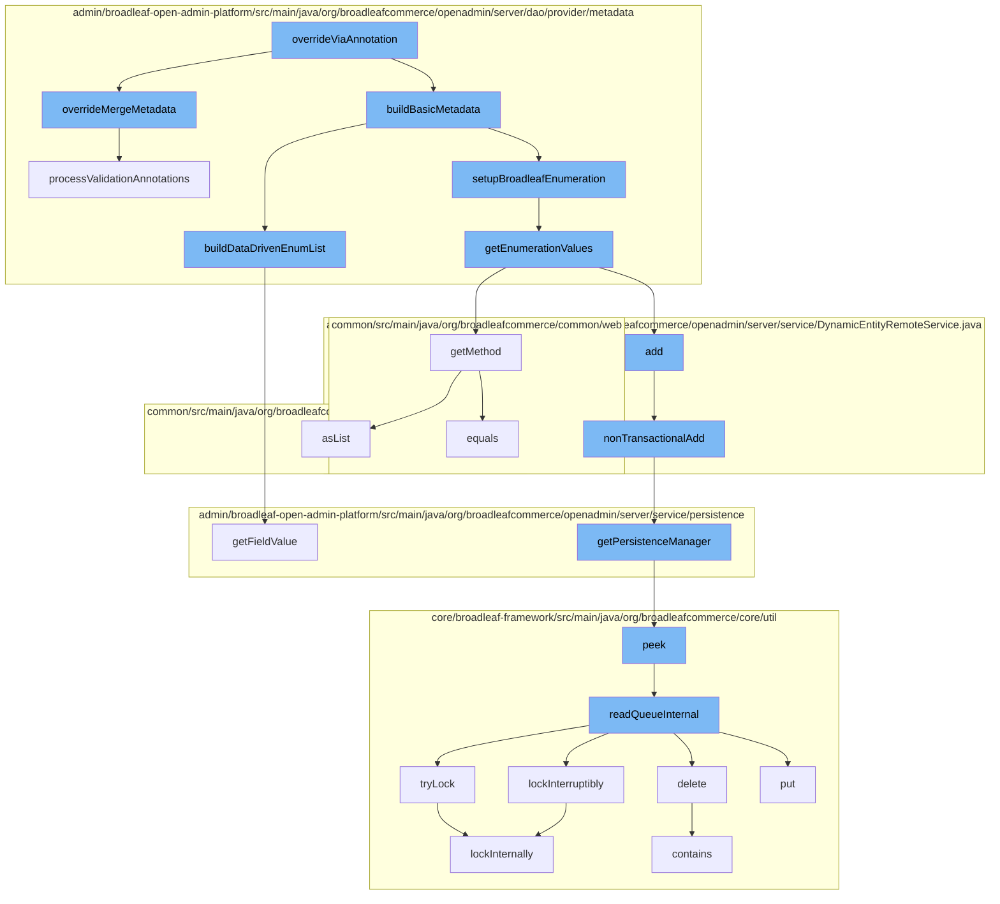

This document will cover the process of metadata override in Broadleaf Commerce, which includes:

1. Overriding metadata via annotation
2. Building basic metadata
3. Setting up Broadleaf enumeration
4. Getting enumeration values
5. Adding non-transactional data
6. Getting persistence manager
7. Reading queue internally



<SwmSnippet path="/admin/broadleaf-open-admin-platform/src/main/java/org/broadleafcommerce/openadmin/server/dao/provider/metadata/BasicFieldMetadataProvider.java" line="215">

---

# Overriding metadata via annotation

The `overrideMergeMetadata` function is used to override metadata based on the provided `AdminPresentationMergeOverride` object. It creates a new `FieldMetadataOverride` object and sets its properties based on the values in the `AdminPresentationMergeOverride` object.

```java
    protected FieldMetadataOverride overrideMergeMetadata(AdminPresentationMergeOverride merge) {
        FieldMetadataOverride fieldMetadataOverride = new FieldMetadataOverride();
        Map<String, AdminPresentationMergeEntry> overrideValues = getAdminPresentationEntries(merge.mergeEntries());
        for (Map.Entry<String, AdminPresentationMergeEntry> entry : overrideValues.entrySet()) {
            String stringValue = entry.getValue().overrideValue();
            if (entry.getKey().equals(PropertyType.AdminPresentation.FRIENDLYNAME)) {
                fieldMetadataOverride.setFriendlyName(stringValue);
            } else if (entry.getKey().equals(PropertyType.AdminPresentation.ADDFRIENDLYNAME)) {
                fieldMetadataOverride.setAddFriendlyName(stringValue);
            } else if (entry.getKey().equals(PropertyType.AdminPresentation.SECURITYLEVEL)) {
                fieldMetadataOverride.setSecurityLevel(stringValue);
            } else if (entry.getKey().equals(PropertyType.AdminPresentation.GROUP)) {
                fieldMetadataOverride.setGroup(stringValue);
            } else if (entry.getKey().equals(PropertyType.AdminPresentation.TAB)) {
                fieldMetadataOverride.setTab(stringValue);
            } else if (entry.getKey().equals(PropertyType.AdminPresentation.COLUMNWIDTH)) {
                fieldMetadataOverride.setColumnWidth(stringValue);
            } else if (entry.getKey().equals(PropertyType.AdminPresentation.BROADLEAFENUMERATION)) {
                fieldMetadataOverride.setBroadleafEnumeration(stringValue);
            }  else if (entry.getKey().equals(PropertyType.AdminPresentation.HIDEENUMERATIONIFEMPTY)) {
                fieldMetadataOverride.setHideEnumerationIfEmpty(StringUtils.isEmpty(stringValue) ? entry.getValue().booleanOverrideValue() :
```

---

</SwmSnippet>

<SwmSnippet path="/admin/broadleaf-open-admin-platform/src/main/java/org/broadleafcommerce/openadmin/server/dao/provider/metadata/BasicFieldMetadataProvider.java" line="690">

---

# Building basic metadata

The `buildDataDrivenEnumList` function is used to build a list of data-driven enums for the given metadata. It uses the `DynamicEntityDao` to fetch the required data and constructs the enum list.

```java
    protected void buildDataDrivenEnumList(BasicFieldMetadata metadata) {
        try {
            DynamicEntityDao dynamicEntityDao = PersistenceManagerFactory.getDefaultPersistenceManager().getDynamicEntityDao();
            FieldManager fieldManager = dynamicEntityDao.getFieldManager();

            Class criteriaClass = Class.forName(metadata.getOptionListEntity());

            CriteriaBuilder builder = dynamicEntityDao.getStandardEntityManager().getCriteriaBuilder();
            CriteriaQuery criteria = builder.createQuery(criteriaClass);
            Root root = criteria.from(criteriaClass);
            List<Predicate> restrictions = new ArrayList<>();

            if (metadata.getOptionListEntity().equals(DataDrivenEnumerationValueImpl.class.getName())) {
                restrictions.add(builder.equal(root.get("hidden"), false));
            }

            if (metadata.getOptionFilterParams() != null) {
                for (String[] param : metadata.getOptionFilterParams()) {
                    Path current = root;
                    String key = param[0];
                    if (!key.equals(".ignore")) {
```

---

</SwmSnippet>

<SwmSnippet path="/admin/broadleaf-open-admin-platform/src/main/java/org/broadleafcommerce/openadmin/server/dao/provider/metadata/AbstractFieldMetadataProvider.java" line="37">

---

# Setting up Broadleaf enumeration

The `getEnumerationValues` function is used to get the enumeration values for a given Broadleaf enumeration class. It uses reflection to fetch the values from the enumeration class.

```java
import java.util.HashMap;
import java.util.List;
import java.util.Map;

import javax.annotation.Resource;
import javax.persistence.ManyToMany;
import javax.persistence.MapKey;
import javax.persistence.OneToMany;

/**
 * @author Jeff Fischer
 */
public abstract class AbstractFieldMetadataProvider extends AbstractMetadataProvider implements FieldMetadataProvider {

    @Resource(name = "blEntityConfiguration")
    protected EntityConfiguration entityConfiguration;
    
    @Resource(name = "blBroadleafEnumerationUtility")
    protected BroadleafEnumerationUtility enumerationUtility;

    protected void setClassOwnership(Class<?> parentClass, Class<?> targetClass, Map<String, FieldMetadata> attributes, FieldInfo field) {
```

---

</SwmSnippet>

<SwmSnippet path="/admin/broadleaf-open-admin-platform/src/main/java/org/broadleafcommerce/openadmin/server/service/DynamicEntityRemoteService.java" line="274">

---

# Adding non-transactional data

The `nonTransactionalAdd` function is used to add a non-transactional persistence package. It uses the `PersistenceManager` to add the package.

```java
    @Override
    public PersistenceResponse nonTransactionalAdd(final PersistencePackage persistencePackage) throws ServiceException {
        return persistenceThreadManager.operation(TargetModeType.SANDBOX, persistencePackage, new Persistable <PersistenceResponse, ServiceException>() {
            @Override
            public PersistenceResponse execute() throws ServiceException {
                boolean shouldClean = isShouldClean();
                if (shouldClean && (CollectionUtils.isEmpty(entitiesIgnoreList) ||
                        !entitiesIgnoreList.contains(persistencePackage.getCeilingEntityFullyQualifiedClassname()))) {
                    cleanEntity(persistencePackage.getEntity());
                }
                try {
                    PersistenceManager persistenceManager = PersistenceManagerFactory.getPersistenceManager();
                    return persistenceManager.add(persistencePackage);
                } catch (ServiceException e) {
                    //immediately throw validation exceptions without printing a stack trace
                    if (e instanceof ValidationException) {
                        throw e;
                    } else if (e.getCause() instanceof ValidationException) {
                        throw (ValidationException) e.getCause();
                    }
                    String message = exploitProtectionService.cleanString(e.getMessage());
```

---

</SwmSnippet>

<SwmSnippet path="/admin/broadleaf-open-admin-platform/src/main/java/org/broadleafcommerce/openadmin/server/service/persistence/PersistenceManagerContext.java" line="49">

---

# Getting persistence manager

The `getPersistenceManager` function is used to get the current `PersistenceManager` from the context.

```java
    public PersistenceManager getPersistenceManager() {
        return !persistenceManager.empty()?persistenceManager.peek():null;
    }
```

---

</SwmSnippet>

<SwmSnippet path="/core/broadleaf-framework/src/main/java/org/broadleafcommerce/core/util/queue/ZookeeperDistributedQueue.java" line="591">

---

# Reading queue internally

The `readQueueInternal` function is used to read a certain quantity of data from the queue. It uses the `ZookeeperClient` to fetch the data.

```java
    protected Map<String, T> readQueueInternal(final int qty, final boolean remove, final long timeout) throws InterruptedException {
        final Map<String, T> out = new LinkedHashMap<>();
        long waitTime = timeout;
        synchronized (QUEUE_MONITOR) {
            while (true) {
                boolean locked;
                DistributedLock lock = getQueueAccessLock();
                if (timeout < 0L) {
                    lock.lockInterruptibly();
                    locked = true;
                } else if (timeout > 0L && waitTime > 0L) {
                    long start = System.currentTimeMillis();
                    locked = lock.tryLock(waitTime, TimeUnit.MILLISECONDS);
                    long end = System.currentTimeMillis();
                    waitTime -= (end - start);
                } else {
                    locked = lock.tryLock();
                    if (!locked) {
                        return out;
                    }
                }
```

---

</SwmSnippet>

&nbsp;

*This is an auto-generated document by Swimm AI 🌊 and has not yet been verified by a human*

<SwmMeta version="3.0.0" repo-id="Z2l0aHViJTNBJTNBQnJvYWRsZWFmQ29tbWVyY2UtZGVtbyUzQSUzQWdpbGFkbmF2b3Q=" repo-name="BroadleafCommerce-demo" doc-type="flows"><sup>Powered by [Swimm](/)</sup></SwmMeta>
