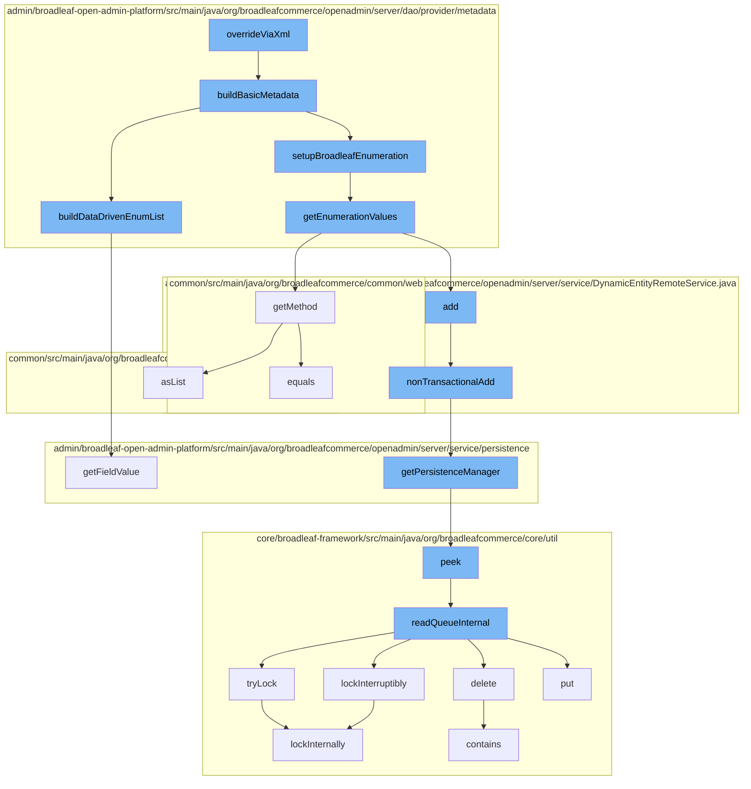

This document will cover the process of overriding metadata via XML in the BroadleafCommerce-demo repository. The process involves the following steps:

1. Overriding metadata via XML
2. Building basic metadata
3. Setting up Broadleaf enumeration
4. Getting enumeration values
5. Adding non-transactional data
6. Getting the persistence manager
7. Reading the queue internally
8. Locking internally



<SwmSnippet path="/admin/broadleaf-open-admin-platform/src/main/java/org/broadleafcommerce/openadmin/server/dao/provider/metadata/BasicFieldMetadataProvider.java" line="471">

---

# Overriding metadata via XML

The `overrideViaXml` function starts the process. It calls the `buildBasicMetadata` function to construct the basic metadata for a given field.

```java
    protected void buildBasicMetadata(Class<?> parentClass, Class<?> targetClass, Map<String, FieldMetadata> attributes,
            FieldInfo field, FieldMetadataOverride basicFieldMetadata, DynamicEntityDao dynamicEntityDao) {
        BasicFieldMetadata serverMetadata = (BasicFieldMetadata) attributes.get(field.getName());

        BasicFieldMetadata metadata;
        if (serverMetadata != null) {
            metadata = serverMetadata;
        } else {
            metadata = new BasicFieldMetadata();
        }

        metadata.setName(field.getName());
        metadata.setTargetClass(targetClass.getName());
        metadata.setFieldName(field.getName());

        if (basicFieldMetadata.getFieldType() != null) {
            metadata.setFieldType(basicFieldMetadata.getFieldType());
        }
        if (basicFieldMetadata.getDisplayType() != null) {
            metadata.setDisplayType(basicFieldMetadata.getDisplayType());
        }
```

---

</SwmSnippet>

<SwmSnippet path="/admin/broadleaf-open-admin-platform/src/main/java/org/broadleafcommerce/openadmin/server/dao/provider/metadata/BasicFieldMetadataProvider.java" line="471">

---

# Building basic metadata

The `buildBasicMetadata` function constructs the basic metadata for a given field. It sets various properties of the metadata based on the provided `basicFieldMetadata` and `field` parameters. It then calls `buildDataDrivenEnumList` and `setupBroadleafEnumeration` functions to further refine the metadata.

```java
    protected void buildBasicMetadata(Class<?> parentClass, Class<?> targetClass, Map<String, FieldMetadata> attributes,
            FieldInfo field, FieldMetadataOverride basicFieldMetadata, DynamicEntityDao dynamicEntityDao) {
        BasicFieldMetadata serverMetadata = (BasicFieldMetadata) attributes.get(field.getName());

        BasicFieldMetadata metadata;
        if (serverMetadata != null) {
            metadata = serverMetadata;
        } else {
            metadata = new BasicFieldMetadata();
        }

        metadata.setName(field.getName());
        metadata.setTargetClass(targetClass.getName());
        metadata.setFieldName(field.getName());

        if (basicFieldMetadata.getFieldType() != null) {
            metadata.setFieldType(basicFieldMetadata.getFieldType());
        }
        if (basicFieldMetadata.getDisplayType() != null) {
            metadata.setDisplayType(basicFieldMetadata.getDisplayType());
        }
```

---

</SwmSnippet>

<SwmSnippet path="/admin/broadleaf-open-admin-platform/src/main/java/org/broadleafcommerce/openadmin/server/dao/provider/metadata/AbstractFieldMetadataProvider.java" line="570">

---

# Setting up Broadleaf enumeration

The `setupBroadleafEnumeration` function is called to set up the Broadleaf enumeration for the metadata. It calls the `getEnumerationValues` function to get the enumeration values.

```java

```

---

</SwmSnippet>

<SwmSnippet path="/admin/broadleaf-open-admin-platform/src/main/java/org/broadleafcommerce/openadmin/server/dao/provider/metadata/BroadleafEnumerationUtility.java" line="37">

---

# Getting enumeration values

The `getEnumerationValues` function retrieves the enumeration values for the given Broadleaf enumeration class. It then calls the `getMethod` function.

```java
    @SuppressWarnings("rawtypes")
    public List<Tuple<String, String>> getEnumerationValues(String broadleafEnumerationClass, DynamicEntityDao dynamicEntityDao) {
        try {
            Map<String, String> enumVals;
            Class<?> broadleafEnumeration = Class.forName(broadleafEnumerationClass);  
    
            Method typeMethod = broadleafEnumeration.getMethod("getType");
            Method friendlyTypeMethod = broadleafEnumeration.getMethod("getFriendlyType");
            Field types = dynamicEntityDao.getFieldManager().getField(broadleafEnumeration, "TYPES");
            
            if (Comparable.class.isAssignableFrom(broadleafEnumeration)) {
                enumVals = new LinkedHashMap<String, String>();
                if (types != null) {
                    Map<Object, ?> typesMap = getTypesMap(types, broadleafEnumeration);
                    for (final Object value : getSortedEnumValues(typesMap)) {
                        enumVals.put((String) friendlyTypeMethod.invoke(value), (String) typeMethod.invoke(value));
                    }
                }
            } else {
                enumVals = new TreeMap<String, String>();
                if (types != null) {
```

---

</SwmSnippet>

<SwmSnippet path="/admin/broadleaf-open-admin-platform/src/main/java/org/broadleafcommerce/openadmin/server/service/DynamicEntityRemoteService.java" line="274">

---

# Adding non-transactional data

The `nonTransactionalAdd` function is used to add non-transactional data. It calls the `getPersistenceManager` function to get the persistence manager.

```java
    @Override
    public PersistenceResponse nonTransactionalAdd(final PersistencePackage persistencePackage) throws ServiceException {
        return persistenceThreadManager.operation(TargetModeType.SANDBOX, persistencePackage, new Persistable <PersistenceResponse, ServiceException>() {
            @Override
            public PersistenceResponse execute() throws ServiceException {
                boolean shouldClean = isShouldClean();
                if (shouldClean && (CollectionUtils.isEmpty(entitiesIgnoreList) ||
                        !entitiesIgnoreList.contains(persistencePackage.getCeilingEntityFullyQualifiedClassname()))) {
                    cleanEntity(persistencePackage.getEntity());
                }
                try {
                    PersistenceManager persistenceManager = PersistenceManagerFactory.getPersistenceManager();
                    return persistenceManager.add(persistencePackage);
                } catch (ServiceException e) {
                    //immediately throw validation exceptions without printing a stack trace
                    if (e instanceof ValidationException) {
                        throw e;
                    } else if (e.getCause() instanceof ValidationException) {
                        throw (ValidationException) e.getCause();
                    }
                    String message = exploitProtectionService.cleanString(e.getMessage());
```

---

</SwmSnippet>

<SwmSnippet path="/admin/broadleaf-open-admin-platform/src/main/java/org/broadleafcommerce/openadmin/server/service/persistence/PersistenceManagerContext.java" line="49">

---

# Getting the persistence manager

The `getPersistenceManager` function retrieves the persistence manager. It then calls the `peek` function.

```java
    public PersistenceManager getPersistenceManager() {
        return !persistenceManager.empty()?persistenceManager.peek():null;
    }
```

---

</SwmSnippet>

<SwmSnippet path="/core/broadleaf-framework/src/main/java/org/broadleafcommerce/core/util/queue/ZookeeperDistributedQueue.java" line="222">

---

# Reading the queue internally

The `readQueueInternal` function reads the queue internally. It calls the `tryLock` function to try to acquire a lock.

```java
    @Override
    public T peek() {
        try {
            Map<String, T> elements = readQueueInternal(1, false, 0L);
            Iterator<Map.Entry<String, T>> entries = elements.entrySet().iterator();
            if (entries.hasNext()) {
                return entries.next().getValue();
            }
            
            return null;
        } catch (InterruptedException e) {
            Thread.currentThread().interrupt();
            return null;
        }
    }
```

---

</SwmSnippet>

<SwmSnippet path="/core/broadleaf-framework/src/main/java/org/broadleafcommerce/core/util/lock/ReentrantDistributedZookeeperLock.java" line="344">

---

# Locking internally

The `lockInternally` function is used to acquire a lock. It is called by both the `tryLock` and `lockInterruptibly` functions.

```java
    @Override
    public boolean tryLock() {
        try {
            return lockInternally(0L);
        } catch (InterruptedException e) {
            Thread.currentThread().interrupt();
            return false;
        }
    }
```

---

</SwmSnippet>

&nbsp;

*This is an auto-generated document by Swimm AI 🌊 and has not yet been verified by a human*

<SwmMeta version="3.0.0" repo-id="Z2l0aHViJTNBJTNBQnJvYWRsZWFmQ29tbWVyY2UtZGVtbyUzQSUzQWdpbGFkbmF2b3Q=" repo-name="BroadleafCommerce-demo" doc-type="flows"><sup>Powered by [Swimm](/)</sup></SwmMeta>
