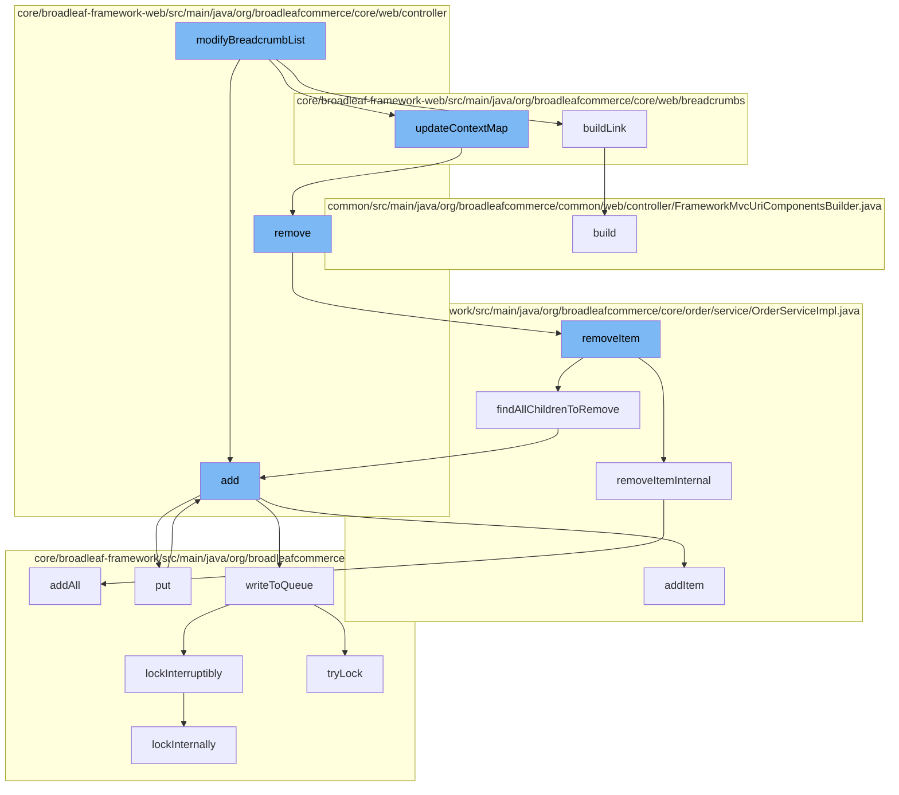

This document will cover the process of modifying breadcrumb list in Broadleaf Commerce, which includes:

 1. Adding items to the wishlist
 2. Building the link for the breadcrumb
 3. Updating the context map
 4. Removing items from the cart
 5. Removing items from the order
 6. Adding items to the resource purge service
 7. Adding items to the Zookeeper distributed queue
 8. Writing to the queue
 9. Locking the queue
10. Building the URI components for the breadcrumb.



<SwmSnippet path="/core/broadleaf-framework-web/src/main/java/org/broadleafcommerce/core/web/controller/account/BroadleafManageWishlistController.java" line="62">

---

# Adding items to the wishlist

The `add` method in `BroadleafManageWishlistController` is used to add items to the wishlist. It first checks if the wishlist exists for the customer, if not, it creates one. Then it adds the item to the wishlist and saves the wishlist.

```java
    public String add(HttpServletRequest request, HttpServletResponse response, Model model,
                      OrderItemRequestDTO itemRequest, String wishlistName) throws IOException, AddToCartException, PricingException  {
        Order wishlist = orderService.findNamedOrderForCustomer(wishlistName, CustomerState.getCustomer(request));

        if (wishlist == null) {
            wishlist = orderService.createNamedOrderForCustomer(wishlistName, CustomerState.getCustomer(request));
        }
        
        wishlist = orderService.addItem(wishlist.getId(), itemRequest, false);
        wishlist = orderService.save(wishlist, true);

        return getAccountWishlistRedirect();
    }
```

---

</SwmSnippet>

<SwmSnippet path="/core/broadleaf-framework-web/src/main/java/org/broadleafcommerce/core/web/breadcrumbs/AbstractBreadcrumbServiceExtensionHandler.java" line="840">

---

# Building the link for the breadcrumb

The `build` method in `FrameworkMvcUriComponentsBuilder` is used to build the URI components for the breadcrumb. It uses the base URL, controller type, method, and argument values to construct the URI.

```java

```

---

</SwmSnippet>

<SwmSnippet path="/core/broadleaf-framework-web/src/main/java/org/broadleafcommerce/core/web/breadcrumbs/SimpleSearchBreadcrumbServiceExtensionHandler.java" line="318">

---

# Updating the context map

The `updateContextMap` method in `SimpleSearchBreadcrumbServiceExtensionHandler` is used to update the context map. It calls the `remove` method in `BroadleafCartController` to remove items from the cart.

```java

```

---

</SwmSnippet>

<SwmSnippet path="/core/broadleaf-framework-web/src/main/java/org/broadleafcommerce/core/web/controller/cart/BroadleafCartController.java" line="318">

---

# Removing items from the cart

The `remove` method in `BroadleafCartController` is used to remove items from the cart. It gets the cart, removes the item from the cart, and saves the cart. If the request is an AJAX request, it returns the cart view, otherwise, it redirects to the cart page.

```java
    /**
     * Takes in an item request, updates the quantity of that item in the cart, and returns
     * 
     * If the method was invoked via an AJAX call, it will render the "ajax/cart" template.
     * Otherwise, it will perform a 302 redirect to "/cart"
     * 
     * @param request
     * @param response
     * @param model
     * @param itemRequest
     * @throws IOException
     * @throws PricingException
     * @throws RemoveFromCartException 
     */
    public String remove(HttpServletRequest request, HttpServletResponse response, Model model,
            OrderItemRequestDTO itemRequest) throws IOException, PricingException, RemoveFromCartException {
        Order cart = CartState.getCart();
        
        cart = orderService.removeItem(cart.getId(), itemRequest.getOrderItemId(), false);
        cart = orderService.save(cart, true);
        
```

---

</SwmSnippet>

<SwmSnippet path="/core/broadleaf-framework/src/main/java/org/broadleafcommerce/core/order/service/OrderServiceImpl.java" line="814">

---

# Removing items from the order

The `removeItem` method in `OrderServiceImpl` is used to remove items from the order. It first validates the cart operation, then it removes the item from the order and returns the updated order.

```java
    @Override
    @Transactional(value = "blTransactionManager", rollbackFor = {RemoveFromCartException.class})
    public Order removeItem(Long orderId, Long orderItemId, boolean priceOrder) throws RemoveFromCartException {
        preValidateCartOperation(findOrderById(orderId));
        try {
            OrderItem oi = orderItemService.readOrderItemById(orderItemId);
            if (oi == null) {
                throw new WorkflowException(new ItemNotFoundException());
            }
            List<Long> childrenToRemove = new ArrayList<Long>();
            if (oi instanceof BundleOrderItem) {
                List<DiscreteOrderItem> bundledItems = ((BundleOrderItem) oi).getDiscreteOrderItems();
                for (DiscreteOrderItem doi : bundledItems) {
                    findAllChildrenToRemove(childrenToRemove, doi);
                }
            } else {
                findAllChildrenToRemove(childrenToRemove, oi);
            }
            for (Long childToRemove : childrenToRemove) {
                removeItemInternal(orderId, childToRemove, false);
            }                    
```

---

</SwmSnippet>

<SwmSnippet path="/core/broadleaf-framework/src/main/java/org/broadleafcommerce/core/util/service/ResourcePurgeServiceImpl.java" line="593">

---

# Adding items to the resource purge service

The `add` method in `ResourcePurgeServiceImpl` is used to add items to the resource purge service. It checks if the cache contains the entry, if not, it adds the entry to the cache.

```java
        public Long add(Long entry) {
            if (! cache.containsKey(entry)) {
                return cache.put(entry, new Long(System.currentTimeMillis()));
            }
            return null;
        }
```

---

</SwmSnippet>

<SwmSnippet path="/core/broadleaf-framework/src/main/java/org/broadleafcommerce/core/util/queue/ZookeeperDistributedQueue.java" line="359">

---

# Adding items to the Zookeeper distributed queue

The `add` method in `ZookeeperDistributedQueue` is used to add items to the Zookeeper distributed queue. It calls the `writeToQueue` method to write the items to the queue.

```java
    @Override
    public boolean add(T e) {
        try {
            final ArrayList<T> lst = new ArrayList<>();
            lst.add(e);
            int count = writeToQueue(lst, 0L);
            if (count != 1) {
                throw new IllegalStateException("The Zookeeper queue was full.");
            } else {
                return true;
            }
        } catch (InterruptedException ex) {
            Thread.currentThread().interrupt();
            return false;
        }
    }
```

---

</SwmSnippet>

<SwmSnippet path="/core/broadleaf-framework/src/main/java/org/broadleafcommerce/core/util/queue/ZookeeperDistributedQueue.java" line="503">

---

# Writing to the queue

The `writeToQueue` method in `ZookeeperDistributedQueue` is used to write items to the queue. It locks the queue, writes the items to the queue, and then unlocks the queue.

```java
    protected int writeToQueue(List<? extends T> entries, final long timeout) throws InterruptedException {
        if (entries == null || entries.isEmpty()) {
            return 0;
        }
        
        int entryCount = 0;
        long waitTime = timeout;
        synchronized (QUEUE_MONITOR) {
            while (true) {
                boolean locked = false;
                DistributedLock lock = getQueueAccessLock();
                if (timeout < 0L) {
                    lock.lockInterruptibly();
                    locked = true;
                } else if (timeout > 0L && waitTime > 0L) {
                    long start = System.currentTimeMillis();
                    locked = lock.tryLock(waitTime, TimeUnit.MILLISECONDS);
                    long end = System.currentTimeMillis();
                    waitTime -= (end - start);
                } else {
                    locked = lock.tryLock();
```

---

</SwmSnippet>

<SwmSnippet path="/core/broadleaf-framework/src/main/java/org/broadleafcommerce/core/util/lock/ReentrantDistributedZookeeperLock.java" line="335">

---

# Locking the queue

The `lockInterruptibly` method in `ReentrantDistributedZookeeperLock` is used to lock the queue. It checks if the thread was interrupted before trying to acquire the lock, if not, it locks the queue.

```java
    @Override
    public void lockInterruptibly() throws InterruptedException {
        if (Thread.interrupted()) {
            throw new InterruptedException("Thread was interrupted prior to trying to acquire the lock.");
        }
        
        lockInternally(-1L);
    }
```

---

</SwmSnippet>

<SwmSnippet path="/common/src/main/java/org/broadleafcommerce/common/web/controller/FrameworkMvcUriComponentsBuilder.java" line="840">

---

# Building the URI components for the breadcrumb

The `build` method in `FrameworkMvcUriComponentsBuilder` is used to build the URI components for the breadcrumb. It uses the base URL, controller type, method, and argument values to construct the URI.

```java
        public String build() {
            return fromMethodInternal(this.baseUrl, this.controllerType, this.method,
                    this.argumentValues).build(false).encode().toUriString();
        }
```

---

</SwmSnippet>

&nbsp;

*This is an auto-generated document by Swimm AI 🌊 and has not yet been verified by a human*

<SwmMeta version="3.0.0" repo-id="Z2l0aHViJTNBJTNBQnJvYWRsZWFmQ29tbWVyY2UtZGVtbyUzQSUzQWdpbGFkbmF2b3Q=" repo-name="BroadleafCommerce-demo" doc-type="flows"><sup>Powered by [Swimm](/)</sup></SwmMeta>
