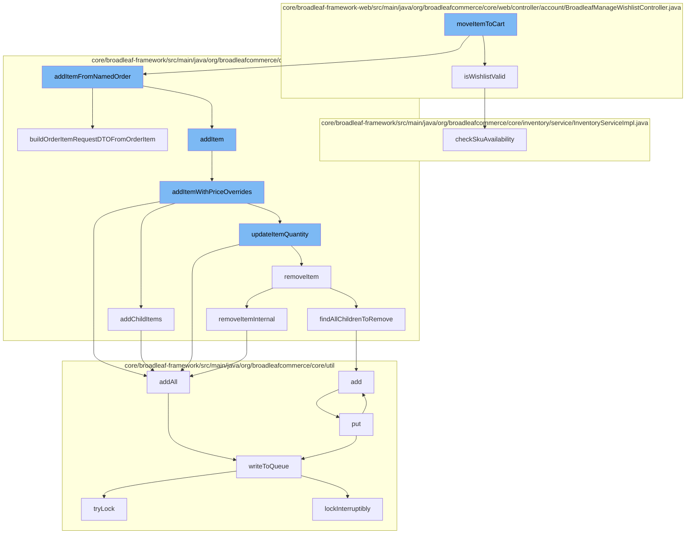

This document will cover the process of moving an item to the cart in the BroadleafCommerce-demo project. The process includes the following steps:

1. Validating the wishlist
2. Adding the item from the named order
3. Adding the item with price overrides
4. Updating the item quantity
5. Removing the item
6. Adding child items
7. Writing to the queue



<SwmSnippet path="/core/broadleaf-framework-web/src/main/java/org/broadleafcommerce/core/web/controller/account/BroadleafManageWishlistController.java" line="148">

---

# Validating the wishlist

The `isWishlistValid` function checks if the wishlist is valid by iterating over the order items and checking their availability. If any item is not available, the function returns false, indicating that the wishlist is not valid.

```java
    protected boolean isWishlistValid(Order wishlist) {
        try {
            Map<Sku, Integer> skuItems = new HashMap<>();
            for (OrderItem orderItem : wishlist.getOrderItems()) {
                Sku sku;
                if (orderItem instanceof DiscreteOrderItem) {
                    sku = ((DiscreteOrderItem) orderItem).getSku();
                } else if (orderItem instanceof BundleOrderItem) {
                    sku = ((BundleOrderItem) orderItem).getSku();
                } else {
                    final String message = "Could not check availability; did not recognize passed-in item " + orderItem.getClass().getName();
                    LOG.warn(message);
                   return false;
                }
                if (!sku.isActive()) {
                    return false;
                }
                skuItems.merge(sku, orderItem.getQuantity(), (oldVal, newVal) -> oldVal + newVal);
            }
            for (Map.Entry<Sku, Integer> entry : skuItems.entrySet()) {
                inventoryService.checkSkuAvailability(wishlist, entry.getKey(), entry.getValue());
```

---

</SwmSnippet>

<SwmSnippet path="/core/broadleaf-framework/src/main/java/org/broadleafcommerce/core/order/service/OrderItemServiceImpl.java" line="446">

---

# Adding the item from the named order

The `buildOrderItemRequestDTOFromOrderItem` function is used to build an `OrderItemRequestDTO` object from an `OrderItem`. This object is then used to add the item to the order.

```java
    @Override
    public OrderItemRequestDTO buildOrderItemRequestDTOFromOrderItem(OrderItem item) {
        OrderItemRequestDTO orderItemRequest;
        if (item instanceof DiscreteOrderItem) {
            DiscreteOrderItem doi = (DiscreteOrderItem) item;
            orderItemRequest = new OrderItemRequestDTO();

            if (doi.getCategory() != null) {
                orderItemRequest.setCategoryId(doi.getCategory().getId());
            }

            if (doi.getProduct() != null) {
                orderItemRequest.setProductId(doi.getProduct().getId());
            }

            if (doi.getSku() != null) {
                orderItemRequest.setSkuId(doi.getSku().getId());
            }

            if (doi.getAdditionalAttributes() != null) {
                for (Entry<String, String> entry : doi.getAdditionalAttributes().entrySet()) {
```

---

</SwmSnippet>

<SwmSnippet path="/core/broadleaf-framework/src/main/java/org/broadleafcommerce/core/order/service/OrderServiceImpl.java" line="664">

---

# Adding the item with price overrides

The `addItemWithPriceOverrides` function adds the item to the order with price overrides. It first checks if there are any like items in the order and updates their quantity if found. If not, it adds the item to the order.

```java
    @Override
    @Transactional(value = "blTransactionManager", rollbackFor = { AddToCartException.class })
    public Order addItemWithPriceOverrides(Long orderId, OrderItemRequestDTO orderItemRequestDTO, boolean priceOrder) throws AddToCartException {
        Order order = findOrderById(orderId);
        preValidateCartOperation(order);
        if (getAutomaticallyMergeLikeItems()) {
            OrderItem item = findMatchingItem(order, orderItemRequestDTO);
            if (item != null && item.getParentOrderItem() == null) {
                orderItemRequestDTO.setQuantity(item.getQuantity() + orderItemRequestDTO.getQuantity());
                orderItemRequestDTO.setOrderItemId(item.getId());
                try {
                    return updateItemQuantity(orderId, orderItemRequestDTO, priceOrder);
                } catch (RemoveFromCartException e) {
                    throw new AddToCartException("Unexpected error - system tried to remove item while adding to cart", e);
                } catch (UpdateCartException e) {
                    throw new AddToCartException("Could not update quantity for matched item", e);
                }
            }
        }
        try {
            // We only want to price on the last addition for performance reasons and only if the user asked for it.
```

---

</SwmSnippet>

<SwmSnippet path="/core/broadleaf-framework/src/main/java/org/broadleafcommerce/core/order/service/OrderServiceImpl.java" line="851">

---

# Updating the item quantity

The `removeItemInternal` function is used to remove an item from the order. It is called when the quantity of an item is updated to zero.

```java
    protected Order removeItemInternal(Long orderId, Long orderItemId, boolean priceOrder) throws WorkflowException {
        OrderItemRequestDTO orderItemRequestDTO = new OrderItemRequestDTO();
        orderItemRequestDTO.setOrderItemId(orderItemId);
        CartOperationRequest cartOpRequest = new CartOperationRequest(findOrderById(orderId), orderItemRequestDTO, priceOrder);
        Session session = em.unwrap(Session.class);
        FlushMode current = session.getHibernateFlushMode();
        if (!autoFlushRemoveFromCart) {
            //Performance measure. Hibernate will sometimes perform an autoflush when performing query operations and this can
            //be expensive. It is possible to avoid the autoflush if there's no concern about queries in the flow returning
            //incorrect results because something has not been flushed to the database yet.
            session.setHibernateFlushMode(FlushMode.MANUAL);
        }
        ProcessContext<CartOperationRequest> context;
        try {
            context = (ProcessContext<CartOperationRequest>) removeItemWorkflow.doActivities(cartOpRequest);
        } finally {
            if (!autoFlushRemoveFromCart) {
                session.setHibernateFlushMode(current);
            }
        }
        context.getSeedData().getOrder().getOrderMessages().addAll(((ActivityMessages) context).getActivityMessages());
```

---

</SwmSnippet>

<SwmSnippet path="/core/broadleaf-framework/src/main/java/org/broadleafcommerce/core/order/service/OrderServiceImpl.java" line="732">

---

# Adding child items

The `addChildItems` function is used to add child items to an order item. It is called when an item with child items is added to the order.

```java
    @Override
    public void addChildItems(OrderItemRequestDTO orderItemRequestDTO, int numAdditionRequests, int currentAddition, ProcessContext<CartOperationRequest> context, List<ActivityMessageDTO> orderMessages) throws WorkflowException {
        if (CollectionUtils.isNotEmpty(orderItemRequestDTO.getChildOrderItems())) {
            Long parentOrderItemId = context.getSeedData().getOrderItem().getId();
            for (OrderItemRequestDTO childRequest : orderItemRequestDTO.getChildOrderItems()) {
                childRequest.setParentOrderItemId(parentOrderItemId);
                currentAddition++;

                if (childRequest.getQuantity() > 0) {
                    CartOperationRequest childCartOpRequest = new CartOperationRequest(context.getSeedData().getOrder(), childRequest, currentAddition == numAdditionRequests);
                    Session session = em.unwrap(Session.class);
                    FlushMode current = session.getHibernateFlushMode();
                    if (!autoFlushAddToCart) {
                        //Performance measure. Hibernate will sometimes perform an autoflush when performing query operations and this can
                        //be expensive. It is possible to avoid the autoflush if there's no concern about queries in the flow returning
                        //incorrect results because something has not been flushed to the database yet.
                        session.setHibernateFlushMode(FlushMode.MANUAL);
                    }
                    ProcessContext<CartOperationRequest> childContext;
                    try {
                        childContext = (ProcessContext<CartOperationRequest>) addItemWorkflow.doActivities(childCartOpRequest);
```

---

</SwmSnippet>

<SwmSnippet path="/core/broadleaf-framework/src/main/java/org/broadleafcommerce/core/util/queue/ZookeeperDistributedQueue.java" line="503">

---

# Writing to the queue

The `writeToQueue` function is used to write the order item to the queue. It is called when an item is added to the order, when the quantity of an item is updated, and when an item is removed from the order.

```java
    protected int writeToQueue(List<? extends T> entries, final long timeout) throws InterruptedException {
        if (entries == null || entries.isEmpty()) {
            return 0;
        }
        
        int entryCount = 0;
        long waitTime = timeout;
        synchronized (QUEUE_MONITOR) {
            while (true) {
                boolean locked = false;
                DistributedLock lock = getQueueAccessLock();
                if (timeout < 0L) {
                    lock.lockInterruptibly();
                    locked = true;
                } else if (timeout > 0L && waitTime > 0L) {
                    long start = System.currentTimeMillis();
                    locked = lock.tryLock(waitTime, TimeUnit.MILLISECONDS);
                    long end = System.currentTimeMillis();
                    waitTime -= (end - start);
                } else {
                    locked = lock.tryLock();
```

---

</SwmSnippet>

&nbsp;

*This is an auto-generated document by Swimm AI 🌊 and has not yet been verified by a human*

<SwmMeta version="3.0.0" repo-id="Z2l0aHViJTNBJTNBQnJvYWRsZWFmQ29tbWVyY2UtZGVtbyUzQSUzQWdpbGFkbmF2b3Q=" repo-name="BroadleafCommerce-demo" doc-type="flows"><sup>Powered by [Swimm](/)</sup></SwmMeta>
