This document will cover the process of filtering and applying offers in the BroadleafCommerce-demo project. The process includes the following steps:

 1. Filtering offers
 2. Filtering order level offers
 3. Filtering item level offers
 4. Checking if an offer could apply to order items
 5. Checking for item requirements
 6. Adding child order items to candidates
 7. Adding targets
 8. Checking if an order item could meet offer requirement
 9. Checking if item qualifier subtotal is met
10. Getting target item criteria

```mermaid
graph TD;
subgraph core/broadleaf-framework/src/main/java/org/broadleafcommerce/core/offer/service/processor
  filterOffers:::mainFlowStyle --> filterOrderLevelOffer
end
subgraph core/broadleaf-framework/src/main/java/org/broadleafcommerce/core/offer/service/processor
  filterOffers:::mainFlowStyle --> filterItemLevelOffer
end
subgraph core/broadleaf-framework/src/main/java/org/broadleafcommerce/core/offer/service/processor
  filterOrderLevelOffer:::mainFlowStyle --> createCandidateOrderOffer
end
subgraph core/broadleaf-framework/src/main/java/org/broadleafcommerce/core/offer/service/processor
  filterItemLevelOffer:::mainFlowStyle --> createCandidateItemOffer
end
subgraph core/broadleaf-framework/src/main/java/org/broadleafcommerce/core/offer/domain/OfferImpl.java
  filterItemLevelOffer:::mainFlowStyle --> getTargetItemCriteriaXref
end
subgraph core/broadleaf-framework/src/main/java/org/broadleafcommerce/core/util
  filterItemLevelOffer:::mainFlowStyle --> contains
end
subgraph core/broadleaf-framework/src/main/java/org/broadleafcommerce/core/offer/service/processor
  filterItemLevelOffer:::mainFlowStyle --> couldOfferApplyToOrderItems
end
subgraph core/broadleaf-framework/src/main/java/org/broadleafcommerce/core/offer/domain/OfferImpl.java
  getTargetItemCriteriaXref --> equals
end
subgraph core/broadleaf-framework/src/main/java/org/broadleafcommerce/core/util
  contains --> containsAll
end
subgraph core/broadleaf-framework/src/main/java/org/broadleafcommerce/core/offer/service/discount/CandidatePromotionItems.java
  couldOfferApplyToOrderItems:::mainFlowStyle --> addFixedTarget
end
subgraph core/broadleaf-framework/src/main/java/org/broadleafcommerce/core/offer/service/processor
  couldOfferApplyToOrderItems:::mainFlowStyle --> meetsItemQualifierSubtotal
end
subgraph core/broadleaf-framework/src/main/java/org/broadleafcommerce/core/offer/domain/OfferImpl.java
  couldOfferApplyToOrderItems:::mainFlowStyle --> getTargetItemCriteriaXref
end
subgraph core/broadleaf-framework/src/main/java/org/broadleafcommerce/core/offer/service/processor
  couldOfferApplyToOrderItems:::mainFlowStyle --> checkForItemRequirements
end
subgraph core/broadleaf-framework/src/main/java/org/broadleafcommerce/core/offer/service/discount/CandidatePromotionItems.java
  meetsItemQualifierSubtotal --> getAllCandidateTargets
end
subgraph core/broadleaf-framework/src/main/java/org/broadleafcommerce/core/util
  meetsItemQualifierSubtotal --> contains
end
subgraph core/broadleaf-framework/src/main/java/org/broadleafcommerce/core/offer/service/discount/CandidatePromotionItems.java
  checkForItemRequirements:::mainFlowStyle --> addQualifier
end
subgraph core/broadleaf-framework/src/main/java/org/broadleafcommerce/core/offer/service/processor
  checkForItemRequirements:::mainFlowStyle --> couldOrderItemMeetOfferRequirement
end
subgraph core/broadleaf-framework/src/main/java/org/broadleafcommerce/core/offer/service/processor
  checkForItemRequirements:::mainFlowStyle --> addChildOrderItemsToCandidates
end
subgraph core/broadleaf-framework/src/main/java/org/broadleafcommerce/core/offer/service/processor
  couldOrderItemMeetOfferRequirement --> executeExpression
end
subgraph core/broadleaf-framework/src/main/java/org/broadleafcommerce/core/util
  addChildOrderItemsToCandidates --> addAll
end
subgraph core/broadleaf-framework/src/main/java/org/broadleafcommerce/core/util
  addChildOrderItemsToCandidates --> contains
end
subgraph core/broadleaf-framework/src/main/java/org/broadleafcommerce/core/offer/service/discount/CandidatePromotionItems.java
  addChildOrderItemsToCandidates --> addTarget
end
subgraph core/broadleaf-framework/src/main/java/org/broadleafcommerce/core/util
  addTarget --> add
end

classDef mainFlowStyle color:#000000,fill:#7CB9F4
classDef rootsStyle color:#000000,fill:#00FFF4
classDef Style1 color:#000000,fill:#00FFAA
classDef Style2 color:#000000,fill:#FFFF00
classDef Style3 color:#000000,fill:#AA7CB9
```



<SwmSnippet path="/core/broadleaf-framework/src/main/java/org/broadleafcommerce/core/offer/service/processor/ItemOfferProcessorImpl.java" line="1">

---

# Filtering Offers

The `filterOffers` function is the entry point for the offer filtering process. It calls `filterOrderLevelOffer` and `filterItemLevelOffer` to filter offers at the order and item levels respectively.

```java
/*-
 * #%L
 * BroadleafCommerce Framework
 * %%
 * Copyright (C) 2009 - 2024 Broadleaf Commerce
 * %%
 * Licensed under the Broadleaf Fair Use License Agreement, Version 1.0
 * (the "Fair Use License" located  at http://license.broadleafcommerce.org/fair_use_license-1.0.txt)
 * unless the restrictions on use therein are violated and require payment to Broadleaf in which case
 * the Broadleaf End User License Agreement (EULA), Version 1.1
```

---

</SwmSnippet>

<SwmSnippet path="/core/broadleaf-framework/src/main/java/org/broadleafcommerce/core/offer/service/processor/OrderOfferProcessorImpl.java" line="89">

---

# Filtering Order Level Offers

The `filterOrderLevelOffer` function filters offers at the order level. It checks if the offer could apply to the order and if so, it creates a candidate order offer.

```java
    @Override
    public void filterOrderLevelOffer(PromotableOrder promotableOrder, List<PromotableCandidateOrderOffer> qualifiedOrderOffers, Offer offer) {
        if (offer.getDiscountType().getType().equals(OfferDiscountType.FIX_PRICE.getType())) {
            LOG.warn("Offers of type ORDER may not have a discount type of FIX_PRICE. Ignoring order offer (name=" + offer.getName() + ")");
            return;
        }
        boolean orderLevelQualification = false;
        //Order Qualification
        orderQualification:
        {
            if (couldOfferApplyToOrder(offer, promotableOrder)) {
                orderLevelQualification = true;
                break orderQualification;
            }
            for (PromotableOrderItem orderItem : promotableOrder.getDiscountableOrderItems(offer.getApplyDiscountToSalePrice())) {
                if (couldOfferApplyToOrder(offer, promotableOrder, orderItem)) {
                    orderLevelQualification = true;
                    break orderQualification;
                }
            }
            for (PromotableFulfillmentGroup fulfillmentGroup : promotableOrder.getFulfillmentGroups()) {
```

---

</SwmSnippet>

<SwmSnippet path="/core/broadleaf-framework/src/main/java/org/broadleafcommerce/core/offer/service/processor/ItemOfferProcessorImpl.java" line="139">

---

# Filtering Item Level Offers

The `filterItemLevelOffer` function filters offers at the item level. It creates a candidate item offer if the offer could apply to the order items.

```java
    /**
     * Create a candidate item offer based on the offer in question and a specific order item
     * 
     * @param qualifiedItemOffers the container list for candidate item offers
     * @param offer the offer in question
     * @return the candidate item offer
     */
    protected PromotableCandidateItemOffer createCandidateItemOffer(List<PromotableCandidateItemOffer> qualifiedItemOffers,
            Offer offer, PromotableOrder promotableOrder) {

        PromotableCandidateItemOffer promotableCandidateItemOffer =
                promotableItemFactory.createPromotableCandidateItemOffer(promotableOrder, offer);
        qualifiedItemOffers.add(promotableCandidateItemOffer);
        
        return promotableCandidateItemOffer;
    }
```

---

</SwmSnippet>

<SwmSnippet path="/core/broadleaf-framework/src/main/java/org/broadleafcommerce/core/offer/service/processor/AbstractBaseProcessor.java" line="283">

---

# Checking if an Offer Could Apply to Order Items

The `couldOfferApplyToOrderItems` function checks if an offer could apply to order items. It adds fixed targets and checks if the item qualifier subtotal is met.

```java
    /**
     * Private method used by couldOfferApplyToOrder to execute the MVEL expression in the
     * appliesToOrderRules to determine if this offer can be applied.
     *
     * @param expression
     * @param vars
     * @return a Boolean object containing the result of executing the MVEL expression
     */
    public Boolean executeExpression(String expression, Map<String, Object> vars) {
        Map<String, Class<?>> contextImports = new HashMap<>();

        expression = usePriceBeforeAdjustments(expression);
        contextImports.put("OfferType", OfferType.class);
        contextImports.put("FulfillmentType", FulfillmentType.class);
        return MvelHelper.evaluateRule(expression, vars, EXPRESSION_CACHE, contextImports);

    }
```

---

</SwmSnippet>

<SwmSnippet path="/core/broadleaf-framework/src/main/java/org/broadleafcommerce/core/offer/service/processor/AbstractBaseProcessor.java" line="283">

---

# Checking for Item Requirements

The `checkForItemRequirements` function checks for item requirements. It adds qualifiers and checks if an order item could meet the offer requirement.

```java
    /**
     * Private method used by couldOfferApplyToOrder to execute the MVEL expression in the
     * appliesToOrderRules to determine if this offer can be applied.
     *
     * @param expression
     * @param vars
     * @return a Boolean object containing the result of executing the MVEL expression
     */
    public Boolean executeExpression(String expression, Map<String, Object> vars) {
        Map<String, Class<?>> contextImports = new HashMap<>();

        expression = usePriceBeforeAdjustments(expression);
        contextImports.put("OfferType", OfferType.class);
        contextImports.put("FulfillmentType", FulfillmentType.class);
        return MvelHelper.evaluateRule(expression, vars, EXPRESSION_CACHE, contextImports);

    }
```

---

</SwmSnippet>

<SwmSnippet path="/core/broadleaf-framework/src/main/java/org/broadleafcommerce/core/offer/service/processor/AbstractBaseProcessor.java" line="283">

---

# Adding Child Order Items to Candidates

The `addChildOrderItemsToCandidates` function adds child order items to candidates. It adds all items to the target.

```java
    /**
     * Private method used by couldOfferApplyToOrder to execute the MVEL expression in the
     * appliesToOrderRules to determine if this offer can be applied.
     *
     * @param expression
     * @param vars
     * @return a Boolean object containing the result of executing the MVEL expression
     */
    public Boolean executeExpression(String expression, Map<String, Object> vars) {
        Map<String, Class<?>> contextImports = new HashMap<>();

        expression = usePriceBeforeAdjustments(expression);
        contextImports.put("OfferType", OfferType.class);
        contextImports.put("FulfillmentType", FulfillmentType.class);
        return MvelHelper.evaluateRule(expression, vars, EXPRESSION_CACHE, contextImports);

    }
```

---

</SwmSnippet>

<SwmSnippet path="/core/broadleaf-framework/src/main/java/org/broadleafcommerce/core/offer/service/discount/CandidatePromotionItems.java" line="60">

---

# Adding Targets

The `addTarget` function adds targets to the candidate promotion items.

```java
    public void addFixedTarget(OfferPriceData offerPriceData, PromotableOrderItem item) {
        List<PromotableOrderItem> itemList = candidateFixedTargetsMap.get(offerPriceData);
        if (itemList == null) {
            itemList = new ArrayList<PromotableOrderItem>();
            candidateFixedTargetsMap.put(offerPriceData, itemList);
        }
        itemList.add(item);
    }
```

---

</SwmSnippet>

<SwmSnippet path="/core/broadleaf-framework/src/main/java/org/broadleafcommerce/core/offer/service/processor/AbstractBaseProcessor.java" line="283">

---

# Checking if an Order Item Could Meet Offer Requirement

The `couldOrderItemMeetOfferRequirement` function checks if an order item could meet the offer requirement. It executes the expression to determine if the offer could apply.

```java
    /**
     * Private method used by couldOfferApplyToOrder to execute the MVEL expression in the
     * appliesToOrderRules to determine if this offer can be applied.
     *
     * @param expression
     * @param vars
     * @return a Boolean object containing the result of executing the MVEL expression
     */
    public Boolean executeExpression(String expression, Map<String, Object> vars) {
        Map<String, Class<?>> contextImports = new HashMap<>();

        expression = usePriceBeforeAdjustments(expression);
        contextImports.put("OfferType", OfferType.class);
        contextImports.put("FulfillmentType", FulfillmentType.class);
        return MvelHelper.evaluateRule(expression, vars, EXPRESSION_CACHE, contextImports);

    }
```

---

</SwmSnippet>

<SwmSnippet path="/core/broadleaf-framework/src/main/java/org/broadleafcommerce/core/offer/service/processor/AbstractBaseProcessor.java" line="283">

---

# Checking if Item Qualifier Subtotal is Met

The `meetsItemQualifierSubtotal` function checks if the item qualifier subtotal is met. It gets all candidate targets and checks if they are contained in the queue.

```java
    /**
     * Private method used by couldOfferApplyToOrder to execute the MVEL expression in the
     * appliesToOrderRules to determine if this offer can be applied.
     *
     * @param expression
     * @param vars
     * @return a Boolean object containing the result of executing the MVEL expression
     */
    public Boolean executeExpression(String expression, Map<String, Object> vars) {
        Map<String, Class<?>> contextImports = new HashMap<>();

        expression = usePriceBeforeAdjustments(expression);
        contextImports.put("OfferType", OfferType.class);
        contextImports.put("FulfillmentType", FulfillmentType.class);
        return MvelHelper.evaluateRule(expression, vars, EXPRESSION_CACHE, contextImports);

    }
```

---

</SwmSnippet>

<SwmSnippet path="/core/broadleaf-framework/src/main/java/org/broadleafcommerce/core/offer/domain/OfferImpl.java" line="842">

---

# Getting Target Item Criteria

The `getTargetItemCriteriaXref` function gets the target item criteria. It checks if the offer equals the target item criteria.

```java
    @Override
    public boolean equals(Object o) {
        if (o != null && getClass().isAssignableFrom(o.getClass())) {
            OfferImpl that = (OfferImpl) o;
            return new EqualsBuilder()
                .append(this.id, that.id)
                .append(this.name, that.name)
                .append(this.startDate, that.startDate)
                .append(this.type, that.type)
                .append(this.value, that.value)
                .build();
        }
        
        return false;
    }
```

---

</SwmSnippet>

&nbsp;

*This is an auto-generated document by Swimm AI 🌊 and has not yet been verified by a human*

<SwmMeta version="3.0.0" repo-id="Z2l0aHViJTNBJTNBQnJvYWRsZWFmQ29tbWVyY2UtZGVtbyUzQSUzQWdpbGFkbmF2b3Q=" repo-name="BroadleafCommerce-demo" doc-type="flows"><sup>Powered by [Swimm](/)</sup></SwmMeta>
